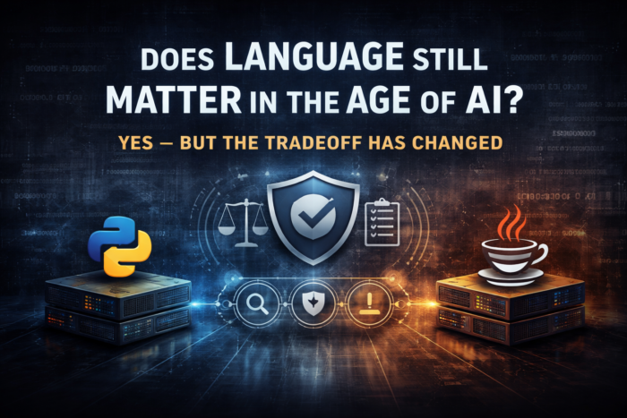
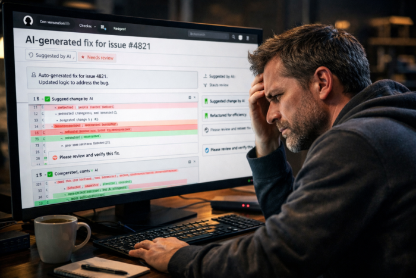

## 

I keep hearing the same question in architecture reviews, slack threads, and conference Hallways:
> **"If AI is writing the code, does language even matter anymore?"**

It does. More than ever, actually --- just not for the reasons we've been arguing about for the last decade.

## The Bottleneck Has Moved

For decades, we optimized for developer productivity. How fast can someone write code? How expressive is the language? How quickly can we ship features?

That math doesn't hold anymore.

## AI Produces Code Faster Than Teams Can Review It

I've watched teams adopt Copilot and immediately drown in PRs. The code looks plausible. It even compiles. But nobody has time to actually verify it. Authoring is no longer the bottleneck --- understanding and verification is.

## Why Verbose Languages Are Making a Comeback

Languages we spent years complaining about --- Java, C# --- are turning into strategic assets. Not because they're faster to write --- they never were. What changed is they're easier to *read under pressure*.

When you're reviewing AI-generated code at scale, you need:

* Explicit types that eliminate guesswork
* Structured patterns that make inconsistencies obvious
* Clear intent a reviewer can confirm in seconds

## Boilerplate Is Now Signal

What we used to call "boilerplate" is now signal. A Java method signature tells you the input types, return type, and nullability contract. You get all of that before reading a single line of implementation. A Python function gives you a name and some parameters that could be anything.

### The research backs this up

[Atlassian published a study at ICSME'25](https://www.atlassian.com/blog/artificial-intelligence/atlassian-research-developers-on-code-readibility-llm){#https://www.atlassian.com/blog/artificial-intelligence/atlassian-research-developers-on-code-readibility-llm} across 118 practitioners and production code. They found that 81% of developers say readability is still crucial --- even with LLMs in the loop. The top motivation? Reducing long-term maintenance costs.

They also found something more specific. AI-generated code in TypeScript and Python tended to be slightly longer and less maintainable. Java, Kotlin, Go, and Scala showed negligible differences from human-written code.

That last point is worth sitting with. AI-generated Java looks like human-written Java. AI-generated Python drifts.

### What this means in practice

* Readability is no longer a preference --- it's a gate on delivery speed
* Verbosity is no longer a flaw --- it's a verification accelerator
* Clarity determines how fast AI-generated code can ship



## The Other Half: Runtime Performance

Clarity gets code through review. But once it ships, it has to run.

### The benchmarks tell the story

Data from [programming-language-benchmarks.vercel.app](https://programming-language-benchmarks.vercel.app/) (August 2025, OpenJDK 21 vs PyPy 3.11 vs rustc 1.88):

|     Benchmark      |  Java   | Python (PyPy) | Rust  | Java vs Python  | Rust vs Java |
|--------------------|---------|---------------|-------|-----------------|--------------|
| nbody (5M)         | 446ms   | 2,650ms       | 163ms | **5.9x faster** | 2.7x faster  |
| nsieve (12)        | 387ms   | 2,403ms       | ---   | **6.2x faster** | ---          |
| fasta (2.5M)       | 449ms   | 2,215ms       | 88ms  | **4.9x faster** | 5.1x faster  |
| knucleotide (2.5M) | 1,059ms | ---           | 219ms | ---             | 4.8x faster  |
| mandelbrot (5K)    | 1,153ms | ---           | 292ms | ---             | 3.9x faster  |

Java runs 5-6x faster than Python on compute-intensive work. Rust beats Java by 2-5x. Not synthetic micro-benchmarks either --- these are algorithmic workloads that show up in real backend systems.

### Where Java lands in the performance stack

Java sits in a pragmatic middle ground. It won't match Rust in a tight loop. But it gives you strong runtime performance without manual memory management. And it pairs that with a type system that makes AI-generated code reviewable.

## From Language Choice to Pipeline Design

The real shift isn't about picking the "best language." Software production now has three distinct stages. Each has different optimization criteria:

**AI generates** -\> **Humans validate** -\> **Systems execute**

### Stage 1: Generation

AI benefits from structured, predictable patterns. Languages with strong conventions give it less room to hallucinate creative solutions.

### Stage 2: Validation

Humans need clarity, strong types, and explicit intent. This is where Java and C# earn their keep. You can scan a typed method signature and know if the AI got it right.

### Stage 3: Execution

Runtime performance, scalability, and infrastructure cost. Rust and C++ dominate here. Java is a strong middle ground for most workloads.

Previously these were a single decision. Now they're decoupled. Optimizing for one stage will hurt you in the others.

## Clarity First, Then Speed

We're not choosing between readability and performance anymore. We're sequencing them.

1. **Clarity comes first** --- If a reviewer can't validate AI-generated code quickly, it doesn't ship. The fastest code in the world is useless sitting in a PR queue.

2. **Performance comes next** --- Once deployed, inefficiency becomes your AWS bill.

## Code Examples: Same Intent, Different Review Experience

### Python: concise but ambiguous

```
def total_completed_orders(orders):
    return sum(order["total"] for order in orders if order["status"] == "COMPLETED")
```

Concise. But what's in `orders`? What type is `"total"` --- float, int, Decimal? What if the key is missing? A reviewer has to hold all of that in their head.

### Java: verbose but verifiable

```
import java.math.BigDecimal;
import java.util.List;

public class OrderService {

    public BigDecimal totalCompletedOrders(List<Order> orders) {
        return orders.stream()
                .filter(order -> order.status() == OrderStatus.COMPLETED)
                .map(Order::total)
                .reduce(BigDecimal.ZERO, BigDecimal::add);
    }
}

record Order(OrderStatus status, BigDecimal total) {}

enum OrderStatus {
    COMPLETED,
    PENDING,
    CANCELLED
}
```

More code, yes. But a reviewer knows immediately: the input is a `List`, the total is `BigDecimal` (not a floating point footgun), and status is a closed enum. The AI can't sneak in a string comparison or rounding error.

### Rust: maximum guarantees, steeper curve

```
#[derive(PartialEq)]
enum OrderStatus {
    Completed,
    Pending,
    Cancelled,
}

struct Order {
    status: OrderStatus,
    total: f64,
}

fn total_completed_orders(orders: &[Order]) -> f64 {
    orders
        .iter()
        .filter(|order| order.status == OrderStatus::Completed)
        .map(|order| order.total)
        .sum()
}
```

Strong structural guarantees. Best runtime performance of the three. The tradeoff? A steeper learning curve and ownership semantics that slow down both AI generation and human review.

## Where Language Still Matters

Language matters more than ever --- just not as a tool for writing code faster.

It matters as the interface between AI output and human trust. The languages that win are the ones that make verification cheap, intent obvious, and mistakes visible.

That is where language still matters.

Sources:

* [Programming Language Benchmarks](https://programming-language-benchmarks.vercel.app/) --- Java vs Python and Java vs Rust performance data
* [Atlassian Research: Code Readability in the Age of LLMs](https://www.atlassian.com/blog/artificial-intelligence/atlassian-research-developers-on-code-readibility-llm) --- ICSME'25 study on developer attitudes and AI-generated code quality
* [Computer Language Benchmarks Game](https://benchmarksgame-team.pages.debian.net/benchmarksgame/index.html) --- canonical cross-language performance comparison
