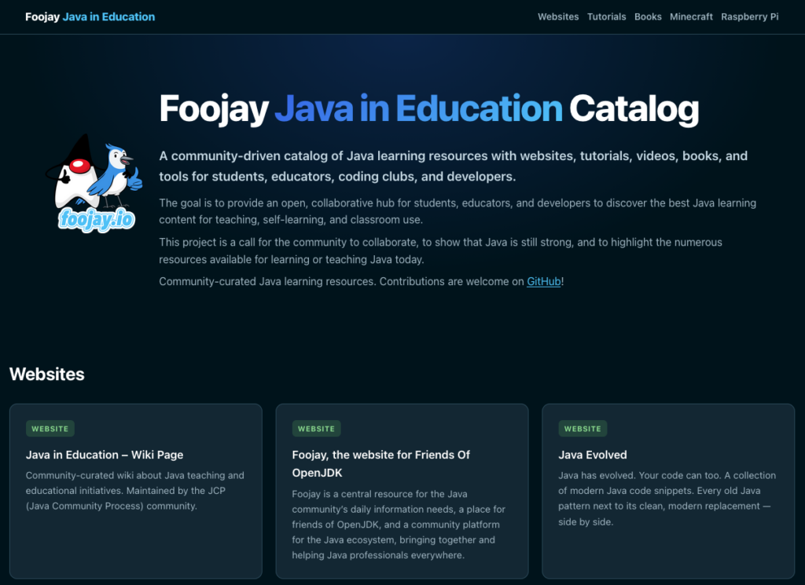

A few weeks ago, Igor De Souza shared [Bringing Java Closer to Education: A Community-Driven Initiative](https://foojay.io/today/bringing-java-closer-to-education-a-community-driven-initiative/) here on Foojay. It's something we started together to gather Java educational resources in one place, making it easier for mentors, educators, and learners to discover what's out there.

But let's be honest: a GitHub README, while perfectly functional, is not exactly the most inviting front door for educators who aren't already deep in the coding ecosystem. That's now fixed...

## Inspired by a Great Idea from James Ward

If you haven't visited [ai4jvm.com](https://ai4jvm.com/) yet, go have a look. [James Ward](https://www.linkedin.com/in/jamesward/), Java Champion and Developer Advocate, built a beautifully clean, community-curated website listing Java AI frameworks, tools, key people, and learning resources. It's an excellent reference and a great example of what a well-structured catalog site can look like.

James agreed to let us reuse his workflow. It's a setup that takes a structured `SPEC.md` document and turns it into a proper, browsable website. A huge thank you to him for being so open about sharing that approach!

## Meet education.foojay.social

The result is now live at **[education.foojay.social](https://education.foojay.social/)**! If you're a coding club mentor or a teacher looking for Java resources to point students to, this is where to start.

What's already in the catalog? A mix of things:

* Tutorials and videos by Jetbrains and others
* Resources shared by Devoxx4Kids
* Pi4J and JBang examples for getting Java running on a Raspberry Pi
* Books like "Raising Young Coders"

## The Catalog Is Only as Good as the Community Makes It

The whole point of this initiative is that it's not owned by any single person or organization. The GitHub repository at [github.com/foojayio/java-education-catalog](https://github.com/foojayio/java-education-catalog) is the source of truth, and the website is generated directly from it.

That means contributing is as simple as opening a pull request to update `SPEC.md` with a new resource. Found a great Java tutorial series on YouTube? A book you'd recommend to beginners? A creative project idea that works well in a classroom or coding club? Add it.

If you've been creating Java educational content and it's currently sitting on the internet with little visibility, this is exactly where it should be listed. Let's make sure your content gets found more easily.

## What's Next

The goal remains the same as when this initiative started: make Java more visible and accessible in educational environments, from CoderDojo clubs to university courses to self-learners picking up their first programming language. A well-maintained, community-driven catalog site gets us closer to that.

Go visit [education.foojay.social](https://education.foojay.social/), explore what's there, and then come back to [the GitHub repository](https://github.com/foojayio/java-education-catalog) and add something. Every contribution matters, and this one really is as easy as editing a text file.
