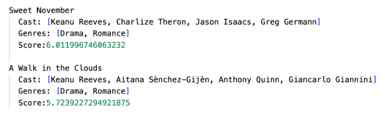
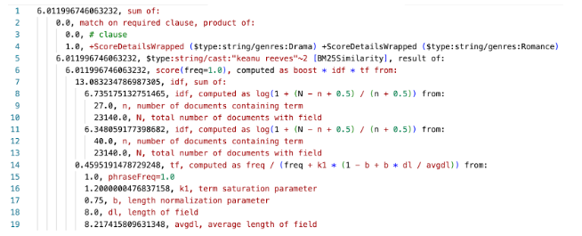
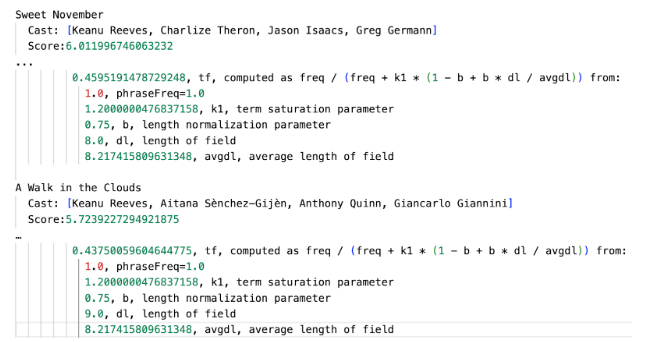

Full-text search powers all of our digital lives --- googling for this and that; asking Siri where to find a tasty, nearby dinner; shopping at Amazon; and so on. We receive relevant results, often even in spite of our typos, voice transcription mistakes, or vaguely formed queries. We have grown accustomed to expecting the best results for our searching intentions, right there, at the top.

But now it's your turn, dear developer, to build the same satisfying user experience into your Atlas-powered application.

If you've not yet created an MongoDB Search index, it would be helpful to do so before delving into the rest of this article. We've got a handy tutorial to [get started with MongoDB Search](https://www.mongodb.com/docs/atlas/atlas-search/tutorial/?utm_campaign=devrel&utm_source=third-party-content&utm_medium=cta&utm_content=atlas-search-rel-foojay&utm_term=tony.kim). We will happily and patiently wait for you to get started and return here when you've got some search results.

Welcome back! We see that you've got data, and it lives in MongoDB Atlas. You've turned on MongoDB Search and run some queries, and now you want to understand why the results are in the order they appear and get some tips on tuning the relevancy ranking order.

Relevancy riddle {#h2-0-relevancy-riddle}
-----------------------------------------

In the article [Using MongoDB Search from Java,](https://www.mongodb.com/developer/products/atlas/atlas-search-java/?utm_campaign=devrel&utm_source=third-party-content&utm_medium=cta&utm_content=atlas-search-rel-foojay&utm_term=tony.kim) we left the reader with a bit of a search relevancy mystery, using a query of the cast field for the phrase "keanu reeves" (lowercase; a \`$match\` fails at even this inexact of a query) narrowing the results to movies that are both dramatic (\`genres:Drama\`) *AND* romantic (\`genres:Romance\`). We'll use that same query here. The results of this query match several documents, but with differing scores. The only scoring factor is a \`must\` clause of the \`phrase\` "keanu reeves"\`. Why don't "Sweet November" and "A Walk in the Clouds" score identically?  

Can you spot the difference? Read on as we provide you the tools and tips to suss out and solve these kinds of challenges presented by full-text, inexact/fuzzy/close-but-not-exact search results.

Score details {#h2-1-score-details}
-----------------------------------

MongoDB Search makes building full-text search applications possible, and with a few clicks, accepting default settings, you've got incredibly powerful capabilities within reach. You've got a pretty good auto-pilot system, but you're in the cockpit of a 747 with knobs and dials all around. The plane will take off and land safely by itself --- most of the time. Depending on conditions and goals, manually going up to 11.0 on the volume knob, and perhaps a bit more on the thrust lever, is needed to fly there in style. Relevancy tuning can be described like this as well, and before you take control of the parameters, you need to understand what the settings do and what's possible with adjustments.

The scoring details of each document for a given query [can be requested and returned](https://www.mongodb.com/docs/atlas/atlas-search/score/get-details/?utm_campaign=devrel&utm_source=third-party-content&utm_medium=cta&utm_content=atlas-search-rel-foojay&utm_term=tony.kim). There are two steps needed to get the score details: first requesting them in the \`$search\` request, and then projecting the score details metadata into each returned document. Requesting score details is a performance hit on the underlying search engine, so only do this for diagnostic or learning purposes. To request score details from the search request, set \`scoreDetails\` to \`true\`. Those score details are available in the results \`$meta\`data for each document.

Here's what's needed to get score details:

|--------------------------------------------------------------------------------------------------------------------------|
| \[{ "$search": { ... "scoreDetails": true } }, { "$project": { ... "scoreDetails": {"$meta": "searchScoreDetails"} } }\] |

Let's search the movies collection built from the [tutorial](https://www.mongodb.com/docs/atlas/atlas-search/tutorial/?utm_campaign=devrel&utm_source=third-party-content&utm_medium=cta&utm_content=atlas-search-rel-foojay&utm_term=tony.kim) for dramatic, romance movies starring "keanu reeves" (tl; dr: add sample collections, create a search index \`default\` on movies collection with \`dynamic="true"\`), bringing in the score and score details:

|--------------------------------------------------------------------------------------------------------------------------------------------------------------------------------------------------------------------------------------------------------------------------------------------------------------------------------------------------------------------------------------------------------------------------------------------------------------------------------|
| \[ { "$search": { "compound": { "filter": \[ { "compound": { "must": \[ { "text": { "query": "Drama", "path": "genres" } }, { "text": { "query": "Romance", "path": "genres" } } \] } } \], "must": \[ { "phrase": { "query": "keanu reeves", "path": "cast" } } \] }, "scoreDetails": true } }, { "$project": { "_id": 0, "title": 1, "cast": 1, "genres": 1, "score": { "$meta": "searchScore" }, "scoreDetails": { "$meta": "searchScoreDetails" } } }, { "$limit": 10 } \] |

Content warning! The following output is not for the faint of heart. It's the daunting reason we are here though, so please push through as these details are explained below. The value of the projected \`scoreDetails\` will look something like the following for the first result:

|-------------------------------------------------------------------------------------------------------------------------------------------------------------------------------------------------------------------------------------------------------------------------------------------------------------------------------------------------------------------------------------------------------------------------------------------------------------------------------------------------------------------------------------------------------------------------------------------------------------------------------------------------------------------------------------------------------------------------------------------------------------------------------------------------------------------------------------------------------------------------------------------------------------------------------------------------------------------------------------------------------------------------------------------------------------------------------------------------------------------------------------------------------------------------------------------------------------------------------------------------------------------------------------------------------------------------------------------------------------------------------------------------------------------------------------------------------------------------------------------------------------------------------------------------------------------------------------------------------------------------------------------------------------------------------------------------------------------------------------------------------------------------------------------------------------------------------------------------------------------------------------------------------------------------------------------------------------------------------------|
| "scoreDetails": { "value": 6.011996746063232, "description": "sum of:", "details": \[ { "value": 0, "description": "match on required clause, product of:", "details": \[ { "value": 0, "description": "# clause", "details": \[\] }, { "value": 1, "description": "+ScoreDetailsWrapped ($type:string/genres:drama) +ScoreDetailsWrapped ($type:string/genres:romance)", "details": \[\] } \] }, { "value": 6.011996746063232, "description": "$type:string/cast:\\"keanu reeves\\" \[BM25Similarity\], result of:", "details": \[ { "value": 6.011996746063232, "description": "score(freq=1.0), computed as boost \* idf \* tf from:", "details": \[ { "value": 13.083234786987305, "description": "idf, sum of:", "details": \[ { "value": 6.735175132751465, "description": "idf, computed as log(1 + (N - n + 0.5) / (n + 0.5)) from:", "details": \[ { "value": 27, "description": "n, number of documents containing term", "details": \[\] }, { "value": 23140, "description": "N, total number of documents with field", "details": \[\] } \] }, { "value": 6.348059177398682, "description": "idf, computed as log(1 + (N - n + 0.5) / (n + 0.5)) from:", "details": \[ { "value": 40, "description": "n, number of documents containing term", "details": \[\] }, { "value": 23140, "description": "N, total number of documents with field", "details": \[\] } \] } \] }, { "value": 0.4595191478729248, "description": "tf, computed as freq / (freq + k1 \* (1 - b + b \* dl / avgdl)) from:", "details": \[ { "value": 1, "description": "phraseFreq=1.0", "details": \[\] }, { "value": 1.2000000476837158, "description": "k1, term saturation parameter", "details": \[\] }, { "value": 0.75, "description": "b, length normalization parameter", "details": \[\] }, { "value": 8, "description": "dl, length of field", "details": \[\] }, { "value": 8.217415809631348, "description": "avgdl, average length of field", "details": \[\] } \] } \] } \] } \] } |

We'll write a little code, below, that presents this nested structure in a more concise, readable format, and delve into the details there. Before we get to breaking down the score, we need to understand where these various factors come from. They come from Lucene.

Lucene inside {#h2-2-lucene-inside}
-----------------------------------

[Apache Lucene](https://lucene.apache.org) powers a large percentage of the world's search experiences, from the majority of e-commerce sites to healthcare and insurance systems, to intranets, to top secret intelligence, and so much more. And it's no secret that Apache Lucene powers MongoDB Search. Lucene has proven itself to be robust and scalable, and it's pervasively deployed. Many of us would consider Lucene to be the most important open source project ever, where a diverse community of search experts from around the world and across multiple industries collaborate constructively to continually improve and innovate this potent project.

So, what is this amazing thing called Lucene? Lucene is an open source search engine library written in Java that indexes content and handles sophisticated queries, rapidly returning relevant results. In addition, Lucene provides faceting, highlighting, vector search, and more.

Lucene indexing {#h2-3-lucene-indexing}
---------------------------------------

We cannot discuss search relevancy without addressing the [indexing side](https://www.mongodb.com/developer/products/atlas/introduction-indexes-mongodb-atlas-search/?utm_campaign=devrel&utm_source=third-party-content&utm_medium=cta&utm_content=atlas-search-rel-foojay&utm_term=tony.kim) of the equation as they are interrelated. When documents are added to an Atlas collection with an MongoDB Search index enabled, the fields of the documents are indexed into Lucene according to the configured index mappings.

When textual fields are indexed, a data structure known as an inverted index is built through a process called analysis. The inverted index, much like a physical dictionary, is a lexicographically/alphabetically ordered list of terms/words, cross-referenced to the documents that contain them. The analysis process is initially fed the entire text value of the field during indexing and, according to the analyzer defined in the mapping, breaks it down into individual terms/words.

For example, the silly sentence "The quick brown fox jumps over the lazy dog" is analyzed by the [MongoDB Search default analyzer](https://www.mongodb.com/docs/atlas/atlas-search/analyzers/standard/?utm_campaign=devrel&utm_source=third-party-content&utm_medium=cta&utm_content=atlas-search-rel-foojay&utm_term=tony.kim) (\`lucene.standard\`) into the following terms: the,quick,brown,fox,jumps,over,the,lazy,dog. Now, if we alphabetize (and de-duplicate, noting the frequency) those terms, it looks like this:

| **term** | **frequency** |
|----------|---------------|
| brown    | 1             |
| dog      | 1             |
| fox      | 1             |
| jumps    | 1             |
| lazy     | 1             |
| over     | 1             |
| quick    | 1             |
| the      | 2             |

In addition to which documents contain a term, the positions of each instance of that term are recorded in the inverted index structure. Recording term positions allows for phrase queries (like our "keanu reeves" example), where terms of the query must be adjacent to one another in the indexed field.

Suppose we have a Silly Sentences collection where that was our first document (document id 1), and we add another document (id 2) with the text "My dogs play with the red fox". Our inverted index, showing document ids and term positions. becomes:

| **term** | **document ids** | **term frequency** |       **term positions**       |
|----------|------------------|--------------------|--------------------------------|
| brown    | 1                | 1                  | Document 1: 3                  |
| dog      | 1                | 1                  | Document 1: 9                  |
| dogs     | 2                | 1                  | Document 2: 2                  |
| fox      | 1,2              | 2                  | Document 1: 4 Document 2: 7    |
| jumps    | 1                | 1                  | Document 1: 5                  |
| lazy     | 1                | 1                  | Document 1: 8                  |
| my       | 2                | 1                  | Document 2: 1                  |
| over     | 1                | 1                  | Document 1: 6                  |
| play     | 2                | 1                  | Document 2: 3                  |
| quick    | 1                | 1                  | Document 1: 2                  |
| red      | 2                | 1                  | Document 2: 6                  |
| the      | 1,2              | 3                  | Document 1: 1, 7 Document 2: 5 |
| with     | 2                | 1                  | Document 2: 4                  |

With this data structure, Lucene can quickly navigate to a queried term and return the documents containing it.

There are a couple of notable features of this inverted index example. The words "dog" and "dogs" are separate terms. The terms emitted from the analysis process, which are indexed exactly as they are emitted, are the atomic searchable units, where "dog" is not the same as "dogs". Does your application need to find both documents for a search of either of these terms? Or should it be more exact? Also of note, there are two documents, and "the" has appeared three times --- more times than there are documents. Maybe words such as "the" are so common in your data that a search for that term isn't useful. Your analyzer choices determine what lands in the inverted index, and thus what is searchable or not. MongoDB Search provides a [variety of analyzer options](https://www.mongodb.com/docs/atlas/atlas-search/analyzers/?utm_campaign=devrel&utm_source=third-party-content&utm_medium=cta&utm_content=atlas-search-rel-foojay&utm_term=tony.kim), with the right choice being the one that works best for your domain and data.

There are a number of statistics about a document collection that emerge through the analysis and indexing processes, including:

* Term frequency: How many times did a term appear in the field of the document?
* Document frequency: In how many documents does this term appear?
* Field length: How many terms are in this field?
* Term positions: In which position, in the emitted terms, does each instance appear?

These stats lurk in the depths of the Lucene index structure and surface visibly in the score detail output that we've seen above and will delve into below.

Lucene scoring {#h2-4-lucene-scoring}
-------------------------------------

The statistics captured during indexing factor into how documents are scored at query time. [Lucene scoring](https://lucene.apache.org/core/9_5_0/core/org/apache/lucene/search/package-summary.html#scoring), at its core, is built upon [TF/IDF](https://en.wikipedia.org/wiki/Tf%E2%80%93idf) --- term frequency/inverse document frequency. Generally speaking, TF/IDF scores documents with higher term frequencies greater than ones with lower term frequencies, and scores documents with more common terms lower than ones with rarer terms --- the idea being that a rare term in the collection conveys more information than a frequently occurring one and that a term's weight is proportional to its frequency.

There's a bit more math behind the scenes of Lucene's implementation of TF/IDF, to dampen the effect (e.g., take the square root) of TF and to scale IDF (using a logarithm function).

The classic TF/IDF formula has worked well in general, when document fields are of generally the same length, and there aren't nefarious or odd things going on with the data where the same word is repeated many times --- which happens in product descriptions, blog post comments, restaurant reviews, and where boosting a document to the top of the results has some incentive. Given that not all documents are created equal --- some titles are long, some are short, and some have descriptions that repeat words a lot or are very succinct --- some fine-tuning is warranted to account for these situations.

Best matches {#h2-5-best-matches}
---------------------------------

As search engines have evolved, refinements have been made to the classic TF/IDF relevancy computation to account for term saturation (an excessively large number of the same term within a field) and reduce the contribution of long field values which contain many more terms than shorter fields, by factoring in the ratio of the field length of the document to the average field length of the collection. The now popular [BM25](https://en.wikipedia.org/wiki/Okapi_BM25) method has become the [default scoring formula in Lucene](https://github.com/apache/lucene/blob/releases/lucene/9.7.0/lucene/core/src/java/org/apache/lucene/search/similarities/BM25Similarity.java) and is [the scoring formula used by MongoDB Search](https://www.mongodb.com/docs/atlas/atlas-search/score/get-details/?utm_campaign=devrel&utm_source=third-party-content&utm_medium=cta&utm_content=atlas-search-rel-foojay&utm_term=tony.kim#factors-that-contribute-to-the-score). BM25 stands for "Best Match 25" (the 25th iteration of this scoring algorithm). A really great writeup comparing classic TF/IDF to BM25, including illustrative graphs, can be found on [OpenSource Connections](https://opensourceconnections.com/blog/2015/10/16/bm25-the-next-generation-of-lucene-relevation/).

There are built-in values for the additional BM25 factors, \`k1\` and \`b\`. The \`k1\` factor affects how much the score increases with each reoccurrence of the term, and \`b\` controls the effect of field length. Both of these factors are currently internally set to the Lucene defaults and are not settings a developer can adjust at this point, but that's okay as the built-in values have been tuned to provide great relevancy as is.

Breaking down the score details {#h2-6-breaking-down-the-score-details}
-----------------------------------------------------------------------

Let's look at those same score details in a slimmer, easier-to-read fashion:  

It's easier to see in this format that the score of roughly 6.011 comes from the sum of two numbers: 0.0 (the non-scoring \`# clause\`-labeled filters) and roughly 6.011. And that \~6.011 factor comes from the BM25 scoring formula that multiples the "idf" (inverse document frequency) factor of \~13.083 with the "tf" (term frequency) factor of \~0.459. The "idf" factor is the "sum of" two components, one for each of the terms in our \`phrase\` operator clause. Each of the \`idf\` factors for our two query terms, "keanu" and "reeves", is computed using the formula in the output, which is:

<pre class="EnlighterJSRAW" data-enlighter-language="generic" data-enlighter-theme="" data-enlighter-highlight="" data-enlighter-linenumbers="" data-enlighter-lineoffset="" data-enlighter-title="" data-enlighter-group="">log(1 + (N - n + 0.5) / (n + 0.5))</pre>

The "tf" factor for the full phrase is "computed as" this formula:

<pre class="EnlighterJSRAW" data-enlighter-language="generic" data-enlighter-theme="" data-enlighter-highlight="" data-enlighter-linenumbers="" data-enlighter-lineoffset="" data-enlighter-title="" data-enlighter-group="">freq / (freq + k1 * (1 - b + b * dl / avgdl))</pre>

This uses the factors indented below it, such as the average length (in number of terms) of the "cast" field across all documents in the collection.

In front of each field name in this output ("genres" and "cast") there is a prefix used internally to note the field type (the "$type:string/" prefix).

Pretty printing the score details {#h2-7-pretty-printing-the-score-details}
---------------------------------------------------------------------------

The more human-friendly output of the score details above was generated using [MongoDB VS Code Playgrounds](https://www.mongodb.com/docs/mongodb-vscode/playgrounds/?utm_campaign=devrel&utm_source=third-party-content&utm_medium=cta&utm_content=atlas-search-rel-foojay&utm_term=tony.kim). This JavaScript code will print a more concise, indented version of the scoreDetails, by calling: \`print_score_details(doc.scoreDetails);\`:

<pre class="EnlighterJSRAW" data-enlighter-language="generic" data-enlighter-theme="" data-enlighter-highlight="" data-enlighter-linenumbers="" data-enlighter-lineoffset="" data-enlighter-title="" data-enlighter-group="">function print_score_details(details, indent_level) {
&nbsp;&nbsp;if (!indent_level) { indent_level = 0; }
&nbsp;&nbsp;spaces = " ".padStart(indent_level);
&nbsp;&nbsp;console.log(spaces + details.value + ", " + details.description);
&nbsp;&nbsp;details.details.forEach (d =&gt; {
&nbsp;&nbsp;&nbsp;&nbsp;print_score_details(d, indent_level + 2);
&nbsp;&nbsp;});
}</pre>

Similarly, pretty printing in Java can be done like the code developed in the article [Using MongoDB Search from Java](https://www.mongodb.com/developer/products/atlas/atlas-search-java/?utm_campaign=devrel&utm_source=third-party-content&utm_medium=cta&utm_content=atlas-search-rel-foojay&utm_term=tony.kim), which is [available on GitHub](https://github.com/mongodb-developer/getting-started-search-java/blob/main/src/main/java/com/mongodb/atlas/FirstSearchExample.java#L89-L97).

Mystery solved! {#h2-8-mystery-solved}
--------------------------------------

Going back to our Relevancy Riddle, let's see the score details:  

Using the detailed information provided about the statistics captured in the Lucene inverted index, it turns out that the \`cast\` fields of these two documents have an interesting difference. They both have four cast members, but remember the analysis process that extracts searchable terms from text. In the lower scoring of the two documents, one of the cast members has a hyphenated last name: Aitana Sènchez-Gijèn. The dash/hyphen character is a term separator character for the \`lucene.standard\` analyzer, making one additional term for that document which in turn increases the length (in number of terms) of the \`cast\` field. A greater field length causes term matches to weigh less than if they were in a shorter length field.

Compound is king {#h2-9-compound-is-king}
-----------------------------------------

Even in this simple phrase query example, the scoring is made up of many factors that are the "sum of", "product of", "result of", or "from" other factors and formulas. Relevancy tuning involves crafting clauses nested within a \`compound\` operator using \`should\` and \`must\`. Note again that \`filter\` clauses do not contribute to the score but are valuable to narrow the documents considered for scoring by the \`should\` and \`must\` clauses. And of course, \`mustNot\` clauses don't contribute to the score, as documents matching those clauses are omitted from the results altogether.

Use multiple \`compound.should\` and \`compound.must\` to weight matches in different fields in different ways. It's a common practice, for example, to weight matches in a \`title\` field higher than matches in a \`description\` field (or \`plot\` field in the movies collection), using boosts on different query operator clauses.

Boosting clauses {#h2-10-boosting-clauses}
------------------------------------------

With a query composed of multiple clauses, you have control over [modifying the score](https://www.mongodb.com/docs/atlas/atlas-search/score/modify-score/?utm_campaign=devrel&utm_source=third-party-content&utm_medium=cta&utm_content=atlas-search-rel-foojay&utm_term=tony.kim) in various ways using the optional \`score\` setting available on all search operators. Scoring factors for a clause can be controlled in these four ways:

* \`constant\`: The scoring factor for the clause is set to an explicit value.
* \`boost\`: Multiply the normal computed scoring factor for the clause by either a specified value or by the value of a field on the document being scored.
* \`function\`: Compute the scoring factor using the specified formula expression.
* \`embedded\`: Work with the \`embeddedDocument\` search operator to control how matching embedded documents contribute to the score of the top-level parent document.

That's a lot of nuanced control! These are important controls to have when you're deep into tuning search results rankings.

Relevancy tuning: a delicate balance {#h2-11-relevancy-tuning-a-delicate-balance}
---------------------------------------------------------------------------------

With the tools and mechanisms illustrated here, you've got the basics of MongoDB Search scoring insight. When presented with the inevitable results ranking challenges, you'll be able to assess the situation and understand why and how the scores are computed as they are. Tuning those results is tricky. Nudging one query's results to the desired order is fairly straightforward, but that's just one query.

Adjusting boost factors, leveraging more nuanced compound clauses, and tinkering with analysis will affect other query results. To make sure your users get relevant results:

* Test, test, and test again, across many queries --- especially real-world queries mined from your logs, not just your pet queries.
* Test with a complete collection of data (as representative or as real-world as you can get), not just a subset of data for development purposes.
* Remember, index stats matter for scores, such as the average length in number of terms of each field. If you test with non-production quality and scale data, relevance measures won't match a production environment's stats.

Relevancy concerns vary dramatically by domain, scale, sensitivity, and monetary value of search result ordering. Ensuring the "best" (by whatever metrics are important to you) documents appear in the top positions presented is both an art and a science. The e-commerce biggies are constantly testing query results, running regression tests and A/B experiments behind the scenes , fiddling with all the parameters available. For website search, however, setting a boost for \`title\` can be all you need.

You've got the tools, and it's just math, but be judicious about adjusting things, and do so with full real data, real queries, and some time and patience to set up tests and experiments.

Can we add a CTA? Maybe directing them to the community forums?
