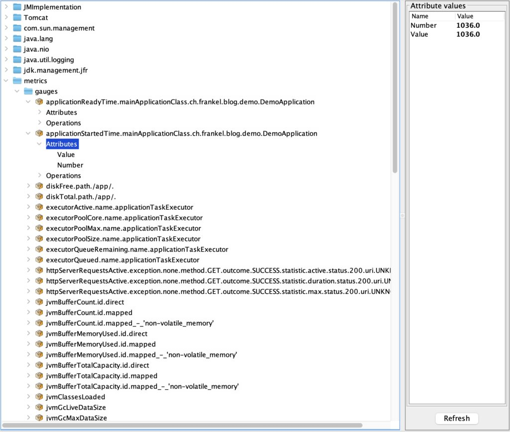
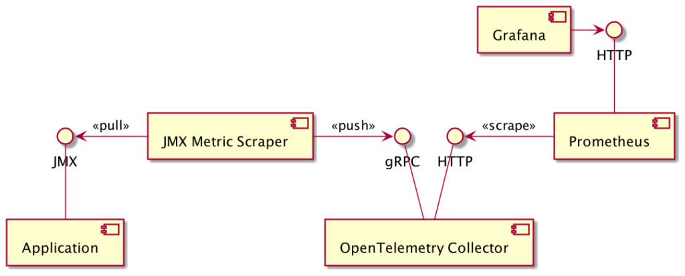
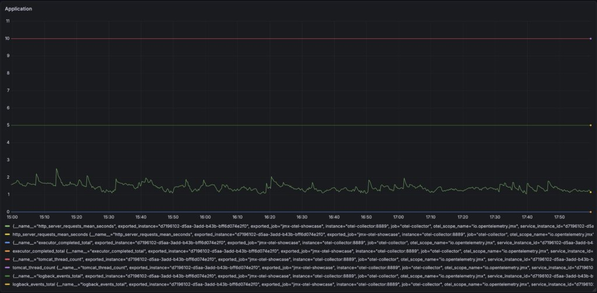

Leading your organization to use OpenTelemetry is a challenge. In addition to all the usual project hurdles, you'll face one of these two situations: convince your teams to use OpenTelemetry, or convince them to move from the telemetry tool they are already using to OpenTelemetry. Most people don't want to change. You'll need lots of effort and baby steps. My tip is the following: the fewer the changes, the higher your chances of success. In this post, I want to tackle a real-world use case and describe which tools you can leverage to reduce the necessary changes.

## The context

Imagine a JVM application that already offers metrics via JMX. To be more precise, let's take the example of a Spring Boot application running Tomcat embedded. Developers were supportive of the Ops team or were tasked to do Ops themselves. They added the Spring Boot Actuator, as well as [Micrometer JMX](https://docs.micrometer.io/micrometer/reference/implementations/jmx.html). A scheduled pipeline gets the metrics from JMX to a backend that ingests them.



During my previous talks on OpenTelemetry, I advised the audience to aim for the low-hanging fruit first. It means you should start with zero-code instrumentation. On the JVM, it translates to setting the [OpenTelemetry Java Agent](https://opentelemetry.io/docs/zero-code/java/agent/) when launching the JVM.

```bash
java -javaagent:opentelemetry-javaagent.jar -jar app.jar
```

It looks like an innocent change on an individual level. Yet, it may be the responsibility of another team, or even a team outside your direct control. Slight changes pile upon slight changes, and change management overhead compounds with each one. Hence, the fewer changes, the less time you have to spend on change management and the higher your chances of success.

Why not leverage the existing JMX beans?

## Integrating JMX in OpenTelemetry

A quick search of JMX and OpenTelemetry yields the [JMX Receiver](https://github.com/open-telemetry/opentelemetry-collector-contrib/blob/main/receiver/jmxreceiver/README.md), which is deprecated. It points to the [JMX Metric Gatherer](https://github.com/open-telemetry/opentelemetry-java-contrib/blob/main/jmx-metrics/README.md), which is also deprecated. The state of the art, at the time of this writing, is the [JMX Metric Scraper](https://github.com/open-telemetry/opentelemetry-java-contrib/tree/main/jmx-scraper).
> This utility provides a way to query JMX metrics and export them to an OTLP endpoint. The JMX MBeans and their metric mappings are defined in YAML and reuse implementation from jmx-metrics instrumentation.
>
> — JMX Metric Scraper

Note that the scraper is only available as a JAR. It is, however, trivial to create a Docker image out of it.

```dockerfile
FROM eclipse-temurin:21-jre

ADD https://github.com/open-telemetry/opentelemetry-java-contrib/releases/latest/download/opentelemetry-jmx-scraper.jar \
    /opt/opentelemetry-jmx-scraper.jar

ENTRYPOINT ["java", "-jar", "/opt/opentelemetry-jmx-scraper.jar"]
```

While you can configure individual JMX bean values to scrape, the scraper provides config sets for a couple of common software systems that run on the JVM, *e.g.*, Tomcat and Kafka. You can also provide your own config file for specific MXBeans. Here's a sample custom config file:

```yaml
rules:
  - bean: "metrics:name=executor*,type=gauges"     #1
    mapping:
      Value:
        metric: executor.gauge                     #2
        type: gauge                                #3
        unit: "{threads}"
        desc: Spring executor thread pool gauge
```

1. JMX bean to map
2. OpenTelemetry metric key
3. Metric kind. See possible options [here](https://opentelemetry.io/docs/concepts/signals/metrics/#metric-instruments).

You can use it with the `OTEL_JMX_CONFIG` environment variable:

```
services:
  jmx-gatherer:
    build: ./jmx-gatherer
    environment:
      OTEL_SERVICE_NAME: jmx-otel-showcase
      OTEL_JMX_SERVICE_URL: service:jmx:rmi:///jndi/rmi://app:9010/jmxrmi
      OTEL_JMX_TARGET_SYSTEM: jvm,tomcat                                       #1
      OTEL_JMX_CONFIG: /etc/jmx/springboot.yaml                                #2
```

1. JMX presets
2. Reference the custom config file

## Putting it all together

Here are the components of a starting architecture to display the application's metrics:

* JMX Metric Scraper
* OpenTelemetry Collector
* Prometheus
* Grafana



The JMX Metric Scraper polls metrics from a JVM, using the JMX interface for this. It then pushes them to an OpenTelemetry Collector. For the demo, I chose a simple flow. The Collector exposes metrics in Prometheus format on an HTTP endpoint. A Prometheus instance polls them and exposes them for Grafana.



## Conclusion

In this post, I kept a JMX-enabled application as is and used the JMX Metric Scraper to send MBean metrics to the OpenTelemetry Collector.

Introducing OpenTelemetry in your information system doesn't need more changes than necessary. You can, and you probably should, keep as much as possible of your existing assets to focus your efforts on the required parts. It's always possible to change them at a later stage, when things are more stable. It might be time to nudge a bit toward a regular Java agent, with the influence of a migration that has been successful.

The complete source code for this post can be found on [Codeberg](https://codeberg.org/ajavageek/jmx-otel).

**To go further:**

* [Micrometer JMX](https://docs.micrometer.io/micrometer/reference/implementations/jmx.html)
* [JMX Metric Scraper](https://github.com/open-telemetry/opentelemetry-java-contrib/tree/main/jmx-scraper)

*Originally published at [A Java Geek](https://blog.frankel.ch/tip-opentelemetry-projects/) on March 29^th^, 2026.*
