This is going to be a fun, practical tutorial demonstrating how to build a Java faceted full-text search API (like the ones powering sites like Amazon)!

We'll use an interesting dataset which showcases how you can effectively pair machine learning/AI-generated data with more traditional search to produce fast, cheap, repeatable, and intuitive search engines.

**TL;DR**: If you (like me!) are less about words and more about code, you can jump straight in. Check it out and run it locally like this:

```
git clone https://github.com/luketn/atlas-search-coco 
cd atlas-search-coco
docker compose up java-app
```

(You'll need [Docker Desktop](https://www.docker.com/products/docker-desktop/) installed.)

Then, you can try it out with the little sample UI:

<http://localhost:8222/>  
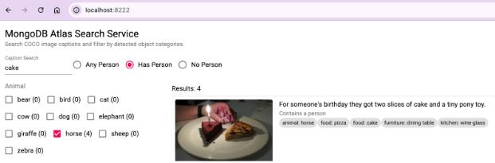

Or directly use the API: http://localhost:8222/image/search?text=kite\&animal=dog  
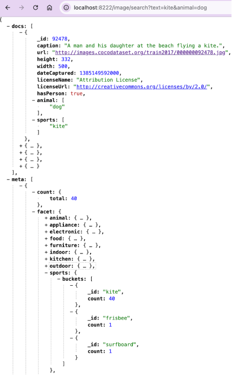

## Let's build!

Alright, let's walk through building this solution step by step. By the end, you will have all the tools you need to build your own awesome faceted search APIs. We'll leverage the powerful capabilities of MongoDB Atlas Search combined with the strong data modeling and high performance of Java to build it.

## Prerequisites

You'll need the following on your machine:

* Java developer kit (JDK) 25+ and a Java IDE
  * In this tutorial, we'll use [IntelliJ Idea](https://www.jetbrains.com/idea/).
  * IntelliJ can also download and configure the JDK for you (e.g., Amazon Corretto 25).
  * If you prefer another IDE, you should be able to translate the instructions pretty easily.
* Docker Desktop
* [MongoDB Compass](https://www.mongodb.com/products/tools/compass/?utm_campaign=devrel&utm_source=third-party-content&utm_medium=cta&utm_content=fulltext-foojay&utm_term=tony.kim)
* [Apache Maven](https://maven.apache.org/)

## 1. Project setup

Let's create a new Java project! Open your Java IDE and create a new Maven-based project, for Java 21. In IntelliJ select File -\> New Project...  
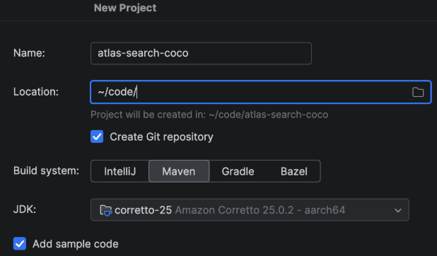

## 2. COCO data

The example we'll use is the open source [COCO image dataset](https://www.mongodb.com/products/tools/compass/?utm_campaign=devrel&utm_source=third-party-content&utm_medium=cta&utm_content=fulltext-foojay&utm_term=tony.kim).

Have a click around and you'll see some awesome images and (importantly for us!) nice captions and labels for the categories of objects in each image. The data here was generated by applying machine learning models to images to segment, caption, and label the features they include. Our search, however, will be lexical, fast, and independent of any machine learning or AI models.  


### Data model

When working with data in MongoDB, one of the most important steps is data modeling. Consider the structure and design of the collections, and each collection's document schema. In the raw COCO dataset, there are the following entities, each separate and linked by an integer ID:  
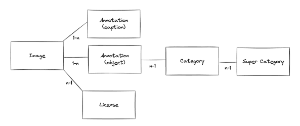

* Image: The height, width, image URL, license ID, and date captured
* License: Indicates the license the image is under, and links to the license document (1-n)
* Annotation (caption): An image ID and caption string describing the image (n-1)
* Annotation (object): A bounding box, image ID, and category ID (n-1)
* Category: A superCategory and category name, e.g., vehicle and car

When you're modeling data in MongoDB, the primary consideration is how your application will be queried. In our case, we are going to expose a REST API search endpoint like:

```
/search?vehicle=car&text=red
```

In the results, we are going to want all the details of the images matching the facets (categories) and the full text (caption) parameters.

To support this intended query pattern, we are going to collapse all of these entities into a single hierarchical document schema, "Image," that makes searching efficient and simple.

Here's our schema, defined as a Java record:

```
import java.util.Date;
import java.util.List;

public record Image(
       int _id,
       //The caption describes the contents of the image and can be searched on using full text search.
       String caption,
       String url,
       int height,
       int width,
       Date dateCaptured,
       String licenseName,
       String licenseUrl,
       //True if the image shows a person.
       boolean hasPerson,
       //Following fields are 'super categories'.
       // Each item in the list is a category.
       // One or more objects of each category listed is present in the image.
       List<String> accessory,
       List<String> animal,
       List<String> appliance,
       List<String> electronic,
       List<String> food,
       List<String> furniture,
       List<String> indoor,
       List<String> kitchen,
       List<String> outdoor,
       List<String> sports,
       List<String> vehicle
) { }
```

We'll have two collections in our MongoDB:

* Image: Will have documents in the schema above
* Category: Will have a list of the categories (and their super categories) which can be selected for filtering

```
public record Category(
       int _id,
       String superCategory,
       String name
) { }
```

Create the two records above in your Java project (feel free to use whichever namespace you like):  
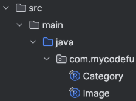

### Running MongoDB Atlas

You can choose whether you'd like to run MongoDB Atlas locally in a Docker container:

```
docker run -d --name mongodb-atlas -p 27017:27017 mongodb/mongodb-atlas-local:8.2.6
```

Local connection string:

```
mongodb://localhost:27017/?directConnection=true
```

Or create yourself a [free MongoDB Atlas cluster](https://www.mongodb.com/docs/atlas/getting-started/?utm_campaign=devrel&utm_source=third-party-content&utm_medium=cta&utm_content=fulltext-foojay&utm_term=tony.kim) in the cloud. (Keep a note of the connection string to the cluster for the next step.)

### Data ingest into MongoDB Atlas

Just to make things a little simpler, I've downloaded the COCO dataset and transformed it into the data model.

First, download and unzip the [data](https://github.com/luketn/atlas-search-coco-dataset/raw/refs/heads/main/AtlasSearchCoco.json.zip).

You'll have two data files: one for each of our collections:

* AtlasSearchCoco.Category.json
* AtlasSearchCoco.Image.json

Then, we'll use MongoDB Compass UI to ingest the JSON data and create our database.

Open the Compass app, connect to MongoDB using the connection string you noted down in the previous step, and create a new database using the + icon on the connection:  
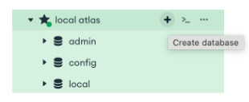

Enter atlasSearchCoco as the database name and image as our initial collection name:  
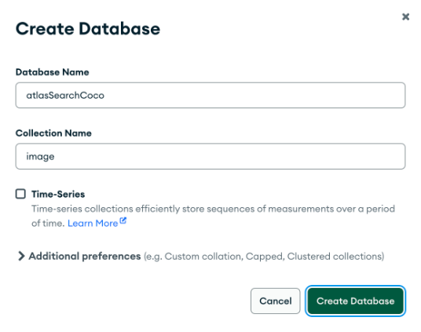

Click **Create Database** to get started.

Click **Import Data** to bring in our JSON data:  
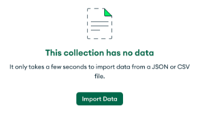

Select the AtlasSearchCoco.Image.json file you downloaded and click Import.

You should see a note that you have imported 118,287 documents.

Next, create the category collection by clicking the + icon on the atlasSearchCoco database:  
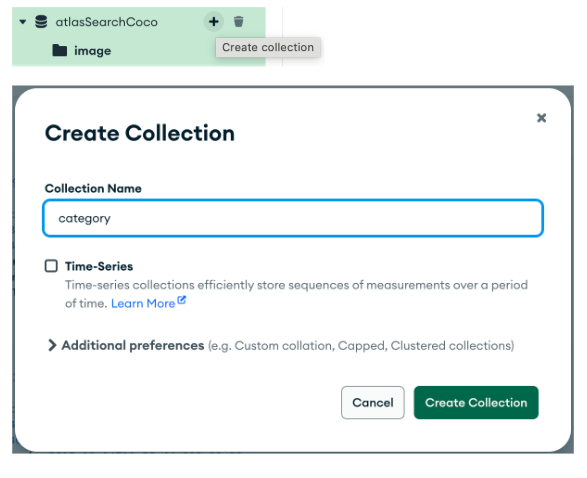

Click **Create Collection**.

As above, click **Import Data**but this time, select the file AtlasSearchCoco.Category.json:  
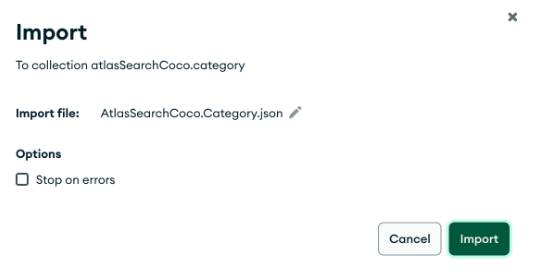

Click Import to finish importing the categories, and you should see a note that you have imported 80 documents. Congratulations! You now have a MongoDB Atlas cluster, with the COCO image dataset loaded into it.

### Creating an Atlas Search index

Next, we're going to create our Atlas Search index. This is the heart of everything we'll do in Java next, so we'll take a bit of time to walk through each part of the index and explain what it means. To create the index, go to the Indexes tab of the image collection in the MongoDB Compass UI. Click **Search Indexes** to select the Atlas Search index tab:  


Next, click Create Atlas Search Index:  
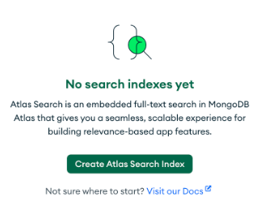

Leave the name as default, and paste in the index definition:

```
{
 "mappings": {
   "fields": {
     "caption": [{"type": "string"}],
     "hasPerson": {"type": "boolean"},
     "accessory": [{"type": "token"}, {"type": "stringFacet"}],
     "animal": [{"type": "token"}, {"type": "stringFacet"}],
     "appliance": [{"type": "token"}, {"type": "stringFacet"}],
     "electronic": [{"type": "token"}, {"type": "stringFacet"}],
     "food": [{"type": "token"}, {"type": "stringFacet"}],
     "furniture": [{"type": "token"}, {"type": "stringFacet"}],
     "indoor": [{"type": "token"}, {"type": "stringFacet"}],
     "kitchen": [{"type": "token"}, {"type": "stringFacet"}],
     "outdoor": [{"type": "token"}, {"type": "stringFacet"}],
     "sports": [{"type": "token"}, {"type": "stringFacet"}],
     "vehicle": [{"type": "token"}, {"type": "stringFacet"}]
   }
 }
}
```

Click **Create Search Index**. After a moment, you should see the status change to READY, indicating the index is created and ready to search:  


Here are the index fields, and what their type definition(s) each do: caption

```
     "caption": [{"type": "string"}],
```

This field's type definition is deceptively simple: string.

String fields can be searched in complex ways using the underlying Lucene search engine, and this field will be the main one searched by our Java search service.

When you create a field of type string, Lucene will iterate over all the documents, tokenizing the caption field string into small stems of words, making a short list of unique tokens. This is the secret sauce to what makes text search with Lucene so fast.

Each document is assigned an integer document ID in the Lucene index, and these can be efficiently stored because ranges can be compressed or skipped when searching.

Using a string type index allows you to perform advanced text searches like fuzzy matching, synonyms, and wildcards.

*hasPerson*

```
     "hasPerson": {"type": "boolean"},
```

This field is a very simple type of index, essentially dividing the documents into three groups: boolean true, false, and undefined.

*category fields - accessory, animal, appliance, electronic, food, furniture, indoor, kitchen, outdoor, sports, vehicle*

```
     "accessory": [{"type": "token"}, {"type": "stringFacet"}],
     "animal": [{"type": "token"}, {"type": "stringFacet"}],
     "appliance": [{"type": "token"}, {"type": "stringFacet"}],
     "electronic": [{"type": "token"}, {"type": "stringFacet"}],
     "food": [{"type": "token"}, {"type": "stringFacet"}],
     "furniture": [{"type": "token"}, {"type": "stringFacet"}],
     "indoor": [{"type": "token"}, {"type": "stringFacet"}],
     "kitchen": [{"type": "token"}, {"type": "stringFacet"}],
     "outdoor": [{"type": "token"}, {"type": "stringFacet"}],
     "sports": [{"type": "token"}, {"type": "stringFacet"}],
     "vehicle": [{"type": "token"}, {"type": "stringFacet"}]
```

These fields all have string array values in the collection. For example, in the animal array:

```
    "animal": ["dog"]
```

They are indexed with Atlas Search in two different ways: token: Token type indexes are on values which can be used for exact match filtering but cannot be used for advanced text searches. This is perfect for our use-case here because we will be allowing the API to include certain categories as filters.

stringFacet: String facet type indexes are used for counting potential exact matches for a given field value. We'll use this to show the number of documents that would match each category if selected.

### Example search

By combining these fields into a single index we can (all at once!) perform an advanced text search on the caption, filter by any category/categories we want, and collect the facet counts of the categories. For example, this abbreviated search will find images with "frisbee" in the caption and a dog in the picture. We'll use a [compound filter](https://www.mongodb.com/docs/atlas/atlas-search/compound/?utm_campaign=devrel&utm_source=third-party-content&utm_medium=cta&utm_content=fulltext-foojay&utm_term=tony.kim) to combine multiple filter clauses in our example query. We will also count the number of potential matches for the animal and sports categories using the [facet](https://www.mongodb.com/docs/atlas/atlas-search/facet/?utm_campaign=devrel&utm_source=third-party-content&utm_medium=cta&utm_content=fulltext-foojay&utm_term=tony.kim) Atlas Search collector. The query is quite complex, but don't worry too much about it for now—we'll dive into each part of this query in more detail as we implement it in Java. For the moment, give it a try in Compass, and notice that you can see both the query results and facets all returned together. You can run the example in Compass by clicking on the Aggregations tab in the image collection, and pasting the following JSON into the text view:  
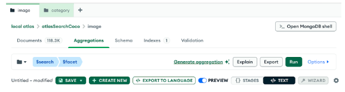

```
[
 {
   $search: {
     facet: {
       operator: {
         compound: {
           filter: [
             {
               text: {
                 path: "caption",
                 query: "frisbee"
               }
             },
             {
               equals: {
                 path: "animal",
                 value: "dog"
               }
             }
           ]
         }
       },
       facets: {
         animal: {
           type: "string",
           path: "animal",
           numBuckets: 10
         },
         sports: {
           type: "string",
           path: "sports",
           numBuckets: 10
         }
       }
     },
     count: {
       type: "total"
     }
   }
 },
 {
   $facet: {
     docs: [],
     meta: [
       {
         $replaceWith: "$$SEARCH_META"
       },
       {
         $limit: 1
       }
     ]
   }
 }
]
```

Example result:

```
{
 "docs": [
   {
     "_id": 394,
     "caption": "A dog is holding a frisbee standing on grass.",
     "url": "http://images.cocodataset.org/train2017/000000000394.jpg",
     "height": 611,
     "width": 640,
     "dateCaptured": {
       "$date": "2013-11-18T09:44:51.000Z"
     },
     "licenseName": "Attribution-NonCommercial-NoDerivs License",
     "licenseUrl": "http://creativecommons.org/licenses/by-nc-nd/2.0/",
     "hasPerson": false,
     "animal": [
       "dog"
     ],
     "sports": [
       "frisbee"
     ]
   },
   ...
 ],
 "meta": [
   {
     "count": {
       "total": {
         "$numberLong": "366"
       }
     },
     "facet": {
       "sports": {
         "buckets": [
           {
             "_id": "frisbee",
             "count": {
               "$numberLong": "364"
             }
           },
           {
             "_id": "sports ball",
             "count": {
               "$numberLong": "4"
             }
           },
           {
             "_id": "baseball glove",
             "count": {
               "$numberLong": "1"
             }
           }
         ]
       },
       "animal": {
         "buckets": [
           {
             "_id": "dog",
             "count": {
               "$numberLong": "366"
             }
           }
         ]
       }
     }
   }
 ]
}
```


## 3. Java service implementation

Alright! Let's implement our Java service class. Let's not mince words. Atlas Search syntax is complex, especially if you get into multiple compound clauses and conditions. Faceting adds an extra layer of complexity, and getting the results out of the search alongside the facets in a single query further complicates it. I think the MongoDB Java driver, and Java in general, helps mitigate the complexity in a few ways:

* Strong types: Once you've established your data model, you can easily define it as immutable Java record types, and the driver will take care of serializing/deserializing. Once you have this in place, you can be confident that your business logic code is correct and safe.
* Fluent builder syntax: Most of the operations you need to use in Atlas Search have helper methods to help you compose the search operations and build up your query.
* Great tests: Having built similar solutions with NodeJS and Python, I find the testing solutions and rigour around code coverage and test completeness easier to achieve and better supported in Java. Having a comprehensive set of tests around your search code is super important to make the code intent clear, rehearse the golden paths and edge cases, and prevent regression.

Starting with the basics, let's create an EntryPoint class, initialize a connection to MongoDB, and return some data:

First, add the dependencies for MongoDB, a JSON serializer (Jackson), and a simple logging framework to your Maven pom.xml:

```
<dependencies>
   <dependency>
       <groupId>org.mongodb</groupId>
       <artifactId>mongodb-driver-sync</artifactId>
       <version>5.2.0</version>
   </dependency>
   <dependency>
       <groupId>com.fasterxml.jackson.core</groupId>
       <artifactId>jackson-databind</artifactId>
       <version>2.17.2</version>
   </dependency>
   <dependency>
       <groupId>org.slf4j</groupId>
       <artifactId>slf4j-simple</artifactId>
       <version>2.0.13</version>
   </dependency>
</dependencies>
```

The JSON serializer will be used to return our data from the API, and the MongoDB driver will use the SL4J logger to write its logs to the console (or wherever you configure it to write). Then, create your EntryPoint class:

```
package com.mycodefu;

import com.fasterxml.jackson.databind.ObjectMapper;
import com.mongodb.client.MongoClient;
import com.mongodb.client.MongoClients;
import com.mongodb.client.MongoCollection;
import com.mongodb.client.MongoDatabase;
import com.sun.net.httpserver.HttpServer;

import java.io.IOException;
import java.net.InetSocketAddress;
import java.net.URLDecoder;
import java.nio.charset.StandardCharsets;
import java.util.ArrayList;
import java.util.Arrays;
import java.util.List;
import java.util.Map;
import java.util.stream.Collectors;

public class Main {

   public static void main(String[] args) throws IOException {

       String connectionString = "mongodb://localhost:27017";
       MongoClient mongoClient = MongoClients.create(connectionString);
       MongoDatabase database = mongoClient.getDatabase("atlasSearchCoco");
       MongoCollection<Category> categoryCollection = database.getCollection("category", Category.class);
       MongoCollection<Image> imageCollection = database.getCollection("image", Image.class);

       ObjectMapper objectMapper = new ObjectMapper();

       HttpServer httpServer = HttpServer.create(new InetSocketAddress("0.0.0.0", 8080), 0);

       httpServer.createContext("/categories", exchange -> {
           List<Category> categories = categoryCollection.find().into(new ArrayList<>());
           String categoriesJson = objectMapper.writeValueAsString(categories);
           byte[] categoriesJsonBytes = categoriesJson.getBytes();

           exchange.sendResponseHeaders(200, categoriesJsonBytes.length); 
           exchange.getResponseBody().write(categoriesJsonBytes);
           exchange.close();
       });

       httpServer.createContext("/images", exchange -> {
           Map<String, List<String>> params = Arrays.stream(exchange.getRequestURI().getQuery().split("&"))
                   .map(param -> param.split("=", 2))
                   .map(pair -> new String[]{
                           URLDecoder.decode(pair[0], StandardCharsets.UTF_8),
                           URLDecoder.decode(pair[1], StandardCharsets.UTF_8)
                   })
                   .collect(Collectors.groupingBy(
                           pair -> pair[0],
                           Collectors.mapping(
                                   pair -> pair[1],
                                   Collectors.toList()
                           )
                   ));

           //TODO: Implement the search for images based on the query parameters. For now we just return the first image.
           List<Image> images = imageCollection.find().limit(1).into(new ArrayList<>());
           //----------------

           String imagesJson = objectMapper.writeValueAsString(images);
           byte[] imagesJsonBytes = imagesJson.getBytes();

           exchange.sendResponseHeaders(200, imagesJsonBytes.length);
           exchange.getResponseBody().write(imagesJsonBytes);
           exchange.close();
       });

       httpServer.start();

       System.out.println("Server started on port http://localhost:8080");
       System.out.println("Try listing categories at http://localhost:8080/categories");
       System.out.println("Try searching for images at http://localhost:8080/images?caption=motorcycle");
   }
}
```

Run the application and you should then be able to load the URLs in the browser: [](http://localhost:8080/categories)<http://localhost:8080/categories>  
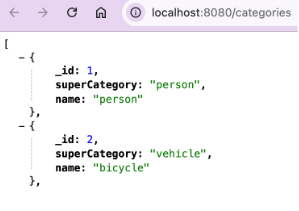

And: [](http://localhost:8080/images)<http://localhost:8080/images>  
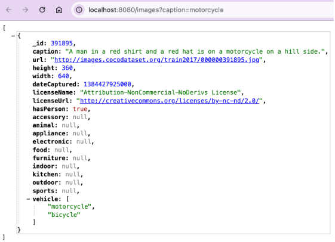

There are a few things to notice about the main class implementation: The Mongo connection, database, and collection instances—the first thing we do is establish a connection to MongoDB and typed instances of collection classes which allow us to query the data:

```
       String connectionString = "mongodb://localhost:27017";
       MongoClient mongoClient = MongoClients.create(connectionString);
       MongoDatabase database = mongoClient.getDatabase("atlasSearchCoco");
       MongoCollection<Category> categoryCollection = database.getCollection("category", Category.class);
       MongoCollection<Image> imageCollection = database.getCollection("image", Image.class);
```

The Category and Image types are the records we created earlier, which represent the COCO domain model for our project. We also create an ObjectMapper which is the Jackson JSON serializer we'll use to write JSON to the client. Next, we used Java's built-in HTTP server to create an API server, query the database, and return JSON:

```
       HttpServer httpServer = HttpServer.create(new InetSocketAddress("0.0.0.0", 8080), 0);

       httpServer.createContext("/categories", exchange -> {
           List<Category> categories = categoryCollection.find().into(new ArrayList<>());
           String categoriesJson = objectMapper.writeValueAsString(categories);
           byte[] categoriesJsonBytes = categoriesJson.getBytes();

           exchange.sendResponseHeaders(200, categoriesJsonBytes.length);
           exchange.getResponseBody().write(categoriesJsonBytes);
           exchange.close();
       });
…
       httpServer.start();
```

Of course, we could use a framework like Springboot here, but to keep the focus on MongoDB Atlas Search, we'll just use this little basic HTTP server implementation for our project. One of my favourite things about Java's client for MongoDB is that we can easily take advantage of the strength of the type system. Our domain model as defined by the immutable Category record is strongly enforced here in all logic interacting with the database. Whilst our schema in MongoDB is free to evolve, the place we are controlling that evolution is here in our Java code. Any changes to the model will be deliberate and enforced at compile time and runtime in our service. Typically, our client—let's say a browser UI—would also be loosely typed JSON (not enforcing the data model). For me, the service is the right place for such control to be enforced, so our schema evolves with our API. Next, we have our placeholder for the image search:

```
httpServer.createContext("/images", exchange -> {
   Map<String, List<String>> params = Arrays.stream(exchange.getRequestURI().getQuery().split("&"))
           .map(param -> param.split("=", 2))
           .map(pair -> new String[]{
                   URLDecoder.decode(pair[0], StandardCharsets.UTF_8),
                   URLDecoder.decode(pair[1], StandardCharsets.UTF_8)
           })
           .collect(Collectors.groupingBy(
                   pair -> pair[0],
                   Collectors.mapping(
                           pair -> pair[1],
                           Collectors.toList()
                   )
           ));

   //TODO: Implement the search for images based on the query parameters. For now we just return the first image.
   List<Image> images = imageCollection.find().limit(1).into(new ArrayList<>());
   //----------------

   String imagesJson = objectMapper.writeValueAsString(images);
   byte[] imagesJsonBytes = imagesJson.getBytes();

   exchange.sendResponseHeaders(200, imagesJsonBytes.length);
   exchange.getResponseBody().write(imagesJsonBytes);
   exchange.close();
});
```

Here, we are adding a nice safe ingestion of the query params into a map, and for now, just return the first image. Note that the map is from String to List, which is important because our query params may include 1-n instances of the same parameter. We'll use that in the next step to filter on multiple values in the search.

## 4. Java search

Our last step: the search!  

We're going to add one more record type to our list of models, which will allow us to return both a paged list of Image records, as well as the facet counts:

```
import java.util.List;

public record ImageSearchResult(List<Image> docs, List<ImageMeta> meta) {
   public record ImageMeta (ImageMetaTotal count, ImageMetaFacets facet) { }
   public record ImageMetaTotal (long total) { }
   public record ImageMetaFacets (
           ImageMetaFacet accessory,
           ImageMetaFacet animal,
           ImageMetaFacet appliance,
           ImageMetaFacet electronic,
           ImageMetaFacet food,
           ImageMetaFacet furniture,
           ImageMetaFacet indoor,
           ImageMetaFacet kitchen,
           ImageMetaFacet outdoor,
           ImageMetaFacet sports,
           ImageMetaFacet vehicle
   ) { }
   public record ImageMetaFacet (List<ImageMetaFacetBucket> buckets) { }
   public record ImageMetaFacetBucket (String _id, long count) { }
}
```

Save this as a new record in your project alongside Image and Category. This record represents the result document which will be returned by our aggregate search query. The first field, docs, is a single page of image documents, and the second field, meta, contains the metadata for all the documents which match the search criteria. The metadata shows the total count of all documents that match, as well as the counts per facet. In our case, we have facets for each category of object which may be in the image. As an example, let's say we had searched for "dog" in the caption of an image. We might expect to see a high value on the animal-\>dog facet count, but we'll see a lot of other facets with counts too. For example, you might notice a count of 68 on the sports-\>surfboard facet.  
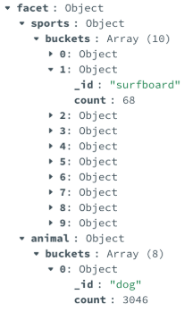

Knowing this would allow you to further filter the results like: [](http://localhost:8080/images?caption=dog&sports=surfboard)[http://localhost:8080/images?caption=dog\&sports=surfboard](http://localhost:8080/images?caption=dog&sports=surfboard)  


Or at least, it will! Let's implement the image search API. Because there is a bit of complexity in this query, let's create a new method in the Main class to handle the search. Insert the following after your main method:

```
private static ImageSearchResult search(MongoCollection<Image> imageCollection, String caption, Integer page, Boolean hasPerson, List<String> accessory, List<String> animal, List<String> appliance, List<String> electronic, List<String> food, List<String> furniture, List<String> indoor, List<String> kitchen, List<String> outdoor, List<String> sports, List<String> vehicle) {
   int skip = 0;
   int pageSize = 5;
   if (page != null) {
       skip = page * pageSize;
   }

   List<SearchOperator> clauses = new ArrayList<>();
   if (caption != null) {
       clauses.add(SearchOperator
               .text(
                       fieldPath("caption"),
                       caption
               )
       );
   }
   if (hasPerson != null) {
       clauses.add(equals("hasPerson", hasPerson));
   }
   BiConsumer<String, List<String>> addConditional = (String category, List<String> values) -> {
       if (values != null) {
           for (String value : values) {
               clauses.add(equals(category, value));
           }
       }
   };
   addConditional.accept("accessory", accessory);
   addConditional.accept("animal", animal);
   addConditional.accept("appliance", appliance);
   addConditional.accept("electronic", electronic);
   addConditional.accept("food", food);
   addConditional.accept("furniture", furniture);
   addConditional.accept("indoor", indoor);
   addConditional.accept("kitchen", kitchen);
   addConditional.accept("outdoor", outdoor);
   addConditional.accept("sports", sports);
   addConditional.accept("vehicle", vehicle);

   List<StringSearchFacet> facets = List.of(
           stringFacet("accessory", fieldPath("accessory")).numBuckets(10),
           stringFacet("animal", fieldPath("animal")).numBuckets(10),
           stringFacet("appliance", fieldPath("appliance")).numBuckets(10),
           stringFacet("electronic", fieldPath("electronic")).numBuckets(10),
           stringFacet("food", fieldPath("food")).numBuckets(10),
           stringFacet("furniture", fieldPath("furniture")).numBuckets(10),
           stringFacet("indoor", fieldPath("indoor")).numBuckets(10),
           stringFacet("kitchen", fieldPath("kitchen")).numBuckets(10),
           stringFacet("outdoor", fieldPath("outdoor")).numBuckets(10),
           stringFacet("sports", fieldPath("sports")).numBuckets(10),
           stringFacet("vehicle", fieldPath("vehicle")).numBuckets(10)
   );

   List<Bson> aggregateStages = List.of(
           Aggregates.search(
                   SearchCollector.facet(
                           SearchOperator.compound().filter(clauses),
                           facets
                   ), SearchOptions.searchOptions().count(SearchCount.total())),
           Aggregates.skip(skip),
           Aggregates.limit(pageSize),
           Aggregates.facet(
                   new Facet("docs", List.of()),
                   new Facet("meta", List.of(
                           Aggregates.replaceWith("$$SEARCH_META"),
                           Aggregates.limit(1)
                   ))
           )
   );

   ImageSearchResult imageSearchResult = imageCollection.aggregate(aggregateStages, ImageSearchResult.class).first();

   return imageSearchResult;
}

private static SearchOperator equals(String fieldName, Object value) {
   return SearchOperator.of(
           new Document("equals", new Document()
                   .append("path", fieldName)
                   .append("value", value)
           ));
}
```

Next, let's call the new function from our /image service handler. Replace the TODO you left earlier:

```
//TODO: Implement the search for images based on the query parameters. For now we just return the first image.
List<Image> images = imageCollection.find().limit(1).into(new ArrayList<>());
//----------------
```

With:

```
ImageSearchResult images = search(imageCollection,
       params.containsKey("caption") ? params.get("caption").getFirst() : null,
       params.containsKey("page") ? Integer.parseInt(params.get("page").getFirst()) : null,
       params.containsKey("hasPerson") ? Boolean.parseBoolean(params.get("hasPerson").getFirst()) : null,
       params.get("accessory"),
       params.get("animal"),
       params.get("appliance"),
       params.get("electronic"),
       params.get("food"),
       params.get("furniture"),
       params.get("indoor"),
       params.get("kitchen"),
       params.get("outdoor"),
       params.get("sports"),
       params.get("vehicle")
);
```

This will take the query parameters passed to the API and call our search function. Let's give it a spin, and then we'll come back and break down the search method piece by piece. You can now start to see how the facets work. Let's search for the term "riding" in our image caption, and further filter down to only images having a horse and a suitcase: [](http://localhost:8080/images?caption=riding&accessory=suitcase&animal=horse)[http://localhost:8080/images?caption=riding\&accessory=suitcase\&animal=horse](http://localhost:8080/images?caption=riding&accessory=suitcase&animal=horse)  


Amazing. 🙂 If you had any trouble following the steps, [refer to the tutorial code](https://github.com/luketn/atlas-search-coco-tutorial). So, let's go through the search method and explain each part piece by piece. Our aggregate search on the image MongoDB collection will have the following stages:

```
[
 {
   $search: {
     facet: {
       operator: {
         compound: {
           filter: [ <Filter clauses go here!> ]
         }
       },
       facets: { <List the facets we want returned> }
     }
   }
 }, 
 <Paging>
 {"$skip": 0},{"$limit": 5},
 <Return structure - page of docs + meta (facet counts)>
 {$facet: {docs: [], meta: [...]}}
]
```

You can see the composition of each stage in the Java code:

### Paging

```
   int skip = 0;
   int pageSize = 5;
   if (page != null) {
       skip = page * pageSize;
   }
```

First up, we calculate the number of documents to skip for paging, and set the page size to 5. These are passed to the skip and limit stages.

### Filter clauses

In this section of the search method, we put together a List which will be the filter clauses:

```
   List<SearchOperator> clauses = new ArrayList<>();
   if (caption != null) {
       clauses.add(SearchOperator
               .text(
                       fieldPath("caption"),
                       caption
               )
       );
   }
   if (hasPerson != null) {
       clauses.add(equals("hasPerson", hasPerson));
   }
   BiConsumer<String, List<String>> addConditional = (String category, List<String> values) -> {
       if (values != null) {
           for (String value : values) {
               clauses.add(equals(category, value));
           }
       }
   };
   addConditional.accept("accessory", accessory);
   addConditional.accept("animal", animal);
   addConditional.accept("appliance", appliance);
   addConditional.accept("electronic", electronic);
   addConditional.accept("food", food);
   addConditional.accept("furniture", furniture);
   addConditional.accept("indoor", indoor);
   addConditional.accept("kitchen", kitchen);
   addConditional.accept("outdoor", outdoor);
   addConditional.accept("sports", sports);
   addConditional.accept("vehicle", vehicle);
```

We use a little helper method, addConditional, which checks if the parameter was null, and if not, adds each value with an equals clause for the categories. Another small helper method, equals(), constructs the Document for our equals clause.

The first clause uses the text search operator. There is a huge depth to this operator, which we won't cover in full here, but you can customize this to support:

* Simple text search (like we're using here).
* Configurable fuzzy text searching to handle typos---"ridung" -\> riding.
* Wildcards like "rid\*".
* Complex query strings like "riding AND NOT (bicycle OR horse)".
* Phrases to find multi-word sequences.
* Combining more than one of these approaches in a single search, and rank the results by the best intersection of matching results.

Check out the full details for [how you can customize it](https://www.mongodb.com/docs/atlas/atlas-search/operators-and-collectors/?utm_campaign=devrel&utm_source=third-party-content&utm_medium=cta&utm_content=fulltext-foojay&utm_term=tony.kim).

### Facets

Then, we put together a list of the facets we want to return:

```
   List<StringSearchFacet> facets = List.of(
           stringFacet("accessory", fieldPath("accessory")).numBuckets(10),
           stringFacet("animal", fieldPath("animal")).numBuckets(10),
           stringFacet("appliance", fieldPath("appliance")).numBuckets(10),
           stringFacet("electronic", fieldPath("electronic")).numBuckets(10),
           stringFacet("food", fieldPath("food")).numBuckets(10),
           stringFacet("furniture", fieldPath("furniture")).numBuckets(10),
           stringFacet("indoor", fieldPath("indoor")).numBuckets(10),
           stringFacet("kitchen", fieldPath("kitchen")).numBuckets(10),
           stringFacet("outdoor", fieldPath("outdoor")).numBuckets(10),
           stringFacet("sports", fieldPath("sports")).numBuckets(10),
           stringFacet("vehicle", fieldPath("vehicle")).numBuckets(10)
   );
```

Here, we are saying that we want all of the fields we've indexed with stringFacet in our Atlas Search index, allowing them to be counted. We're also specifying 10 as the maximum number of buckets to count in. This means we'll get the top 10 results per super category, with their counts. For example, let's say there were 15 animals which had a count for a search on the caption "grass." In that case, we would receive only the top 10 animal counts—the five least significant would be omitted.

### Search

Finally, we put together all the aggregate stages and call the search:

```
List<Bson> aggregateStages = List.of(
       Aggregates.search(
               SearchCollector.facet(
                       SearchOperator.compound().filter(clauses),
                       facets
               ), SearchOptions.searchOptions().count(SearchCount.total())),
       Aggregates.skip(skip),
       Aggregates.limit(pageSize),
       Aggregates.facet(
               new Facet("docs", List.of()),
               new Facet("meta", List.of(
                       Aggregates.replaceWith("$$SEARCH_META"),
                       Aggregates.limit(1)
               ))
       )
);

ImageSearchResult imageSearchResult = imageCollection.aggregate(aggregateStages, ImageSearchResult.class).first();
return imageSearchResult;
```

The most interesting part, and perhaps also the most confusing part, is the use of the final aggregate stage, facet. This is a different use of the term facet, wherein we are creating two facets for our aggregate result. This is a little piece of Atlas Search magic that allows us to return the paged documents of the search, alongside the meta data for the facets. Best not to think about it too much. Grit your teeth and put it in there. If you really must know, you can find the documentation for using the facet collector with the [$$SEARCH_META aggregation framework variable](https://www.mongodb.com/docs/atlas/atlas-search/facet/?utm_campaign=devrel&utm_source=third-party-content&utm_medium=cta&utm_content=fulltext-foojay&utm_term=tony.kim#search_meta-aggregation-variable).

## (Optional) Refactoring to a better structure

If you'd like to, you can check out the [same code refactored](https://github.com/luketn/atlas-search-coco) out into a few separate classes in a better overall structure which could be the foundation of a real API server. This project also has the code used to download and transform the COCO dataset into our domain model and create the index. There are some goodies if you go exploring around unit testing for Atlas Search using the incredible Test Containers project.

## Wrapping up

So there you have it. The beginnings of an awesome service using Atlas Search to perform advanced text search, filtering, and facet counting! The use of the COCO dataset here shows an interesting example of how data generated using machine learning can be combined with more traditional lexical text searching. This provides repeatable, consistent, and intuitive search results to consumers of your API. Faceting allows us to create filterable result sets with counts on each filterable category returned. This supports advanced user interfaces in a highly performant single search query. Using the Java language and the Java Virtual Machine (JVM) as the runtime provides a highly consistent, strongly typed, and reliable platform for building scalable APIs. The language features in particular pair well with MongoDB. Java is a great language to enforce your schema with and evolve it over time. This combination of compile time and runtime checks for consistency in the code schema, along with flexible changes in the MongoDB database schema as you evolve it over time, is a great match.   

Read more about [Atlas Search](https://www.mongodb.com/docs/atlas/atlas-search/?utm_campaign=devrel&utm_source=third-party-content&utm_medium=cta&utm_content=fulltext-foojay&utm_term=tony.kim), [Atlas Search faceting](https://www.mongodb.com/docs/atlas/atlas-search/tutorial/facet-tutorial/?utm_campaign=devrel&utm_source=third-party-content&utm_medium=cta&utm_content=fulltext-foojay&utm_term=tony.kim), [running Atlas locally with Docker](https://www.mongodb.com/docs/atlas/cli/current/atlas-cli-deploy-docker/?utm_campaign=devrel&utm_source=third-party-content&utm_medium=cta&utm_content=fulltext-foojay&utm_term=tony.kim), and the Java [driver for MongoDB's Atlas search features](https://github.com/mongodb/mongo-java-driver/tree/main/driver-core/src/main/com/mongodb/client/model/search).

Finally, take a peek at the [internals of Atlas Search](https://medium.com/@luketn/mongodb-local-atlas-deployments-under-the-hood-225b1b685fb7).

If you have any questions or would like to know more, please don't hesitate to reach out to me on [LinkedIn](https://www.linkedin.com/in/lukethompson9/) and check out my personal blog page [here](https://tech-blog.luketn.com/series/mongodb-atlas-search). Happy coding!
