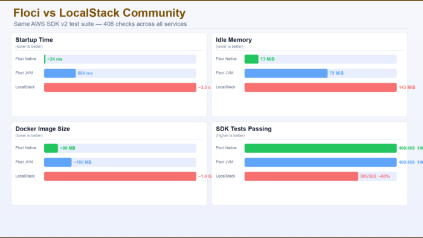

The Motivation: Why Another AWS Emulator? {#h2-0-the-motivation-why-another-aws-emulator}
-----------------------------------------------------------------------------------------



<br />

As Java developers, we are used to local-first development. Tools that emulate the cloud environment have become essential for keeping feedback loops tight and costs at zero. However, the ecosystem has shifted. Many of us have felt the friction of:

* Mandatory Authentication: Needing to log in or use tokens just to run local tests.
* Heavy Resource Footprint: Docker containers that consume a lot of resources.
* Slow Startup: Waiting several seconds for the environment to be **ready.**

I created Floci (from the floccus cloud formation) to solve these specific pain points. It is a 100% open-source, MIT-licensed alternative designed for speed, privacy, and simplicity.

Technical Edge: Built with Java and GraalVM {#h2-1-technical-edge-built-with-java-and-graalvm}
----------------------------------------------------------------------------------------------

Floci isn't just another wrapper. It is built using a modern Java stack (leveraging JAX-RS and Quarkus, Vert.x) and is compiled into a native binary using GraalVM. This technical choice provides several benefits that are immediately noticeable:

#### 1. Blazing Fast "Instant-On" Performance

Because Floci is a native executable, it bypasses the traditional JVM warmup period.

* Startup Time: Typically around 24ms

* Developer Impact: You can spin up a fresh Floci instance for every single unit test without adding any measurable overhead to your build time.

#### 2. Tiny Memory Footprint

Java infrastructure tools have a reputation for being "heavy." Floci breaks that mold:

* **Idle Memory Usage:** \~13 MiB.
* **Image Size:** \~90 MB.
* **Developer Impact:** You can run complex microservice architectures on a standard laptop without your IDE lagging or your fans spinning at full speed.

#### 3. Privacy and CI/CD Simplicity

Floci is built on the principle of Zero Friction.

* **No Auth Gates:** There are no API keys, no telemetry, and no accounts required.
* **Drop-in Compatibility:** It works seamlessly with the standard AWS SDKs and CLI.

Feature Coverage {#h2-2-feature-coverage}
-----------------------------------------

Despite its small size, Floci is powerful. It currently supports over 25 AWS services, including:

* **Storage \& Messaging:** S3 (with Object Lock), DynamoDB (with Streams), SQS (Standard/FIFO).
* **Compute \& Logic:** Lambda, Step Functions, EventBridge.
* **Identity \& Security:** Cognito, IAM, KMS.

It has been rigorously tested, passing over [400+ AWS SDK](https://github.com/hectorvent/floci-compatibility-tests) tests to ensure that your local code behaves exactly as it will in production.

Getting Started {#h2-3-getting-started}
---------------------------------------

You can start Floci with a single Docker command:

```
docker run -p 4566:4566 hectorvent/floci
```


Or via docker-compose.yml:

```
services:
  floci:
    image: hectorvent/floci:latest
    ports:
      - "4566:4566"
```


Full documentation [here](https://hectorvent.dev/floci/)

Join the Floci Community {#h2-4-join-the-floci-community}
---------------------------------------------------------

Floci is 100% open-source and community-driven. Whether you want to contribute code, report a bug, or suggest a new service implementation, your input is welcome.

The goal is to provide a fast, stable, and truly open environment for all cloud-native developers. Check out the repository, give it a star if you find it useful, and let's build a better local development experience together.

**Links:**   

Website: [floci.io](https://floci.io)  

GitHub: [hectorvent/floci](https://github.com/hectorvent/floci)  

Slack: [floci.slack.com](https://join.slack.com/t/floci/shared_invite/zt-3tjn02s3q-A00kEjJ1cZxsg_imTfy6Cw)
