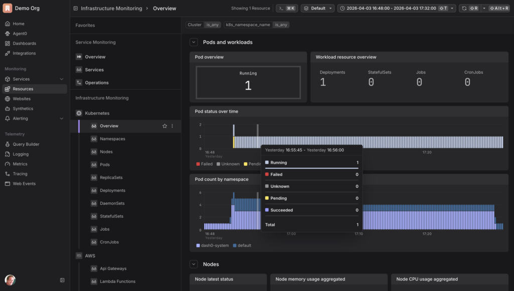
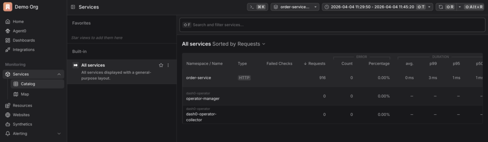
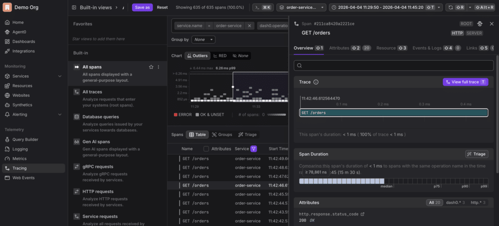
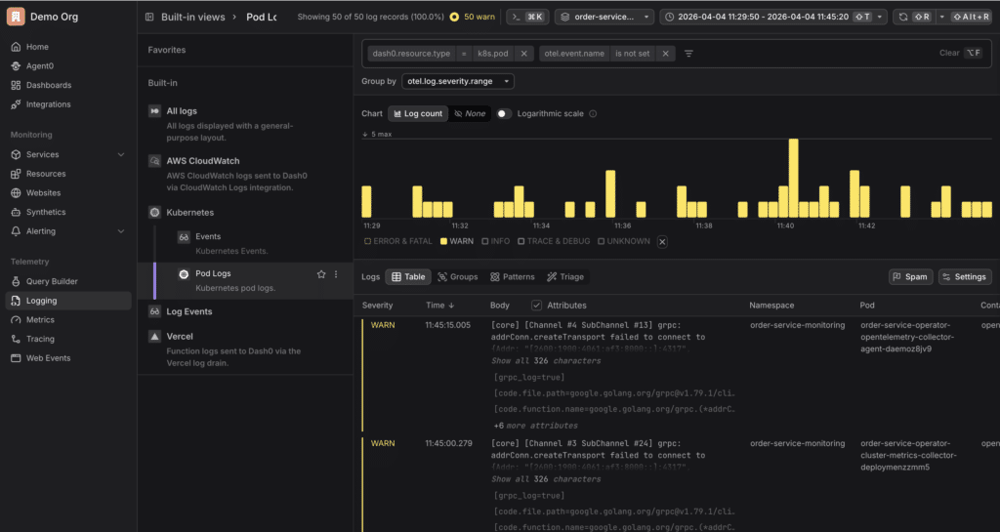

This guide walks through the complete process of deploying a minimal Spring Boot service to Kubernetes and adding full observability using the [Dash0 Kubernetes Operator](https://www.dash0.com/docs/dash0/monitoring/kubernetes/about-kubernetes) --- without making any changes to the application code.

[Dash0](https://www.dash0.com/docs/dash0) is an OpenTelemetry-native observability platform that collects and correlates traces, metrics, and logs, and provides infrastructure monitoring across Kubernetes resources --- pods, nodes, namespaces, deployments, daemonsets, statefulsets, jobs, and cronjobs --- as well as cloud infrastructure such as AWS. Its Kubernetes operator can automatically instrument workloads at the pod level, with no changes required to application code or container images.


The setup is divided into two distinct phases. The first phase establishes the "before" state: a service running in Kubernetes with no instrumentation, generating traffic that is completely invisible to any observability tool. The second phase adds the Dash0 operator to the cluster, which automatically instruments the workload and begins sending traces, metrics, and logs to Dash0 --- again, with no changes to the application itself.

The entire workflow runs without a local Docker installation. The Docker image is built and pushed via GitHub Actions, and the Kubernetes cluster runs inside a GitHub Codespace.

## Before: A Service with No Observability

### Part 1: Build the Application

The starting point is a minimal Spring Boot REST API with no observability configured at all. No OpenTelemetry, no Micrometer, no logging frameworks --- just the web starter and a controller with two endpoints. This is the "before" state: a service that is running but completely invisible.

**1. Create the pom.xml.** Create `pom.xml` with one dependency:

```
<dependencies>
  <dependency>
    <groupId>org.springframework.boot</groupId>
    <artifactId>spring-boot-starter-web</artifactId>
  </dependency>
</dependencies>
```

One dependency, no telemetry --- this is intentional. The absence of any OpenTelemetry or metrics libraries is the purpose of the "before" state.

**2. Create the main application class.** Create `src/main/java/com/example/demo/DemoApplication.java`:

```
package com.example.demo;

import org.springframework.boot.SpringApplication;
import org.springframework.boot.autoconfigure.SpringBootApplication;

@SpringBootApplication
public class DemoApplication {
    public static void main(String[] args) {
        SpringApplication.run(DemoApplication.class, args);
    }
}
```

This is the standard Spring Boot entry point --- nothing beyond the minimum needed to start the application.

**3. Create the controller.** Create `src/main/java/com/example/demo/OrderController.java`:

```
package com.example.demo;

import org.springframework.web.bind.annotation.*;
import java.util.List;

@RestController
public class OrderController {

    @GetMapping("/orders")
    public List<String> getOrders() {
        return List.of("order-1", "order-2", "order-3");
    }

    @PostMapping("/orders")
    public String createOrder(@RequestBody String order) {
        return "Created: " + order;
    }
}
```

Two endpoints with no logging, no instrumentation, and no tracing --- when this service is running, you have no visibility into what it is doing.

**4. Build the app**

```
mvn package -DskipTests
```

This packages the application into a single executable JAR in the `target/` directory, which gets copied into the Docker image in the next step.

### Part 2: Containerize and Publish

To run the app in Kubernetes it needs to be packaged as a container image. Rather than building and pushing the Docker image locally, we use GitHub Actions to do it in the cloud. This avoids any need for a local Docker installation.

**1. Create a Dockerfile.** This Dockerfile uses Azul Zulu 25 as the base image.

```
FROM azul-zulu:25-jre
COPY target/order-service.jar app.jar
ENTRYPOINT ["java", "-jar", "/app.jar"]
```

**2. Create the GitHub Actions workflow.** Create `.github/workflows/build.yml`. The workflow builds the Maven project, logs in to Docker Hub using repository secrets, and pushes the image. It triggers automatically on every push to main.

```
name: Build and Push Docker Image

on:
  push:
    branches:
      - main

jobs:
  build:
    runs-on: ubuntu-latest
    steps:
      - uses: actions/checkout@v4

      - name: Set up JDK 21
        uses: actions/setup-java@v4
        with:
          java-version: '25'
          distribution: 'zulu'

      - name: Build with Maven
        run: mvn package -DskipTests

      - name: Log in to Docker Hub
        uses: docker/login-action@v3
        with:
          username: ${{ secrets.DOCKER_USERNAME }}
          password: ${{ secrets.DOCKER_PASSWORD }}

      - name: Build and push Docker image
        uses: docker/build-push-action@v5
        with:
          context: .
          push: true
          tags: ${{ secrets.DOCKER_USERNAME }}/order-service:latest
```

**3. Add Docker Hub secrets to GitHub.** Go to the GitHub repo Settings → Secrets and variables → Actions and add:

* `DOCKER_USERNAME` --- your Docker Hub username
* `DOCKER_PASSWORD` --- your Docker Hub password or access token

Push the workflow file and GitHub Actions will build and push the image to Docker Hub automatically.

**Further Reading:**

* <https://hub.docker.com/_/azul-zulu>
* <https://github.com/docker/build-push-action>

### Part 3: Deploy to Kubernetes

With the image on Docker Hub, we can deploy the app to Kubernetes. We use GitHub Codespaces as the environment, which gives a full Linux terminal in the browser without requiring any local tooling. From there we install kind, which spins up a cluster inside the Codespace.

**1. Open a Codespace.** Go to the GitHub repo, click Code → Codespaces → Create codespace on main.

**2. Install kind and create a cluster**

```
curl -Lo ./kind https://kind.sigs.k8s.io/dl/latest/kind-linux-amd64
chmod +x ./kind
sudo mv ./kind /usr/local/bin/kind
kind create cluster
```

**3. Create the Kubernetes manifest.** The manifest defines a Deployment with one replica and a Service that exposes it on port 80. The image reference points directly to the Docker Hub image pushed in the previous step.

Create `deployment.yaml`:

```
apiVersion: apps/v1
kind: Deployment
metadata:
  name: order-service
spec:
  replicas: 1
  selector:
    matchLabels:
      app: order-service
  template:
    metadata:
      labels:
        app: order-service
    spec:
      containers:
        - name: order-service
          image: your-name/order-service:latest
          ports:
            - containerPort: 8080
---
apiVersion: v1
kind: Service
metadata:
  name: order-service
spec:
  selector:
    app: order-service
  ports:
    - port: 80
      targetPort: 8080
```

**4. Deploy the app.** Apply the manifest and update the image reference to point to the correct Docker Hub image:

```
kubectl apply -f deployment.yaml
kubectl set image deployment/order-service order-service=your-name/order-service:latest
kubectl get pods
```

Wait until the pod shows `Running`.

**Further Reading:**

* [https://kind.sigs.k8s.io](https://kind.sigs.k8s.io/)
* <https://docs.github.com/en/codespaces>

### Part 4: Generate Traffic (the Before State)

Because we are inside a Codespace rather than running locally, the service is not directly accessible on localhost. We use `kubectl port-forward` to bridge the gap. This is the **before** state --- the service is running and receiving traffic, but nothing appears in Dash0. No traces, no metrics, no logs.

**1. Start the port-forward (terminal 1)**

```
kubectl port-forward svc/order-service 8080:80
```

**2. Start the traffic loop (terminal 2).** Open a second terminal and run:

```
while true; do curl http://localhost:8080/orders; sleep 1; done
```

## After: Adding Observability with the Dash0 Operator

### Part 5: Install the Dash0 Operator

Now we add observability --- without touching the application code, the pom.xml, or the Docker image. The Dash0 operator is installed into the cluster using Helm. It runs in its own namespace and is responsible for injecting instrumentation into workloads and forwarding telemetry to Dash0.

Run the install command on a single line to avoid shell parsing errors. Replace `<your-region>` with the region from your Dash0 ingress endpoint, and `<your-auth-token>` with an auth token from your Dash0 organisation. Both can be found in Dash0 under Settings.

**1. Add the Helm repo and install the operator (terminal 3)**

```
helm repo add dash0-operator https://dash0hq.github.io/dash0-operator
helm repo update dash0-operator
helm install dash0-operator dash0-operator/dash0-operator --namespace dash0-system --create-namespace --set operator.dash0Export.endpoint=ingress.<your-region>.dash0.com:4317 --set operator.dash0Export.token=<your-auth-token>
```

**2. Verify the operator is running**

```
kubectl get pods -n dash0-system
```

Wait until the operator pod shows `Running`.

**Further Reading:**

* <https://github.com/dash0hq/dash0-operator>
* <https://artifacthub.io/packages/helm/dash0-operator/dash0-operator>
* <https://www.dash0.com/docs/dash0/dash0-kubernetes-operator>

### Part 6: Configure the Operator

Installing the Helm chart alone is not sufficient. The operator also needs a `Dash0OperatorConfiguration` resource to know where to send telemetry, and a `Dash0Monitoring` resource to know which namespace to instrument. Without both of these, no data will flow to Dash0.

**1. Create the operator configuration resource**

```
cat <<EOF | kubectl apply -f -
apiVersion: operator.dash0.com/v1alpha1
kind: Dash0OperatorConfiguration
metadata:
  name: dash0-operator-configuration
spec:
  export:
    dash0:
      endpoint: ingress.<your-region>.dash0.com:4317
      authorization:
        token: <your-auth-token>
EOF
```

**2. Enable monitoring for the namespace.** This is the resource that switches on instrumentation for all workloads in the default namespace. The export configuration must be included directly in the resource.

```
cat <<EOF | kubectl apply -f -
apiVersion: operator.dash0.com/v1alpha1
kind: Dash0Monitoring
metadata:
  name: dash0-monitoring
  namespace: default
spec:
  export:
    dash0:
      endpoint: ingress.<your-region>.dash0.com:4317
      authorization:
        token: <your-auth-token>
EOF
```

**Further Reading:**

* <https://www.dash0.com/docs/dash0/dash0-kubernetes-operator>

### Part 7: Restart and Verify

The operator injects instrumentation at pod startup via an init container. Because the pod was already running before the monitoring resource was created, it needs to be restarted so the operator can instrument it.

**1. Restart the deployment**

```
kubectl rollout restart deployment/order-service
kubectl get pods
```

Wait until the new pod shows `Running`.

**2. Restart the port-forward (terminal 1).** Kill the existing port-forward with Ctrl+C and restart it:

```
kubectl port-forward svc/order-service 8080:80
```

The curl loop in terminal 2 will resume automatically.

**3. Open Dash0.** Go to app.dash0.com. With the instrumented pod running and traffic flowing, telemetry will begin appearing within a minute or two. No changes were made to the application code, the pom.xml, or the Docker image. The only things added were the Dash0 operator and two Kubernetes manifests.

Check the following:

**Monitoring → Services** --- `order-service` with live request rate, error rate, and latency


**Telemetry → Tracing** --- individual traces for each `/orders` request


**Telemetry → Logging** --- structured logs


**Monitoring → Resources** --- pod and node resource usage


**Further Reading:**

* <https://www.dash0.com/docs/dash0/monitoring/kubernetes/about-kubernetes>
