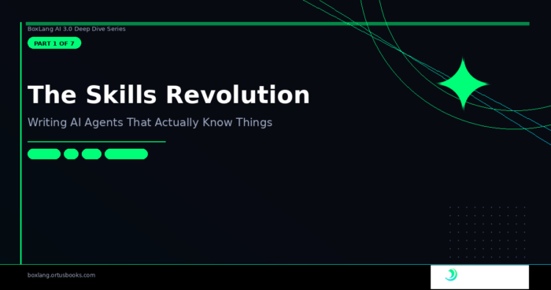

*This article is part of our 7-part deep dive on building production-ready AI systems with BoxLang.*

**BoxLang AI 3.0 Series · Part 1 of 7**

Every AI framework eventually hits the same wall: your system prompts start drifting. Agent A has a slightly different version of the SQL rules than Agent B. The tone policy on your support bot is three weeks behind the tone policy on your documentation bot. Someone copy-pasted the wrong version. Nobody noticed.

This isn't a discipline problem: it's an architecture problem. System prompts are plain strings, and plain strings don't have a source of truth.

**BoxLang AI 3.0 fixes this with the AI Skills system** --- a first-class implementation of [Anthropic's Agent Skills open standard](https://www.anthropic.com/news/agent-skills "Anthropic's Agent Skills open standard") that treats knowledge as a first-class, versioned, reusable asset. Define it once. Inject it everywhere. Let your codebase --- not copy-paste --- be the source of truth.

🧠 What Is a Skill? {#h2-0-what-is-a-skill}
-------------------------------------------

A skill is a named block of domain knowledge or instructions that can be injected into any agent or model's system context at runtime. Think of it as a reusable expertise module: a SQL style guide, a tone-of-voice policy, an API cheat sheet, a set of security rules.

The core class is `AiSkill.bx`. Each skill has three fields:

<pre class="EnlighterJSRAW" data-enlighter-language="java">// From AiSkill.bx
property name="name"        type="string" default="";
property name="description" type="string" default="";
property name="content"     type="string" default="";
</pre>

That's it. The `description` tells the LLM when to apply the skill. The `content` is the full instruction block. Simple by design.

📄 The SKILL.md File Format {#h2-1-the-skill-md-file-format}
------------------------------------------------------------

Skills live in named subdirectories under `.ai/skills/`, following the Agent Skills open standard:

<pre class="EnlighterJSRAW" data-enlighter-language="html">.ai/skills/
    sql-optimizer/
        SKILL.md
    company-tone/
        SKILL.md
    api-guidelines/
        SKILL.md</pre>

The file format is plain Markdown with optional YAML frontmatter:

<pre class="EnlighterJSRAW" data-enlighter-language="java">---
description: Enforces our SQL coding standards. Apply when writing or reviewing any database query.
---

# SQL Coding Standards

Always use snake_case for column and table names.
Prefer CTEs over nested sub-queries for readability.
Never use `SELECT *` — list columns explicitly.
Alias all tables with a meaningful short name.
Use parameterized queries for all user input.
</pre>

One important detail from the source code: if you omit the frontmatter `description`, BoxLang automatically uses the **first paragraph of the body** as the description. This matches the Claude Agent Skills standard, and it means even the simplest possible `SKILL.md` --- just a few lines of plain text --- works without any configuration:

<pre class="EnlighterJSRAW" data-enlighter-language="java">// From AiSkill.bx — fromPath() method
var descFromFrontmatter = parsed.frontmatter.description ?: ""
if ( descFromFrontmatter.len() ) {
    skill.setDescription( descFromFrontmatter )
} else {
    var bodyText       = parsed.body.trim()
    var blankAt        = bodyText.find( char( 10 ) &amp; char( 10 ) )
    var firstParagraph = blankAt &gt; 0 ? bodyText.left( blankAt - 1 ).trim() : bodyText
    skill.setDescription( firstParagraph )
}
</pre>

The directory name becomes the skill's default name when loaded from a path. So `sql-optimizer/SKILL.md` becomes the `sql-optimizer` skill automatically.

🔧 Creating Skills {#h2-2-creating-skills}
------------------------------------------

Three ways to create skills, for three different use cases.

**From a single file:**

<pre class="EnlighterJSRAW" data-enlighter-language="java">// Load one skill by path
apiSkill = aiSkill( ".ai/skills/api-guidelines/SKILL.md" )
</pre>

**From an entire directory (recursive by default):**

<pre class="EnlighterJSRAW" data-enlighter-language="java">// Discover every SKILL.md under .ai/skills/ and all subdirectories
allSkills = aiSkill( ".ai/skills/", recurse: true )
</pre>

**Inline, for short guidance that lives in your code:**

<pre class="EnlighterJSRAW" data-enlighter-language="java">sqlStyle = aiSkill(
    name        : "sql-style",
    description : "SQL coding standards for all database queries",
    content     : "Always use snake_case. Prefer CTEs. Never use SELECT *."
)
</pre>

The `aiSkill()` BIF handles all three cases --- you pass either a path or named arguments, and it figures out the rest.

⚡ Two Injection Modes {#h2-3-two-injection-modes}
-------------------------------------------------

This is where the architecture gets genuinely clever. Skills support two injection strategies that you can mix freely within the same agent.

### Always-On Skills {#h3-4-always-on-skills}

Full content injected into the system message on every single call. Zero latency --- the LLM always has this knowledge in context.

<pre class="EnlighterJSRAW" data-enlighter-language="generic">agent = aiAgent(
    name   : "support-bot",
    skills : [
        aiSkill( name: "tone",   content: "Always be warm, concise, and empathetic." ),
        aiSkill( name: "format", content: "Use bullet lists for steps. Keep replies under 300 words." )
    ]
)
</pre>

Best for: short, universally relevant guidance that applies to virtually every query.

### Lazy / Available Skills {#h3-5-lazy-available-skills}

Only a compact index --- the skill name and one-line description --- is included in the system message. When the LLM determines it needs a skill, it calls a built-in `loadSkill( name )` tool to fetch the full content on demand.

<pre class="EnlighterJSRAW" data-enlighter-language="java">agent = aiAgent(
    name            : "code-assistant",
    availableSkills : aiSkill( ".ai/skills/", recurse: true )
)
</pre>

What the LLM sees in its system message:

<pre class="EnlighterJSRAW" data-enlighter-language="html">## Available Skills
Call loadSkill(name) to activate when needed:
- sql-optimizer: Enforces our SQL coding standards. Apply when writing or reviewing database queries.
- boxlang-expert: BoxLang idioms and best practices for writing idiomatic BoxLang code.
- api-guidelines: REST API design standards for all new endpoints.
- security-policy: Security rules for handling user data and authentication.</pre>

The LLM only pulls full content for skills it actually needs. A query about formatting a date never loads the SQL optimizer. **Token usage stays low even with hundreds of skills in the library.**

### The `loadSkill` Tool --- Auto-Registered, Not Magic {#h3-6-the-loadskill-tool-auto-registered-not-magic}

One of the cleanest implementation details in the codebase is how lazy skills are wired up. When you add available skills to an agent, it automatically registers a `loadSkill` tool:

<pre class="EnlighterJSRAW" data-enlighter-language="java">// From AiAgent.bx — _registerLoadSkillTool()
var loadSkillTool = aiTool(
    name       : "loadSkill",
    description: "Activate a skill from the Available Skills library...",
    callable   : ( required string name ) =&gt; {
        var skill = agentSelf.activateSkill( arguments.name )
        if ( isNull( skill ) ) {
            return "Skill '#arguments.name#' was not found..."
        }
        return skill.toContentBlock()
    },
    autoRegister: false
)
</pre>

When the LLM calls `loadSkill( "sql-optimizer" )`, two things happen: the full content is returned as a tool result (so the LLM can use it immediately), and the skill is **promoted to always-on** for all subsequent calls in that session. The agent learns on the fly what it needs.

### Promoting Lazy Skills Mid-Session {#h3-7-promoting-lazy-skills-mid-session}

You can also promote a skill programmatically at any point:

<pre class="EnlighterJSRAW" data-enlighter-language="java">// User just mentioned they want to work on SQL queries
// Pre-load the skill for the rest of the session
agent.activateSkill( "sql-optimizer" )
</pre>

🌍 Global Skills Pool {#h2-8-global-skills-pool}
------------------------------------------------

Register skills once at the application level and have them automatically available to every new agent --- no explicit wiring required.

<pre class="EnlighterJSRAW" data-enlighter-language="java">// In Application.bx or ModuleConfig.bx
aiGlobalSkills().add( aiSkill( ".ai/skills/company-tone/SKILL.md" ) )
aiGlobalSkills().add( aiSkill( ".ai/skills/security-policy/SKILL.md" ) )

// Every agent gets these automatically as available (lazy) skills
agent1 = aiAgent( name: "support-bot" )    // already has company-tone + security-policy
agent2 = aiAgent( name: "code-assistant" ) // ditto
</pre>

You can also configure global skills statically in `boxlang.json`:

<pre class="EnlighterJSRAW" data-enlighter-language="java">{
    "modules": {
        "bxai": {
            "settings": {
                "skillsDirectory": ".ai/skills",
                "autoLoadSkills": true
            }
        }
    }
}
</pre>

With `autoLoadSkills: true`, any `SKILL.md` file discovered in `skillsDirectory` at startup is automatically added to the global pool.

🎨 How Skills Render {#h2-9-how-skills-render}
----------------------------------------------

`AiSkill` has two rendering methods that are used differently depending on whether the skill is always-on or lazy.

`toIndexLine()` --- the compact one-liner for the Available Skills index:

<pre class="EnlighterJSRAW" data-enlighter-language="html">- sql-optimizer: Enforces our SQL coding standards. Apply when writing or reviewing database queries.</pre>

`toContentBlock()` --- the full markdown block injected for always-on skills:

<pre class="EnlighterJSRAW" data-enlighter-language="java">#### Skill: sql-optimizer
Enforces our SQL coding standards. Apply when writing or reviewing database queries.

# SQL Coding Standards

Always use snake_case for column and table names.
Prefer CTEs over nested sub-queries for readability.
...
</pre>

The `buildSkillsContent()` method on `AiBaseRunnable` assembles both sections into the final system message block --- always-on skills rendered in full, available skills as a compact index.

🔍 Introspection {#h2-10-introspection}
---------------------------------------

Both `AiAgent` and `AiModel` expose full skill visibility:

<pre class="EnlighterJSRAW" data-enlighter-language="java">config = agent.getConfig()

println( config.activeSkillCount )              // 2  — always-on
println( config.availableSkillCount )           // 12 — lazy
println( config.skills.activeSkills )           // [{ name, description }, ...]
println( config.skills.availableSkills )        // [{ name, description }, ...]

// Render the combined system-message block for debugging
println( agent.buildSkillsContent() )
</pre>

The system message is also cached and fingerprinted --- if nothing has changed since the last call (same description, instructions, skill pools), the cached version is returned without rebuilding:

<pre class="EnlighterJSRAW" data-enlighter-language="java">// From AiAgent.bx — _buildSystemMessageFingerprint()
private string function _buildSystemMessageFingerprint() {
    var skillNames = variables.skills.map( s =&gt; s.getName() ).toList( "," )
    var availNames = variables.availableSkills.map( s =&gt; s.getName() ).toList( "," )
    return hash( variables.description &amp; variables.instructions &amp; skillNames &amp; availNames )
}
</pre>

Cache invalidation happens automatically when you add or activate skills.

📋 Full Skills API Reference {#h2-11-full-skills-api-reference}
---------------------------------------------------------------

|                       Method / BIF                       |       Where        |               Description                |
|----------------------------------------------------------|--------------------|------------------------------------------|
| `aiSkill( path \| name, description, content, recurse )` | Global BIF         | Create or discover skills                |
| `aiGlobalSkills()`                                       | Global BIF         | Access the global shared skill pool      |
| `withSkills( skills )`                                   | `AiModel, AiAgent` | Set always-on skills                     |
| `addSkill( skill )`                                      | `AiModel, AiAgent` | Add a single always-on skill             |
| ` withAvailableSkills( skills )`                         | `AiModel, AiAgent` | Set the lazy skill pool                  |
| `addAvailableSkill( skill )`                             | `AiModel, AiAgent` | Add a single lazy skill                  |
| `activateSkill( name )`                                  | `AiModel, AiAgent` | Promote a lazy skill to always-on        |
| `buildSkillsContent()`                                   | `AiModel, AiAgent` | Render the combined system-message block |
| `listSkills() `                                          | `AiModel, AiAgent` | Get active and available skill summaries |

🚀 Putting It Together {#h2-12-putting-it-together}
---------------------------------------------------

Here's a complete real-world example: a code review agent with a curated skill library. Short, universal skills are always-on. A large specialized library is lazy-loaded on demand.

<pre class="EnlighterJSRAW" data-enlighter-language="java">// Always-on: applies to every single response
toneSkill   = aiSkill( name: "tone",   content: "Be concise, technical, and constructive." )
formatSkill = aiSkill( name: "format", content: "Lead with the issue. Follow with code. End with a one-line summary." )

// Lazy library: loaded on demand based on what the user is reviewing
allLangSkills = aiSkill( ".ai/skills/languages/", recurse: true )

agent = aiAgent(
    name            : "code-reviewer",
    description     : "Expert code reviewer across multiple languages and frameworks",
    skills          : [ toneSkill, formatSkill ],
    availableSkills : allLangSkills
)

// BoxLang review — agent loads the boxlang-expert skill automatically
response = agent.run( "Review this BoxLang class for style and correctness: ..." )

// SQL review — agent loads sql-optimizer automatically
response = agent.run( "Is this query efficient? SELECT * FROM orders WHERE ..." )
</pre>

No hardcoded system prompts. No copy-paste. Skills live in files, travel with your codebase, and get reviewed alongside your code.

What's Next {#h2-13-what-s-next}
--------------------------------

**In Part 2** , we'll go deep on the Tool System Overhaul --- `BaseTool`, `ClosureTool`, the Global Tool Registry, `@AITool` annotation scanning, and the built-in `now@bxai` tool that gives every agent temporal awareness for free.

📖 [Full Documentation](https://boxlang.ortusbooks.com/ "Full Documentation") 📦Install Today: `install-bx-module bx-ai` 🫶[Professional Support](https://ai.ortussolutions.com/ "Professional Support")

[← Previous](https://foojay.io/today/boxlang-ai-series-complete-guide-to-building-ai-agents/)

[Next →](https://foojay.io/today/boxlang-ai-deep-dive-part-2-of-7-building-a-production-grade-ai-tool-ecosystem/)

 
