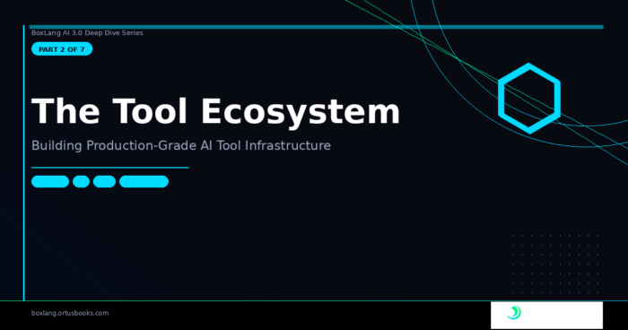

*BoxLang AI 3.0 Series · Part 2 of 7*

Function calling is where most AI frameworks look deceptively simple on the surface and turn into a mess underneath. You define a tool, pass it to the LLM, and when the LLM calls it --- who handles the lifecycle? Who fires observability events? Who serializes the result? Who resolves the tool by name when the only thing you have is a string?

In most frameworks: you do. In BoxLang AI 3.0: the framework does, and the architecture is worth understanding.

🏗️ The Tool Hierarchy {#h2-0-the-tool-hierarchy}
-------------------------------------------------

The 3.0 tool system is built around three layers:

<pre class="EnlighterJSRAW" data-enlighter-language="html">ITool (interface)
  └── BaseTool (abstract class)
        ├── ClosureTool (closure/lambda-backed tool)
        └── MCPTool    (MCP server proxy tool)</pre>

Every tool in the system extends `BaseTool`. That means every tool gets the same lifecycle, the same event firing, and the same result serialization --- for free, without touching provider code.

🧱 `BaseTool` --- The Abstract Foundation {#h2-1-basetool-the-abstract-foundation}
----------------------------------------------------------------------------------

`BaseTool` is an abstract class that owns the shared infrastructure all tools need. The key design decision is that `invoke()` is declared `final`:

<pre class="EnlighterJSRAW" data-enlighter-language="java">// From BaseTool.bx
public final string function invoke( required struct args, AiChatRequest chatRequest ) {
    // Fire global event BEFORE tool execution
    BoxAnnounce( "beforeAIToolExecute", {
        tool        : this,
        name        : variables.name,
        arguments   : arguments.args,
        chatRequest : arguments.chatRequest
    } )

    // Time and execute
    var startTime = getTickCount()
    var results   = doInvoke( arguments.args, arguments.chatRequest )
    var execTime  = getTickCount() - startTime

    // Fire global event AFTER tool execution
    BoxAnnounce( "afterAIToolExecute", {
        tool          : this,
        name          : variables.name,
        arguments     : arguments.args,
        results       : results,
        executionTime : execTime,
        chatRequest   : arguments.chatRequest
    } )

    // Serialize and return
    return serializeResult( results )
}
</pre>

By making `invoke()` final, `BaseTool` guarantees that:

* `beforeAIToolExecute` and `afterAIToolExecute` events **always fire** --- no subclass can skip them
* Execution time is **always measured**
* Results are **always serialized** consistently (simple values pass through, complex values get JSON-serialized)  
  Subclasses implement two abstract methods and nothing else:

<pre class="EnlighterJSRAW" data-enlighter-language="java">// What your tool actually DOES
abstract public any function doInvoke( required struct args, AiChatRequest chatRequest );

// The OpenAI-compatible schema for this tool
abstract public struct function generateSchema();
</pre>

The separation is clean: `BaseTool` handles infrastructure, subclasses handle logic.

### Fluent Schema Description {#h3-2-fluent-schema-description}

`BaseTool` also ships a fluent `onMissingMethod` that gives you a readable way to describe your tool's arguments without building schema structs by hand:

<pre class="EnlighterJSRAW" data-enlighter-language="java">tool = new MySearchTool( client )
    .describeFunction( "Search the product catalog" )  // sets description
    .describeQuery( "The search term to look up" )     // describeArg( "query", "..." )
    .describeMaxResults( "Max items to return" )       // describeArg( "maxResults", "..." )
</pre>

Any call to `describe[ArgName]( "..." )` routes through `onMissingMethod` and sets the argument description used during schema generation.

⚡ `ClosureTool` --- Zero-Boilerplate Tool Creation {#h2-3-closuretool-zero-boilerplate-tool-creation}
-----------------------------------------------------------------------------------------------------

`ClosureTool` is the tool you'll use most of the time. It wraps any closure or lambda and auto-introspects the callable's parameter metadata using BoxLang's `.$bx.meta.parameters` to generate a full OpenAI-compatible function schema.

<pre class="EnlighterJSRAW" data-enlighter-language="java">// From ClosureTool.bx — getArgumentsSchema()
public struct function getArgumentsSchema() {
    var results = { "properties" : {}, "required" : [] }
    variables.callable.$bx.meta.parameters.each( param =&gt; {
        if ( param.required ) {
            results.required.append( param.name )
        }
        results.properties[ param.name ] = {
            "type"        : "string",
            "description" : variables.argDescriptions[ param.name ] ?: param.name
        }
    } )
    return results
}
</pre>

In practice you never call this yourself --- the `aiTool()` BIF creates a `ClosureTool` for you:

<pre class="EnlighterJSRAW" data-enlighter-language="java">// Required + optional args — schema is auto-generated from parameter metadata
searchTool = aiTool(
    "searchKB",
    "Search the internal knowledge base for relevant articles",
    function( required string query, numeric maxResults = 5 ) {
        return knowledgeBase.search( query, maxResults )
    }
)
</pre>

The resulting schema sent to the LLM:

<pre class="EnlighterJSRAW" data-enlighter-language="java">{
    "type": "function",
    "function": {
        "name": "searchKB",
        "description": "Search the internal knowledge base for relevant articles",
        "parameters": {
            "type": "object",
            "properties": {
                "query":      { "type": "string", "description": "query" },
                "maxResults": { "type": "string", "description": "maxResults" }
            },
            "required": ["query"],
            "additionalProperties": false
        }
    }
}
</pre>

Add argument descriptions with the fluent API:

<pre class="EnlighterJSRAW" data-enlighter-language="java">searchTool = aiTool(
    "searchKB",
    "Search the knowledge base",
    function( required string query, numeric maxResults = 5 ) {
        return knowledgeBase.search( query, maxResults )
    }
).describeQuery( "The search term — be specific for better results" )
 .describeMaxResults( "Maximum number of articles to return (default: 5)" )
</pre>

### Tools Get the Full Chat Request {#h3-4-tools-get-the-full-chat-request}

One powerful feature: `ClosureTool` injects `_chatRequest` into the args struct before invocation. This gives your closure access to the full originating `AiChatRequest` --- the entire conversation context, parameters, options, and more:

<pre class="EnlighterJSRAW" data-enlighter-language="java">contextAwareTool = aiTool(
    "getPersonalizedAdvice",
    "Get advice tailored to the user's session context",
    function( required string topic ) {
        // Access the originating chat request from _chatRequest
        var userId = _chatRequest.getOptions().userId ?: "anonymous"
        return advisorService.getAdvice( topic, userId )
    }
)
</pre>

🗄️ The Global AI Tool Registry {#h2-5-the-global-ai-tool-registry}
-------------------------------------------------------------------

The `AIToolRegistry` is a module-scoped singleton accessible via `aiToolRegistry()`. Its core job: let you register tools by name once and reference them as plain strings anywhere tools are accepted.

<pre class="EnlighterJSRAW" data-enlighter-language="java">// Register once at startup (Application.bx or ModuleConfig.bx)
aiToolRegistry().register( "searchProducts", productSearchTool )
aiToolRegistry().register( name: "getWeather", description: "Get weather for a city", callback: weatherFn )

// Reference by name — no live object needed
result = aiChat(
    "Find wireless headphones under $50",
    { tools: [ "searchProducts", "getWeather" ] }
)
</pre>

String keys are resolved lazily via `resolveTools()` right before each LLM request --- so you can register at startup and reference anywhere.

### Module Namespacing {#h3-6-module-namespacing}

Use `toolName@moduleName` convention to keep registrations collision-free across modules:

<pre class="EnlighterJSRAW" data-enlighter-language="java">aiToolRegistry().register(
    name        : "lookup",
    description : "Look up customer by ID",
    callback    : id =&gt; customerService.find( id ),
    module      : "crm"
)

// Full key lookup
tool = aiToolRegistry().get( "lookup@crm" )

// Bare name works too when unambiguous
tool = aiToolRegistry().get( "lookup" )
</pre>

### `@AITool` Annotation Scanning {#h3-7-aitool-annotation-scanning}

The cleanest registration path for class-based tools: annotate your methods and let the registry scan the class:

<pre class="EnlighterJSRAW" data-enlighter-language="java">// WeatherTools.bx
class {

    @AITool( "Get the current weather for a city, returns temperature and conditions" )
    public string function getWeather( required string city ) {
        return weatherAPI.fetch( arguments.city )
    }

    @AITool( "Get a 7-day forecast for a city" )
    public string function getForecast( required string city, string units = "celsius" ) {
        return weatherAPI.forecast( arguments.city, arguments.units )
    }

}
</pre>

<pre class="EnlighterJSRAW" data-enlighter-language="java">// Register everything at once
aiToolRegistry().scan( new WeatherTools(), "weather-module" )
// → getWeather@weather-module, getForecast@weather-module
</pre>

The `scan()` method uses `getMetaData()` to find all @`AITool`-annotated functions, extracts the annotation value as the description, and wraps each method as a `ClosureTool` automatically. Per-parameter `@hint` annotations become argument descriptions.

### Two-Step Resolution {#h3-8-two-step-resolution}

The registry uses a smart two-step lookup for bare names (without `@module`):

Try exact key match: `"lookup"` → look for exactly `"lookup"` in the registry  

Scan all keys for any that match the name portion before `@`: `"lookup"` → finds `"lookup@crm"`  

This means you can use bare names in development and fully-qualified keys in production without changing your call sites.

🔧 Built-In Core Tools --- `now@bxai` {#h2-9-built-in-core-tools-now-bxai}
--------------------------------------------------------------------------

Two tools ship built-in, defined in `CoreTools.bx` using the same `@AITool` annotation pattern:

<pre class="EnlighterJSRAW" data-enlighter-language="java">// From CoreTools.bx
class {

    @AITool( "Returns the current date and time in ISO 8601 format. Use this whenever you need to know the current date or time." )
    public string function now() {
        return now().dateTimeFormat( "iso" )
    }

    @AITool( "Fetches the contents of a URL via HTTP GET. Use this to retrieve data from websites or REST APIs." )
    public string function httpGet( required string url ) {
        return http( url: arguments.url ).send().fileContent
    }

}
</pre>

`now@bxai` is **auto-registered on module load** --- every agent in every application gets temporal awareness without any configuration. This matters because LLMs have a training cutoff. Without access to the current date and time, they'll confidently tell you the wrong year, calculate ages incorrectly, or miscalculate deadlines. `now@bxai` solves this.

`httpGet@bxai` is **opt-in only** --- not auto-registered because it can reach any URL including internal network endpoints. Register it explicitly when your application genuinely needs web access:

<pre class="EnlighterJSRAW" data-enlighter-language="java">import bxModules.bxai.models.tools.core.CoreTools;
// This adds httpGet@bxai alongside the already-registered now@bxai
aiToolRegistry().scan( new CoreTools(), "bxai" )
</pre>

🔌 `MCPTool` --- MCP Server Proxy {#h2-10-mcptool-mcp-server-proxy}
-------------------------------------------------------------------

`MCPTool` is the third `BaseTool` subclass. When you call `withMCPServer()` on an agent or model, each tool returned by `MCPClient.listTools()` becomes an `MCPTool` instance automatically:

<pre class="EnlighterJSRAW" data-enlighter-language="java">// From MCPTool.bx — doInvoke()
public any function doInvoke( required struct args, AiChatRequest chatRequest ) {
    // Strip the internal _chatRequest key before forwarding to MCP server
    var mcpArgs  = arguments.args.filter( ( k, v ) =&gt; k != "_chatRequest" )
    var response = variables.mcpClient.send( variables.name, mcpArgs )

    if ( response.isSuccess() ) {
        var data = response.getData()
        // Handle MCP content arrays: [{ type: "text", text: "..." }, ...]
        if ( isArray( data ) ) {
            return data
                .map( item =&gt; isStruct( item ) &amp;&amp; item.keyExists( "text" ) ? item.text : toString( item ) )
                .toList( char( 10 ) )
        }
        return isSimpleValue( data ) ? toString( data ) : data
    }

    return "Error from MCP tool [#variables.name#]: " &amp; response.getError()
}
</pre>

The `generateSchema()` method converts the MCP `inputSchema` to OpenAI function-calling format automatically --- so the LLM can call MCP tools exactly the same way it calls any other `ITool`.

🏗️ Building a Custom Class-Based Tool {#h2-11-building-a-custom-class-based-tool}
----------------------------------------------------------------------------------

For tools that need their own state, configuration, or unit tests, extend `BaseTool` directly:

<pre class="EnlighterJSRAW" data-enlighter-language="java">// MySearchTool.bx
class extends="bxModules.bxai.models.tools.BaseTool" {

    property name="searchClient";

    function init( required any searchClient ) {
        variables.name        = "searchProducts"
        variables.description = "Search the product catalog and return matching items"
        variables.searchClient = arguments.searchClient
        return this
    }

    public any function doInvoke( required struct args, AiChatRequest chatRequest ) {
        return variables.searchClient.search(
            query      : args.query,
            maxResults : args.maxResults ?: 5
        )
    }

    public struct function generateSchema() {
        return {
            "type": "function",
            "function": {
                "name"       : variables.name,
                "description": variables.description,
                "parameters" : {
                    "type"                 : "object",
                    "properties"           : {
                        "query"      : { "type": "string",  "description": "Search query text" },
                        "maxResults" : { "type": "integer", "description": "Maximum results to return" }
                    },
                    "required"             : [ "query" ],
                    "additionalProperties" : false
                }
            }
        }
    }

}
</pre>

Register and use it:

<pre class="EnlighterJSRAW" data-enlighter-language="java">aiToolRegistry().register( new MySearchTool( searchClient ), "my-app" )

result = aiChat( "Find wireless headphones", { tools: [ "searchProducts@my-app" ] } )
</pre>

🗺️ MCP Server Seeding {#h2-12-mcp-server-seeding}
--------------------------------------------------

Beyond the `MCPTool` class itself, the agent and model `withMCPServer()` / `withMCPServers()` APIs make it trivial to connect to entire MCP ecosystems:

<pre class="EnlighterJSRAW" data-enlighter-language="java">// At construction time
agent = aiAgent(
    name       : "data-analyst",
    mcpServers : [
        { url: "http://localhost:3001", token: "secret" },
        "http://internal-tools:3002"
    ]
)

// Fluently after construction
agent = aiAgent( "analyst" )
    .withMCPServer( "http://localhost:3001", { token: "secret", timeout: 5000 } )
    .withMCPServer( existingMCPClient )

// Inspect what was discovered
tools   = agent.listTools()     // [{ name, description }] for ALL tools
servers = agent.listMCPServers() // [{ url, toolNames }]
</pre>

Under the hood, `withMCPServer()` calls `listTools()`, wraps each result as an `MCPTool`, and appends them to the agent's tool list. The MCP server metadata is also injected into the system message so the LLM knows which tools came from which server --- useful for complex multi-server setups.

🎯 Putting It All Together {#h2-13-putting-it-all-together}
-----------------------------------------------------------

A realistic example: a customer support agent with a mix of registry tools, class-based tools, and MCP server tools.

<pre class="EnlighterJSRAW" data-enlighter-language="java">// Application.bx — register at startup
aiToolRegistry().scan( new CustomerTools(), "crm" )   // getCustomer@crm, updateCustomer@crm
aiToolRegistry().scan( new OrderTools(), "orders" )   // getOrder@orders, refundOrder@orders

// Agent setup — mix strings, instances, and MCP servers
agent = aiAgent(
    name       : "support-agent",
    tools      : [ "getCustomer@crm", "getOrder@orders", "refundOrder@orders" ],
    mcpServers : [ "http://internal-kb-server:3001" ]  // knowledge base MCP tools
)

// The LLM sees all tools — registry tools + MCP tools — and uses them freely
response = agent.run( "Customer #12345 says their order #98765 never arrived. Help them." )
</pre>

What's Next {#h2-14-what-s-next}
--------------------------------

In Part 3, we go deep on multi-agent orchestration --- how parent-child hierarchies work in code, how sub-agents become tools automatically, how stateless agents handle multi-tenant memory, and how to build real AI teams in BoxLang.

📖 [Full Documentation](https://boxlang.ortusbooks.com/ "Full Documentation") 📦Install Today: `install-bx-module bx-ai` 🫶[Professional Support](https://ai.ortussolutions.com/ "Professional Support")

[← Previous](https://foojay.io/today/boxlang-ai-deep-dive-part-1-of-7-the-skills-revolution-%f0%9f%8e%93/)

[Next -\>](https://foojay.io/today/boxlang-ai-deep-dive-part-3-of-7-multi-agent-orchestration-building-ai-teams-that-work-%f0%9f%8c%b2/)
