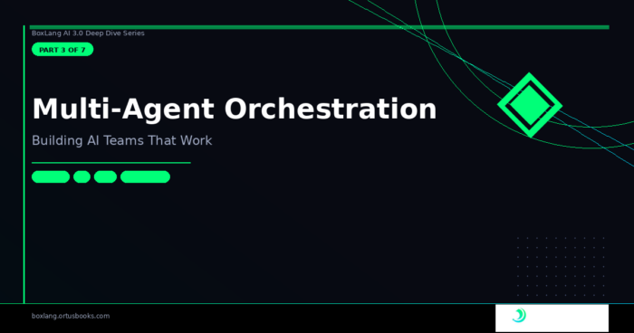

*BoxLang AI 3.0 Series · Part 3 of 7*

A single agent is useful. An orchestra of agents is powerful.

The problem with most multi-agent frameworks is that the orchestration layer is bolted on --- you're managing agent references manually, passing outputs between them by hand, and hoping you haven't introduced a cycle. There's no concept of hierarchy. No cycle detection. No way to ask "who's in charge here?" or "how deep in the tree am I?"

BoxLang AI 3.0 changes this. `AiAgent` now tracks its position in a full hierarchy tree, and sub-agents are wired as tools automatically --- the coordinator doesn't need to know how to delegate, only that it can.

🌲 The Agent Tree
-----------------

Every `AiAgent` carries a `parentAgent` property and a full set of hierarchy helpers. The relationship is bidirectional: `addSubAgent()` registers the sub-agent as a callable tool and sets the parent reference in one call.

```java
coordinator = aiAgent( name: "coordinator" )
    .addSubAgent( aiAgent( name: "researcher" ) )
    .addSubAgent( aiAgent( name: "writer" ) )

// Hierarchy queries
println( coordinator.isRootAgent() )           // true
println( coordinator.getAgentDepth() )         // 0

println( researcherAgent.isRootAgent() )       // false
println( researcherAgent.getAgentDepth() )     // 1
println( researcherAgent.getAgentPath() )      // /coordinator/researcher
println( researcherAgent.getAncestors() )      // [ coordinator ]

println( writerAgent.getRootAgent().getAgentName() ) // coordinator
```


The full hierarchy API from the source:

```java
// From AiAgent.bx
setParentAgent( parent )   // assign parent — with self-reference and cycle guards
clearParentAgent()         // detach from parent
hasParentAgent()           // boolean
isRootAgent()              // true when depth == 0
getRootAgent()             // walks up, returns the root
getAgentDepth()            // 0 = root, 1 = child, 2 = grandchild, ...
getAgentPath()             // "/coordinator/researcher"
getAncestors()             // [immediateParent, grandparent, ..., root]
```


### Cycle Detection Built-In

Setting a parent that would create a cycle throws immediately --- no silent infinite loops:

```java
// From AiAgent.bx — setParentAgent()
AiAgent function setParentAgent( required AiAgent parent ) {
    if ( arguments.parent == this ) {
        throw( type: "AiAgent.InvalidParent", message: "An agent cannot be its own parent." )
    }
    // Walk up the proposed parent's ancestry and check for self
    var ancestor = arguments.parent
    while ( ancestor.hasParentAgent() ) {
        ancestor = ancestor.getParentAgent()
        if ( ancestor == this ) {
            throw( type: "AiAgent.CyclicParent", message: "Setting this parent would create a cycle..." )
        }
    }
    variables.parentAgent = arguments.parent
    return this
}
```


🤖 Sub-Agents as Tools
----------------------

The magic of `addSubAgent()` is that each sub-agent is automatically wrapped as a tool the parent can call --- no manual wiring, no custom callback code.

```java
// From AiAgent.bx — createSubAgentTool()
private ITool function createSubAgentTool( required AiAgent subAgent ) {
    var agentName    = arguments.subAgent.getConfig().name
    var toolName     = "delegate_to_" & agentName.slugify()
    var toolDescription = "Delegate a task to the '#agentName#' sub-agent. "
        & "Use this tool when the task matches the sub-agent's specialty: #agentConfig.description#"

    return aiTool(
        name: toolName,
        description: toolDescription,
        callable: ( required task ) => {
            return subAgent.run( task )
        }
    ).describeArg( "task", "The task or question to delegate to the sub-agent" )
}
```


When `addSubAgent()` is called, the parent's `AiModel` gets a new tool named `delegate_to_researcher`, `delegate_to_writer`, etc. The LLM sees these tools in its context and decides when to use them --- exactly the same way it decides when to call any other tool.

**The coordinator doesn't need special logic. It just has more tools.**

🏢 AiAgent is Now Fully Stateless
---------------------------------

One of the most important architectural changes in 3.0: `AiAgent` no longer holds `userId` or `conversationId` as instance state. They are resolved per-call.

```java
// From AiAgent.bx — run()
public any function run( any input = "", struct params = {}, struct options = {} ) {
    // Resolve per-call — no shared state
    var threadId       = arguments.options.threadId ?: variables.options.threadId ?: createUUID()
    var userId         = arguments.options.userId ?: variables.options.userId ?: ""
    var conversationId = arguments.options.conversationId ?: variables.options.conversationId ?: ""
    // ...
}
```


This means **one agent instance can safely serve multiple concurrent users** --- no race conditions, no cross-user contamination, no per-user agent factory needed.

```java
// One shared agent — many concurrent users
sharedAgent = aiAgent( name: "support", memory: aiMemory( "cache" ) )

// Each call is fully isolated
sharedAgent.run( "Hello",           {}, { userId: "alice", conversationId: "sess-1" } )
sharedAgent.run( "What did I say?", {}, { userId: "alice", conversationId: "sess-1" } ) // remembers alice
sharedAgent.run( "Hello",           {}, { userId: "bob",   conversationId: "sess-2" } ) // isolated from alice
```


🧠 Per-Call Identity Routing on Memory
--------------------------------------

All memory types follow the same pattern --- `add()`, `getAll()`, `clear()`, and `trim()` all accept optional `userId` and `conversationId`:

```java
// One memory instance, many tenants
sharedMemory = aiMemory( "cache" )

sharedMemory.add( message, userId: "alice", conversationId: "conv-1" )
sharedMemory.add( message, userId: "bob",   conversationId: "conv-2" )

// Each retrieval is tenant-scoped
aliceHistory = sharedMemory.getAll( userId: "alice", conversationId: "conv-1" )
bobHistory   = sharedMemory.getAll( userId: "bob",   conversationId: "conv-2" )
```


When the agent calls `loadMemoryMessages()` internally, it passes the resolved per-call `userId` and `conversationId` down to all attached memories. Memory is naturally tenant-isolated without any extra wiring.

🏗️ The Agent Run Lifecycle
---------------------------

Understanding what happens inside `run()` is useful when you're debugging or building middleware (more on that in Part 4). Here's the sequence:

```html
1. Resolve threadId / userId / conversationId (per-call, not instance state)
2. Build the user message struct
3. Build the system message (description + instructions + skills + tools + MCP servers)
4. Load memory messages for this userId/conversationId
5. Assemble: [system, ...memory, userMessage]
6. Fire beforeAgentRun middleware (forward pass)
7. Fire BoxAnnounce "beforeAIAgentRun" (global event)
8. Execute via AiModel.run() — handles tool calling, retries, streaming
9. If suspended (HITL): checkpoint and return
10. Store assistant response in all memories (userId/conversationId scoped)
11. Fire afterAgentRun middleware (reverse pass)
12. Fire BoxAnnounce "afterAIAgentRun" (global event)
13. Return response
```


The system message is also cached and fingerprinted --- if description, instructions, and skill pools haven't changed since the last call, the cached version is used instead of rebuilding. This matters for high-throughput scenarios where the same agent handles many requests.

🌊 Streaming with Multi-Agent Teams
-----------------------------------

Streaming works the same way in multi-agent setups --- each agent can stream independently:

coordinator = aiAgent( name: "coordinator" )

```java
coordinator = aiAgent( name: "coordinator" )
    .addSubAgent( aiAgent( name: "researcher" ) )
    .addSubAgent( aiAgent( name: "writer" ) )

// Stream the coordinator's output
coordinator.stream(
    onChunk : chunk => writeOutput( chunk.choices?.first()?.delta?.content ?: "" ),
    input   : "Research and write a 500-word article about BoxLang's JVM interop",
    options : { userId: "user-123", conversationId: "session-abc" }
)
```


When the coordinator decides to delegate to the researcher, that sub-call happens synchronously inside the tool invocation --- the streaming coordinator gets back the researcher's result as a tool response, then continues streaming.

🔄 Suspend and Resume
---------------------

When `HumanInTheLoopMiddleware` (covered in Part 4) suspends an agent, the state needs to be preserved. The `checkpointer` property handles this:

```java
agent = aiAgent(
    name        : "finance-bot",
    middleware  : new HumanInTheLoopMiddleware(
        mode                  : "web",
        toolsRequiringApproval: [ "transferFunds" ]
    ),
    checkpointer: aiMemory( "cache" )
)

// First call — suspended waiting for approval
result = agent.run( "Transfer $500 to account #12345" )
// result.isSuspended() == true
// Agent auto-saves checkpoint with the threadId

// Later, after human approves via web UI
threadId = result.getData().threadId
agent.resume( "approve", threadId )

// Or reject:
agent.resume( "reject", threadId )

// Or edit the arguments:
agent.resume( "edit", threadId, { correctedArgs: { amount: 100, account: "#12345" } } )
```


The `resume()` implementation re-runs from the saved checkpoint, injecting the human's decision into the middleware context:

```java
// From AiAgent.bx — resume()
any function resume( required string decision, required string threadId, struct editedData = {} ) {
    var savedState = variables.checkpointer.loadState( arguments.threadId )
    // Clear so it can't be resumed twice
    variables.checkpointer.clearState( arguments.threadId )
    // Re-run with resume context injected into options
    return run(
        savedState.input,
        savedState.params,
        savedState.options.append( { _resumeContext: {
            resumeDecision : arguments.decision,
            editedData     : arguments.editedData,
            suspendData    : savedState.suspendData
        } } )
    )
}
```


🔍 Introspection
----------------

The `getConfig()` method gives you full visibility into an agent's state --- useful for debugging, monitoring dashboards, and logging:

```java
config = agent.getConfig()

// Hierarchy
println( config.agentDepth )    // 0, 1, 2, ...
println( config.agentPath )     // "/coordinator/researcher"
println( config.parentAgent )   // "coordinator" (name string)

// Capabilities
println( config.toolCount )     // total tools (including sub-agent delegation tools)
println( config.tools )         // [{ name, description }]
println( config.mcpServers )    // [{ url, toolNames }]

// Memory
println( config.memoryCount )
println( config.memories )

// Skills
println( config.activeSkillCount )
println( config.availableSkillCount )
println( config.skills )        // { activeSkills: [...], availableSkills: [...] }

// Middleware
println( config.middlewareCount )
println( config.middleware )    // [{ name, description }]
```


🚀 A Complete Multi-Agent Example
---------------------------------

Here's a practical orchestration: a coordinator that delegates research to a specialized researcher and writing to a specialized writer, both with their own skills and tools.

```java
// Specialist agents
researchAgent = aiAgent(
    name        : "researcher",
    description : "Expert at finding, analyzing, and summarizing information from multiple sources",
    instructions: "Always cite your sources. Prioritize recent information. Summarize findings clearly.",
    tools       : [ "searchWeb@tools", "fetchURL@tools" ],
    skills      : [ aiSkill( ".ai/skills/research-methodology/SKILL.md" ) ]
)

writerAgent = aiAgent(
    name        : "writer",
    description : "Expert at transforming research into polished, engaging prose",
    instructions: "Write for a technical audience. Be clear and direct. No fluff.",
    skills      : [ aiSkill( ".ai/skills/writing-style/SKILL.md" ) ]
)

// Coordinator with both as sub-agents
coordinator = aiAgent(
    name        : "content-coordinator",
    description : "Orchestrates research and writing to produce complete articles",
    instructions: "Break complex requests into research and writing phases. Delegate accordingly.",
    subAgents   : [ researchAgent, writerAgent ],
    memory      : aiMemory( "cache" )
)

// Inspect the hierarchy
println( coordinator.isRootAgent() )               // true
println( researchAgent.getAgentPath() )            // /content-coordinator/researcher
println( coordinator.getConfig().toolCount )       // 2 (delegate_to_researcher + delegate_to_writer)

// Run — coordinator decides when to delegate and to whom
response = coordinator.run(
    "Write a comprehensive article about BoxLang's AI capabilities",
    {},
    { userId: "luis", conversationId: "article-session-1" }
)
```


The LLM driving the coordinator sees two tools: `delegate_to_researcher` and `delegate_to_writer`. It decides to call the researcher first, gets back a detailed summary, then calls the writer with that summary and the original request, and finally synthesizes the writer's output into a final response. You didn't write any of that logic --- the LLM figured it out from the tool descriptions.

What's Next
-----------

In Part 4, we tackle the middleware system --- the six built-in middleware classes, how the hook lifecycle works, writing your own middleware, and the `FlightRecorderMiddleware` that makes AI agents properly testable in CI.

📖 [Full Documentation](https://boxlang.ortusbooks.com/ "Full Documentation") 📦Install Today: `install-bx-module bx-ai` 🫶[Professional Support](https://ai.ortussolutions.com/ "Professional Support")

[← Previous](https://foojay.io/today/boxlang-ai-deep-dive-part-2-of-7-building-a-production-grade-ai-tool-ecosystem/ "← Previous")

[-\> Next](https://foojay.io/today/boxlang-ai-deep-dive-part-4-of-7-middleware-the-missing-layer-in-every-ai-framework-%f0%9f%a7%b5/)

<br />
