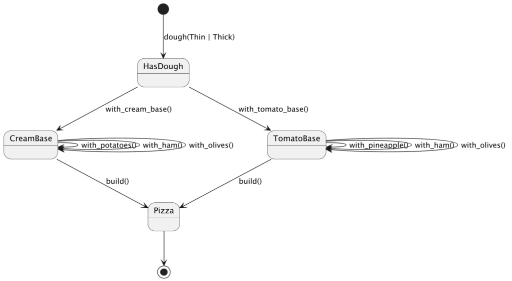

A couple of years ago, I wrote that [The Builder pattern is a finite state machine!](https://blog.frankel.ch/builder-pattern-finite-state-machine/). A state machine consists of states and transitions between them. As a developer, I want to make illegal states unrepresentable, *i.e.*, users of my API can't create non-existent transitions. My hypothesis is that only a static typing system allows this at compile-time. Dynamic typing systems rely on runtime validation.

In this blog post, I will show that it holds true, with a caveat. If your model has many combinations, you also need generics and other niceties to avoid too much boilerplate code. My exploration will use Python, Java, Kotlin, Rust, and Gleam. With that background in mind, let's move on to the model itself.

## The model

I will keep the theme of the aforementioned post: a pizza. Here's the full model:



Every pizza starts with dough. Then, you need to choose your base, either regular tomato or cream. At this point, you can't add any ingredients to it. While you can add ham to both, pineapple is only acceptable on the tomato base, while potatoes are only compatible with the cream base.

The model is purposely simplistic, intentionally leaving out some options and complexities to maintain clarity. It primarily showcases how illegal transitions are represented and avoided. For example, you can't transition from `CreamBase` to `CreamBase` with `withPineapple`.

## Modeling with Python

I chose to model with Python first to demonstrate how dynamically-typed languages manage illegal transitions.

Here are some types:

```python
class Crust:
    pass

@dataclass(frozen=True)
class ThinCrust(Crust):
    pass

@dataclass(frozen=True)
class ThickCrust(Crust):
    pass

class Base:
    pass

@dataclass(frozen=True)
class CreamBase(Base):
    pass

@dataclass(frozen=True)
class TomatoBase(Base):
    pass

class Topping:
    pass

@dataclass(frozen=True)
class Potatoes(Topping):
    pass

@dataclass(frozen=True)
class Pineapple(Topping):
    pass
```

The builders look like:

```python
class DoughBuilder:
    def __init__(self, crust: Crust) -> None:
        self._crust = crust

    def with_cream_base(self) -> "CreamBuilder":
        return CreamBuilder(self._crust, CreamBase(), frozenset())

    def with_tomato_base(self) -> "TomatoBuilder":
        return TomatoBuilder(self._crust, TomatoBase(), frozenset())

class CreamBuilder:
    def __init__(self, crust: Crust, base: CreamBase, toppings: frozenset[Topping]) -> None:
        self._crust = crust
        self._base = base
        self._toppings = toppings

    def with_potatoes(self) -> "CreamBuilder":
        return CreamBuilder(self._crust, self._base, self._toppings | {Potatoes()})

    def with_ham(self) -> "CreamBuilder":
        return CreamBuilder(self._crust, self._base, self._toppings | {Ham()})

    def with_olives(self) -> "CreamBuilder":
        return CreamBuilder(self._crust, self._base, self._toppings | {Olives()})

    def build(self) -> Pizza:
        return Pizza(self._crust, self._base, self._toppings)

class TomatoBuilder:
    def __init__(self, crust: Crust, base: TomatoBase, toppings: frozenset[Topping]) -> None:
        self._crust = crust
        self._base = base
        self._toppings = toppings

    def with_pineapple(self) -> "TomatoBuilder":
        return TomatoBuilder(self._crust, self._base, self._toppings | {Pineapple()})

    def with_ham(self) -> "TomatoBuilder":
        return TomatoBuilder(self._crust, self._base, self._toppings | {Ham()})

    def with_olives(self) -> "TomatoBuilder":
        return TomatoBuilder(self._crust, self._base, self._toppings | {Olives()})

    def build(self) -> Pizza:
        return Pizza(self._crust, self._base, self._toppings)
```

You can happily write:

```python
pizza = dough(ThinCrust()).with_cream_base().with_potatoes().with_ham().build()
pizza = dough(ThinCrust()).with_cream_base().with_pineapple().with_ham().build()   # 1
```

1. Pineapple on a creamy base? Yuck!

Astute readers may have noticed that I used types in the Python code. Seasoned Python developers may use a type checker, *e.g.* , `mypy`, to leverage them.

```bash
uv run mypy .
```

    "CreamBuilder" has no attribute "with_pineapple"  [attr-defined]

Without `mypy`, the call fails at runtime with an `AttributeError`.

Python's gradual typing proves that static typing helps avoid calling non-existent transitions. However, because of the way Python works, one needs to invoke a dedicated type checker. In statically-typed languages, it's unnecessary.

## Modeling with Java

Let's do the same exercise with Java.

Here's the model:

```java
public sealed interface Crust permits ThinCrust, ThickCrust {}
public record ThinCrust() implements Crust {}
public record ThickCrust() implements Crust {}

sealed interface BaseState permits CreamBase, TomatoBase {}
record CreamBase() implements BaseState {}
record TomatoBase() implements BaseState {}
```

And here are the builders:

```java
public class DoughBuilder {

    private final Crust crust;

    private DoughBuilder(Crust crust) {
        this.crust = crust;
    }

    public static DoughBuilder dough(Crust crust) {
        return new DoughBuilder(crust);
    }

    CreamBaseBuilder withCreamBase() {
        return new CreamBaseBuilder(crust, new CreamBase());
    }

    TomatoBaseBuilder withTomatoBase() {
        return new TomatoBaseBuilder(crust, new TomatoBase());
    }
}

class CreamBaseBuilder {

    private final Crust crust;
    private final CreamBase base;
    private final List<Topping> toppings;

    CreamBaseBuilder(Crust crust, CreamBase base) {
        this(crust, base, List.of());
    }

    private CreamBaseBuilder(Crust crust, CreamBase base, List<Topping> toppings) {
        this.crust = crust;
        this.base = base;
        this.toppings = toppings;
    }

    CreamBaseBuilder withPotatoes() {
        return new CreamBaseBuilder(crust, base, append(new Potatoes()));
    }

    CreamBaseBuilder withHam() {
        return new CreamBaseBuilder(crust, base, append(new Ham()));
    }

    CreamBaseBuilder withOlives() {
        return new CreamBaseBuilder(crust, base, append(new Olives()));
    }

    Pizza build() {
        return new Pizza(crust, base, Set.copyOf(toppings));
    }

    private List<Topping> append(Topping topping) {
        return Stream.concat(toppings.stream(), Stream.of(topping)).toList();
    }
}

class TomatoBaseBuilder {

    private final Crust crust;
    private final TomatoBase base;
    private final List<Topping> toppings;

    TomatoBaseBuilder(Crust crust, TomatoBase base) {
        this(crust, base, List.of());
    }

    private TomatoBaseBuilder(Crust crust, TomatoBase base, List<Topping> toppings) {
        this.crust = crust;
        this.base = base;
        this.toppings = toppings;
    }

    TomatoBaseBuilder withPineapple() {
        return new TomatoBaseBuilder(crust, base, append(new Pineapple()));
    }

    TomatoBaseBuilder withHam() {
        return new TomatoBaseBuilder(crust, base, append(new Ham()));
    }

    TomatoBaseBuilder withOlives() {
        return new TomatoBaseBuilder(crust, base, append(new Olives()));
    }

    Pizza build() {
        return new Pizza(crust, base, Set.copyOf(toppings));
    }

    private List<Topping> append(Topping topping) {
        return Stream.concat(toppings.stream(), Stream.of(topping)).toList();
    }
}
```

There's no way we can call `withPineapple()` on a `CreamBase`: we didn't declare the method, and compilation fails. However, imagine more combinations: an additional sweet base, or ingredients incompatible with others, *e.g.* , no anchovies with pineapple. This would create additional states, represented as classes, and transitions, as methods. Soon, you'll face an explosion of combinations, which would require lots of boilerplate code. For example, with the anchovies/pineapple exclusion, you'd need two more base classes: `TomatoBaseWithPineappleBuilder` and `TomatoBaseWithAnchoviesBuilder`.

Java is not a good fit for creating smart builders. Let's see if other languages may improve the situation.

## Modeling with Kotlin

The Kotlin model is pretty similar to the Java one:

```kotlin
sealed interface Crust
data object ThinCrust : Crust
data object ThickCrust : Crust

sealed interface BaseState
data object CreamBase : BaseState
data object TomatoBase : BaseState

sealed interface Topping
data object Ham : Topping
data object Olives : Topping
data object Potatoes : Topping
data object Pineapple : Topping
```

The builder approach is pretty different, though:

```kotlin
class DoughBuilder internal constructor(internal val crust: Crust)

class PizzaBuilder<out S : BaseState> internal constructor( // 1 // 2
    internal val crust: Crust,
    internal val base: BaseState,
    internal val toppings: List<Topping>,
)

fun dough(crust: Crust): DoughBuilder = DoughBuilder(crust)

fun DoughBuilder.withCreamBase() =
    PizzaBuilder<CreamBase>(crust, CreamBase, emptyList())                         // 3
fun DoughBuilder.withTomatoBase() =
    PizzaBuilder<TomatoBase>(crust, TomatoBase, emptyList())                       // 3
fun PizzaBuilder<CreamBase>.withPotatoes() =
    PizzaBuilder<CreamBase>(crust, base, toppings + Potatoes)                      // 3
fun PizzaBuilder<TomatoBase>.withPineapple() =
    PizzaBuilder<TomatoBase>(crust, base, toppings + Pineapple)                    // 3
fun <S : BaseState> PizzaBuilder<S>.withHam() =
    PizzaBuilder<S>(crust, base, toppings + Ham)                                   // 3 // 4
fun <S : BaseState> PizzaBuilder<S>.withOlives() =
    PizzaBuilder<S>(crust, base, toppings + Olives)                                // 3 // 4
fun <S : BaseState> PizzaBuilder<S>.build() = Pizza(crust, base, toppings.toSet())
```

1. Generics on the parent class are possible in Java, but it lacks what comes next.
2. `out` is Kotlin's syntax for *covariance* : a `PizzaBuilder` can be used where a `PizzaBuilder` is expected. The upper bound `: BaseState` separately constrains `S` to `BaseState` and its subclasses.
3. Function extensions are Kotlin-specific. Instead of creating different subclasses as in Java, we keep a single one, but extend each **generic type** with the relevant function.
4. For transitions that are common to both bases, generics help us return the same type. This way, we can define the function once on the generic type.

If we were to add pineapple/anchovies exclusion as in Java, we would need a slight change in the existing hierarchy:

```kotlin
sealed interface TomatoBase : BaseState
data object Tomato : TomatoBase
```

And then, add the states and the transitions:

```kotlin
data object TomatoWithPineapple : TomatoBase
data object TomatoWithAnchovies : TomatoBase

fun PizzaBuilder<TomatoBase>.withPineapple(): PizzaBuilder<TomatoWithPineapple> = TODO()
fun PizzaBuilder<TomatoBase>.withAnchovies(): PizzaBuilder<TomatoWithAnchovies> = TODO()
```

Finally, you'd define the exclusive transitions on the new types with extension functions.

In Kotlin, unlike Java, adding a new constraint requires only new type markers and extension functions — the growth is linear, not combinatorial.

## Modeling with Rust

Rust isn't an Object-Oriented programming language, contrary to Kotlin. Let's examine what we can learn from it.

The model part is quite straightforward:

```rust
#[derive(Debug, Clone, Copy, PartialEq, Eq)]
pub enum Crust {
    Thin,
    Thick,
}

#[derive(Debug, Clone, Copy, PartialEq, Eq)]
pub(crate) enum Base {
    Cream,
    Tomato,
}

pub struct HasDough;
pub struct CreamBase;
pub struct TomatoBase;

pub struct Pizza {
    crust: Crust,
    base: Base,
    ham: bool,
    olives: bool,
    potatoes: bool,
    pineapple: bool,
}
```

Interestingly enough, the design is pretty similar to Java's:

```rust
#[derive(Default)]
struct ToppingState {
    ham: bool,
    olives: bool,
    potatoes: bool,
    pineapple: bool,
}

pub struct PizzaBuilder<S> {
    crust: Crust,
    toppings: ToppingState,
    _marker: std::marker::PhantomData<S>,                                          // 1
}

impl PizzaBuilder<HasDough> {
    pub fn dough(crust: Crust) -> PizzaBuilder<HasDough> {
        PizzaBuilder {
            crust,
            toppings: ToppingState::default(),
            _marker: std::marker::PhantomData,                                     // 1
        }
    }

    pub fn with_cream_base(self) -> PizzaBuilder<CreamBase> {
        PizzaBuilder {
            crust: self.crust,
            toppings: self.toppings,
            _marker: std::marker::PhantomData,                                     // 1
        }
    }

    pub fn with_tomato_base(self) -> PizzaBuilder<TomatoBase> {
        PizzaBuilder {
            crust: self.crust,
            toppings: self.toppings,
            _marker: std::marker::PhantomData,                                     // 1
        }
    }
}

impl PizzaBuilder<CreamBase> {
    pub fn with_potatoes(mut self) -> Self {
        self.toppings.potatoes = true;
        self
    }

    pub fn with_ham(mut self) -> Self {
        self.toppings.ham = true;
        self
    }

    pub fn with_olives(mut self) -> Self {
        self.toppings.olives = true;
        self
    }

    pub fn build(self) -> Pizza {
        Pizza::new(
            self.crust,
            Base::Cream,
            self.toppings.ham,
            self.toppings.olives,
            self.toppings.potatoes,
            self.toppings.pineapple,
        )
    }
}

impl PizzaBuilder<TomatoBase> {
    pub fn with_pineapple(mut self) -> Self {
        self.toppings.pineapple = true;
        self
    }

    pub fn with_ham(mut self) -> Self {
        self.toppings.ham = true;
        self
    }

    pub fn with_olives(mut self) -> Self {
        self.toppings.olives = true;
        self
    }

    pub fn build(self) -> Pizza {
        Pizza::new(
            self.crust,
            Base::Tomato,
            self.toppings.ham,
            self.toppings.olives,
            self.toppings.potatoes,
            self.toppings.pineapple,
        )
    }
}
```

1. Phantom type. See section [Phantom types](#phantom-types) below.

Java and Rust have fundamental differences in approaches: the former uses a runtime, and the latter compiles to native. Yet, from a pure language syntax point of view, Rust `impl` maps more or less to a Java subclass in this context.

We would get the same combinatory explosion for anchovies and pineapple.

## Modeling with Gleam

Gleam is a recent programming language that runs on the [BEAM](https://en.wikipedia.org/wiki/BEAM_(Erlang_virtual_machine)). As of now, I'd say I'm proficient in Java and Kotlin, thus covering the JVM. Kotlin also allows JavaScript transpilation for the browser. I'm able to write quite a bit in Python, and consider myself a Rust newbie. The BEAM is outside my reach, and I wanted to widen my options. Erlang is dynamically-typed, and Elixir is a bit too esoteric. [Gleam's syntax](https://tour.gleam.run/) is a bit similar to Rust's.
> **Note:** Given my limited knowledge of Gleam, I used Claude Code **a lot** in this section. I'll be happy to receive feedback from Gleam programmers as I'm still learning.

Types are declared as:

```gleam
pub type Crust {
  Thin
  Thick
}

pub type Topping {
  Potatoes
  Pineapple
  Ham
  Olives
}

pub type Base {
  CreamBase
  TomatoBase
}

pub type Cream {
  Cream
}

pub type Tomato {
  Tomato
}

pub opaque type Pizza {                                                            // 1
  Pizza(crust: Crust, base: Base, toppings: List(Topping))
}
```

1. `opaque` is Gleam's way to hide the constructor from outside the module

Then the builder looks like:

```gleam
pub opaque type DoughBuilder {                                                     // 1
  DoughBuilder(crust: Crust)
}

pub opaque type PizzaBuilder(base) {                                               // 1
  PizzaBuilder(crust: Crust, base: Base, toppings: List(Topping))
}

pub fn dough(crust: Crust) -> DoughBuilder {
  DoughBuilder(crust: crust)
}

pub fn with_cream_base(builder: DoughBuilder) -> PizzaBuilder(Cream) {
  let DoughBuilder(crust: crust) = builder
  PizzaBuilder(crust: crust, base: CreamBase, toppings: [])
}

pub fn with_tomato_base(builder: DoughBuilder) -> PizzaBuilder(Tomato) {
  let DoughBuilder(crust: crust) = builder
  PizzaBuilder(crust: crust, base: TomatoBase, toppings: [])
}

pub fn with_potatoes(builder: PizzaBuilder(Cream)) -> PizzaBuilder(Cream) {        // 2
  let PizzaBuilder(crust: crust, base: base, toppings: toppings) = builder
  PizzaBuilder(crust: crust, base: base, toppings: [Potatoes, ..toppings])
}

pub fn with_pineapple(builder: PizzaBuilder(Tomato)) -> PizzaBuilder(Tomato) {     // 2
  let PizzaBuilder(crust: crust, base: base, toppings: toppings) = builder
  PizzaBuilder(crust: crust, base: base, toppings: [Pineapple, ..toppings])
}

pub fn with_ham(builder: PizzaBuilder(a)) -> PizzaBuilder(a) {                     // 3
  let PizzaBuilder(crust: crust, base: base, toppings: toppings) = builder
  PizzaBuilder(crust: crust, base: base, toppings: [Ham, ..toppings])
}

pub fn with_olives(builder: PizzaBuilder(a)) -> PizzaBuilder(a) {                  // 3
  let PizzaBuilder(crust: crust, base: base, toppings: toppings) = builder
  PizzaBuilder(crust: crust, base: base, toppings: [Olives, ..toppings])
}

pub fn build(builder: PizzaBuilder(a)) -> Pizza {
  let PizzaBuilder(crust: crust, base: base, toppings: toppings) = builder
  Pizza(crust: crust, base: base, toppings: list.reverse(toppings))
}
```

1. Hide the constructor from outside the module
2. Specific transitions
3. Common transitions

Adding anchovies topping exclusive to pineapple would require: adding the new states as types and the transitions as functions. As in Kotlin, it would be a linear code expansion, thanks to the generic `PizzaBuilder(a)` parameter and return type for common transitions.

## Phantom types

Kotlin, Rust, and Gleam all allow a generic type on `PizzaBuilder`. While the syntax is different and the naming differs, phantom data in Rust, phantom type in Gleam, the concept stays the same: use generic types to enforce typing **at compilation time**, while letting go of them at runtime.

Here's the Kotlin code above, simplified:

```kotlin
class PizzaBuilder<out S : BaseState>

fun PizzaBuilder<CreamBase>.withPotatoes() = TODO()
fun PizzaBuilder<TomatoBase>.withPineapple() = TODO()
```

The magic is the `S` generic in the `PizzaBuilder`. It allows grafting extension functions based on this type. `withPotatoes()` only applies when `S` is `CreamBase`, `withPineapple()` when it's `TomatoBase`. Without a generic type, you can't constrain extension functions. However, `S` isn't used in any other place: it's effectively a phantom type, hence the name.

Gleam splits between types and functions. While this design is quite different from Kotlin's, it also enables phantom types to constrain functions depending on the phantom type.

The Rust compiler effectively disallows unused types, so you need to reference it somehow. Hence, you need a `_marker: std::marker::PhantomData` attribute: it's a zero-cost abstraction, discarded in the compiled code and useful only for the compiler. The leading underscore is a Rust convention that suppresses Rust's dead-code warning.

Note that despite Java having generics, its lack of extension functions or related mechanisms prevents attaching methods to a specific generic type.

## Conclusion

Static typing is the solid foundation that prevents illegal state transitions. Yet, you need more to design a model that doesn't degrade quickly. Without phantom types and a way to leverage them to bind specific functions to them, each new state adds combinatorial complexity. The exact mechanism depends on the language: extension functions in Kotlin, impl blocks in Rust, and constrained parameter types in Gleam.

The complete source code for this post can be found on [Codeberg](https://codeberg.org/ajavageek/kotlin-rust-gleam).

**To go further:**

* [The Builder pattern is a finite state machine!](https://blog.frankel.ch/builder-pattern-finite-state-machine/)
* [Make Illegal States Unrepresentable - Data-Oriented Programming v1.1](https://inside.java/2024/06/03/dop-v1-1-illegal-states/)

*Originally published at [A Java Geek](https://blog.frankel.ch/illegal-state-unrepresentable/) on April 19th, 2026.*
