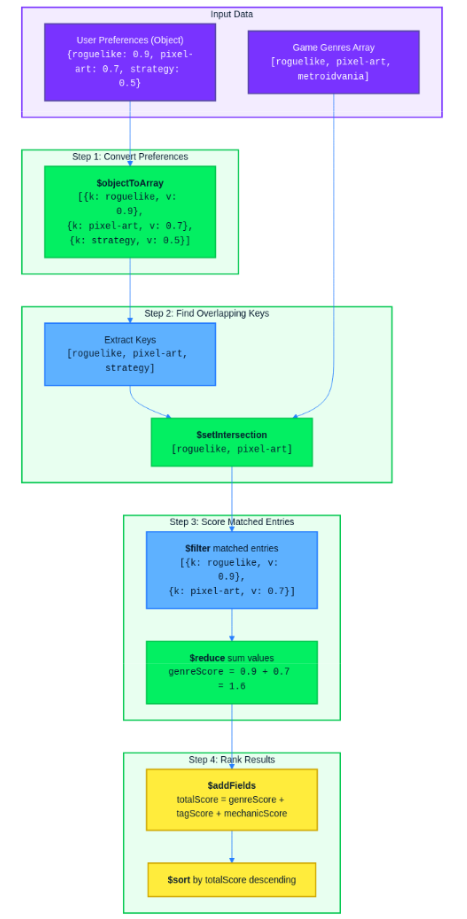
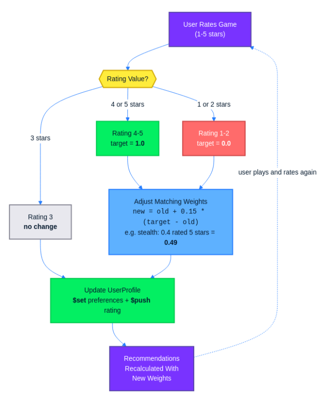
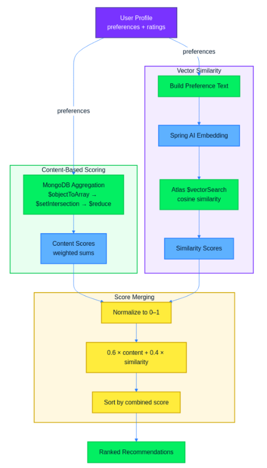

Recommendation engines have a reputation for requiring specialized ML infrastructure: matrix factorization pipelines, training jobs, and model serving layers. That is one way to do it, but not the only way. If your data already lives in MongoDB and your application runs on Spring Boot, you can build a practical recommendation system using tools you already have. MongoDB aggregation pipelines handle the scoring math server-side, and Atlas Vector Search adds semantic matching without a separate vector database.

In this article, you will build an indie game discovery platform with two complementary recommendation approaches. The first is content-based preference scoring: users create profiles with weighted preferences for genres, tags, and game mechanics, and MongoDB aggregation pipelines score every game against those weights. When users rate games, the system adjusts their preference weights over time, so recommendations improve with each interaction. The second approach uses Spring AI embeddings and MongoDB Atlas Vector Search to catch semantic connections that literal tag matching misses. A game tagged "exploration" and "mystery" should appeal to someone who likes "adventure" and "narrative," even though the strings never overlap.

By the end, you will have a working recommendation API built with Java 21+, Spring Boot 3.x, Spring Data MongoDB, and Spring AI, combining both approaches into a single ranked result. The embedding layer uses OpenAI's `text-embedding-3-small` model, but any embedding provider that Spring AI supports will work. The complete source code is available in the [companion repository on GitHub](https://github.com/fhsinchy/indie-game-discovery).

## Prerequisites

* Java 21 or later
* Spring Boot 3.x (use [Spring Initializr](https://start.spring.io/) with the `Spring Data MongoDB` and `Spring Web` dependencies; Spring AI is added manually later in the article)
* A MongoDB Atlas cluster (the free tier is sufficient, and you will need it for Atlas Vector Search). You can set up one by following the [MongoDB Atlas Getting Started Guide](https://www.mongodb.com/docs/get-started/?utm_campaign=devrel&utm_source=third-party-content&utm_medium=cta&utm_content=delivery-foojay&utm_term=hugh.murray).
* An OpenAI API key (used for generating embeddings in the second half of the article)
* Basic familiarity with Spring Boot (controllers, services, dependency injection)

## 1. Data model

The system needs two collections: one for games and one for user profiles. Start with the `Game` document:

```
@Document(collection = "games")
public class Game {

    @Id
    private String id;
    private String title;
    private String description;
    private String developer;
    private List<String> genres;
    private List<String> tags;
    private List<String> mechanics;
    private double rating;
    private int releaseYear;

    public Game(String title, String description, String developer,
                List<String> genres, List<String> tags, List<String> mechanics,
                double rating, int releaseYear) {
        this.title = title;
        this.description = description;
        this.developer = developer;
        this.genres = genres;
        this.tags = tags;
        this.mechanics = mechanics;
        this.rating = rating;
        this.releaseYear = releaseYear;
    }

    // getters and setters
}
```

The `genres`, `tags`, and `mechanics` fields are all `List<String>` rather than single values. A game like *Hades* is both a roguelike and an action game. It has tags like "fast-paced" and "mythology" and mechanics like "permadeath" and "procedural-generation." Storing these as arrays works well with MongoDB because you can match and filter on array fields directly in queries and aggregation pipelines. The recommendation engine you will build in section 3 relies on this to find games that overlap with a user's preferences.

Next, the `UserProfile` document:

```
@Document(collection = "user_profiles")
public class UserProfile {

    @Id
    private String id;
    private String username;
    private Preferences preferences;
    private List<GameRating> ratings;

    public UserProfile(String username, Preferences preferences) {
        this.username = username;
        this.preferences = preferences;
        this.ratings = new ArrayList<>();
    }

    // getters and setters
}
```

The `Preferences` class is an embedded object that holds three weighted maps:

```
public class Preferences {

    private Map<String, Double> genres;
    private Map<String, Double> tags;
    private Map<String, Double> mechanics;

    public Preferences(Map<String, Double> genres, Map<String, Double> tags,
                       Map<String, Double> mechanics) {
        this.genres = genres;
        this.tags = tags;
        this.mechanics = mechanics;
    }

    // getters and setters
}
```

Each map key is an attribute (like "roguelike" or "pixel-art"), and the value is a weight between 0 and 1 representing how strongly the user prefers it. This is a deliberate choice over plain lists. A plain list of preferred genres tells you that someone likes roguelikes and platformers equally. A weighted map like `{"roguelike": 0.9, "platformer": 0.4}` tells you they strongly favor roguelikes but only have mild interest in platformers. When the scoring engine computes recommendations, it multiplies matched attributes by their weights, so higher-affinity preferences produce higher-ranked results.

The `GameRating` class is another embedded object:

```
public class GameRating {

    private String gameId;
    private int score;
    private Instant ratedAt;

    public GameRating(String gameId, int score, Instant ratedAt) {
        this.gameId = gameId;
        this.score = score;
        this.ratedAt = ratedAt;
    }

    // getters and setters
}
```

To make the document structure concrete, here is what a couple of game documents look like in MongoDB:

```
[
    {
        "_id": "64a1b2c3d4e5f6a7b8c9d0e1",
        "title": "Hollow Knight",
        "description": "A challenging 2D action-adventure through a vast underground kingdom.",
        "developer": "Team Cherry",
        "genres": ["metroidvania", "action", "platformer"],
        "tags": ["atmospheric", "difficult", "exploration", "hand-drawn"],
        "mechanics": ["ability-unlocks", "backtracking", "boss-fights"],
        "rating": 4.7,
        "releaseYear": 2017
    },
    {
        "_id": "64a1b2c3d4e5f6a7b8c9d0e2",
        "title": "Slay the Spire",
        "description": "A deck-building roguelike where you craft a unique deck and climb the Spire.",
        "developer": "Mega Crit Games",
        "genres": ["roguelike", "strategy", "card-game"],
        "tags": ["replayable", "turn-based", "procedural"],
        "mechanics": ["deck-building", "permadeath", "procedural-generation"],
        "rating": 4.8,
        "releaseYear": 2019
    }
]
```

Notice how each game has multiple genres, tags, and mechanics. When a user's preference map contains `{"roguelike": 0.9, "strategy": 0.6}`, the recommendation engine can match both keys against *Slay the Spire*'s genres array and sum the weights to compute a relevance score.

The companion repository includes a `DataSeeder` component implemented as a `CommandLineRunner` that loads approximately 25 indie games into the `games` collection on startup. This gives you a meaningful dataset to test recommendations against without manual data entry.

## 2. Project setup

Head over to [Spring Initializr](https://start.spring.io/) and configure a new project. Select **Maven** as the build tool, **Java 21** as the language version, and the latest **Spring Boot 3.x** release. For dependencies, add **Spring Web** and **Spring Data MongoDB**. These two are all you need for now. Spring AI gets added later in section 5 when you build the embedding-based recommendation layer. Generate the project, unzip it, and open it in your IDE.

The codebase is organized into several packages that you will create as you go. The `domain` package holds the entity classes you defined in the previous section. The `repository` package contains Spring Data MongoDB repository interfaces. The `service` package contains the recommendation logic. The `controller` package exposes REST endpoints for creating users, fetching recommendations, and submitting ratings. The `seeder` package contains the `DataSeeder` class that populates the database on startup. You do not need to create all of these up front. Each package gets introduced in the section where it first becomes relevant.

To connect the application to your MongoDB Atlas cluster, open `src/main/resources/application.properties` and add the following:

```
spring.data.mongodb.uri=${MONGODB_URI:mongodb://localhost:27017/indie-game-discovery?appName=devrel-tutorial-indie-game-discovery}
```

The `${MONGODB_URI:...}` syntax reads the connection string from an environment variable called `MONGODB_URI`. The value after the colon is a fallback that points to a local MongoDB instance if the variable is not set. The `appName` query parameter identifies your application in Atlas connection logs and monitoring dashboards. To use your Atlas cluster, set the environment variable before starting the application:

```
export MONGODB_URI="mongodb+srv://<username>:<password>@<cluster-url>/indie-game-discovery?appName=devrel-tutorial-indie-game-discovery"
```

Replace the placeholders with your Atlas credentials and cluster URL. If you followed the Atlas getting started guide linked in the prerequisites, you already have these values.

If you want to skip the incremental setup and jump straight into a working project, clone the [companion repository](https://github.com/fhsinchy/indie-game-discovery). It contains the complete source code for every section, so you can follow along with the article or run the finished application directly.

## 3. Building the content-based recommendation engine

Before you can generate recommendations, you need endpoints for managing user profiles and a repository for querying games. Start with a simple request DTO and controller for user profiles.

### UserProfileController

Create a `CreateUserRequest` record that captures the data needed to build a new profile:

```
public record CreateUserRequest(String username, Preferences preferences) {
}
```

The controller exposes two endpoints: one to create a profile and one to retrieve it by ID.

```
@RestController
@RequestMapping("/api/users")
public class UserProfileController {

    private final UserProfileRepository userProfileRepository;

    public UserProfileController(UserProfileRepository userProfileRepository) {
        this.userProfileRepository = userProfileRepository;
    }

    @PostMapping
    public ResponseEntity<UserProfile> createUser(@RequestBody CreateUserRequest request) {
        UserProfile profile = new UserProfile(request.username(), request.preferences());
        UserProfile saved = userProfileRepository.save(profile);
        return ResponseEntity.ok(saved);
    }

    @GetMapping("/{userId}")
    public ResponseEntity<UserProfile> getUser(@PathVariable String userId) {
        return userProfileRepository.findById(userId)
                .map(ResponseEntity::ok)
                .orElse(ResponseEntity.notFound().build());
    }
}
```

The `UserProfileRepository` is a standard Spring Data MongoDB interface:

```
public interface UserProfileRepository extends MongoRepository<UserProfile, String> {
}
```

Constructor injection is used throughout the codebase. Spring resolves the single constructor automatically without needing an `@Autowired` annotation.

### GameRepository

The game repository needs two queries: one to fetch all games and one to find games that match any of a given set of genres. Spring Data MongoDB derives both from method names:

```
public interface GameRepository extends MongoRepository<Game, String> {

    List<Game> findByGenresIn(List<String> genres);
}
```

The `findByGenresIn` method queries the `genres` array field and returns any game where at least one genre appears in the provided list. You will not use this method for the main recommendation pipeline, but it is useful for quick filtering when you want to narrow results to a specific genre subset.

### RecommendationService core logic

The recommendation engine needs to solve a specific problem: the user's preferences are stored as `Map<String, Double>` (weighted maps where keys are attributes and values are affinity scores), while each game stores its genres, tags, and mechanics as plain `List<String>` arrays. To score a game, you need to find which keys in the user's preference maps appear in the game's arrays, then sum the corresponding weights.

Consider a concrete example. A user has these genre preferences:

`{"roguelike": 0.9, "pixel-art": 0.7, "strategy": 0.5}`

A game has the genres array `["roguelike", "pixel-art", "metroidvania"]`. The matching genres are "roguelike" and "pixel-art," so the genre score is `0.9 + 0.7 = 1.6`.

The same user also has tag preferences `{"replayable": 0.8, "difficult": 0.6}` and the game has tags `["replayable", "atmospheric"]`. Only "replayable" matches, so the tag score is `0.8`.

No mechanics match in this case, so the mechanic score is `0.0`. The total is the sum across all three categories:

`1.6 + 0.8 + 0.0 = 2.4`

You could pull every game into the application and compute scores in Java, but that wastes network bandwidth. Aggregation pipelines let you push this computation to the database, so MongoDB returns only the scored and sorted results. The pipeline works in four conceptual steps:

1. Convert the user's preference map from an object (`{"roguelike": 0.9, "pixel-art": 0.7}`) into an array of key-value pairs using `$objectToArray`. This produces `[{"k": "roguelike", "v": 0.9}, {"k": "pixel-art", "v": 0.7}]`.
2. Extract just the keys from that array and use `$setIntersection` to find which keys overlap with the game's genre/tag/mechanic arrays.
3. Use `$filter` on the key-value pair array to keep only entries whose key appeared in the intersection, then use `$reduce` to sum their values into a single score.
4. Add the computed score as a new field with `$addFields` and sort by score descending.



Since the pipeline references the user's preferences as literal values (not fields from the games collection), you need to build it dynamically in Java. Here is the `RecommendationService`:

```
@Service
public class RecommendationService {

    private final MongoTemplate mongoTemplate;
    private final UserProfileRepository userProfileRepository;

    public RecommendationService(MongoTemplate mongoTemplate,
                                 UserProfileRepository userProfileRepository) {
        this.mongoTemplate = mongoTemplate;
        this.userProfileRepository = userProfileRepository;
    }

    public List<GameRecommendation> getRecommendations(String userId) {
        UserProfile user = userProfileRepository.findById(userId)
                .orElseThrow(() -> new RuntimeException("User not found: " + userId));

        Preferences prefs = user.getPreferences();

        Document genreScoreExpr = buildScoreExpression(prefs.getGenres(), "$genres");
        Document tagScoreExpr = buildScoreExpression(prefs.getTags(), "$tags");
        Document mechanicScoreExpr = buildScoreExpression(prefs.getMechanics(), "$mechanics");

        Document totalScore = new Document("$add", List.of(genreScoreExpr, tagScoreExpr, mechanicScoreExpr));

        AggregationOperation addScoreField = context ->
                new Document("$addFields", new Document("score", totalScore));

        AggregationOperation sortByScore = context ->
                new Document("$sort", new Document("score", -1));

        Aggregation aggregation = Aggregation.newAggregation(addScoreField, sortByScore);

        AggregationResults<GameRecommendation> results =
                mongoTemplate.aggregate(aggregation, "games", GameRecommendation.class);

        return results.getMappedResults();
    }

    private Document buildScoreExpression(Map<String, Double> preferenceMap, String gameField) {
        if (preferenceMap == null || preferenceMap.isEmpty()) {
            return new Document("$literal", 0.0);
        }

        Document prefObject = new Document();
        preferenceMap.forEach(prefObject::append);

        Document prefArray = new Document("$objectToArray", new Document("$literal", prefObject));

        Document prefKeys = new Document("$map",
                new Document("input", prefArray)
                        .append("as", "pref")
                        .append("in", "$$pref.k"));

        Document matchedKeys = new Document("$setIntersection", List.of(prefKeys, gameField));

        Document matchedEntries = new Document("$filter",
                new Document("input", prefArray)
                        .append("as", "entry")
                        .append("cond", new Document("$in", List.of("$$entry.k", matchedKeys))));

        return new Document("$reduce",
                new Document("input", matchedEntries)
                        .append("initialValue", 0.0)
                        .append("in", new Document("$add", List.of("$$value", "$$this.v"))));
    }
}
```

The `buildScoreExpression` method constructs the aggregation expression for a single preference category. It takes the user's preference map and the game's array field name as parameters, then works through four steps:

1. Convert the preference map to a BSON `Document` and wrap it in `$objectToArray` to get a key-value pair array.
2. Extract just the keys with `$map`.
3. Use `$setIntersection` to find which keys overlap with the game's array field, then `$filter` to keep only the matched entries.
4. Sum the matched values with `$reduce` to produce the score for that category.

The `getRecommendations` method calls `buildScoreExpression` three times (once each for genres, tags, and mechanics), adds the three results together into a total score, and runs the pipeline against the `games` collection.

### RecommendationController

The controller takes a user ID, calls the service, and returns the ranked list:

```
@RestController
@RequestMapping("/api/recommendations")
public class RecommendationController {

    private final RecommendationService recommendationService;

    public RecommendationController(RecommendationService recommendationService) {
        this.recommendationService = recommendationService;
    }

    @GetMapping("/{userId}")
    public ResponseEntity<List<GameRecommendation>> getRecommendations(@PathVariable String userId) {
        List<GameRecommendation> recommendations = recommendationService.getRecommendations(userId);
        return ResponseEntity.ok(recommendations);
    }
}
```

The `GameRecommendation` response DTO includes the game fields along with the computed score:

```
public class GameRecommendation {

    private String id;
    private String title;
    private String description;
    private String developer;
    private List<String> genres;
    private List<String> tags;
    private List<String> mechanics;
    private double rating;
    private int releaseYear;
    private double score;

    public GameRecommendation() {
    }

    // getters and setters
}
```

MongoDB's aggregation result maps directly into this class because `$addFields` attaches the `score` field alongside the existing game fields. Spring Data MongoDB deserializes the output documents into `GameRecommendation` objects automatically.

### Manual test

Start the application and create a user profile with weighted preferences:

```
curl -X POST http://localhost:8080/api/users \
  -H "Content-Type: application/json" \
  -d '{
    "username": "alex",
    "preferences": {
      "genres": {"roguelike": 0.9, "platformer": 0.5, "metroidvania": 0.7},
      "tags": {"difficult": 0.8, "atmospheric": 0.6, "replayable": 0.7},
      "mechanics": {"permadeath": 0.9, "procedural-generation": 0.6}
    }
  }'
```

Copy the returned `id` field and hit the recommendations endpoint:

```
curl http://localhost:8080/api/recommendations/<user-id>
```

The response is a list of games sorted by score. Take *Slay the Spire* as an example. It matches on multiple fronts:

* "roguelike" in genres (0.9)
* "replayable" in tags (0.7)
* "permadeath" (0.9) and "procedural-generation" (0.6) in mechanics

That gives it a total score of 3.1. Compare that to *Hollow Knight*, which scores well on "metroidvania" (0.7) and tags like "difficult" (0.8) and "atmospheric" (0.6), but lacks roguelike traits, so it ends up lower in the ranking. The scores map directly to the user's preference weights, which makes the results easy to explain and debug.

## 4. User ratings and affinity adjustment

The recommendation engine works, but the preference weights are static. A user sets their initial preferences once, and the system never learns from their behavior. You need a ratings endpoint that lets users score games they have played, and adjustment logic that updates preference weights based on those ratings.  


### Ratings endpoint

Create a `RatingRequest` record to capture the incoming data:

```
public record RatingRequest(String gameId, int score) {
}
```

Add a new endpoint to `UserProfileController` that accepts a rating for a specific user:

```
@PostMapping("/{userId}/ratings")
public ResponseEntity<UserProfile> rateGame(@PathVariable String userId,
                                            @RequestBody RatingRequest request) {
    UserProfile updatedProfile = ratingService.applyRating(userId, request);
    return ResponseEntity.ok(updatedProfile);
}
```

The controller delegates all the work to a `RatingService`. Inject it through the constructor alongside the existing `UserProfileRepository`:

```
private final UserProfileRepository userProfileRepository;
private final RatingService ratingService;

public UserProfileController(UserProfileRepository userProfileRepository,
                             RatingService ratingService) {
    this.userProfileRepository = userProfileRepository;
    this.ratingService = ratingService;
}
```

### Affinity adjustment logic

The `RatingService` handles the core adjustment logic. When a user rates a game, the service looks up the game's genres, tags, and mechanics, then adjusts the corresponding weights in the user's preference maps according to these rules:

* A rating of 4 or 5 pushes weights upward toward 1.0.
* A rating of 1 or 2 pushes weights downward toward 0.0.
* A rating of 3 leaves weights unchanged.

The adjustment uses an exponential moving average formula that naturally keeps weights bounded between 0 and 1:

```
newWeight = oldWeight + learningRate * (targetDirection - oldWeight)
```

The `learningRate` is set to 0.15, which means each rating shifts the weight by 15% of the remaining distance toward the target. The `targetDirection` is 1.0 for high ratings (the user wants more of this attribute) and 0.0 for low ratings (the user wants less).

Because the formula always moves the weight a fraction of the distance between its current value and the target, it can never exceed 1.0 or drop below 0.0. Two quick examples show why:

* A weight of 0.9 rated highly moves to `0.9 + 0.15 * (1.0 - 0.9) = 0.915`. A small nudge, since it is already close to the ceiling.
* A weight of 0.2 rated highly moves to `0.2 + 0.15 * (1.0 - 0.2) = 0.32`. A larger jump, because there is more room to grow.

Here is a concrete example. Suppose a user rates a stealth-puzzle game 5 stars. The game has the following genres: \["stealth", "puzzle"\]. The user's current genre weights include `"stealth": 0.4` and `"puzzle": 0.6`. Since the rating is 5, the target direction is 1.0:

* Stealth: `0.4 + 0.15 * (1.0 - 0.4) = 0.4 + 0.09 = 0.49`. Rounded, stealth goes from 0.4 to roughly 0.49.
* Puzzle: `0.6 + 0.15 * (1.0 - 0.6) = 0.6 + 0.06 = 0.66`. Puzzle goes from 0.6 to 0.66.

The same formula applies to the game's tags and mechanics. If the game has a tag like "atmospheric" and the user's tag weight for it is 0.5, it becomes `0.5 + 0.15 * (1.0 - 0.5) = 0.575`.

Here is the `RatingService`:

```
@Service
public class RatingService {

    private static final double LEARNING_RATE = 0.15;

    private final MongoTemplate mongoTemplate;
    private final GameRepository gameRepository;
    private final UserProfileRepository userProfileRepository;

    public RatingService(MongoTemplate mongoTemplate,
                         GameRepository gameRepository,
                         UserProfileRepository userProfileRepository) {
        this.mongoTemplate = mongoTemplate;
        this.gameRepository = gameRepository;
        this.userProfileRepository = userProfileRepository;
    }

    public UserProfile applyRating(String userId, RatingRequest request) {
        UserProfile user = userProfileRepository.findById(userId)
                .orElseThrow(() -> new RuntimeException("User not found: " + userId));

        Game game = gameRepository.findById(request.gameId())
                .orElseThrow(() -> new RuntimeException("Game not found: " + request.gameId()));

        int score = request.score();
        if (score == 3) {
            pushRatingOnly(userId, request);
            return userProfileRepository.findById(userId).orElseThrow();
        }

        double targetDirection = score >= 4 ? 1.0 : 0.0;
        Preferences prefs = user.getPreferences();

        Map<String, Double> updatedGenres = adjustWeights(prefs.getGenres(), game.getGenres(), targetDirection);
        Map<String, Double> updatedTags = adjustWeights(prefs.getTags(), game.getTags(), targetDirection);
        Map<String, Double> updatedMechanics = adjustWeights(prefs.getMechanics(), game.getMechanics(), targetDirection);

        updateProfileInMongo(userId, request, updatedGenres, updatedTags, updatedMechanics);

        return userProfileRepository.findById(userId).orElseThrow();
    }

    private Map<String, Double> adjustWeights(Map<String, Double> currentWeights,
                                              List<String> gameAttributes,
                                              double targetDirection) {
        Map<String, Double> updated = new HashMap<>(currentWeights);
        for (String attribute : gameAttributes) {
            double oldWeight = updated.getOrDefault(attribute, 0.5);
            double newWeight = oldWeight + LEARNING_RATE * (targetDirection - oldWeight);
            updated.put(attribute, Math.round(newWeight * 1000.0) / 1000.0);
        }
        return updated;
    }

    private void pushRatingOnly(String userId, RatingRequest request) {
        GameRating rating = new GameRating(request.gameId(), request.score(), Instant.now());
        Query query = Query.query(Criteria.where("_id").is(userId));
        Update update = new Update().push("ratings", rating);
        mongoTemplate.updateFirst(query, update, UserProfile.class);
    }

    private void updateProfileInMongo(String userId, RatingRequest request,
                                      Map<String, Double> genres,
                                      Map<String, Double> tags,
                                      Map<String, Double> mechanics) {
        GameRating rating = new GameRating(request.gameId(), request.score(), Instant.now());
        Query query = Query.query(Criteria.where("_id").is(userId));
        Update update = new Update()
                .set("preferences.genres", genres)
                .set("preferences.tags", tags)
                .set("preferences.mechanics", mechanics)
                .push("ratings", rating);
        mongoTemplate.updateFirst(query, update, UserProfile.class);
    }
}
```

The `adjustWeights` method iterates over the game's attributes and applies the formula to each matching weight. If the user does not already have a weight for a particular attribute (for example, a genre they have never encountered before), it defaults to 0.5 as a neutral starting point and adjusts from there.

### MongoDB update

The `updateProfileInMongo` method performs the preference update and rating storage in a single MongoDB operation. The `$set` operator replaces the `preferences.genres`, `preferences.tags`, and `preferences.mechanics` maps with the recalculated versions, while `$push` appends the new `GameRating` entry to the `ratings` array. Because both modifications happen in one `updateFirst` call, there is no window during which the document is partially updated.

### Before and after demo

To see the feedback loop in action, hit the recommendations endpoint before and after submitting a rating. Using the same user from section 3:

```
# get recommendations before rating
curl http://localhost:8080/api/recommendations/<user-id>

# rate a game highly
curl -X POST http://localhost:8080/api/users/<user-id>/ratings \
  -H "Content-Type: application/json" \
  -d '{"gameId": "<game-id>", "score": 5}'

# get recommendations after rating
curl http://localhost:8080/api/recommendations/<user-id>
```

Compare the two responses. Games that share genres, tags, or mechanics with the highly rated game will have moved up in the rankings because their matching weights increased. Games that do not share those attributes remain at their previous scores. Each rating nudges the profile slightly, and over several ratings, the preference weights settle into a profile that matches what the user actually enjoys.

## 5. Adding Spring AI embeddings and MongoDB Atlas Vector Search

The preference engine works well when a user's tags literally match a game's tags. But it misses semantic connections. A game tagged "exploration" and "mystery" should appeal to a user who likes "adventure" and "narrative," because those concepts are closely related. The preference engine scores that match at zero since none of the strings overlap.

Embeddings solve this problem. They represent text as high-dimensional vectors, with semantically similar concepts close together. Instead of checking whether two strings are identical, you measure the distance between their vector representations.

### Spring AI setup

Add the Spring AI OpenAI starter to your `pom.xml`. You also need the Spring AI BOM to manage dependency versions:

```
<dependencyManagement>
    <dependencies>
        <dependency>
            <groupId>org.springframework.ai</groupId>
            <artifactId>spring-ai-bom</artifactId>
            <version>1.0.0</version>
            <type>pom</type>
            <scope>import</scope>
        </dependency>
    </dependencies>
</dependencyManagement>

<dependencies>
    <dependency>
        <groupId>org.springframework.ai</groupId>
        <artifactId>spring-ai-starter-model-openai</artifactId>
    </dependency>
</dependencies>
```

Then add the OpenAI configuration to `application.properties`:

```
spring.ai.openai.api-key=${OPENAI_API_KEY}
spring.ai.openai.embedding.options.model=text-embedding-3-small
```

The `text-embedding-3-small` model produces 1536-dimensional vectors. Store your API key in an environment variable rather than hardcoding it.

### Generating embeddings

To generate an embedding, concatenate a game's description, genres, tags, and mechanics into a single text block, then pass the resulting text to the `EmbeddingModel`. First, add an `embedding` field to the `Game` class:

```
@Document(collection = "games")
public class Game {

    // ... existing fields ...

    private float[] embedding;

    // getter and setter for embedding
    public float[] getEmbedding() { return embedding; }
    public void setEmbedding(float[] embedding) { this.embedding = embedding; }
}
```

Then create a helper method that builds the text representation and generates the embedding:

```
@Service
public class EmbeddingService {

    private final EmbeddingModel embeddingModel;

    public EmbeddingService(EmbeddingModel embeddingModel) {
        this.embeddingModel = embeddingModel;
    }

    public float[] generateGameEmbedding(Game game) {
        String text = game.getDescription() + " "
                + "Genres: " + String.join(", ", game.getGenres()) + ". "
                + "Tags: " + String.join(", ", game.getTags()) + ". "
                + "Mechanics: " + String.join(", ", game.getMechanics()) + ".";
        return embeddingModel.embed(text);
    }
}
```

The `embed()` method sends the text to OpenAI's embedding API and returns a `float[]` with 1536 values. Concatenating all of a game's metadata into one string gives the model enough context to produce a meaningful vector.

### DataSeeder update

Update the `DataSeeder` to generate embeddings for each game on startup. After inserting the game documents, iterate over them and call the `EmbeddingService`:

```
@Component
public class DataSeeder implements CommandLineRunner {

    private final GameRepository gameRepository;
    private final EmbeddingService embeddingService;

    public DataSeeder(GameRepository gameRepository, EmbeddingService embeddingService) {
        this.gameRepository = gameRepository;
        this.embeddingService = embeddingService;
    }

    @Override
    public void run(String... args) {
        // ... existing game insertion logic ...

        List<Game> games = gameRepository.findAll();
        for (Game game : games) {
            if (game.getEmbedding() == null) {
                game.setEmbedding(embeddingService.generateGameEmbedding(game));
                gameRepository.save(game);
            }
        }
    }
}
```

The `null` check prevents re-generating embeddings on every restart. Each API call costs money, so you only want to embed games that do not already have a vector stored.

### Atlas Vector Search index

Before you can query the embeddings, you need to create a Vector Search index in Atlas. Go to your cluster in the Atlas UI, select the **Atlas Search** tab, and click **Create Search Index** . Choose **Atlas Vector Search** as the index type, select the `games` collection, and use the following index definition:

```
{
  "fields": [
    {
      "type": "vector",
      "path": "embedding",
      "numDimensions": 1536,
      "similarity": "cosine"
    }
  ]
}
```

Name the index `vector_index`. The `numDimensions` value must match the output of your embedding model, which is 1536 for `text-embedding-3-small`. Cosine similarity is the standard choice for text embeddings because it measures the angle between vectors regardless of their magnitude.

### Vector search query

With the index in place, you can build a method to find games that are semantically similar to a user's preferences. The approach is: construct a text summary of the user's top preferences, embed it, then run a `$vectorSearch` aggregation against the games collection.

Add a `findSimilarGames` method to the `RecommendationService`:

```
public List<GameRecommendation> findSimilarGames(String userId) {
    UserProfile user = userProfileRepository.findById(userId)
            .orElseThrow(() -> new RuntimeException("User not found: " + userId));

    Preferences prefs = user.getPreferences();
    String preferenceText = buildPreferenceText(prefs);
    float[] queryVector = embeddingModel.embed(preferenceText);

    List<Double> queryVectorList = new ArrayList<>();
    for (float f : queryVector) {
        queryVectorList.add((double) f);
    }

    Document vectorSearchStage = new Document("$vectorSearch",
            new Document("index", "vector_index")
                    .append("path", "embedding")
                    .append("queryVector", queryVectorList)
                    .append("numCandidates", 50)
                    .append("limit", 10));

    AggregationOperation vectorSearch = context -> vectorSearchStage;

    AggregationOperation addScore = context ->
            new Document("$addFields",
                    new Document("score", new Document("$meta", "vectorSearchScore")));

    Aggregation aggregation = Aggregation.newAggregation(vectorSearch, addScore);

    AggregationResults<GameRecommendation> results =
            mongoTemplate.aggregate(aggregation, "games", GameRecommendation.class);

    return results.getMappedResults();
}

private String buildPreferenceText(Preferences prefs) {
    List<String> parts = new ArrayList<>();
    prefs.getGenres().entrySet().stream()
            .sorted(Map.Entry.<String, Double>comparingByValue().reversed())
            .limit(5)
            .forEach(e -> parts.add(e.getKey()));
    prefs.getTags().entrySet().stream()
            .sorted(Map.Entry.<String, Double>comparingByValue().reversed())
            .limit(5)
            .forEach(e -> parts.add(e.getKey()));
    prefs.getMechanics().entrySet().stream()
            .sorted(Map.Entry.<String, Double>comparingByValue().reversed())
            .limit(3)
            .forEach(e -> parts.add(e.getKey()));
    return "Games with " + String.join(", ", parts);
}
```

The `buildPreferenceText` method extracts the user's top-weighted genres, tags, and mechanics and combines them into a natural-language string like "Games with roguelike, metroidvania, difficult, atmospheric, replayable, permadeath, procedural-generation." This string is embedded into a query vector, and `$vectorSearch` finds the game embeddings closest to it using cosine similarity.

The `numCandidates` parameter controls how many candidates the search considers internally before returning the final `limit` results. Setting `numCandidates` higher than `limit` improves accuracy at the cost of slightly more processing.

To make this work, add the `EmbeddingModel` as a dependency in `RecommendationService` alongside the existing fields:

```
private final MongoTemplate mongoTemplate;
private final UserProfileRepository userProfileRepository;
private final EmbeddingModel embeddingModel;

public RecommendationService(MongoTemplate mongoTemplate,
                             UserProfileRepository userProfileRepository,
                             EmbeddingModel embeddingModel) {
    this.mongoTemplate = mongoTemplate;
    this.userProfileRepository = userProfileRepository;
    this.embeddingModel = embeddingModel;
}
```

### Results

Using the same user profile from section 3, vector search surfaces games like *Outer Wilds* (tagged "exploration" and "mystery") even though the user's preferences contain "adventure" and "narrative" rather than those exact terms. The preference engine gives *Outer Wilds* a low score because there is no literal tag overlap, but the embedding vectors for "exploration" and "adventure" are close in vector space, so `$vectorSearch` ranks it highly. This is the gap that embeddings fill.

## 6. Combining both signals

You now have two recommendation approaches that each capture something the other misses. Content-based scoring reflects what the user explicitly told you they want. Vector similarity catches semantic relationships that literal tag matching overlooks. The next step is to merge both into a single ranked result.

### Merging approach

Add three new fields to the `GameRecommendation` class you created in section 3:

```
public class GameRecommendation {

    // ... existing fields ...

    private double contentScore;
    private double similarityScore;
    private double combinedScore;

    // getters and setters for all three score fields
}
```

The combined score uses a weighted formula: `0.6 * contentScore + 0.4 * similarityScore`. Content-based scoring gets the higher weight because it reflects explicit user intent. When a user sets `"roguelike": 0.9`, they are telling you directly what they want. Similarity scores can surface unexpected results that drift from stated preferences, so giving content-based recommendations to the majority share keeps recommendations grounded in what the user asked for while still benefiting from semantic matches.

Add a `getCombinedRecommendations` method to `RecommendationService` that calls both approaches and merges the results:

```
public List<GameRecommendation> getCombinedRecommendations(String userId) {
    List<GameRecommendation> contentResults = getRecommendations(userId);
    List<GameRecommendation> similarityResults = findSimilarGames(userId);

    double maxContentScore = contentResults.stream()
            .mapToDouble(GameRecommendation::getScore)
            .max().orElse(1.0);

    double maxSimilarityScore = similarityResults.stream()
            .mapToDouble(GameRecommendation::getScore)
            .max().orElse(1.0);

    Map<String, GameRecommendation> merged = new LinkedHashMap<>();

    for (GameRecommendation rec : contentResults) {
        rec.setContentScore(rec.getScore() / maxContentScore);
        rec.setSimilarityScore(0.0);
        merged.put(rec.getId(), rec);
    }

    for (GameRecommendation rec : similarityResults) {
        double normalizedSimilarity = rec.getScore() / maxSimilarityScore;
        if (merged.containsKey(rec.getId())) {
            GameRecommendation existing = merged.get(rec.getId());
            existing.setSimilarityScore(normalizedSimilarity);
        } else {
            rec.setContentScore(0.0);
            rec.setSimilarityScore(normalizedSimilarity);
            merged.put(rec.getId(), rec);
        }
    }

    for (GameRecommendation rec : merged.values()) {
        double combined = 0.6 * rec.getContentScore() + 0.4 * rec.getSimilarityScore();
        rec.setCombinedScore(Math.round(combined * 1000.0) / 1000.0);
    }

    return merged.values().stream()
            .sorted(Comparator.comparingDouble(GameRecommendation::getCombinedScore).reversed())
            .toList();
}
```

Both scoring methods operate on different scales. Content-based scores are unbounded sums of matched weights, while similarity scores are cosine distances between 0 and 1. The method normalizes each set of scores by dividing each score by the maximum value in that set, bringing both into the 0 to 1 range before combining them. Games that appear in both result sets get both scores populated. Games that only appear in one set receive a zero for the missing score.

### Unified response

Update the `GET /api/recommendations/{userId}` endpoint in `RecommendationController` to call `getCombinedRecommendations` instead of `getRecommendations`:

```
@GetMapping("/{userId}")
public ResponseEntity<List<GameRecommendation>> getRecommendations(@PathVariable String userId) {
    List<GameRecommendation> recommendations =
            recommendationService.getCombinedRecommendations(userId);
    return ResponseEntity.ok(recommendations);
}
```

The response now includes all three scores for each game:

```
[
    {
        "id": "64a1b2c3d4e5f6a7b8c9d0e2",
        "title": "Slay the Spire",
        "genres": ["roguelike", "strategy", "card-game"],
        "contentScore": 1.0,
        "similarityScore": 0.87,
        "combinedScore": 0.948
    },
    {
        "id": "64a1b2c3d4e5f6a7b8c9d0e1",
        "title": "Hollow Knight",
        "genres": ["metroidvania", "action", "platformer"],
        "contentScore": 0.68,
        "similarityScore": 0.92,
        "combinedScore": 0.776
    },
    {
        "id": "64a1b2c3d4e5f6a7b8c9d0e5",
        "title": "Outer Wilds",
        "genres": ["adventure", "exploration"],
        "contentScore": 0.12,
        "similarityScore": 0.81,
        "combinedScore": 0.396
    }
]
```

*Slay the Spire* leads because it scores well on both signals. *Hollow Knight* has a strong similarity score but a weaker content match. *Outer Wilds* has a low content score, but still appears because its high similarity score pulls it up.

### Recommendation flow



The combined system follows this flow: user preferences and ratings feed into the content-based scoring pipeline, which computes a score for each game using MongoDB aggregation. In parallel, the user's top preferences are converted to a text summary and passed through the embedding model to produce a query vector. MongoDB Atlas Vector Search uses that vector to find semantically similar games. Both sets of scores are normalized and merged using the weighted formula, and the final output is a single ranked list of recommendations sorted by combined score.

### Tuning weights

The 0.6/0.4 split is a reasonable starting point, not a universal answer. The right balance depends on how much preference data you have. When a user has submitted many ratings and their preference weights are well-calibrated, the content-based signal is reliable and deserves more weight. For new users who have set only a few initial preferences, the content-based scores may be sparse, and increasing the similarity weight (e.g to 0.5/0.5 or even 0.4/0.6) can yield better early recommendations by leaning on semantic connections.

Treat these weights as a tunable parameter, not a fixed constant. You could also make them dynamic per user, shifting toward content-based as the system accumulates more ratings.

## 7. Testing the full workflow

With all the pieces in place, walk through the full cycle: create a user, get initial recommendations, submit ratings, and observe how the results change.

Start the application. The `DataSeeder` loads games into the `games` collection and generates embeddings for each one on the first run. Once the application is ready, create a user profile:

```
curl -X POST http://localhost:8080/api/users \
  -H "Content-Type: application/json" \
  -d '{
    "username": "alex",
    "preferences": {
      "genres": {"roguelike": 0.9, "platformer": 0.5, "metroidvania": 0.7},
      "tags": {"difficult": 0.8, "atmospheric": 0.6, "replayable": 0.7},
      "mechanics": {"permadeath": 0.9, "procedural-generation": 0.6}
    }
  }'
```

The response includes the generated user ID. Copy it and request recommendations:

```
curl http://localhost:8080/api/recommendations/682f1a3b5e4d
```

```
[
    {"title": "Slay the Spire", "contentScore": 1.0, "similarityScore": 0.87, "combinedScore": 0.948},
    {"title": "Hades", "contentScore": 0.84, "similarityScore": 0.91, "combinedScore": 0.868},
    {"title": "Dead Cells", "contentScore": 0.77, "similarityScore": 0.83, "combinedScore": 0.794},
    {"title": "Hollow Knight", "contentScore": 0.68, "similarityScore": 0.92, "combinedScore": 0.776},
    {"title": "Outer Wilds", "contentScore": 0.12, "similarityScore": 0.81, "combinedScore": 0.396}
]
```

*Slay the Spire* leads because it hits roguelike (0.9), replayable (0.7), permadeath (0.9), and procedural-generation (0.6) all at once. *Outer Wilds* ranks low on content score since its tags do not literally match the user's preferences, but embeddings still pull it into the list.

Now submit a few ratings. Rate *Hollow Knight* highly and *Slay the Spire* lower:

```
curl -X POST http://localhost:8080/api/users/682f1a3b5e4d/ratings \
  -H "Content-Type: application/json" \
  -d '{"gameId": "64a1b2c3d4e5f6a7b8c9d0e1", "score": 5}'

curl -X POST http://localhost:8080/api/users/682f1a3b5e4d/ratings \
  -H "Content-Type: application/json" \
  -d '{"gameId": "64a1b2c3d4e5f6a7b8c9d0e2", "score": 2}'

curl -X POST http://localhost:8080/api/users/682f1a3b5e4d/ratings \
  -H "Content-Type: application/json" \
  -d '{"gameId": "64a1b2c3d4e5f6a7b8c9d0e5", "score": 4}'
```

The first rating pushes metroidvania, action, and platformer weights upward. The second pulls roguelike and card-game weights down. The third boosts adventure and exploration. Fetch recommendations again:

```
curl http://localhost:8080/api/recommendations/682f1a3b5e4d
```

```
[
    {"title": "Hollow Knight", "contentScore": 0.91, "similarityScore": 0.92, "combinedScore": 0.914},
    {"title": "Hades", "contentScore": 0.82, "similarityScore": 0.89, "combinedScore": 0.848},
    {"title": "Dead Cells", "contentScore": 0.74, "similarityScore": 0.84, "combinedScore": 0.780},
    {"title": "Outer Wilds", "contentScore": 0.38, "similarityScore": 0.81, "combinedScore": 0.552},
    {"title": "Slay the Spire", "contentScore": 0.61, "similarityScore": 0.85, "combinedScore": 0.706}
]
```

*Hollow Knight* jumped from fourth to first. Its content score increased from 0.68 to 0.91 because the 5-star rating boosted the weights for metroidvania, platformer, and atmospheric. *Slay the Spire* dropped because the 2-star rating pulled down roguelike and card-game weights. *Outer Wilds* moved up thanks to the 4-star rating increasing adventure and exploration weights, which also shifted the embedding query to favor similar games. Each rating adjusts the preference profile incrementally, and the combined scoring reflects those changes immediately.

## Conclusion

You built a recommendation engine with two layers. Content-based preference scoring uses MongoDB aggregation pipelines to match games against weighted user preferences. Embedding-based similarity uses Spring AI and MongoDB Atlas Vector Search to surface games that are semantically related to a user's tastes, even when tags do not literally overlap. User ratings close the feedback loop by adjusting preference weights over time.

From here, try swapping in a different embedding model to see how it affects similarity results. Once you have enough users, add collaborative filtering to recommend games based on what similar users enjoyed. You could also incorporate additional signals like playtime, wishlist activity, or purchase history to make the preference model richer.

The complete source code is available in the [companion repository](https://github.com/fhsinchy/indie-game-discovery). Clone it, plug in your MongoDB Atlas connection string and OpenAI API key, and start experimenting with your own game catalog and preference configurations.
