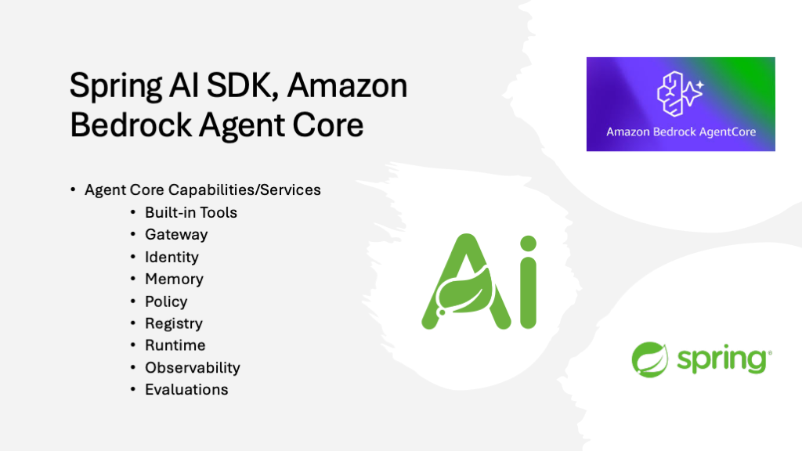
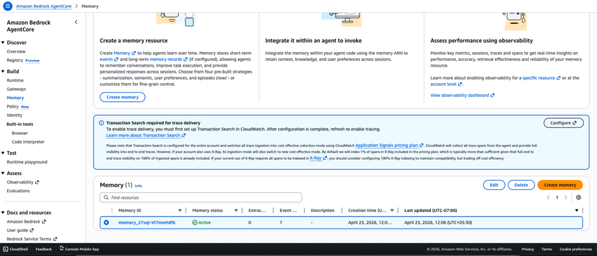

*If you're joining us from [Part 1](https://foojay.io/today/spring-ai-amazon-bedrock-sdk-guide/) or need a quick refresher on the architecture, listen to this brief overview of how Spring AI and Amazon Bedrock work together.*
*Generated using Notebook LLM for my previous [article](https://foojay.io/today/spring-ai-amazon-bedrock-sdk-guide/){#https://foojay.io/today/spring-ai-amazon-bedrock-sdk-guide/}*

In this article, we explore one of the AgentCore capabilities i.e., ***memory***
 ***Source: Amazon***

To begin, enable **AgentCore memory** for the agent you built earlier.  


### Step 1: Add the Ai model and AgentCore memory dependencies

```xml
<dependency>
    <groupId>org.springframework.ai</groupId>
    <artifactId>spring-ai-model</artifactId>
</dependency>
<dependency>
    <groupId>org.springaicommunity</groupId>
    <artifactId>spring-ai-agentcore-memory</artifactId>
</dependency>
```

### Step 2: Create Short/Long Term in AWS Management Console

*Navigate to **Amazon Bedrock AgentCore \> Memory** to create short/long-term memories.*
 AgentCore Memory

### Step 3: Add the following memory-related properties.

`application.yml`

```yaml
agentcore:
  memory:
    memory_id: memory_27vql-Vl7nIoHdf6
    total-events-limit: 100
    default-session: default
    page-size: 50
    ignore-unknown-roles: false
```

`application.properties`

```powershell
agentcore.memory.memory_id=memory_27vql-Vl7nIoHdf6
agentcore.memory.total-events-limit=100
agentcore.memory.default-session=default
agentcore.memory.page-size=50
agentcore.memory.ignore-unknown-roles=false
```

### Step 4: Add the below `MemoryConfig` class.

```java
package com.bsmlabs.springai.config;

import org.springaicommunity.agentcore.memory.longterm.AgentCoreMemory;
import org.springframework.ai.chat.client.advisor.MessageChatMemoryAdvisor;
import org.springframework.ai.chat.memory.ChatMemory;
import org.springframework.ai.chat.memory.MessageWindowChatMemory;
import org.springframework.context.annotation.Bean;
import org.springframework.context.annotation.Configuration;

import java.util.List;

@Configuration
public class MemoryConfig {

    @Bean
    public ChatMemory chatMemory() {
        return MessageWindowChatMemory.builder()
                .maxMessages(20) // keeps last 20 messages
                .build();
    }

    @Bean
    public MessageChatMemoryAdvisor messageChatMemoryAdvisor(ChatMemory chatMemory) {
        return MessageChatMemoryAdvisor.builder(chatMemory).build();
    }

    @Bean
    public AgentCoreMemory agentCoreMemory(MessageChatMemoryAdvisor advisor) {
        return new AgentCoreMemory(advisor, List.of());
    }

}
```

Let's break down the structure of the beans defined in the above `configuration` class.

#### 4.1. ChatMemory Bean -- The Core

```java
@Bean
public ChatMemory chatMemory() {
   return MessageWindowChatMemory.builder()
                .maxMessages(20) // keeps last 20 messages
                .build();
}
```

This creates a ***sliding window memory*** that retains only the last 20 messages. Benefits include:

* Prevents unbounded memory growth
* Keeps recent context while discarding older, irrelevant messages
* Reduces token usage when calling LLMs, making it cost-effective
* Maintains conversation relevance

#### 4.2. MessageChatMemoryAdvisor -- The Wrapper

```java
@Bean
public MessageChatMemoryAdvisor messageChatMemoryAdvisor(ChatMemory chatMemory) {
   return MessageChatMemoryAdvisor.builder(chatMemory).build();
}
```

This advisor acts as an intermediary that:

* Integrates the *ChatMemory* into Spring AI's advisor chain
* Automatically injects conversation history into chat requests
* Manages when and how memory is applied to prompts

#### 4.3. AgentCoreMemory -- The Orchestrator

```java
@Bean
public AgentCoreMemory agentCoreMemory(MessageChatMemoryAdvisor advisor) {
   return new AgentCoreMemory(advisor, List.of());
}
```

This combines the ***advisor*** with an empty list of additional strategies. It:

* Coordinates memory across agent operations
* Provides a unified interface for long-term memory management
* Allows for extensibility (the ***List.of()*** can include custom memory strategies)

### Step 5: Create the ***ChatRequest*** and ***ChatResponse*** classes as shown below.

Add the following classes to the models folder. We will use them in the next REST controller.

```java
package com.bsmlabs.springai.models;

public record ChatRequest(String message) {
}
```

```java
package com.bsmlabs.springai.models;

public record ChatResponse(String response) {
}
```

### Step 6: Add the below `ShortTermController` class.

Adding memory to an existing agent helps improve response latency and relevance. The agent can store previous conversations in short-term memory (STM). It can also retain learned information over time using long-term memory (LTM).

The SDK integrates with AgentCore Memory through **Spring AI's advisor pattern**. These advisors act as interceptors that enrich prompts with relevant context before sending them to the model.

The below RestController demonstrates how to build a stateful chat API that maintains conversation history by leveraging the memory configuration from the previous example to provide a persistent conversational context.

```java
package com.bsmlabs.springai.agents;

import com.bsmlabs.springai.models.ChatRequest;
import com.bsmlabs.springai.models.ChatResponse;
import org.springaicommunity.agentcore.memory.longterm.AgentCoreMemory;
import org.springaicommunity.agentcore.memory.shorttem.AgentCoreShortTermMemoryRepository;
import org.springframework.ai.chat.client.ChatClient;
import org.springframework.ai.chat.memory.ChatMemory;
import org.springframework.ai.chat.messages.Message;
import org.springframework.web.bind.annotation.*;

import java.util.List;

@RestController
public class ShortTermMemoryController {

    private final ChatClient chatClient;
    private final ChatMemory chatMemory;
    private final AgentCoreMemory agentCoreMemory;

    private static final String CONVERSATION_ID = UUID.randomUUID().toString();

    public ShortTermMemoryController(ChatClient.Builder chatClientBuilder,
                                     ChatMemory chatMemory,
                                     AgentCoreMemory agentCoreMemory,
                                     AgentCoreShortTermMemoryRepository shortTermMemoryRepository) {
        this.chatClient = chatClientBuilder.build();
        this.chatMemory = chatMemory;
        this.agentCoreMemory = agentCoreMemory;

        // shortTermMemoryRepository.deleteByConversationId(CONVERSATION_ID);
    }

    @PostMapping("/api/short")
    public ChatResponse shortTermChat(@RequestBody ChatRequest chatRequest) {
        String response = chatClient.prompt()
                .user(chatRequest.message())
                .advisors(agentCoreMemory.advisors)
                .advisors(a -> a.param(ChatMemory.CONVERSATION_ID, CONVERSATION_ID))
                .call()
                .content();

        return new ChatResponse(response);
    }

    @GetMapping("/api/history")
    public List<Message> getHistory() {
        return chatMemory.get(CONVERSATION_ID);
    }

    @DeleteMapping("/api/history")
    public void clearHistory() {
        chatMemory.clear(CONVERSATION_ID);
    }

}
```

* **ChatClient:**Send prompts to the LLM
* **ChatMemory:** Manages the conversation window/sliding window (20 messages)
* **AgentCoreMemory:** Orchestrates memory across operations

#### POST `/api/short` -- Chat Endpoint

```java
@PostMapping("/api/short")
public ChatResponse shortTermChat(@RequestBody ChatRequest chatRequest) {
   String response = chatClient.prompt()
                .user(chatRequest.message())
                .advisors(agentCoreMemory.advisors)
                .advisors(a -> a.param(ChatMemory.CONVERSATION_ID, CONVERSATION_ID))
                .call()
                .content();

   return new ChatResponse(response);
}
```

**What happens:**

1. Receives user message in ***ChatRequest***
2. Calls agentCoreMemory.advisors to inject the ***MessageChatMemoryAdvisor***
3. Passes CONVERSATION_ID to the advisor so it knows which conversation's history to retrieve
4. ChatClient automatically
   * Retrieves last 20 messages for this conversation
   * Appends them to the current user message
   * Sends the full context to the LLM
   * Stores the user message + response in ChatMemory
5. Returns just the LLM response to the client

#### GET `/api/history` -- Retrieve Conversation History

```java
@GetMapping("/api/history")
public List<Message> getHistory() {
   return chatMemory.get(CONVERSATION_ID);
}
```

This method returns all messages (up to 20) for the given conversation ID. It is useful for:

* Displaying chat history in the UI
* Debugging the conversation context
* Auditing interactions

#### DELETE `/api/history` -- Clear History

```java
@DeleteMapping("/api/history")
public void clearHistory() {
   chatMemory.clear(CONVERSATION_ID);
}
```

### Step 7: verify

```powershell
### Tell name - STM
POST http://localhost:8080/api/short
Content-Type: application/json

{
  "message": "Mahendra is writing an article to Foojay on Spring AI SDK with Amazon Bedrock Agentcore"
}

### Ask name - STM
POST http://localhost:8080/api/short
Content-Type: application/json

{
  "message": "What is my name?"
}

### Get history
GET http://localhost:8080/api/history

### Clear history
DELETE http://localhost:8080/api/history
```

Using ***curl*** commands

```powershell
# --- Short-Term Memory (STM) ---
# Tell your name and what you're talking about
curl -X POST http://localhost:8080/api/short \
    -H "Content-Type: application/json" \
    -d '{"message": "Mahendra is writing an article to Foojay on Spring AI SDK with Amazon Bedrock Agentcore"}'

# Ask for your name (memory recall)
curl -X POST http://localhost:8080/api/short \
    -H "Content-Type: application/json" \
    -d '{"message": "What is my name?"}'

# Get conversation history
curl http://localhost:8080/api/history

# Clear conversation
curl -X DELETE http://localhost:8080/api/history
```

### End-to-End Flow

```
User Request
    ↓
[/api/short endpoint]
    ↓
ChatMemory retrieves last 20 messages for CONVERSATION_ID
    ↓
Messages + current user input sent to LLM
    ↓
LLM generates response
    ↓
Exchange stored in ChatMemory (sliding window)
    ↓
Response returned to user
```

***In the next part, I will discuss the inclusion of the remaining AgentCore services adding built-in tools like browser, code interpreter, and deployment to Amazon Bedrock AgentCore runtime.***

Everything comes from the companion [repo](https://github.com/bsmahi/simple-spring-boot-agent), which contains fully working implementations of each example.

***Happy Learning Spring AI***

### References

* <https://spring.io/ai>
* **Amazon Bedrock AgentCore:** <https://docs.aws.amazon.com/bedrock-agentcore/latest/devguide/what-is-bedrock-agentcore.html>
* **Spring AI:** <https://spring.io/projects/spring-ai>
* **AWS Blog Spring AI SDK:** <https://aws.amazon.com/blogs/machine-learning/spring-ai-sdk-for-amazon-bedrock-agentcore-is-now-generally-available/>
