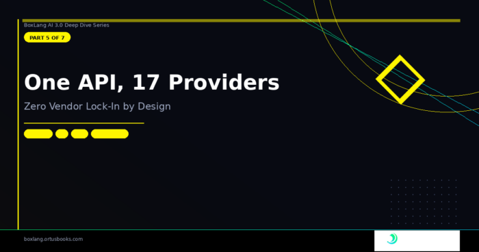

*BoxLang AI 3.0 Series · Part 5 of 7*

Vendor lock-in is the silent killer of AI projects. You pick OpenAI, build everything against the OpenAI API, and then GPT-5 launches at three times the price. Or a competitor launches a model that's faster for your use case. Or you need to self-host for compliance. Or your client is on AWS and wants Bedrock.

Every time the answer to "can we switch providers?" is "it would take months," something went wrong architecturally.

BoxLang AI was designed from the start to eliminate this problem. One API, one set of BIFs, 17 providers — and 3.0 makes the architecture underneath significantly more robust with a proper capability system, a cleaner provider hierarchy, and type-safe capability checking that prevents cryptic runtime crashes.

## 🗺️ The Full Provider Matrix

BoxLang AI 3.0 supports 17 providers out of the box:

| Provider            | Chat \& Stream | Tools       | Embeddings      | Structured Output |
|:--------------------|:---------------|:------------|:----------------|:------------------|
| AWS Bedrock         | ✅              | ✅           | ✅               | ✅                 |
| Claude (Anthropic)  | ✅              | ✅           | ❌               | ✅                 |
| Cohere              | ✅              | ✅           | ✅               | ✅                 |
| DeepSeek            | ✅              | ✅           | ✅               | ✅                 |
| Docker Model Runner | ✅              | ✅           | ✅               | ✅                 |
| Gemini              | ✅              | Coming Soon | ✅               | ✅                 |
| Grok                | ✅              | ✅           | ✅               | ✅                 |
| Groq                | ✅              | ✅           | ✅               | ✅                 |
| HuggingFace         | ✅              | ✅           | ✅               | ✅                 |
| Mistral             | ✅              | ✅           | ✅               | ✅                 |
| MiniMax             | ✅              | ✅           | ✅               | ✅                 |
| Ollama              | ✅              | ✅           | ✅               | ✅                 |
| OpenAI              | ✅              | ✅           | ✅               | ✅ (Native)        |
| OpenAI-Compatible   | ✅              | ✅           | ✅               | ✅                 |
| OpenRouter          | ✅              | ✅           | ✅               | ✅                 |
| Perplexity          | ✅              | ✅           | ❌               | ✅                 |
| Voyage AI           | ❌              | ❌           | ✅ (Specialized) | ❌                 |

Your BoxLang code doesn't change between any of these. Switch providers with a single config change.

## 🏗️ The Provider Hierarchy

The architecture is built around three layers:

```
IAiService (interface — identity + capabilities)
  └── BaseService (abstract — HTTP transport, logging, lifecycle hooks)
        ├── OpenAIService (OpenAI API format — most providers extend this)
        │     ├── ClaudeService
        │     ├── DeepSeekService
        │     ├── GrokService
        │     ├── GroqService
        │     ├── HuggingFaceService
        │     ├── MiniMaxService
        │     ├── MistralService
        │     ├── OpenAICompatibleService
        │     ├── OpenRouterService
        │     └── PerplexityService
        └── (Direct BaseService extensions — custom API formats)
              ├── BedrockService
              ├── CohereService
              ├── DockerModelRunnerService
              ├── GeminiService
              ├── OllamaService
              └── VoyageService
```

The split between `BaseService` and `OpenAIService` is one of the most important refactors in 3.0. Before, the "base" class was OpenAI-specific code that every other provider either inherited awkwardly or had to override entirely. Now `BaseService` is a true provider-agnostic foundation, and `OpenAIService` is where the OpenAI-format-specific logic lives.

## 🎯 `IAiService` --- The Trimmed Interface

The base interface now declares only what's universal across *all* providers:

```java
// From IAiService.bx
interface {

    // Identity
    function getName();

    // Configuration
    IAiService function configure( required any options );

    // Capability discovery
    array   function getCapabilities();
    boolean function hasCapability( required string capability );

}
```

That's it. No `chat()`. No `embeddings()`. No operation methods at all. Those live in capability interfaces — because not every provider supports every operation.

## 🛡️ The Capability System

The capability system is the architectural anchor of 3.0's multi-provider story. It answers the question "what can this provider actually do?" at the type level, not at runtime.

Two capability interfaces define the available operations:

```java
// From IAiChatService.bx
interface extends="IAiService" {
    function chat( required AiChatRequest chatRequest, numeric interactionCount = 0 );
    function chatStream( required AiChatRequest chatRequest, required function callback, numeric interactionCount = 0 );
}

// From IAiEmbeddingsService.bx
interface extends="IAiService" {
    function embeddings( required AiEmbeddingRequest embeddingRequest );
}
```

A provider that supports both chat and embeddings implements both:

```java
class extends="OpenAIService" implements="IAiChatService,IAiEmbeddingsService" {
    // implements chat(), chatStream(), embeddings()
}
```

A provider that only supports embeddings (like Voyage AI) implements only one:

```java
class extends="BaseService" implements="IAiEmbeddingsService" {
    // implements embeddings() only — no chat, no stream
}
```

### Runtime Capability Detection

`BaseService` uses `isInstanceOf()` to detect implemented interfaces — which means capability detection is always in sync with the `implements` declarations with nothing to maintain manually:

```java
// From BaseService.bx — getCapabilities()
public array function getCapabilities() {
    var caps = []
    if ( isInstanceOf( this, "IAiChatService" ) ) {
        caps.append( "chat" )
        caps.append( "stream" )
    }
    if ( isInstanceOf( this, "IAiEmbeddingsService" ) ) {
        caps.append( "embeddings" )
    }
    if ( isInstanceOf( this, "IAudioService" ) ) {
        caps.append( "transcribe" )
        caps.append( "speak" )
    }
    return caps
}
```

### Querying Capabilities

```java
// Runtime introspection
service = aiService( "voyage" )
println( service.getCapabilities() )          // [ "embeddings" ]
println( service.hasCapability( "chat" ) )    // false
println( service.hasCapability( "embeddings" ) ) // true

service = aiService( "openai" )
println( service.getCapabilities() )          // [ "chat", "stream", "embeddings" ]
println( service.hasCapability( "chat" ) )    // true
```

### Enforced at the BIF Level

`aiChat()`, `aiChatStream()`, and `aiEmbed()` all check provider capabilities before calling and throw a clear `UnsupportedCapability` exception if the requirement isn't met:

```java
// This throws immediately — Voyage has no chat capability
aiChat( "Hello?", provider: "voyage" )
// UnsupportedCapability: Provider 'voyage' does not support 'chat'. Supported: ["embeddings"]

// This throws immediately — Claude has no embeddings capability
aiEmbed( "some text", provider: "claude" )
// UnsupportedCapability: Provider 'claude' does not support 'embeddings'. Supported: ["chat", "stream"]
```

No more cryptic 404s or malformed response errors when you call the wrong operation on the wrong provider.

## 🔧 `BaseService` --- The Transport Layer

`BaseService` owns everything that's truly provider-agnostic:

* **HTTP transport** --- `sendChatRequest()`, `sendStreamRequest()`, `sendEmbeddingRequest()`
* **Lifecycle events** — fires `onAIChatRequest`, `onAIChatResponse`, `onAIEmbedRequest`, `onAIEmbedResponse`, `onAIRateLimitHit`, `onAIError`
* **Logging** — request/response logging with detailed, human-readable log messages
* **Configuration** — merges module defaults, provider-specific config, and per-request options
* **Pre/post hooks** --- `preRequest()` and `postResponse()` for provider-specific normalization  
  The pre/post hook pattern is worth understanding. Instead of overriding the entire `sendChatRequest()` method to add a custom header or normalize a response, providers override two lightweight hooks:

```java
// This throws immediately — Voyage has no chat capability
aiChat( "Hello?", provider: "voyage" )
// UnsupportedCapability: Provider 'voyage' does not support 'chat'. Supported: ["embeddings"]

// This throws immediately — Claude has no embeddings capability
aiEmbed( "some text", provider: "claude" )
// UnsupportedCapability: Provider 'claude' does not support 'embeddings'. Supported: ["chat", "stream"]
```

This keeps the HTTP transport code in `BaseService` and isolates provider-specific behavior in tiny, focused overrides.

## ⚙️ Provider Configuration

Every provider auto-detects its API key from environment variables using a convention: `_API_KEY`. So `OPENAI_API_KEY`, `CLAUDE_API_KEY`, `GEMINI_API_KEY`, `GROQ_API_KEY`, etc. — you never commit keys to source control.

Full provider configuration in `boxlang.json`:

```java
{
    "modules": {
        "bxai": {
            "settings": {
                "provider": "openai",
                "defaultParams": {
                    "model": "gpt-4o",
                    "temperature": 0.7,
                    "max_tokens": 2000
                },
                "providers": {
                    "openai": {
                        "params": { "model": "gpt-4o", "temperature": 0.7 },
                        "options": { "timeout": 60 }
                    },
                    "claude": {
                        "params": { "model": "claude-sonnet-4-5-20251001" }
                    },
                    "ollama": {
                        "params": { "model": "qwen2.5:0.5b-instruct" },
                        "options": { "baseUrl": "http://localhost:11434" }
                    }
                }
            }
        }
    }
}
```

Provider-specific params override the global `defaultParams`. Per-request params override provider params. The merge order is predictable and deterministic.

## 🔀 Custom Base URLs

All senders in `BaseService` now accept a `baseUrl` override — making it trivial to use proxies, self-hosted endpoints, and OpenAI-compatible APIs:

```java
// Via config
model = aiModel( provider: "openai", options: { baseUrl: "http://my-proxy/v1" } )

// Via module settings
"providers": {
    "openai": {
        "options": { "baseUrl": "https://api.mycompany.com/openai-proxy/v1" }
    }
}

// Local Ollama
model = aiModel( provider: "ollama", options: { baseUrl: "http://my-ollama-server:11434" } )
```

This is how you use any OpenAI-compatible API — LM Studio, vLLM, LocalAI, Amazon Bedrock with proxy, etc. — without writing a custom provider class.

## 🏠 Ollama — Local AI, Zero API Cost

Ollama deserves a special mention. With BoxLang AI, running fully local AI is as simple as:

```java
# Install Ollama
# Pull a model
ollama pull llama3.2

# Configure BoxLang AI
```

```java
{
    "modules": {
        "bxai": {
            "settings": {
                "provider": "ollama",
                "defaultParams": { "model": "llama3.2" }
            }
        }
    }
}
```

```java
// Your code doesn't change at all
answer = aiChat( "What is BoxLang?" )
```

The same code that runs against OpenAI runs against your local Ollama instance. Switch back by changing the provider in config. This is the zero-vendor-lock-in promise in practice.

Docker Compose setup for development teams that want a shared Ollama instance is included in the repo --- `docker-compose-ollama.yml` sets up both the Ollama service and auto-pulls models on first run.

## 🤗 New in 3.0: HuggingFace Embeddings

`HuggingFaceService` now supports embeddings via the HuggingFace Inference API — useful for semantic search, RAG pipelines, and clustering workflows where you want to use community-hosted models:

```java
embeddings = aiEmbed(
    [ "BoxLang is a modern JVM language", "AI is transforming software development" ],
    provider : "huggingface",
    options  : { apiKey: "${Setting: HUGGINGFACE_API_KEY not found}" }
)
```

The service uses the OpenAI-compatible router endpoint at `router.huggingface.co/v1`, so any HuggingFace model exposed through their inference API works out of the box.

## 🏗️ Building a Custom Provider

If you need a provider that BoxLang AI doesn't support yet, extending the framework is straightforward. For any provider that uses the OpenAI API format (most do), extend `OpenAIService` and override just what's different:

```java
// MyCustomProvider.bx
import bxModules.bxai.models.providers.OpenAIService;
import bxModules.bxai.models.providers.capabilities.IAiChatService;
import bxModules.bxai.models.providers.capabilities.IAiEmbeddingsService;

class extends="OpenAIService" implements="IAiChatService,IAiEmbeddingsService" {

    function init() {
        variables.name          = "my-provider"
        variables.chatURL       = "https://api.myprovider.com/v1/chat/completions"
        variables.embeddingsURL = "https://api.myprovider.com/v1/embeddings"
        variables.params        = { model: "my-model-v1" }
        return this
    }

    // Override configure() if you need non-standard auth
    IAiService function configure( required any options ) {
        super.configure( arguments.options )
        // Add any provider-specific header (e.g. x-api-version)
        variables.headers[ "x-api-version" ] = "2026-01"
        return this
    }

}
```

For providers with fully custom API formats (like Claude's or Gemini's native APIs), extend `BaseService` directly and implement the capability interfaces you need — you own the full `chat()`, `chatStream()`, and `embeddings()` implementations.

Register your custom provider via the `onMissingAiProvider` event:

```java
// In Application.bx or a module's onLoad
bxEvents.listen( "onMissingAiProvider", ( data ) => {
    if ( data.provider == "my-provider" ) {
        data.service = new MyCustomProvider().configure( data.options )
    }
} )
```

## 📢 The Event System

Every operation through `BaseService` fires BoxLang global events you can intercept for monitoring, logging, billing, and custom behavior:

| Event                 | When                                                     |
|:----------------------|:---------------------------------------------------------|
| `onAIChatRequest`     | HTTP request about to be sent                            |
| `onAIChatResponse`    | Response received and deserialized                       |
| `onAIEmbedRequest`    | Embedding request about to be sent                       |
| `onAIEmbedResponse`   | Embedding response received                              |
| `onAIRateLimitHit`    | 429 status code received                                 |
| `onAIError`           | Any error in an AI operation                             |
| `onAITokenCount`      | Token usage data available (prompt + completion + total) |
| `beforeAIModelInvoke` | Before AiModel.run() calls the service                   |
| `afterAIModelInvoke`  | After AiModel.run() returns                              |

The `onAITokenCount` event includes `tenantId` and `usageMetadata` for multi-tenant billing — you can attribute every token to a specific customer, project, or cost center:

```java
bxEvents.listen( "onAITokenCount", ( data ) => {
    billing.record(
        tenantId       : data.tenantId,
        provider       : data.provider,
        model          : data.model,
        promptTokens   : data.promptTokens,
        completionTokens: data.completionTokens,
        usageMetadata  : data.usageMetadata
    )
} )
```

## 🔄 Switching Providers in Practice

To drive the point home — here's what switching from OpenAI to Claude looks like in your code:

**Config change:**

```java
// Before
{ "provider": "openai" }

// After
{ "provider": "claude" }
```

**Code change:**

```
(none)
```

Your `aiChat()`, `aiEmbed()`, `aiAgent()`, and `aiModel()` calls are all identical. The provider-specific formatting, authentication, and response normalization live entirely inside the provider classes — your application code never sees it.

## 🎯 Wrapping Up the Series

Over these five posts, we've covered the full depth of BoxLang AI 3.0:

* **Part 1**--- AI Skills System: versioned, composable knowledge blocks that end prompt drift
* **Part 2** — Tool Ecosystem: `BaseTool`, `ClosureTool`, the Global Registry, and `now@bxai`
* **Part 3** — Multi-Agent Orchestration: hierarchy trees, stateless agents, per-call identity routing
* **Part 4** — Middleware: six built-in classes, the hook lifecycle, and FlightRecorderMiddleware for CI
* **Part 5** — Provider Architecture: 17 providers, the capability system, and zero-vendor-lock-in design  
  The common thread across all five: BoxLang AI is designed so that the hard parts — lifecycle management, observability, multi-tenancy, provider compatibility — are handled by the framework. Your code stays focused on what you're building.

## Get Started

```
# Install via CommandBox
install bx-ai@3.0.0

# Or for OS/CLI applications
install-bx-module bx-ai
```

📖 [Full Documentation](https://boxlang.ortusbooks.com/ai) 📦 [ForgeBox Package](https://forgebox.io/view/bx-ai) 🎓 [AI BootCamp](https://github.com/ortus-boxlang/bx-ai-bootcamp) 🐛 [Report Issues](https://github.com/ortus-boxlang/bx-ai/issues) 💬 [Community Slack](https://boxteam.ortussolutions.com/) 💼 [BoxLang+ Plans](https://www.boxlang.io/plans)

*Thank you to the entire Ortus team and everyone in the BoxLang community who contributed to 3.0. This is the release we're most proud of — and we're just getting started. 🙏*

[← Previous](https://foojay.io/today/boxlang-ai-deep-dive-part-4-of-7-middleware-the-missing-layer-in-every-ai-framework-%f0%9f%a7%b5/ "← Previous")

[Next -\>](https://foojay.io/today/boxlang-ai-deep-dive-part-6-of-7-memory-systems-rag-building-ai-that-remembers/)
