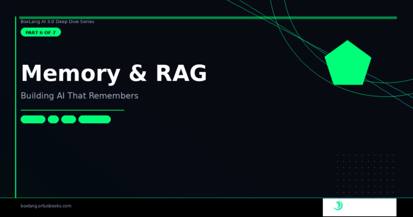

*BoxLang AI 3.0 Series · Part 6 of 7*

A chatbot with no memory isn't a conversation — it's a series of isolated queries. Every message starts from scratch. The user has to re-explain who they are, what they're working on, and what was just said. It's exhausting, and it signals that the AI isn't really listening.

Memory is what separates a useful AI application from a toy. BoxLang AI ships with one of the most comprehensive memory systems in any AI framework — 20+ memory types across two major categories, vector embedding support for semantic retrieval, 30+ document loaders for RAG pipelines, and a per-call identity routing system that makes multi-tenant applications safe by default.

This post is a complete tour.

## 🧠 Two Categories of Memory

```html
           +-----------------------------------+
           |         BoxLang AI Memory         |
           +-----------------------------------+
                        /           \
                       /             \
                      v               v

+--------------------------------+   +--------------------------------+
|        Standard Memory         |   |         Vector Memory          |
+--------------------------------+   +--------------------------------+
| Stores conversation history    |   | Stores semantic knowledge      |
| Sequential message thread      |   | Embeddings + retrieval         |
| Retrieves by recency/order     |   | Retrieves by meaning           |
| Example: remember prior fact   |   | Example: RAG knowledge lookup  |
+--------------------------------+   +--------------------------------+

                      \               /
                       \             /
                        v           v

         +-------------------------------------------+
         | Shared abstraction and usage model        |
         +-------------------------------------------+
         | IAiMemory interface                       |
         | aiMemory() BIF                            |
         | Per-call identity routing                 |
         | Minimal app-code changes between both     |
         +-------------------------------------------+
```

BoxLang AI memory breaks into two fundamentally different categories, solving two different problems.

**Standard Memory** stores conversation history — the sequential messages between user and assistant. It's what lets the agent remember "my name is Luis" from three messages ago.

**Vector Memory** stores semantic knowledge — embeddings of documents, past conversations, or domain content that can be retrieved by meaning, not by recency. It's what enables RAG: "find the three most relevant passages from our knowledge base for this query."

Both categories share the same `IAiMemory` interface, the same `aiMemory()` BIF, and the same per-call identity routing — your application code barely changes between them.

## 📋 Standard Memory Types

Create any memory with our lovely global function: `aiMemory( type, config: {} )`. Our default memory type is a `window` memory of `20` messages:

```java
// Window memory — keeps the last N messages
mem = aiMemory( "window", config: { maxMessages: 20 } )

// Summary memory — auto-summarizes old messages to preserve context
mem = aiMemory( "summary", config: {
    maxMessages      : 30,
    summaryThreshold : 15,
    summaryModel     : "gpt-4o-mini"
} )

// Cache memory — CacheBox-backed, distributed-friendly
mem = aiMemory( "cache", config: { cacheName: "aiMemory" } )

// Session memory — scoped to the current web session
mem = aiMemory( "session" )

// File memory — persisted to disk for audit trails
mem = aiMemory( "file", config: { filePath: "/logs/conversations/" } )

// JDBC memory — stored in a database for enterprise multi-user scenarios
mem = aiMemory( "jdbc", config: {
    datasource : "myDB",
    table      : "ai_conversations"
} )
```

|   Type    |                           Best For                           |
|-----------|--------------------------------------------------------------|
| `window`  | Quick chats, cost-conscious apps, stateless APIs             |
| `summary` | Long conversations where context must survive message limits |
| `session` | Multi-page web applications with PHP/BoxLang sessions        |
| `file`    | Audit trails, offline inspection, long-term storage          |
| `cache`   | Distributed applications, multi-server deployments           |
| `jdbc`    | Enterprise multi-user systems, full persistence              |

### Summary Memory — How It Actually Works

The `summary` type deserves special attention. When the message count exceeds `summaryThreshold`, it calls the configured LLM to produce a one-paragraph summary of the oldest messages, replaces them with that summary as a single system message, then continues accumulating. Conversation context survives without the token cost of carrying the full history.

```java
agent = aiAgent(
    name   : "support-bot",
    memory : aiMemory( "summary", config: {
        maxMessages      : 40,    // keep up to 40 messages
        summaryThreshold : 20,    // summarize when we hit 20
        summaryModel     : "gpt-4o-mini"  // use a cheap model for summarization
    } )
)
```

## 🔍 Vector Memory Types

Vector memory stores embeddings and retrieves by semantic similarity — the right tool when "find relevant context" matters more than "recall what was said recently."

```java
// In-memory vectors — development and small datasets
mem = aiMemory( "boxvector" )

// ChromaDB — Python-based vector store
mem = aiMemory( "chroma", config: {
    collection       : "support_docs",
    embeddingProvider: "openai",
    embeddingModel   : "text-embedding-3-small"
} )

// PostgreSQL pgvector — works with your existing Postgres
mem = aiMemory( "postgres", config: {
    datasource       : "myDB",
    table            : "ai_embeddings",
    embeddingProvider: "openai"
} )

// Pinecone — managed cloud vector DB
mem = aiMemory( "pinecone", config: {
    apiKey     : "${Setting: PINECONE_API_KEY not found}",
    index      : "knowledge-base",
    namespace  : "support"
} )

// OpenSearch — AWS OpenSearch or self-hosted
mem = aiMemory( "opensearch", config: {
    host             : "https://my-opensearch:9200",
    index            : "ai_embeddings",
    embeddingProvider: "openai"
} )
```

Full vector memory roster:

|     Type     |                 Description                 |
|--------------|---------------------------------------------|
| `boxvector`  | In-memory, development/testing              |
| `hybrid`     | Recent window + semantic retrieval combined |
| `chroma`     | ChromaDB integration                        |
| `postgres`   | PostgreSQL pgvector                         |
| `mysql`      | MySQL 9 native vectors                      |
| `opensearch` | MySQL 9 native vectors                      |
| `typesense`  | Fast typo-tolerant search                   |
| `pinecone`   | Managed cloud vector DB                     |
| `qdrant`     | High-performance vector store               |
| `weaviate`   | GraphQL vector database                     |
| `milvus`     | Enterprise-scale vector DB                  |

### Hybrid Memory — The Best of Both

`hybrid` combines a recent message window with semantic vector retrieval — you get recency and relevance:

```java
mem = aiMemory( "hybrid", config: {
    recentLimit   : 5,        // keep last 5 messages always
    semanticLimit : 5,        // add 5 semantically relevant past messages
    vectorProvider: "chroma"  // backed by ChromaDB
} )
```

For most production support-bot or assistant scenarios, `hybrid` is the sweet spot — recent context for coherence, semantic retrieval for depth.

## 🏢 Per-Call Multi-Tenant Identity Routing

This is the architectural feature that makes BoxLang AI memory extensible. Memory instances are stateless and safe to use as singletons --- `userId` and `conversationId` route each operation to the correct isolated conversation. Or you can create memories with seeded identities if you want a specific agent with specific memory; your choice.

Every memory operation accepts optional identity arguments:

```java
sharedMemory = aiMemory( "cache" )

// Operations are fully tenant-isolated
sharedMemory.add( message, userId: "alice", conversationId: "sess-1" )
sharedMemory.add( message, userId: "bob",   conversationId: "sess-2" )

// Retrieval is scoped — alice never sees bob's messages
aliceHistory = sharedMemory.getAll( userId: "alice", conversationId: "sess-1" )
bobHistory   = sharedMemory.getAll( userId: "bob",   conversationId: "sess-2" )

// Clear only alice's conversation
sharedMemory.clear( userId: "alice", conversationId: "sess-1" )
```

In practice, you pass identity through `AiAgent.run()` options and it flows automatically to all memory operations:

```java
sharedAgent = aiAgent( name: "support", memory: sharedMemory )

// One agent instance, many concurrent users — fully safe
sharedAgent.run( "Hello, I need help with my order",    {}, { userId: "alice", conversationId: "sess-1" } )
sharedAgent.run( "What did I just ask about?",          {}, { userId: "alice", conversationId: "sess-1" } ) // remembers
sharedAgent.run( "Can you help me reset my password?",  {}, { userId: "bob",   conversationId: "sess-2" } ) // isolated
```

No per-user agent factories. No thread-local hacks. No shared-state concurrency bugs. One instance, many tenants.

## 📚 Document Loaders

Document loaders are the ingestion layer for RAG pipelines. They normalize content from 30+ source types into the `Document` format that vector memory understands.

```java
// Load a single PDF
docs = aiDocuments(
    source : "/path/to/product-manual.pdf",
    config : { type: "pdf" }
).load()

// Load all Markdown files in a directory (recursively)
docs = aiDocuments(
    source : "/knowledge-base",
    config : {
        type       : "directory",
        recursive  : true,
        extensions : [ "md", "txt", "pdf" ]
    }
).load()

// Load a live web page
docs = aiDocuments(
    source : "https://boxlang.ortusbooks.com/getting-started/overview",
    config : { type: "http" }
).load()

// Load from a database query
docs = aiDocuments(
    source : "SELECT title, content FROM articles WHERE published = 1",
    config : { type: "sql", datasource: "myDB" }
).load()

// Crawl an entire website
docs = aiDocuments(
    source : "https://docs.mycompany.com",
    config : {
        type     : "webcrawler",
        maxPages : 200,
        delay    : 500
    }
).load()
```

**Built-in loaders:**

|       Loader       |     Type     |               Handles                |
|--------------------|--------------|--------------------------------------|
| `TextLoader`       | `text`       | `.txt, .log`                         |
| `MarkdownLoader`   | `markdown`   | `.md` with header splitting          |
| `HTMLLoader`       | `html`       | Web pages, strips scripts/styles     |
| `CSVLoader`        | `csv`        | Rows as documents, column filtering  |
| `JSONLoader`       | `json`       | Field extraction, array-as-documents |
| `PDFLoader`        | `pdf`        | Multi-page, page range selection     |
| `XMLLoader`        | `xml`        | Structured XML content               |
| `LogLoader`        | `log`        | Application log files                |
| `HTTPLoader`       | `http`       | Single URL fetch                     |
| `FeedLoader`       | `feed`       | RSS / Atom feeds                     |
| `SQLLoader`        | `sql`        | Database query results               |
| `DirectoryLoader`  | `directory`  | Batch file processing                |
| `WebCrawlerLoader` | `webcrawler` | Multi-page crawl                     |

## 🔗 Building a Complete RAG Pipeline

Here's the full picture — ingest documents into vector memory, then use an agent with that memory to answer questions grounded in your content.

### Step 1: Ingest

```java
// Create vector memory backed by ChromaDB
vectorMemory = aiMemory( "chroma", config: {
    collection       : "company_knowledge",
    embeddingProvider: "openai",
    embeddingModel   : "text-embedding-3-small"
} )

// Ingest everything in one call
result = aiDocuments(
    source : "/knowledge-base",
    config : {
        type       : "directory",
        recursive  : true,
        extensions : [ "md", "txt", "pdf" ]
    }
).toMemory(
    memory  : vectorMemory,
    options : { chunkSize: 1000, overlap: 200 }
)

// Rich ingestion report
println( "Documents loaded : #result.documentsIn#" )
println( "Chunks created   : #result.chunksOut#" )
println( "Vectors stored   : #result.stored#" )
println( "Duplicates skipped: #result.deduped#" )
println( "Estimated cost   : $#result.estimatedCost#" )
```

The `toMemory()` method handles chunking via `aiChunk()`, embedding via the configured provider, deduplication, and storage — everything in one fluent call with a detailed report back.

### Step 2: Query

```java
// Agent with the same vector memory — retrieves relevant chunks automatically
agent = aiAgent(
    name        : "knowledge-assistant",
    description : "Expert on all company documentation and policies",
    memory      : vectorMemory
)

// The agent retrieves semantically relevant chunks and grounds its answer
response = agent.run(
    "What is our refund policy for enterprise customers?",
    {},
    { userId: "support-team", conversationId: "ticket-12345" }
)
```

When the agent runs, vector memory retrieves the most semantically similar document chunks for the query and injects them as context before the LLM call. The LLM answers based on your actual content — not hallucinations.

### Step 3: Hybrid for Production

For most production RAG scenarios, `hybrid` memory beats pure vector:

```java
// Combines short-term conversation memory with long-term semantic retrieval
productionMemory = aiMemory( "hybrid", config: {
    recentLimit   : 8,
    semanticLimit : 6,
    vectorProvider: "chroma",
    collection    : "company_knowledge"
} )

agent = aiAgent(
    name   : "enterprise-assistant",
    memory : productionMemory
)
```

The first 8 messages keep conversations coherent. The semantic layer ensures relevant documentation is always surfaced. Together they handle both "what did I just ask?" and "what does our policy say about X?"

## 🔧 Token Management

Two BIFs help you reason about context window usage:

```java
// Count tokens before sending (approximate)
tokenCount = aiTokens( "This is the text I want to count", { method: "words" } )

// Chunk a large document for ingestion
chunks = aiChunk( largeText, {
    chunkSize : 1000,  // tokens per chunk
    overlap   : 200    // overlap between chunks for context continuity
} )
```

`aiChunk()` is used internally by `toMemory()`, but you can call it directly when building custom ingestion pipelines.

## 🏗️ Multiple Memories Per Agent

Agents can have multiple memory instances simultaneously — useful when you want different retention policies for different types of information:

```java
agent = aiAgent(
    name   : "research-assistant",
    memory : [
        // Short-term: current conversation
        aiMemory( "window", config: { maxMessages: 20 } ),
        // Long-term: semantic knowledge base
        aiMemory( "chroma", config: {
            collection       : "research_papers",
            embeddingProvider: "openai"
        } )
    ]
)

// Add another memory dynamically
agent.addMemory( aiMemory( "file", config: { filePath: "/audit/" } ) )
```

All memories are read from and written to in parallel. Messages retrieved from all memories are merged before each LLM call.

## 📦 The `aiPopulate()` BIF — Structured Memory Without Live Calls

One often-overlooked feature: `aiPopulate()` fills a typed BoxLang class from JSON without making any LLM call. This is essential for caching and testing:

```java
class CustomerProfile {
    property name="name"         type="string";
    property name="tier"         type="string";
    property name="openTickets"  type="numeric";
}

// From a live AI call
profile = aiChat(
    "Extract the customer profile from: John Doe, Gold tier, 3 open tickets",
    { returnFormat: new CustomerProfile() }
)

// Cache it as JSON
cachedJson = jsonSerialize( profile )

// Later — restore the typed object without another LLM call
restoredProfile = aiPopulate( new CustomerProfile(), cachedJson )
println( restoredProfile.getName() ) // "John Doe"
```

Perfect for: pre-populated test fixtures, cached AI extractions, converting existing JSON data to typed objects.

## What's Next

In **Part 7** — the final post in the series — we go deep on MCP: how to consume tools from any MCP server, how `MCPTool` proxies work, and how to expose your own BoxLang functions as an enterprise MCP server with full security, CORS, API key validation, and rate limiting.

📖 [Full Documentation](https://boxlang.ortusbooks.com/ "Full Documentation") 🌐 [BoxLang AI Site](https://ai.boxlang.io/ "BoxLang AI Site") 📦Install Today: `install-bx-module bx-ai` 🫶[Professional Support](https://ai.ortussolutions.com/ "Professional Support")

[← Previous](https://foojay.io/today/boxlang-ai-deep-dive-part-5-of-7-one-api-17-providers-the-provider-architecture-deep-dive/ "← Previous")

[Next -\>](https://foojay.io/today/boxlang-ai-deep-dive-part-7-of-7-mcp-the-protocol-that-connects-everything/)
