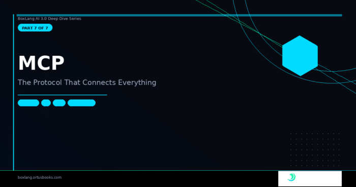

*BoxLang AI 3.0 Series · Part 7 of 7*

The AI ecosystem has a tool problem. Every framework has its own way of defining tools, every agent has its own way of calling them, and every integration requires custom code on both sides. An agent built in Python can't easily use tools built in Java. An MCP server written for Claude Desktop can't easily be consumed by a BoxLang agent without a custom adapter.

The **Model Context Protocol (MCP)** is the industry's answer — a standardized JSON-RPC protocol that lets AI agents discover and call tools from any MCP server, regardless of implementation language. It's an open standard, and it's gaining serious momentum.

**BoxLang AI** is a first-class MCP citizen. You can **consume** any MCP server from your agents with zero configuration. You can **build** production-grade MCP servers that expose your BoxLang functions to any MCP client in the ecosystem. And thanks to the `MCPTool` class from Part 2, the two sides connect seamlessly inside the same agent.

## 🔌 Consuming MCP Servers — The Client Side

The `MCP()` BIF creates an `MCPClient` connected to any MCP server. It handles JSON-RPC, tool discovery, invocation, and response normalization:

```java
// Connect to an MCP server
mcpClient = MCP( "http://localhost:3001" )
    .withTimeout( 5000 )
    .withBearerToken( "${Setting: MCP_API_TOKEN not found}" )

// Discover available tools
tools = mcpClient.listTools()
// → [{ name: "read_file", description: "..." }, { name: "write_file", description: "..." }]

// Call a tool directly
response = mcpClient.send( "read_file", { path: "/config/settings.json" } )
if ( response.isSuccess() ) {
    content = response.getData()
}

// Access resources
resources = mcpClient.listResources()
content   = mcpClient.readResource( "file:///docs/readme.md" )

// Use prompts from the server
prompts = mcpClient.listPrompts()
prompt  = mcpClient.getPrompt( "code-review", { language: "BoxLang" } )
```

### Seeding Agents with MCP Servers

The most powerful use of MCP in BoxLang AI is seeding agents directly. When you call `withMCPServer()`, every tool the server exposes is automatically discovered and registered as an `MCPTool` instance — the agent can use them exactly like any native tool:

```java
// Seed at construction time
agent = aiAgent(
    name       : "data-analyst",
    mcpServers : [
        { url: "http://localhost:3001", token: "secret" },
        { url: "http://internal-db-tools:3002", timeout: 10000 },
        "http://filesystem-server:3003"   // URL string shorthand
    ]
)

// Or fluently
agent = aiAgent( "analyst" )
    .withMCPServer( "http://localhost:3001", { token: "secret" } )
    .withMCPServer( existingMCPClient )

// Introspect what was discovered
println( agent.listTools() )
// → [{ name: "read_file", ... }, { name: "query_db", ... }, { name: "list_tables", ... }]

println( agent.listMCPServers() )
// → [{ url: "http://localhost:3001", toolNames: ["read_file", "write_file"] }, ...]
```

The agent's system message is automatically updated with the MCP server list so the LLM knows which tools came from which server — critical for complex multi-server setups where tool names might overlap.

### How `MCPTool` Works

Each tool discovered from an `MCP` server becomes an `MCPTool` instance that extends BaseTool. This means it gets the full lifecycle --- `beforeAIToolExecute`/`afterAIToolExecute events`, result serialization, middleware interception — exactly like any native tool.

The `doInvoke()` implementation strips internal keys and proxies the call to the MCP server:

```java
// From MCPTool.bx — doInvoke()
public any function doInvoke( required struct args, AiChatRequest chatRequest ) {
    // Strip internal _chatRequest key before forwarding
    var mcpArgs  = arguments.args.filter( ( k, v ) => k != "_chatRequest" )
    var response = variables.mcpClient.send( variables.name, mcpArgs )

    if ( response.isSuccess() ) {
        var data = response.getData()
        // Handle MCP content arrays: [{ type: "text", text: "..." }, ...]
        if ( isArray( data ) ) {
            return data
                .map( item => isStruct( item ) && item.keyExists( "text" ) ? item.text : toString( item ) )
                .toList( char( 10 ) )
        }
        return isSimpleValue( data ) ? toString( data ) : data
    }
    return "Error from MCP tool [#variables.name#]: " & response.getError()
}
```

The schema conversion is also automatic --- `generateSchema()` wraps the MCP `inputSchema` (already in OpenAI-compatible format) in the standard function wrapper. LLM providers see MCP tools identically to native tools.

## 🖥️ Building MCP Servers — The Server Side

BoxLang AI lets you expose your own functions as an MCP server accessible by any MCP client — Claude Desktop, other BoxLang agents, Python scripts, anything that speaks the protocol.

### Simple Server

```java
import ProcbxModules.bxai.models.mcp.MCPRequestProcessor

// Create a server
myServer = mcpServer(
    name        : "company-api",
    description : "Internal company tools for AI agents"
)
// Register native BoxLang tools
.registerTool(
    aiTool(
        name       : "get_customer",
        description: "Retrieve customer information by ID",
        callable   : ( required string customerId ) => {
            return customerService.find( customerId )
        }
    ).describeCustomerId( "The customer's unique identifier" )
)
// Register tools from the global registry by key — zero duplication
.registerTool( "now@bxai" )          // built-in datetime tool
.registerTool( "searchProducts" )    // from AIToolRegistry

// Start the server
// HTTP transport — accessible over the network
MCPRequestProcessor::processHttp()

// STDIO Transport
MCPRequestProcessor::processStdio()
```

### HTTP Transport for Web

```java
import ProcbxModules.bxai.models.mcp.MCPRequestProcessor

myServer = mcpServer(
    name        : "enterprise-tools",
    description : "Enterprise tool suite"
)
// Register multiple tools at once by scanning a class
.registerTool( new CustomerTools() )    // scans @AITool annotations
.registerTool( new OrderTools() )
.registerTool( new InventoryTools() )
// Register prompts and resources
.registerPrompt(
    name        : "customer-email",
    description : "Generate a professional customer email",
    template    : ( orderNumber, customerName ) => {
        return "Write a professional email to #customerName# about order ##orderNumber#"
    }
)
.registerResource(
    uri        : "config://pricing",
    description: "Current pricing configuration",
    getData    : () => fileRead( "/config/pricing.json" )
)

// HTTP transport — accessible over the network
MCPRequestProcessor::processHttp()
```

### Web Application Integration

```java
// Application.bx
class {

    function onApplicationStart() {
        application.mcpServer = mcpServer( "myapp-api" )
            .registerTool( aiTool( "search", ..., callable: data => searchService.search( data ) ) )
            .registerTool( aiTool( "create", ..., callable: data => createService.create( data ) ) )
    }

    function onApplicationEnd() {
        application.mcpServer.stop()
    }

}
```

## 🔒 Enterprise Security Features

MCP servers handling sensitive data need real security. BoxLang AI ships a comprehensive security layer covering CORS, body limits, API key validation, and automatic security headers.

### CORS

```java
myServer
    .withCors( "https://myapp.com" )                // single origin
    .withCors( [ "https://app1.com", "https://app2.com" ] ) // multiple origins
    .withCors( "*.mycompany.com" )                  // wildcard subdomain
    .withCors( "*" )                                // all origins (development only)
```

### Request Body Size Limits

```java
// Protect against payload DoS attacks
myServer.withBodyLimit( 1024 * 1024 )  // 1MB max request body
```

Returns HTTP 413 when exceeded.

### API Key Validation

```java
// Custom validation callback — full control
myServer.withApiKeyProvider( ( apiKey, requestData ) => {
    // apiKey comes from X-API-Key header or Authorization: Bearer token
    return apiKeyService.validate( apiKey )
} )
```

Returns HTTP 401 for invalid keys.

### Automatic Security Headers

Every response from a BoxLang MCP server includes industry-standard security headers automatically — no configuration needed:

```html
X-Content-Type-Options: nosniff
X-Frame-Options: DENY
X-XSS-Protection: 1; mode=block
Referrer-Policy: strict-origin-when-cross-origin
Content-Security-Policy: default-src 'none'; frame-ancestors 'none'
Strict-Transport-Security: max-age=31536000; includeSubDomains
Permissions-Policy: geolocation=(), microphone=(), camera=()
```

### Security Processing Order

When all features are active, requests are processed in this order:

```html
1. Body size check → 413 if exceeded
2. CORS validation → 403 if origin not allowed
3. Basic auth check → 401 if configured and failed
4. API key validation → 401 if configured and failed
5. Request processing → normal execution
```

A fully hardened production server:

```java
myServer = mcpServer( name: "secure-api", description: "Production enterprise tools" )
    .withBodyLimit( 512 * 1024 )                     // 512KB limit
    .withCors( "https://app.mycompany.com" )          // locked down origin
    .withApiKeyProvider( key => keyStore.verify( key ) ) // key validation

myServer
    .registerTool( "now@bxai" )
    .registerTool( new EnterpriseTools() )
```

## 📊 Statistics and Monitoring

The MCP server tracks per-tool invocation counts and error rates:

```java
myServer = mcpServer( name: "monitored-server", statsEnabled: true )
myServer.registerTool( ... )

// After some traffic
stats = myServer.getStats()
println( stats )
// → {
//     totalRequests    : 1847,
//     successfulCalls  : 1832,
//     failedCalls      : 15,
//     toolInvocations  : { "get_customer": 943, "search_orders": 889 },
//     avgResponseTimeMs: 142
//   }
```

## 📢 MCP Events

The MCP system fires BoxLang events you can intercept for logging, authentication, and monitoring:

|       Event       |            When            |
|-------------------|----------------------------|
| onMCPServerCreate | Server instance created    |
| onMCPRequest      | JSON-RPC request received  |
| onMCPResponse     | Response being sent        |
| onMCPError        | Error during MCP operation |
| onMCPServerRemove | Server instance removed    |

```java
// Log every MCP request for audit
bxEvents.listen( "onMCPRequest", ( data ) => {
    auditLog.record(
        server    : data.serverName,
        method    : data.requestData.method,
        timestamp : now()
    )
} )
```

## 🚀 A Complete Real-World Example

Here's the full picture: a BoxLang application that both exposes internal tools via MCP and consumes external MCP servers through its AI agents.

```java
// ── SERVER SIDE ─────────────────────────────────────────────────────────────
// Expose internal BoxLang functions to any MCP client

internalServer = mcpServer( name: "internal-api" )
    .withCors( "https://app.mycompany.com" )
    .withApiKeyProvider( key => apiKeyService.verify( key ) )
    .withBodyLimit( 1024 * 1024 )

internalServer
    .registerTool( aiTool( "get_order",    "Get order by ID",       orderId    => orderService.find( orderId ) ) )
    .registerTool( aiTool( "update_order", "Update order status",   ( orderId, status ) => orderService.update( orderId, status ) ) )
    .registerTool( aiTool( "get_customer", "Get customer by email", email      => customerService.findByEmail( email ) ) )
    .registerTool( "now@bxai" )

// ── AGENT SIDE ───────────────────────────────────────────────────────────────
// Consume the internal server + external MCP tools in one agent

supportAgent = aiAgent(
    name        : "support-coordinator",
    description : "Enterprise customer support agent with full system access",
    instructions: "You have access to order management, customer records, and an external KB. Use all available tools to resolve customer issues completely.",
    mcpServers  : [
        { url: "http://localhost:3000", token: "${Setting: INTERNAL_API_KEY not found}" },  // internal tools
        { url: "http://kb.mycompany.com:3001", token: "${Setting: KB_API_KEY not found}" }  // knowledge base MCP
    ],
    memory      : aiMemory( "hybrid", config: {
        recentLimit   : 10,
        vectorProvider: "chroma",
        collection    : "support_history"
    } ),
    middleware  : [
        new LoggingMiddleware( logToConsole: false ),
        new GuardrailMiddleware( blockedTools: [ "delete_order", "refund_all" ] ),
        new HumanInTheLoopMiddleware(
            mode                  : "web",
            toolsRequiringApproval: [ "update_order", "issue_refund" ]
        )
    ]
)

// The agent has full visibility into what it has
config = supportAgent.getConfig()
println( "Tools available  : #config.toolCount#" )
println( "MCP servers      : #config.mcpServers.len()#" )
println( "Middleware       : #config.middlewareCount#" )

// Run — the agent orchestrates across internal tools, KB, and memory automatically
response = supportAgent.run(
    "Customer alice@example.com says order #ORD-78291 arrived damaged. Resolve this.",
    {},
    { userId: "support-agent-maria", conversationId: "ticket-45892" }
)
```

The agent uses get_order from the internal MCP server, searches the KB MCP for damage policies, checks customer history via hybrid memory, then calls update_order — which triggers the HumanInTheLoopMiddleware and suspends for manager approval. The whole thing is logged, guarded, and fully introspectable.

## 🎯 Wrapping Up the Full Series

Seven posts. One framework. The complete picture.

BoxLang AI 3.0 isn't a wrapper around OpenAI. It's a complete AI application platform — skills for reusable knowledge, a type-safe tool ecosystem, a full agent hierarchy with stateless multi-tenant design, six battle-tested middleware classes, 17 providers with capability-safe routing, 20+ memory types with vector RAG support, and first-class MCP for both consuming and exposing tools.

And it all runs on the JVM, ships with BoxLang's full ecosystem, and takes a single install bx-ai@3.0.0 to get started.

## Get Started

```java
# CommandBox / Web applications
install bx-ai@3.0.0

# OS / CLI applications
install-bx-module bx-ai
```

📖 [Full Documentation](https://boxlang.ortusbooks.com/ai "Full Documentation") 🌍 [Official Website](https://ai.boxlang.io/ "Official Website") 🎓 [AI BootCamp](https://github.com/ortus-boxlang/bx-ai-bootcamp "AI BootCamp") 📦 [ForgeBox Package](https://forgebox.io/view/bx-ai "ForgeBox Package") 🐛 [Report Issues](https://github.com/ortus-boxlang/bx-ai/issues "Report Issues") 💬 [Community Slack](https://boxteam.ortussolutions.com/ "Community Slack") 💼 [BoxLang+ Plans](https://www.boxlang.io/plans "BoxLang+ Plans")

*Thank you to everyone who read through all seven posts. The BoxLang AI team is just getting started — see you in v4. 🙏*

← [Previous](https://foojay.io/today/boxlang-ai-deep-dive-part-6-of-7-memory-systems-rag-building-ai-that-remembers/ "Previous")
