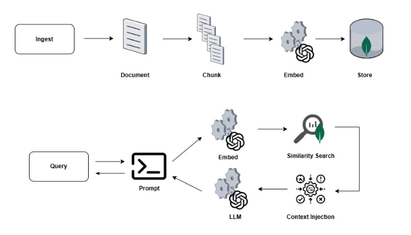

This is the first article in a three-part series. Part 2 covers short-term and long-term memory; Part 3 introduces stateful workflow checkpointing with pause/resume.

## The problem

It's 2 a.m. Suddenly, an alert pops up indicating abnormal CPU usage on the payment services. The on-call engineer opens their laptop, logs into the monitoring dashboards, and begins the hunt. One by one, he searches the runbooks on Confluence, checks the Slack chats, and opens the GitHub wikis and documents shared during the design phase. By the time he finds any useful information, ten minutes have already passed.

And what he finds is often not what he was looking for because he didn't know which keywords to use for the search. Or perhaps what he finds isn't up to date.

We're talking about a problem that, in theory, has already been solved. The team managing the service has prepared and versioned the runbooks needed to resolve the incident; the knowledge is available and documented. The real problem is searching for and retrieving this knowledge: taking and extracting the right context from the ongoing incident, identifying the root cause, and correctly matching it to the part of the documentation that addresses that problem.

So, this is one of the many problems we can solve with Retrieval-Augmented Generation (RAG).

## What we are building

In this series of articles, we will build an Operations Assistant: a Spring AI-based Java application that allows engineers to ask questions in plain English and receive answers that help them perform operations and solve problems, based on their operational knowledge base.

In this first article, we'll focus on the foundation: loading documentation into a vector store and linking it to a language model so that every answer is anchored to real, company-specific content. We don't want a generic response from an LLM. The result is already useful in itself: we will have APIs connected to a small UI, where the user can ask questions such as "What are the steps to roll back my latest deployment on Kubernetes?" and receive structured answers consistent with the company's documentation.

In parts 2 and 3, we will add conversational memory and persistence, leveraging MongoDB as a unified database.

## Why RAG and why MongoDB Atlas

An LLM is a perfect tool for generating generic responses, but it stops being effective the moment I ask it for specific information about your systems. And the problem is clear: it has never seen your runbooks, read your documentation, reviewed your postmortems, or understood the naming convention your team decided on over a post-work beer three years ago.

It is possible to fine-tune a model on this content, but it is an expensive, slow, and difficult process to keep up to date: every time someone updates a runbook, the model needs to be retrained.

Fortunately, there's RAG. RAG allows us to store our information in an external container rather than within the model, retrieve this information when a request is made, and use it within the model's context window alongside the query. Once the model receives the query, it reads the documentation and provides an answer. Quick win: the documentation is always up to date, and the model will always use the latest available version.

Where do I save this documentation? Well, that's where MongoDB comes to the rescue. The same Atlas cluster that will contain our documentation will also allow us, in future articles, to host our conversation history and workflow checkpoints. A single platform serving multiple purposes: this means less management overhead and an infrastructure that's easier to manage. One less headache for the operations team, which already has to handle other requests.

Atlas provides a native Vector Search feature that integrates directly with the MongoDBAtlasVectorStore abstraction provided by Spring AI. This means there is no separate vector database to set up and deploy, and most importantly, no ETL pipeline to synchronize.

Documents and their embeddings coexist within the same collection and can be retrieved using the same infrastructure and connection.

Another truly interesting and useful feature is metadata filtering. Every piece of documentation we save in our database includes metadata, such as the system it refers to, the environment, the associated severity, and which team is responsible. When a request is made, the retrieval advisor can pre-filter the vector search based on this metadata. In the example scenario, a request regarding the payments service in the production environment will bring to the model's attention only the runbooks associated with this service and this environment. This is particularly efficient and accurate when the database grows.

## How the Pieces Fit Together

Before diving into the code, it's helpful to have a clear picture of what we're about to build.

Let's start with the engineer interacting with their assistant: when a question is asked, the request passes through a Spring AI ChatClient. This ChatClient has been configured with a chain of advisors, the most important of which, for this part of the tutorial, is the QuestionAnswerAdvisor.

The QuestionAnswerAdvisor intercepts all requests before they are submitted to the model and converts the question into a vector using, in this case, OpenAI's *text-embedding-3-small* . Once a vector is obtained, a cosine similarity search is performed on the *knowledge_chunks* collection within Atlas. The top 5 document chunks that match the request are formatted and returned to the prompt to form the grounding context.

At this point, we have three components that are sent to the model: the system prompt that defines the role of the person submitting the request, the content retrieved from the knowledge base, and the original question from the operations expert. The prompt explicitly requires that the model cannot rely solely on its own knowledge to answer the question, but must rely on the context retrieved from the knowledge base, and when this is insufficient, the model must clearly indicate it.

From an ingestion perspective, whenever a new runbook, procedure, postmortem, or version of the documentation is produced, it must be split into overlapping chunks (to preserve context) of approximately 800 tokens by the TokenTextSplitter. Each chunk is then embedded and saved within the *knowledge_chunks* collection along with all associated metadata. All of this is possible with the *VectorStore.add()* method, which handles making the request to the embedding API and writing to MongoDB in a single operation.

The pipeline is shown below:  


The true strength of Spring AI lies in its abstraction, which allows the controller and service to remain unaware of which model is being used---whether it's GPT-5.4 or Sonnet 4.6---or whether the database is MongoDB Atlas or PostgreSQL. Changing the model or database is a matter of configuration, not a new development task. A game changer.

## Getting the Project Running

Now that we've laid the groundwork for understanding what we're building, let's get started with the implementation. The project requires Java 21, Maven 3.9+, an OpenAI API key, and a MongoDB Atlas cluster.

Simply clone the repository:

```
git clone https://github.com/matteoroxis/operations-assistant.git

cd operations-assistant
```

Then set the two environment variables required to configure the database and OpenAI API key.

```
export MONGODB_URI="mongodb+srv://<user>:<password>@<cluster>.mongodb.net/ops_assistant?appName=devrel-tutorial-java-agentic-workflows-foojay"

export OPENAI_API_KEY="sk-..."
```

Everything is ready. Let's start the application:

```
mvn spring-boot:run
```

The configuration file specifies that the vector store should use a collection named *knowledge_chunks* with a search index named *knowledge_vector_index* . It also specifies the use of a *text-embedding-3-smal* l embedding model with 1536 dimensions and the*gpt-5.4-mini* model with a temperature of 0.2. What does the temperature indicate?

A temperature of 0.2 makes the output more deterministic and less likely to hallucinate steps that don't exist in the runbooks. For operational procedures, consistency is more important than variety.

All of this works thanks to Spring AI, which is integrated into the application using the following dependencies, listed in the BOM version 1.0.0

* *spring-ai-starter-model-openai* for the chat and the embedding model
* *spring-ai-starter-vector-store-mongodb-atlas* to use MongoDBAtlasVectorStore
* *spring-ai-advisors-vector-store* for the QuestionAnswerAdvisor
* *spring-boot-starter-data-mongodb* to manage interaction and connection with the Atlas cluster.

Everything else consists of standard Spring Boot dependencies.

## The Ingestion Pipeline

The ingestion pipeline has a single task: taking a document, dividing it into chunks of the right size, and saving each chunk along with its embedding and corresponding metadata in the Atlas database. That's it.

The chunking process is not as straightforward as it seems. If the chunks are too large, the embedding captures a topic that is too wide to provide the right level of detail. This causes the context window to be filled with information that may be irrelevant to the initial query. If the chunks are too small, each embedding becomes too limited and specific. As a result, the similarity score might provide inconsistent results with a lot of noise, and more importantly, there is a risk of never being able to retrieve related information scattered across multiple chunks.

For this reason, a target of 800 tokens was used with a small overlap between adjacent chunks, which is useful for retrieving context. This size, also used and [recommended by OpenAI](https://developers.openai.com/api/docs/guides/embeddings#:~:text=use%20case%20section.-,Embedding%20models,Amazon%20fine%2Dfood%20reviews%20dataset.), is sufficient to preserve the logical structure of the runbook or documentation without losing precision during the search phase.

As mentioned earlier, metadata is attached to each chunk. For example, within the chunks that make up the runbook for the production payment service, information such as *sourceType* , *system* , *environment* , and *team*is associated. This metadata is used at query time to perform pre-filtering operations and improve similarity search. The MongoDB Atlas Vector Store saves each chunk as a BSON document with a content field, a metadata subdocument, and an embedding array: none of this requires custom mapping across collections or document sync operations.

The application exposes an API for manually ingesting a text document and its associated metadata as a JSON body. The application also provides sample runbooks in Markdown, covering scenarios such as detecting abnormal CPU usage, service rollbacks, disk space alerts, and network latency. A POST request to the API at /api/ops/knowledge/ingest/sample automatically loads all of them, allowing you to have a working system right away.

## The Retrieval Pipeline

Spring AI truly stands out in the retrieval phase, making many of the operations performed transparent. The ChatClient is configured with the QuestionAnswerAdvisor, which allows every request coming from the chat to be wrapped in a retrieval operation. From the controller's perspective, an incoming request translates into a series of sequential steps that produce an outgoing response, all linked together within a single method chain.

Behind the scenes:

The advisor embeds the user's question using the same model used during knowledge base ingestion. This produces a vector compatible with all previously stored vectors.

1. The advisor performs a cosine-similarity search on the *knowledge_chunks* collection and retrieves the first 5 chunks that meet the minimum similarity threshold.
2. If the request includes contextual information, this is used as a pre-filter to reduce the number of potential search candidates.
3. The retrieved chunks are formatted and injected into the prompt as context, along with the user's question and its characteristics.

The prompt assembled from the previous steps is passed to GPT-5mini, which formulates the response based on the provided context.

Throughout this process, the controller remains extremely lightweight, simply validating the inputs, constructing the filters to pass to the advisor, and building the response.

This separation of responsibilities will become clearer and more useful as we continue through the tutorial. In Parts 2 and 3, we will add new advisors to the chain---for conversational memory and long-term memory---all without touching the controller or the exposed interfaces.

## The Atlas Vector Search Index

Before you can run any similarity search, you must have a Vector Search index on the *knowledge_chunks* collection. The Atlas cluster tier affects how the index is created.

Spring AI can create the index on its own. Simply specify the following in application.yml:

spring.ai.vectorstore.mongodb.initialize-schema: true

When the application starts, MongoDBAtlasVectorStore executes the createSearchIndexes command on the Atlas cluster, and the index is ready to use in just a few seconds.

If you want to create the index manually, you need to access the Atlas UI, navigate to the relevant cluster, open Atlas Search, and create a new index using the JSON Editor. Select the *ops_assistant* database and the *knowledge_chunks* collection, and use the following index definition, naming it *knowledge_vector_index*:

```
{
  "fields": [
    {
      "type": "vector",
      "path": "embedding",
      "numDimensions": 1536,
      "similarity": "cosine"
    },
    { "type": "filter", "path": "metadata.sourceType" },
    { "type": "filter", "path": "metadata.system" },
    { "type": "filter", "path": "metadata.environment" },
    { "type": "filter", "path": "metadata.severity" },
    { "type": "filter", "path": "metadata.team" }
  ]
}
```

## Trying It Out

We're finally ready to test. Open your browser to[http://localhost:8080](http://localhost:8080/) while the application is running, click "Load Sample Runbooks," and wait a few seconds for the sample runbooks to finish loading. Now, try typing the following in the chat panel:

```
> My payment-service pod is at 90% CPU. What should I check first?
```

The result is not the same as what you would get by asking the same question to any LLM. The result includes a reference to the actual steps outlined in the "Abnormal CPU Usage" runbook, which is included within the sample runbooks. Use *kubectl top pods* to identify the pods affected by the issue, collect a JVM thread dump with *jstack* , and analyze the garbage collector with *jstat*.

Finally, review all recent deployments within the cluster. All these operations accurately reflect the company's operational documentation: the retrieval pipeline identified and collected the sections of the runbook relevant to this scenario, then placed them within the model's context to provide a response tailored to your use case.

Let's now try asking another question using the optional filters for *system* and *environment*, and see how the retrieved context changes. If we ask a question with the payment-service and prod filters, the retrieval mechanism retrieves a different subset of chunks compared to the unfiltered version, since these filters narrow the set of candidates before the similarity search.

## Conclusion and What's Next

In this tutorial, we built a RAG system that answers questions by providing responses based on the content of your documentation. To do this, we first gathered a collection of runbooks written in Markdown and divided them into appropriately sized chunks. All of these chunks were embedded within the MongoDB Vector Store, along with associated metadata. Everything was connected to an LLM using a Spring Boot advisor.

The real gem of this code is that many of the tasks required for proper operation are handled without writing custom code. We only step in when we need to add our business logic, and not to write complicated methods for interacting with the Vector Store or the LLMs, which remain completely transparent and interchangeable. Pretty cool, right? The application focuses on writing the domain logic, such as which metadata to use for pre-filtering or which filters to apply. Everything else is declarative.

The one thing this version lacks is memory. If we try to ask a second question in the chat, we'll see that our application won't remember at all what it responded to just a few seconds earlier. Each response provides a completely new context, unaffected by what happened previously.

The second part of this series introduces two complementary memory systems. The first, called short-term memory, uses a sliding window to keep the current conversation in memory, so that more complex analyses of the issues at hand can be performed. The second system, called long-term memory, contains preferences, decisions, recommendations, and events from past conversations, which are referenced in all new responses to apply consistent patterns to resolution recommendations. The system will therefore remember that I prefer to perform a rollback using a Helm chart rather than using *kubectl* via the command line.

You can find the code for this article in the following [repository](https://github.com/matteoroxis/operations-assistant). Try modifying the content with your own runbooks and documentation to see how it behaves in your use cases.
