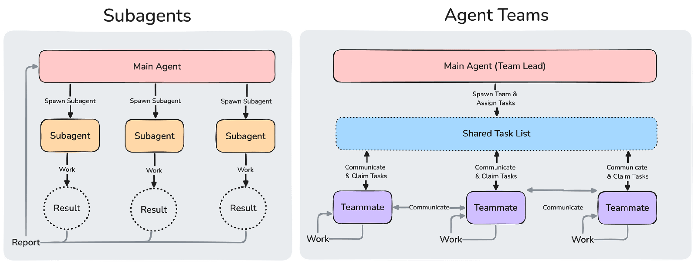
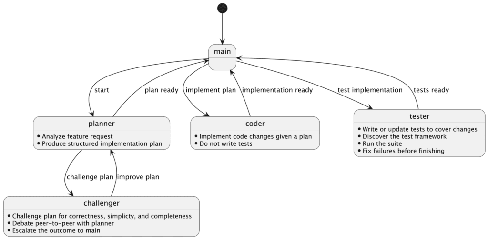

I continue to experiment with AI in the context of software engineering. I'm fortunate that my team supports me in exploring different ways to improve our daily work. This week, I designed a team of **autonomous** agents to implement features, from design to implementation.

## Why autonomous agents?

A long time ago, we were delighted when the IDE offered auto-completion. In the previous two years, things have changed. A lot.

Coding assistants have become our primary interfaces for coding. We still use IDEs, at least I do. Yet, I had an IDE licensing issue two weeks ago, and I continued to code even without it. The assistant automatically compiles and tests after every change. While it was forced on me, I believe it could be a valuable test for seasoned programmers: can you replace your IDE with your coding assistant, or are they complementary?

That being said, chatting with your assistant is but a step in the AI maturity level. In [The 8 Levels of Agentic Engineering](https://www.bassimeledath.com/blog/levels-of-agentic-engineering), the author mentions the following steps:

* Levels 1 \& 2: Tab Complete and Agent IDE
* Level 3: Context Engineering
* Level 4: Compounding Engineering
* Level 5: MCP and Skills
* Level 6: Harness Engineering \& Automated Feedback Loops
* Level 7: Background Agents
* Level 8: Autonomous Agent Teams

> Claude Code's experimental Agent Teams feature is an early implementation: multiple instances work in parallel on a shared codebase, where teammates operate in their own context windows and communicate directly with each other. Anthropic used 16 parallel agents to build a C compiler from scratch that can compile Linux. Cursor ran hundreds of concurrent agents for weeks to build a web browser from scratch and migrate their own codebase from Solid to React.

Obviously, I have neither the resources nor the know-how to tackle such a huge undertaking. However, I wanted to design a team to handle smaller tasks.

## Subagents

I recently wrote about [subagents](https://blog.frankel.ch/experimenting-ai-subagents/).

Claude describes several benefits of using subagents:
> * **Preserve context** by keeping exploration and implementation out of your main conversation
> * **Enforce constraints** by limiting which tools a subagent can use
> * **Reuse configurations** across projects with user-level subagents
> * **Specialize behavior** with focused system prompts for specific domains
> * **Control costs** by routing tasks to faster, cheaper models like Haiku
>
> — [Create custom subagents](https://code.claude.com/docs/en/sub-agents)

Claude Code provides several built-in subagents: explore, plan, general purpose, status line, and Claude Code guidelines. You can read more about each of them in the [documentation](https://code.claude.com/docs/en/sub-agents#built-in-subagents).

However, and this is where it gets interesting, you can define a specialized subagent through a dedicated Markdown file with a specific front matter in a `.claude/agents` folder. The front matter defines: a name, a description, a model, and a list of available tools. The body describes the subagent's purpose, *i.e.*, its instructions. Here's a sample:
>
> ```markdown
> ---
> name: code-reviewer
> description: Reviews code for quality and best practices
> tools: Read, Glob, Grep
> model: sonnet
> ---
>
> You are a code reviewer. When invoked, analyze the code and provide
> specific, actionable feedback on quality, security, and best practices.
> ```
>
> — [Write subagent files](https://code.claude.com/docs/en/sub-agents#write-subagent-files)

## The team design

I asked Claude Code to come up with the team design. He created a plan that included five subagents: `planner`, `challenger`, `coder`, `tester`, and `documenter`. Their name are pretty self-descriptive, but I'll come back to them later. In the meantime, I read that the optimal number of agents in a team is between three and five: I removed the `documenter`.

"Regular" subagents do their tasks autonomously, but then come back to the main agent. Subagents in teams communicate with each other directly.



After defining agents, you need to specify how subagents communicate with each other toward the accomplishment of a task. You describe such interactions in [a skill](https://blog.frankel.ch/writing-agent-skill/), which Claude also created for me. Here's a very simplified model.



States represent agent responsibilities in their respective agent file, while interactions represent communication between agents in the skill. Note that I added extra communication constraints within agent descriptions. I work as usual with Claude Code. The only difference is when it's time to implement; instead of telling it to proceed, I call the `/implement` skill from the command line.

Here's how it looks (at the moment) in the console:

    4 tasks (0 done, 4 open)
      ◻ Approve plan › blocked by #3
      ◻ Implement merged CSV hierarchy changes › blocked by #1
      ◻ Plan: materialize merged CSVs with new hierarchy across both repos
      ◻ Write tests for merged CSV changes › blocked by #2

## Team agents beyond marketing

Agents' teams are amazing, but they come with issues.

The biggest one is the tension between autonomy and security. In regular Claude Code sessions, it's easy to grant permission when it asks for a command. With regular subagents, I notice it gets a bit more tedious: requests for permissions are much more frequent. Agents' teams reach a peak in that regard.

To cope with that, you can add permissions in your `settings.json` and hope they cover the commands made by Claude Code in the session. Alternatively, you can use the aptly-named `--dangerously-skip-permissions` flag, or wait for the slightly safer [auto mode](https://www.anthropic.com/engineering/claude-code-auto-mode). In all cases, you must arbitrate between autonomy and security. Too much security slows you down, too much autonomy is risky.

Also, agents' teams are experimental at the moment. They might be better in the future, be widely different, or not exist at all. To enable them now, set `CLAUDE_CODE_EXPERIMENTAL_AGENT_TEAMS` to `1` in `settings.json`.

On the plus side, it pays to invest time in agents. Within or without teams, you explicitly call agents on the command line.

## Conclusion

Autonomous agent teams sit at the top of the agentic engineering ladder. Getting there requires designing agent interactions upfront and solving the autonomy vs. security tradeoff.

The feature is experimental, and I'd treat it as such, but the direction is clear. We are already spending less time coding directly and more time managing agents. Agents' teams are the next logical step.

**To go further:**

* [The 8 Levels of Agentic Engineering](https://www.bassimeledath.com/blog/levels-of-agentic-engineering)
* [Orchestrate teams of Claude Code sessions](https://code.claude.com/docs/en/agent-teams)
* [Built-in subagents](https://code.claude.com/docs/en/sub-agents#built-in-subagents)

*Originally published at [A Java Geek](https://blog.frankel.ch/design-team-agents/) on May 3^rd^, 2026.*
