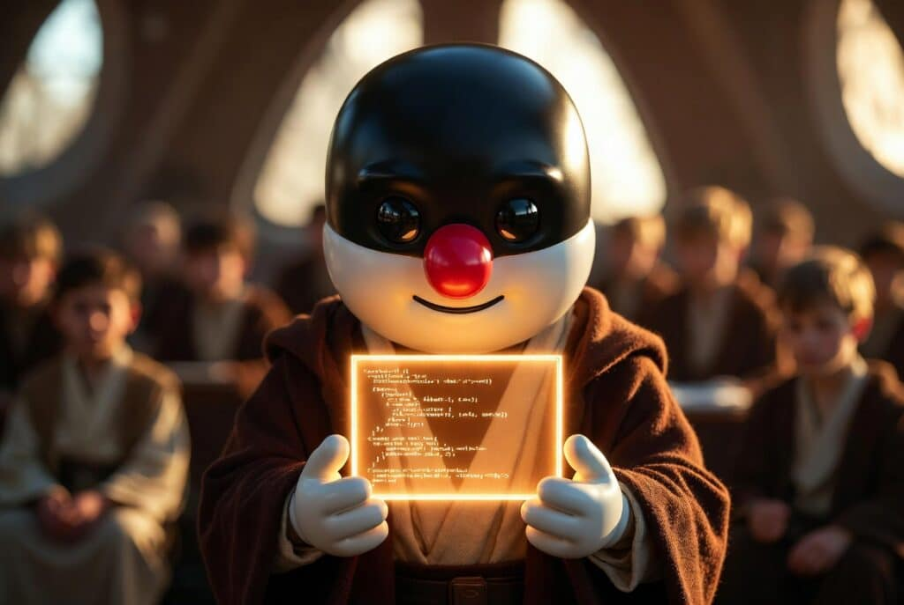
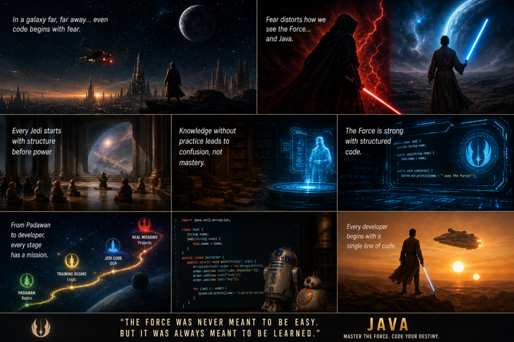

Every year on May 4th, fans around the world celebrate Star Wars Day with the iconic phrase "May the 4th be with you." The following day, May 5th, is often recognized as "Revenge of the Fifth", a playful nod to Revenge of the Sith, where many embrace the darker side of the Force and celebrate iconic Sith Lords and villains.

So, this week is ideal for talking about one of the most misunderstood technologies in programming: **Java**.

While many developers view Java as the "Dark Side" of coding, complex, outdated, and intimidating, the reality is very different. Learning Java can be much easier, more logical, and far more rewarding than most people think. In this post, we'll show you why Java might actually be one of the best and most accessible languages to learn.

### ("In a galaxy far, far away...") {#h3-0-in-a-galaxy-far-far-away}

A long time ago in a galaxy not so different from ours, aspiring developers looked at Java and felt a disturbance in the Force.

Not the Force of balance.

But the Force of fear.  

Fear of syntax.  

Fear of structure.  

Fear of the mysterious "Object-Oriented Programming."

Many believed Java belonged to the Dark Side of programming languages.

But that belief... is as misleading as the Sith doctrine itself.  

Java is not the Dark Side.

It is the Jedi Order in code form.

The Myth: "Java is Too Hard for Beginners" {#h2-1-the-myth-java-is-too-hard-for-beginners}
------------------------------------------------------------------------------------------

Many new developers imagine Java like a Sith holocron, ancient, complex, and impossible to decode.

Common beliefs:

* "Java has too much syntax"
* "OOP is too abstract"
* "I need to be smart to learn it"

Let's test it in the Jedi Archives (also known as: actual code).

#### Your First Connection to the Force

Even a youngling in the Jedi Temple can write this:

<pre class="EnlighterJSRAW" data-enlighter-language="java">public class Main {
   public static void main(String[] args) {
       System.out.println("May the Force be with Java.");
   }
}
</pre>

No lightsaber required.  

No Jedi Council approval needed.  

Just structure.

Java: The Jedi Order of Programming {#h2-2-java-the-jedi-order-of-programming}
------------------------------------------------------------------------------

In the Star Wars galaxy, Jedi training is not random.

It is structured, disciplined, and guided by masters like Yoda, Obi-Wan Kenobi, and Qui-Gon Jinn.

Java works the same way.

#### Classes = Jedi Archives Blueprints

In the Jedi Temple on Coruscant, every Jedi has a record in the Archives.

In Java, that's a class.

<pre class="EnlighterJSRAW" data-enlighter-language="java">class Jedi {
   String name;
   String rank;
}
</pre>

This is your Jedi identity stored in code.  

Like Anakin Skywalker before his fall... or redemption.

#### Objects = Jedi in the Field

A class is theory.  

An object is action.

<pre class="EnlighterJSRAW" data-enlighter-language="java">public class Main {
   public static void main(String[] args) {

       Jedi luke = new Jedi();
       luke.name = "Luke Skywalker";
       luke.rank = "Padawan";

       System.out.println(luke.name + " begins his training.");
   }
}
</pre>

Luke didn't become a Jedi by reading scrolls on Tatooine.  

He became one through experience.

#### Methods = Force Abilities

The Force is not static.

It is used.

So are methods.

<pre class="EnlighterJSRAW" data-enlighter-language="java">class Jedi {

   String name;

   void useForce() {
       System.out.println(name + " uses the Force like Master Yoda taught.");
   }
}
</pre>

And when invoked:

<pre class="EnlighterJSRAW" data-enlighter-language="java">Jedi obiWan = new Jedi();
obiWan.name = "Obi-Wan Kenobi";
obiWan.useForce();
</pre>

Output:

<pre class="EnlighterJSRAW" data-enlighter-language="java">Obi-Wan Kenobi uses the Force like Master Yoda taught.
</pre>

The Real Dark Side: The Empire of Bad Learning {#h2-3-the-real-dark-side-the-empire-of-bad-learning}
----------------------------------------------------------------------------------------------------

Most Padawans fail not because Java is powerful...

But because they fall into the Dark Side of learning:

* Watching endless tutorials like Imperial propaganda broadcasts
* Avoiding hands-on training like Jedi avoiding Sith temptation
* Trying to master the Death Star before building a lightsaber

Even Darth Vader didn't start by building an Empire.

He started as Anakin... a learner.

Why Java Feels Like the Jedi Code (But Isn't Hard) {#h2-4-why-java-feels-like-the-jedi-code-but-isn-t-hard}
-----------------------------------------------------------------------------------------------------------

#### The Jedi Code of Java Logic

<pre class="EnlighterJSRAW" data-enlighter-language="java">int midiChlorians = 12000;

if (midiChlorians &gt; 10000) {
   System.out.println("You are strong with the Force.");
} else {
   System.out.println("You are still a Padawan.");
}
</pre>

In the Jedi Order, everything has meaning and structure.

Java is the same.

No chaos.  

No randomness.  

Only discipline.

Training Like a Jedi: Loops in the Temple {#h2-5-training-like-a-jedi-loops-in-the-temple}
------------------------------------------------------------------------------------------

Jedi training is repetition.

Strike. Block. Meditate. Repeat.

Java loops reflect this perfectly:

<pre class="EnlighterJSRAW" data-enlighter-language="java">for (int i = 1; i &lt;= 3; i++) {
   System.out.println("Jedi training session " + i);
}
</pre>

Even Luke Skywalker didn't master the Force in one training montage.

Your Journey from Youngling to Jedi Developer {#h2-6-your-journey-from-youngling-to-jedi-developer}
---------------------------------------------------------------------------------------------------

Let's map your path through the galaxy:

#### Youngling Stage (Tatooine Beginnings)

<pre class="EnlighterJSRAW" data-enlighter-language="java">int lightsaber = 1;
</pre>

You are just discovering the Force exists.  

Like Luke staring at the twin suns.

#### Padawan Stage (Training with Obi-Wan)

<pre class="EnlighterJSRAW" data-enlighter-language="java">if (lightsaber == 1) {
   System.out.println("Training begins under Kenobi.");
}
</pre>

You start learning discipline.

#### Jedi Knight Stage (Council Approval)

<pre class="EnlighterJSRAW" data-enlighter-language="java">class Jedi {
   String name;

   void train() {
       System.out.println(name + " trains under the Jedi Order.");
   }
}
</pre>

You begin building systems.

#### Jedi Master Stage (Building Your Own Order)

<pre class="EnlighterJSRAW" data-enlighter-language="java">import java.util.ArrayList;

class Jedi {
   String name;

   Jedi(String name) {
       this.name = name;
   }
}

public class Main {
   public static void main(String[] args) {

       ArrayList order = new ArrayList();

       order.add(new Jedi("Luke Skywalker"));
       order.add(new Jedi("Ahsoka Tano"));
       order.add(new Jedi("Rey"));

       for (Jedi j : order) {
           System.out.println(j.name + " is part of the New Jedi Order.");
       }
   }
}
</pre>

Now you are no longer a learner.

You are building systems like the Jedi rebuilt themselves after Order 66.

Final Wisdom from the Jedi Archives {#h2-7-final-wisdom-from-the-jedi-archives}
-------------------------------------------------------------------------------

Java is not the Dark Side.

It is not chaotic like the Clone Wars.

It is structured like the Jedi Code.

And once you understand it, you realize:

* Classes are your Jedi blueprint
* Objects are your living Jedi
* Methods are your Force abilities
* Practice is your training in the Jedi Temple

So don't fear Java.

Train with it.

Because even Master Yoda would agree:

*"A programmer strong with Java, the Force is."*
