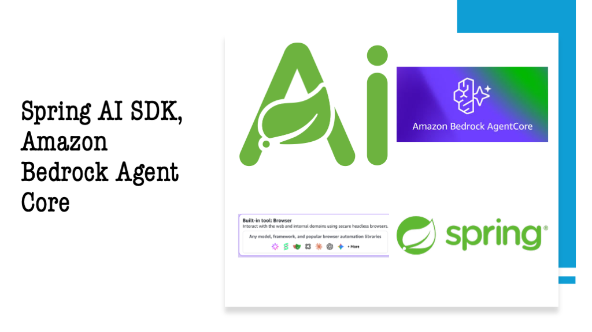
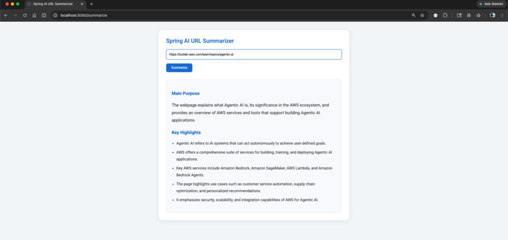

In [Part 1](https://foojay.io/today/spring-ai-amazon-bedrock-sdk-guide/) and [Part 2](https://foojay.io/today/explore-spring-ai-sdk-amazon-bedrock-agentcore-part-2/), we explored the Spring AI SDK and Amazon Bedrock AgentCore features, including the agentcore runtime starter and integration of agentcore memory. In this article, we will explore the integration of AgentCore built-in tools, including the Browser and Code Interpreter features.
> **Repository containing the companion code for the tutorial. [Go to GitHub](https://github.com/bsmahi/simple-spring-boot-agent){#https://github.com/bsmahi/simple-spring-boot-agent}.**
>  Built-In Tool Browser

*The use case I am trying to build here is for the given URL; it navigates the entire website and retrieves the content and gives key points and the summary of the page using **the AgentCore Browser** tool.*

### 1. Adding Built-in Tools: AgentCore Browser {#h3-0-1-adding-built-in-tools-agentcore-browser}

AgentCore provides specialized tools, such as the Browser and Code Interpreter, which the SDK exposes as Spring AI tool callbacks through the [ToolCallbackProvider](https://docs.spring.io/spring-ai/docs/current/api/org/springframework/ai/tool/ToolCallbackProvider.html){#https://docs.spring.io/spring-ai/docs/current/api/org/springframework/ai/tool/ToolCallbackProvider.html} interface.

By adding the [AgentCore Browser](https://docs.aws.amazon.com/bedrock-agentcore/latest/devguide/browser-tool.html), agents can navigate websites, perform actions such as parsing content and fetching images, and provide summaries of the given URL.

To start with, add the below dependency in pom.xml

```xml
<dependency>
    <groupId>org.springaicommunity</groupId>
    <artifactId>spring-ai-agentcore-browser</artifactId>
</dependency>
```


### 2. Add the below class. {#h3-1-2-add-the-below-class}

```java
package com.bsmlabs.springai.agents;

import com.bsmlabs.springai.models.PromptRequest;
import org.slf4j.Logger;
import org.slf4j.LoggerFactory;
import org.springaicommunity.agentcore.artifacts.SessionConstants;
import org.springaicommunity.agentcore.context.AgentCoreContext;
import org.springaicommunity.agentcore.memory.longterm.AgentCoreMemory;
import org.springframework.ai.chat.client.ChatClient;
import org.springframework.ai.chat.memory.ChatMemory;
import org.springframework.ai.tool.ToolCallbackProvider;
import org.springframework.beans.factory.annotation.Qualifier;
import org.springframework.stereotype.Service;

import java.io.IOException;
import java.util.UUID;

@Service
public class BuiltInToolsAgent {

    private static final Logger logger = LoggerFactory.getLogger(BuiltInToolsAgent.class);

    private final ChatClient chatClient;
    private final ChatMemory chatMemory;
    private final AgentCoreMemory agentCoreMemory;

    public BuiltInToolsAgent(
            ChatClient.Builder chatClientBuilder,
            ChatMemory chatMemory,
            AgentCoreMemory agentCoreMemory,
            @Qualifier("browserToolCallbackProvider")
            ToolCallbackProvider browserTools) {

        this.chatMemory = chatMemory;
        this.agentCoreMemory = agentCoreMemory;

        this.chatClient = chatClientBuilder
                .defaultToolCallbacks(browserTools)
                .build();
    }

    public String chat(PromptRequest request,
                       AgentCoreContext context) throws IOException {

        String sessionId = "session-" + UUID.randomUUID();
        logger.info(
                "Chat initiated - Session: {}, Prompt: {}",
                sessionId,
                request.prompt()
        );

        String response = chatClient.prompt()
                .user(request.prompt())
                .advisors(advisorSpec ->
                        advisorSpec.param(
                                SessionConstants.SESSION_ID_KEY,
                                sessionId
                        )
                )
                .call()
                .content();

        logger.info("Response: {}", response);

        return response;
    }
}
```


<br />

This BuiltInToolsAgent class is a Spring service that integrates the Spring AI SDK with Amazon Bedrock AgentCore built-in tools, specifically the Browser tool. It uses ChatClient to interact with the LLM and enables tool execution through ToolCallbackProvider.

This class acts as an AI agent service that processes prompts and invokes AgentCore tools.

**ChatClient**

* Main Spring AI client used to communicate with the foundation model.

**Constructor Injection**

```java
public BuiltInToolsAgent(
            ChatClient.Builder chatClientBuilder,
            ChatMemory chatMemory,
            AgentCoreMemory agentCoreMemory,
            @Qualifier("browserToolCallbackProvider")
            ToolCallbackProvider browserTools) {

        this.chatMemory = chatMemory;
        this.agentCoreMemory = agentCoreMemory;

        this.chatClient = chatClientBuilder
                .defaultToolCallbacks(browserTools)
                .build();
}
```


Spring injects all required dependencies through the constructor. **@Qualifier("browserToolCallbackProvider")**

* Injects the Browser tool callback provider bean.
* This enables the agent to use browser capabilities such as the following:
  * Navigating websites
  * Parsing web pages
  * Fetching content
  * Summarizing URL

```java
this.chatClient = chatClientBuilder
                .defaultToolCallbacks(browserTools)
                .build();
```


* Registers the browser tool with the **ChatClient**.
* Whenever the model requires browser actions, it can automatically invoke the tool callback.

**Chat Method**

Accepts:

* PromptRequest → user prompt
* AgentCoreContext → AgentCore execution context

Returns: AI-generated response as a string

* Generates a unique session ID for every interaction.
* Helps AgentCore maintain conversation tracking and memory isolation.
* Logs incoming user requests.
* Sends the user prompt to the LLM.
* Passes the session ID to AgentCore advisors.
* Allows AgentCore to associate memory and execution state with the session.
* Executes the prompt request.
* Retrieves only the textual response content.
* Logs the generated AI response.
* Sends the final AI-generated output back to the caller.

The key concept here is ***.defaultToolCallbacks(browserTools)***. This line enables Amazon Bedrock AgentCore built-in Browser capabilities inside the Spring AI SDK through the ToolCallbackProvider abstraction.

```
+-------------------+
|   User Prompt     |
+-------------------+
          |
          v
+-------------------+
| BuiltInToolsAgent |
+-------------------+
          |
          v
+-------------------+
|   ChatClient      |
| Processes Prompt  |
+-------------------+
          |
          v
+------------------------------+
| Browser Tool Callback        |
| Registered via               |
| ToolCallbackProvider         |
+------------------------------+
          |
          v
+------------------------------+
| LLM Decides Whether to Use   |
| Browser Tool Automatically   |
+------------------------------+
          |
          v
+------------------------------+
| Browser Tool Navigates URL   |
| Parses Content / Fetches     |
| Images / Extracts Data       |
+------------------------------+
          |
          v
+------------------------------+
| AgentCore Manages Session    |
| and Memory Context           |
+------------------------------+
          |
          v
+------------------------------+
| LLM Generates Summary and    |
| Key Insights                 |
+------------------------------+
          |
          v
+-------------------+
| Final Response    |
| Returned to User  |
+-------------------+
```


### 3. Create a Controller {#h3-2-3-create-a-controller}

```java
package com.bsmlabs.springai.agents;

import com.bsmlabs.springai.models.PromptRequest;
import org.springaicommunity.agentcore.context.AgentCoreContext;
import org.springframework.http.HttpHeaders;
import org.springframework.stereotype.Controller;
import org.springframework.ui.Model;
import org.springframework.web.bind.annotation.GetMapping;
import org.springframework.web.bind.annotation.PostMapping;
import org.springframework.web.bind.annotation.RequestParam;

@Controller
public class SummaryController {

    private final BuiltInToolsAgent builtInToolsAgent;

    public SummaryController(BuiltInToolsAgent builtInToolsAgent) {
        this.builtInToolsAgent = builtInToolsAgent;
    }

    @GetMapping("/")
    public String home() {
        return "summary";
    }

    @PostMapping("/summarize")
    public String summarize(@RequestParam("url") String url, Model model) {

        try {

            String prompt = """
                    Open webpage: %s

                    Read the webpage content once.

                    Locate the primary content area.

                    Prioritize content inside:
                    - <main>
                    - <article>
                    - documentation body
                    - blog content

                    Provide:
                    1. Main purpose
                    2. Key highlights
                    3. Concise summary in bullet points

                    Ignore:
                    - navigation
                    - menus
                    - footer
                    - ads
                    - banners
                    - related links

                    Extract only meaningful content.
                    Return only final answer.
                    Generate concise HTML summary using:
                    <h3>, <p>, <ul>, <li>

                    Return only HTML.
                    """.formatted(url);
            String response = builtInToolsAgent.chat(
                    new PromptRequest(prompt),
                    new AgentCoreContext(new HttpHeaders())
            );
            model.addAttribute("summary", response);

        } catch (Exception e) {
            model.addAttribute("summary",
                    "Error occurred: " + e.getMessage());
        }

        return "summary";
    }
}
```


### 4. Create a Thymeleaf UI page {#h3-3-4-create-a-thymeleaf-ui-page}

#### 4.1. Add the thymeleaf dependency

```xml
<dependency>
    <groupId>org.springframework.boot</groupId>
    <artifactId>spring-boot-starter-thymeleaf</artifactId>
</dependency>
```


#### 4.2 Add the below entries in the application.yaml

```yaml
spring:
  thymeleaf:
    prefix: classpath:/templates/
    suffix: .html
    mode: HTML
    encoding: UTF-8
    cache: false
```


#### 4.3 Add the below html page

under ***/src/main/resources/template*s** folder add the below ***summary.html*** page

```html
<!DOCTYPE html>
<html xmlns:th="http://www.thymeleaf.org" lang="en">

<head>
    <title>Spring AI URL Summarizer</title>

    <!-- Google Font -->
    <link rel="preconnect" href="https://fonts.googleapis.com">

    <link rel="preconnect"
          href="https://fonts.gstatic.com"
          crossorigin>

    <link href="https://fonts.googleapis.com/css2?family=Roboto:wght@300;400;500;700&display=swap"
          rel="stylesheet">

    <style>

        * {
            box-sizing: border-box;
        }

        body {
            font-family: "Roboto", Arial, sans-serif;
            margin: 0;
            padding: 40px;
            background: #f4f6f9;
        }

        .container {
            width: 100%;
            max-width: 900px;
            margin: auto;
            background: white;
            padding: 35px;
            border-radius: 16px;
            box-shadow: 0 4px 20px rgba(0, 0, 0, 0.08);
        }

        h2 {
            margin-top: 0;
            color: #1976d2;
            font-weight: 500;
        }

        form {
            margin-top: 25px;
        }

        input[type=text] {
            width: 100%;
            padding: 14px;
            border: 1px solid #dcdcdc;
            border-radius: 8px;
            font-size: 15px;
            outline: none;
            transition: 0.2s ease;
        }

        input[type=text]:focus {
            border-color: #1976d2;
            box-shadow: 0 0 0 3px rgba(25, 118, 210, 0.15);
        }

        button {
            margin-top: 18px;
            padding: 12px 24px;
            background: #1976d2;
            color: white;
            border: none;
            border-radius: 8px;
            font-size: 15px;
            font-weight: 500;
            cursor: pointer;
            transition: background 0.2s ease;
        }

        button:hover {
            background: #1565c0;
        }

        .summary-box {
            margin-top: 35px;
            padding: 25px;
            background-color: #f9fafc;
            border-radius: 12px;
            border: 2px solid #e5e7eb;
            line-height: 1.8;
        }

        .summary-box h3 {
            color: #1976d2;
            margin-top: 20px;
            margin-bottom: 10px;
        }

        .summary-box p {
            color: #333;
            font-size: 1.1em;
        }

        .summary-box ul {
            padding-left: 22px;
        }

        .summary-box li {
            margin-bottom: 10px;
            color: #333;
        }

    </style>
</head>
<body>
<div class="container">

    <h2>Spring AI URL Summarizer</h2>

    <form action="/summarize" method="post">

        <label>
            <input type="text"
                   name="url"
                   placeholder="Enter URL (https://example.com)"
                   required/>
        </label>

        <button type="submit">
            Summarize
        </button>

    </form>

    <div class="summary-box"
         th:if="${summary}">

        <div th:utext="${summary}"></div>

    </div>

</div>
</body>
</html>
```


### 5. Verify {#h3-4-5-verify}

Start the application and then access the following: <http://localhost:8080> and verify using the below URL.

<https://builder.aws.com/learn/topics/agentic-ai>
 agentcorebrowser

```bash
2026-05-10T12:14:26.581+05:30  INFO 5736 --- [simple-spring-boot-agent] [           main] c.b.s.SimpleSpringBootAgentApplication   : Starting SimpleSpringBootAgentApplication using Java 21.0.8 with PID 5736 (/Users/puneethsai/devworkspace/explore-spring-ai/simple-spring-boot-agent/target/classes started by puneethsai in /Users/puneethsai/devworkspace/explore-spring-ai/simple-spring-boot-agent)
2026-05-10T12:14:26.584+05:30  INFO 5736 --- [simple-spring-boot-agent] [           main] c.b.s.SimpleSpringBootAgentApplication   : No active profile set, falling back to 1 default profile: "default"
2026-05-10T12:14:29.121+05:30  INFO 5736 --- [simple-spring-boot-agent] [           main] o.s.b.w.embedded.tomcat.TomcatWebServer  : Tomcat initialized with port 8080 (http)
2026-05-10T12:14:29.137+05:30  INFO 5736 --- [simple-spring-boot-agent] [           main] o.apache.catalina.core.StandardService   : Starting service [Tomcat]
2026-05-10T12:14:29.137+05:30  INFO 5736 --- [simple-spring-boot-agent] [           main] o.apache.catalina.core.StandardEngine    : Starting Servlet engine: [Apache Tomcat/10.1.53]
2026-05-10T12:14:29.193+05:30  INFO 5736 --- [simple-spring-boot-agent] [           main] o.a.c.c.C.[Tomcat].[localhost].[/]       : Initializing Spring embedded WebApplicationContext
2026-05-10T12:14:29.194+05:30  INFO 5736 --- [simple-spring-boot-agent] [           main] w.s.c.ServletWebServerApplicationContext : Root WebApplicationContext: initialization completed in 2430 ms
Standard Commons Logging discovery in action with spring-jcl: please remove commons-logging.jar from classpath in order to avoid potential conflicts
2026-05-10T12:14:29.487+05:30 DEBUG 5736 --- [simple-spring-boot-agent] [           main] .s.a.b.AgentCoreBrowserAutoConfiguration : Creating Playwright bean for local mode
2026-05-10T12:14:34.143+05:30 DEBUG 5736 --- [simple-spring-boot-agent] [           main] .s.a.b.AgentCoreBrowserAutoConfiguration : Creating LocalBrowserClient bean (local mode)
2026-05-10T12:14:34.144+05:30  INFO 5736 --- [simple-spring-boot-agent] [           main] o.s.a.browser.LocalBrowserClient         : LocalBrowserClient initialized: viewport=819x1456, maxContent=10000
2026-05-10T12:14:34.148+05:30 DEBUG 5736 --- [simple-spring-boot-agent] [           main] .s.a.b.AgentCoreBrowserAutoConfiguration : Creating ArtifactStoreFactory bean
2026-05-10T12:14:34.150+05:30 DEBUG 5736 --- [simple-spring-boot-agent] [           main] .s.a.b.AgentCoreBrowserAutoConfiguration : Creating browserArtifactStore bean: ttl=300s, maxSize=10000
2026-05-10T12:14:34.194+05:30 DEBUG 5736 --- [simple-spring-boot-agent] [           main] o.s.a.artifacts.CaffeineArtifactStore    : BrowserArtifactStore initialized: ttl=300s, maxSize=10000
2026-05-10T12:14:34.195+05:30 DEBUG 5736 --- [simple-spring-boot-agent] [           main] .s.a.b.AgentCoreBrowserAutoConfiguration : Creating BrowserTools bean
2026-05-10T12:14:34.195+05:30 DEBUG 5736 --- [simple-spring-boot-agent] [           main] o.s.agentcore.browser.BrowserTools       : BrowserTools initialized with category: default
2026-05-10T12:14:34.196+05:30 DEBUG 5736 --- [simple-spring-boot-agent] [           main] .s.a.b.AgentCoreBrowserAutoConfiguration : Creating Browser ToolCallbackProvider with 5 tools
2026-05-10T12:14:34.412+05:30 DEBUG 5736 --- [simple-spring-boot-agent] [           main] gentCoreCodeInterpreterAutoConfiguration : Creating BedrockAgentCoreClient bean
2026-05-10T12:14:35.203+05:30 DEBUG 5736 --- [simple-spring-boot-agent] [           main] gentCoreCodeInterpreterAutoConfiguration : Creating BedrockAgentCoreAsyncClient bean
2026-05-10T12:14:35.376+05:30 DEBUG 5736 --- [simple-spring-boot-agent] [           main] gentCoreCodeInterpreterAutoConfiguration : Creating AgentCoreCodeInterpreterClient bean
2026-05-10T12:14:35.377+05:30 DEBUG 5736 --- [simple-spring-boot-agent] [           main] o.s.a.c.AgentCoreCodeInterpreterClient   : AgentCoreCodeInterpreterClient initialized: identifier=aws.codeinterpreter.v1, sessionTimeout=900s, asyncTimeout=300s
2026-05-10T12:14:35.382+05:30 DEBUG 5736 --- [simple-spring-boot-agent] [           main] gentCoreCodeInterpreterAutoConfiguration : Creating codeInterpreterArtifactStore bean: ttl=300s, maxSize=10000
2026-05-10T12:14:35.383+05:30 DEBUG 5736 --- [simple-spring-boot-agent] [           main] o.s.a.artifacts.CaffeineArtifactStore    : CodeInterpreterArtifactStore initialized: ttl=300s, maxSize=10000
2026-05-10T12:14:35.383+05:30 DEBUG 5736 --- [simple-spring-boot-agent] [           main] gentCoreCodeInterpreterAutoConfiguration : Creating CodeInterpreterTools bean
2026-05-10T12:14:35.383+05:30 DEBUG 5736 --- [simple-spring-boot-agent] [           main] o.s.a.c.CodeInterpreterTools             : CodeInterpreterTools initialized with category: default
2026-05-10T12:14:35.384+05:30 DEBUG 5736 --- [simple-spring-boot-agent] [           main] gentCoreCodeInterpreterAutoConfiguration : Creating CodeInterpreter ToolCallbackProvider with description: Execute code in a secure sandbox environment.
Supp...
2026-05-10T12:14:35.789+05:30  INFO 5736 --- [simple-spring-boot-agent] [           main] ortTermMemoryRepositoryAutoConfiguration : Creating AgentCoreShortTermMemoryRepository bean with memoryId: memory_27vql-Vl7nIoHdf6
2026-05-10T12:14:36.764+05:30  INFO 5736 --- [simple-spring-boot-agent] [           main] o.s.b.a.e.web.EndpointLinksResolver      : Exposing 0 endpoints beneath base path '/actuator'
2026-05-10T12:14:36.853+05:30  INFO 5736 --- [simple-spring-boot-agent] [           main] o.s.b.w.embedded.tomcat.TomcatWebServer  : Tomcat started on port 8080 (http) with context path '/'
2026-05-10T12:14:36.872+05:30  INFO 5736 --- [simple-spring-boot-agent] [           main] c.b.s.SimpleSpringBootAgentApplication   : Started SimpleSpringBootAgentApplication in 10.999 seconds (process running for 12.221)
2026-05-10T12:14:36.879+05:30  WARN 5736 --- [simple-spring-boot-agent] [           main] o.s.core.events.SpringDocAppInitializer  : SpringDoc /v3/api-docs endpoint is enabled by default. To disable it in production, set the property 'springdoc.api-docs.enabled=false'
2026-05-10T12:14:36.879+05:30  WARN 5736 --- [simple-spring-boot-agent] [           main] o.s.core.events.SpringDocAppInitializer  : SpringDoc /swagger-ui.html endpoint is enabled by default. To disable it in production, set the property 'springdoc.swagger-ui.enabled=false'
2026-05-10T12:14:37.203+05:30  INFO 5736 --- [simple-spring-boot-agent] [on(3)-127.0.0.1] o.a.c.c.C.[Tomcat].[localhost].[/]       : Initializing Spring DispatcherServlet 'dispatcherServlet'
2026-05-10T12:14:37.204+05:30  INFO 5736 --- [simple-spring-boot-agent] [on(3)-127.0.0.1] o.s.web.servlet.DispatcherServlet        : Initializing Servlet 'dispatcherServlet'
2026-05-10T12:14:37.206+05:30  INFO 5736 --- [simple-spring-boot-agent] [on(3)-127.0.0.1] o.s.web.servlet.DispatcherServlet        : Completed initialization in 2 ms
2026-05-10T12:15:33.673+05:30  INFO 5736 --- [simple-spring-boot-agent] [nio-8080-exec-3] c.b.springai.agents.BuiltInToolsAgent    : Chat initiated - Session: session-b77ef77f-b9eb-43f3-841d-75eabce761e9, Prompt: Open webpage: https://builder.aws.com/learn/topics/agentic-ai

Read the webpage content once.

Locate the primary content area.

Prioritize content inside:
- <main>
- <article>
- documentation body
- blog content

Provide:
1. Main purpose
2. Key highlights
3. Concise summary in bullet points

Ignore:
- navigation
- menus
- footer
- ads
- banners
- related links

Extract only meaningful content.
Return only final answer.
Generate concise HTML summary using:
<h3>, <p>, <ul>, <li>

Return only HTML.

2026-05-10T12:15:36.147+05:30  INFO 5736 --- [simple-spring-boot-agent] [nio-8080-exec-3] c.b.springai.agents.BuiltInToolsAgent    : Response: <h3>Main Purpose</h3>
<p>The webpage explains what Agentic AI is, its significance in the AWS ecosystem, and provides an overview of AWS services and tools that support building Agentic AI applications.</p>

<h3>Key Highlights</h3>
<ul>
  <li>Agentic AI refers to AI systems that can act autonomously to achieve user-defined goals.</li>
  <li>AWS offers a comprehensive suite of services for building, training, and deploying Agentic AI applications.</li>
  <li>Key AWS services include Amazon Bedrock, Amazon SageMaker, AWS Lambda, and Amazon Bedrock Agents.</li>
  <li>The page highlights use cases such as customer service automation, supply chain optimization, and personalized recommendations.</li>
  <li>It emphasizes security, scalability, and integration capabilities of AWS for Agentic AI.</li>
</ul>
```


Happy Learning!

### References {#h3-5-references}

* <https://aws.amazon.com/blogs/machine-learning/spring-ai-sdk-for-amazon-bedrock-agentcore-is-now-generally-available>
* <https://www.thymeleaf.org/>
* <https://docs.aws.amazon.com/bedrock-agentcore/latest/devguide/browser-tool.html>

<br />
