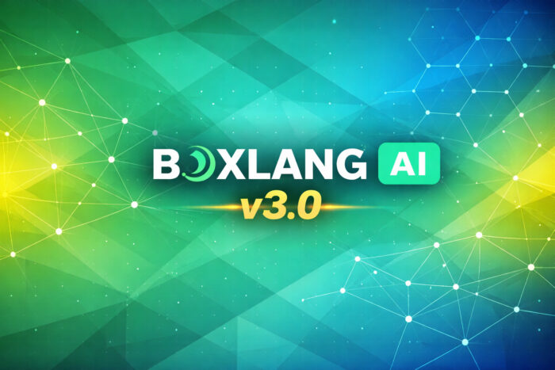

AI agents are transforming how we build software. Unlike traditional chatbots that just answer questions, agents can reason about what tools they need, decide when to use them, chain multiple actions together, and remember what happened earlier in a conversation.

In this tutorial, I'll show you how to build a real-world AI agent using [BoxLang AI](https://ai.boxlang.io/ "BoxLang AI") --- the official AI framework for the BoxLang JVM language. We'll build **SupportBot**, an e-commerce customer support agent that can look up orders, check inventory, issue refunds, and answer questions grounded in your knowledge base.

By the end you'll understand how AI agents work under the hood, and you'll have a fully working agent you can adapt for your own domain.

## What we'll Cover

* Prerequisites
* What Are AI Agents?
* What Is BoxLang AI?
* Core Concept 1: Tools
* Core Concept 2: Memory
* Core Concept 3: The Agent
* How to Put It All Together
* Streaming Responses
* How the Agent Thinks
* Going Further
* Conclusion

## Prerequisites

Before diving in, you should be comfortable with:

**BoxLang basics** — You should know how to write BoxLang scripts, work with structs and arrays, and understand closures. If you're new, start with the [Quick Start Guide](https://boxlang.ortusbooks.com/getting-started/overview "Quick Start Guide").

**Basic LLM familiarity** — Knowing what a large language model is and having used one (via `aiChat()` or similar) will help you follow along.

### Step 1 — Install BoxLang

Download and install BoxLang from [boxlang.io](https://boxlang.io/ "boxlang.io"), or use BVM (BoxLang Version Manager) to manage multiple versions:

```java
# Install BVM
/bin/bash -c "$(curl -fsSL https://downloads.ortussolutions.com/ortussolutions/bvm/install.sh)"

# Install the latest BoxLang
bvm install latest
bvm use latest

# Verify
boxlang --version
```

### Step 2 — Install the `bx-ai` Module

Install `bx-ai` locally into your project using the built-in module installer:

```java
# Creates a boxlang_modules/ folder in your project
install-bx-module bx-ai --local
```

Your project structure will look like this:

```html
my-project/
├── boxlang_modules/
│   └── bxai/               ← installed here
├── config/
│   └── boxlang.json        ← BoxLang configuration
├── .env                    ← your API keys (never commit this)
├── .env.example            ← template to share with your team
├── .gitignore
└── agent.bxs               ← your BoxLang scripts
```

### Step 3 — Set Up Your `.env` File

Copy `.env.example` to `.env` and fill in at least one provider API key. Never commit `.env` to source control.

`.env.example` --- commit this template so your team knows what keys are needed:

```java
# BoxLang Custom Configuration — points BoxLang at your config file
BOXLANG_CONFIG=./config/boxlang.json

# AI Provider API Keys — fill in at least one
OPENAI_API_KEY=your-api-key
CLAUDE_API_KEY=your-api-key
GEMINI_API_KEY=your-api-key
GROK_API_KEY=your-api-key
GROQ_API_KEY=your-api-key
PERPLEXITY_API_KEY=your-api-key
OPENROUTER_API_KEY=your-api-key
MISTRAL_API_KEY=your-api-key
HUGGINGFACE_API_KEY=your-api-key
VOYAGE_API_KEY=your-api-key
COHERE_API_KEY=your-api-key
# AWS Bedrock
AWS_ACCESS_KEY_ID=your-key
AWS_SECRET_ACCESS_KEY=your-secret
AWS_REGION=us-east-1
```

`.env` --- your actual keys, never committed:

```java
BOXLANG_CONFIG=./config/boxlang.json
OPENAI_API_KEY=sk-proj-...
```

Add `.env` to your `.gitignore`:

```html
.env
boxlang_modules/
```

### Step 4 --- `Configure config/boxlang.json`

BoxLang reads its configuration from the file pointed to by `BOXLANG_CONFIG`. The `${Setting: VAR_NAME not found}` syntax reads directly from your `.env` file — your keys never live in the config file itself.

`config/boxlang.json`:

```java
{
    "modules": {
        "bxai": {
            "settings": {
                "provider": "openai",
                "apiKey": "${Setting: OPENAI_API_KEY not found}",
                "defaultParams": {
                    "model": "gpt-4o",
                    "temperature": 0.2
                }
            }
        }
    }
}
```

### Step 5 — Run Your First Script

Create `agent.bxs` and run it:

```java
// agent.bxs
answer = aiChat( "What is BoxLang AI in one sentence?" )
println( answer )
```

```java
boxlang agent.bxs
```

That's it — no build step, no compile, no server. BoxLang reads `.env` automatically, loads the `bxai` module from `boxlang_modules/`, and runs.

#### Switching Providers

To switch from OpenAI to Claude, change two lines in `config/boxlang.json` and add the key to `.env`:

```java
{
    "modules": {
        "bxai": {
            "settings": {
                "provider": "claude",
                "apiKey": "${Setting: CLAUDE_API_KEY not found}",
                "defaultParams": {
                    "model": "claude-sonnet-4-5-20251001"
                }
            }
        }
    }
}
```

Your `agent.bxs` code doesn't change at all. This is the zero-vendor-lock-in promise in practice.

"💡 `bx-ai` ***supports 17 providers — OpenAI, Claude, Gemini, Ollama, Groq, and more. You can also run fully local AI with Ollama — no API key required, zero cost, complete privacy. See the [provider docs](https://ai.ortusbooks.com/ "provider docs") for per-provider configuration*** **.**"

## What Are AI Agents?

Think of an AI agent as a chatbot that can act, not just respond. A traditional chatbot answers questions from what it knows. An agent can reach out and do things — query databases, call APIs, read files, send emails — and chain those actions together to solve multi-step problems.

```html
┌─────────────────────────────────────────────────────────────┐
│                                                             │
│   TRADITIONAL CHATBOT           AI AGENT                    │
│   ──────────────────            ────────                    │
│                                                             │
│   User ──► LLM ──► Answer       User ──► Agent              │
│                                           │                 │
│   One shot. No tools.                     ├──► Tool A       │
│   No memory.                              ├──► Tool B       │
│                                           ├──► Memory       │
│                                           └──► Answer       │
│                                                             │
│                                 Reasons. Acts. Remembers.   │
└─────────────────────────────────────────────────────────────┘
```

Here's a conversation with the SupportBot we'll build:

```html
User:  "Where is order #ORD-78291? It was supposed to arrive yesterday."

Agent: [Thinks: I need to look up that order]
Agent: [Calls get_order( orderId: "ORD-78291" )]
Agent: [Gets back: { status: "In Transit", carrier: "FedEx",
                     tracking: "794644792798",
                     estimatedDelivery: "2026-04-04" }]

Agent: "Your order #ORD-78291 is in transit with FedEx
        (tracking: 794644792798). It was delayed by one day
        and is now estimated to arrive tomorrow, April 4th."
```

The agent broke the problem down, picked the right tool, and synthesized the answer. This matters when:

* Queries don't fit into predefined categories
* Answering requires combining data from multiple sources
* Users need to follow up on previous answers

## What Is BoxLang AI?

BoxLang AI (`bx-ai`) is the official AI framework for BoxLang — a modern, dynamic JVM language. It provides a unified, fluent API for building AI agents, multi-model workflows, RAG pipelines, and AI-powered applications.

```html
┌────────────────────────────────────────────────────────────────┐
│                     BoxLang AI Stack                           │
├────────────────────────────────────────────────────────────────┤
│                                                                │
│   Your Application Code                                        │
│   ─────────────────────────────────────────────────────────    │
│   aiAgent()  aiChat()  aiEmbed()  aiMemory()  aiTool()         │
│                                                                │
│   ─────────────────────────────────────────────────────────    │
│   Skills │ Middleware │ Tool Registry │ Memory │ Pipelines     │
│                                                                │
│   ─────────────────────────────────────────────────────────    │
│   OpenAI │ Claude │ Gemini │ Ollama │ Groq │ + 12 more         │
│                                                                │
└────────────────────────────────────────────────────────────────┘
```

Key properties that make it great for building agents:

**- One API, 17 providers** — switch from OpenAI to Claude by changing a config value, not code  
**- `aiAgent()` BIF** — a fully featured agent with tools, memory, skills, and middleware  
**- Fluent tool definition** — turn any closure into an AI-callable tool with `aiTool()`  
**- Multi-tenant memory** — one agent instance safely handles thousands of concurrent users  
**- JVM-native** — runs everywhere Java runs, with full Java interop

## Core Concept 1: Tools

Tools are functions your AI agent can call. The framework passes the tool's name, description, and parameter schema to the LLM, which decides when and how to call them. When the LLM decides to use a tool, BoxLang AI executes it and feeds the result back.

```html
┌──────────────────────────────────────────────────────────────┐
│                    How Tools Work                            │
│                                                              │
│  ┌─────────┐    "I need order data"    ┌──────────────────┐  │
│  │   LLM   │ ─────────────────────── ► │  get_order()     │  │
│  │         │                           │  • name          │  │
│  │         │ ◄───────────────────────  │  • description   │  │
│  └─────────┘    { status, tracking }   │  • parameters    │  │
│                                        └──────────────────┘  │
│                                                              │
│  The LLM reads the description to decide WHEN to call.       │
│  BoxLang AI handles the execution and result passing.        │
└──────────────────────────────────────────────────────────────┘
```

#### Defining a Tool with `aiTool()`

The simplest way to create a tool is with the `aiTool()` BIF and a closure:

```java
getWeatherTool = aiTool(
    "get_weather",
    "Get the current weather for a city. Use when the user asks about weather conditions.",
    ( required city ) => {
        // In a real app you'd call a weather API here
        return { temp: 72, condition: "sunny", city: arguments.city }
    }
)
```

The three arguments are: name, description, and callable. The description is what the LLM reads to decide whether this is the right tool — write it like you're telling a colleague when to use it.

#### A Real Tool: `get_order`

Here's the first tool for our SupportBot. It looks up an order by ID:

```java
// OrderTools.bx
class {

    property name="orderService";

    function init( required any orderService ) {
        variables.orderService = arguments.orderService
        return this
    }

    @AITool( "Retrieve a single order by order ID. Use first when a customer mentions a specific order number. Always call this before attempting a refund or cancellation." )
    public struct function get_order( required string orderId ) {
        var order = variables.orderService.findById( arguments.orderId )

        if ( isNull( order ) ) {
            return {
                found   : false,
                orderId : arguments.orderId,
                message : "Order #arguments.orderId# was not found. Please verify the order ID."
            }
        }

        return {
            found            : true,
            orderId          : order.getId(),
            status           : order.getStatus(),
            carrier          : order.getCarrier(),
            trackingNumber   : order.getTrackingNumber(),
            estimatedDelivery: order.getEstimatedDelivery().dateFormat( "long" ),
            items            : order.getItems().map( item => {
                return { name: item.getName(), qty: item.getQty(), price: item.getPrice() }
            } ),
            total            : order.getTotal(),
            summary          : "Order ##arguments.orderId# — #order.getStatus()# — Est. delivery: #order.getEstimatedDelivery().dateFormat( 'long' )#"
        }
    }

}
```

A few things to notice:

**The `@AITool` annotation** tells the `AIToolRegistry` scanner that this method is an AI-callable tool. The annotation value becomes the tool's description. When you call `aiToolRegistry().scan( new OrderTools( orderService ), "support" )`, it registers `get_order@support` automatically.

**The return value includes a `summary` field.** Rather than making the LLM parse a raw struct, you pre-compute a one-sentence summary it can read directly. Return both the data (for detailed reasoning) and the summary (for quick reading).

**The not-found case returns a helpful struct instead of throwing.** The LLM sees `found: false` and the `message` and can relay that to the user clearly — far better than an unhandled exception.

#### The Full `OrderTools` Class

```java
class {

    property name="orderService";

    function init( required any orderService ) {
        variables.orderService = arguments.orderService
        return this
    }

    @AITool( "Retrieve a single order by order ID. Use first when a customer mentions a specific order number." )
    public struct function get_order( required string orderId ) {
        var order = variables.orderService.findById( arguments.orderId )
        if ( isNull( order ) ) {
            return { found: false, message: "Order #arguments.orderId# not found." }
        }
        return {
            found            : true,
            orderId          : order.getId(),
            status           : order.getStatus(),
            carrier          : order.getCarrier(),
            trackingNumber   : order.getTrackingNumber(),
            estimatedDelivery: order.getEstimatedDelivery().dateFormat( "long" ),
            total            : order.getTotal(),
            summary          : "Order ##arguments.orderId# — #order.getStatus()#"
        }
    }

    @AITool( "Search a customer's order history. Use when the customer asks about past orders, spending history, or recent purchases." )
    public struct function search_orders(
        required string customerEmail,
        string  status = "",
        numeric limit  = 10
    ) {
        var orders = variables.orderService.findByEmail(
            email  : arguments.customerEmail,
            status : arguments.status,
            limit  : arguments.limit
        )
        return {
            count  : orders.len(),
            orders : orders.map( o => { id: o.getId(), status: o.getStatus(), total: o.getTotal(), date: o.getCreatedAt().dateFormat( "short" ) } ),
            summary: "Found #orders.len()# orders for #arguments.customerEmail#"
        }
    }

    @AITool( "Issue a refund for a specific order. IMPORTANT: Only call this after confirming the order exists and the customer has explicitly requested a refund." )
    public struct function issue_refund(
        required string orderId,
        required string reason
    ) {
        var result = variables.orderService.refund(
            orderId: arguments.orderId,
            reason : arguments.reason
        )
        return {
            success       : result.isSuccess(),
            refundId      : result.getRefundId(),
            amount        : result.getAmount(),
            processingDays: 5,
            summary       : result.isSuccess()
                ? "Refund of $#result.getAmount()# issued for order ##arguments.orderId#. Allow 5 business days."
                : "Refund failed: #result.getError()#"
        }
    }

}
```

#### Tool Design Principles

```html
┌─────────────────────────────────────────────────────────────────┐
│                  The 4 Tool Design Rules                        │
│                                                                 │
│  1. DESCRIPTION ── Tell the LLM exactly when (and when NOT)     │
│                    to call this tool. Be specific.              │
│                                                                 │
│  2. SUMMARY     ── Always return a pre-computed one-liner       │
│                    alongside raw data. Saves tokens.            │
│                                                                 │
│  3. NO THROWS   ── Return { success: false, message: "..." }    │
│                    instead of throwing. LLM can relay errors.   │
│                                                                 │
│  4. CAP RESULTS ── Always use a limit param. Never return       │
│                    unbounded arrays to the LLM.                 │
└─────────────────────────────────────────────────────────────────┘
```

**Write the description like you're training a new colleague:**

```java
// ❌ Vague — LLM won't know when to call this
@AITool( "Gets order information" )

// ✅ Clear — tells the LLM exactly when and what
@AITool( "Retrieve a single order by order ID. Use first when a customer mentions
          a specific order number. Do not call without an explicit order ID." )
```

## Core Concept 2: Memory

Memory is what separates a stateful agent from a stateless API call. Without memory, every message is processed in isolation. With memory, the agent carries the full conversation thread.

```html
┌────────────────────────────────────────────────────────────────┐
│               Without Memory  vs  With Memory                  │
│                                                                │
│  WITHOUT                       WITH                            │
│  ──────────────────            ────────────────────            │
│                                                                │
│  Turn 1:                       Turn 1:                         │
│  User: "My order is late"      User: "My order is late"        │
│  Agent: "Which order?"         Agent: "Which order?"           │
│                                                                │
│  Turn 2:                       Turn 2:                         │
│  User: "ORD-78291"             User: "ORD-78291"               │
│  Agent: "Which order?" ❌       Agent: [looks up ORD-78291] ✅ │
│                                                                │
│  Each call is isolated.        Full context is preserved.      │
└────────────────────────────────────────────────────────────────┘
```

BoxLang AI ships 20+ memory types. Here are the three you'll use most.

#### Window Memory — Short-Term Conversation History

Window memory keeps the last N messages. It's the minimum you need for a coherent conversation:

```java
memory = aiMemory( "window", config: { maxMessages: 20 } )
```

What the memory stores as a conversation builds:

```html
After Turn 1:
┌─────────────────────────────────────────────────────┐
│  user      │ "Where is order #ORD-78291?"           │
│  assistant │ "Your order is in transit..."          │
└─────────────────────────────────────────────────────┘

After Turn 2:
┌─────────────────────────────────────────────────────┐
│  user      │ "Where is order #ORD-78291?"           │
│  assistant │ "Your order is in transit..."          │
│  user      │ "When exactly will it arrive?"         │
│  assistant │ "It's estimated to arrive April 4th."  │
└─────────────────────────────────────────────────────┘
```

Without memory, "When exactly will it arrive?" has no context — "it" refers to nothing. With memory, the agent knows what "it" means.

#### Cache Memory — Multi-Tenant Production

For web applications serving multiple users, you need one agent instance that's safe across concurrent requests:

```java
memory = aiMemory( "cache" )
```

Every memory operation accepts `userId` and `conversationId` to route each read/write to the right isolated conversation:

```html
┌──────────────────────────────────────────────────────────────┐
│              One Memory Instance, Many Users                 │
│                                                              │
│  ┌──────────┐                                                │
│  │  Alice   │──► add( msg, userId:"alice", convId:"t-101" )  │
│  └──────────┘                    │                           │
│                                  ▼                           │
│                         ┌────────────────┐                   │
│                         │  Cache Memory  │                   │
│                         │  ──────────── │                    │
│  ┌──────────┐           │  alice/t-101  │                    │
│  │   Bob    │──────────►│  bob/t-102    │                    │
│  └──────────┘           │  carol/t-103  │                    │
│                         └────────────────┘                   │
│                                  │                           │
│  getAll( userId:"alice" ) ───────┘  Returns ONLY Alice's     │
│                                     messages. Bob isolated.  │
└──────────────────────────────────────────────────────────────┘
```

When you pass `userId` and `conversationId` through `agent.run()` options, they flow automatically to all memory operations — no explicit wiring needed:

```java
// Same agent instance, fully isolated per user
agent.run( "My order is late.", {}, { userId: "alice@example.com", conversationId: "ticket-101" } )
agent.run( "I need a refund.",  {}, { userId: "bob@example.com",   conversationId: "ticket-102" } )
```

No per-user agent factories. No thread-local hacks. One instance handles thousands of concurrent users safely.

#### Summary Memory — Long Conversations

For long support sessions, `summary` memory auto-compresses old messages to preserve context without token bloat:

```java
memory = aiMemory( "summary", config: {
    maxMessages      : 40,
    summaryThreshold : 20,
    summaryModel     : "gpt-4o-mini"   // use a cheap model for summarization
} )
```

```html
              How Summary Memory Works

Messages 1-20 accumulate normally...

At message 21:
┌──────────────────────────────────────────────────┐
│  Messages 1–20  ──► LLM summarizes ──►           │
│  "Customer reported damaged item on order        │
│   ORD-78291. Refund of $89.99 discussed."        │
└──────────────────────────────────────────────────┘
       │
       ▼
┌──────────────────────────────────────────────────┐
│  [SUMMARY]  +  Messages 21–40                    │
│  Full context preserved, fraction of the tokens  │
└──────────────────────────────────────────────────┘
```

## Core Concept 3: The Agent

With tools and memory defined, the agent is the piece that ties them together. In BoxLang AI, `aiAgent()` is a single BIF call that gives you a fully autonomous agent.

```html
┌──────────────────────────────────────────────────────────────┐
│                    The Agent is the Glue                     │
│                                                              │
│   ┌──────────┐   ┌──────────┐   ┌──────────┐                 │
│   │  Tools   │   │  Memory  │   │  Skills  │                 │
│   └────┬─────┘   └────┬─────┘   └────┬─────┘                 │
│        │              │              │                       │
│        └──────────────┼──────────────┘                       │
│                       │                                      │
│                  ┌────▼─────┐                                │
│                  │  Agent   │◄── Instructions                │
│                  │          │◄── Middleware                  │
│                  └────┬─────┘                                │
│                       │                                      │
│                  ┌────▼─────┐                                │
│                  │   LLM    │  (any of 17 providers)         │
│                  └──────────┘                                │
└──────────────────────────────────────────────────────────────┘
```

#### The Simplest Possible Agent

```java
// Window memory by default with 20 messages
agent = aiAgent(
    name   : "SupportBot",
    tools  : [ getOrderTool, searchOrdersTool, issueRefundTool ]
)

response = agent.run( "Where is order #ORD-78291?" )
println( response )
```

That's it. The agent handles the full reasoning loop: deciding when to call tools, passing results back to the LLM, and producing a final response.

#### Giving the Agent an Identity

A well-defined `description` and `instructions` dramatically improve agent behavior:

```java
agent = aiAgent(
    name         : "SupportBot",
    description  : "Customer support specialist for Acme Store. Expert in orders, shipping, returns, and product questions.",
    instructions : "
        You are a friendly and efficient customer support agent.
        Always look up order details before discussing specific orders.
        Confirm refund requests explicitly before calling issue_refund.
        Lead with the direct answer, then add supporting detail.
        If you cannot resolve an issue, offer to escalate to a human agent.
    ",
    tools        : [ getOrderTool, searchOrdersTool, issueRefundTool ],
    memory       : aiMemory( "cache" )
)
```

#### The Agent Run Lifecycle

```html
┌──────────────────────────────────────────────────────────────┐
│                  Agent Run Lifecycle                         │
│                                                              │
│  agent.run( "My order is late" )                             │
│        │                                                     │
│        ▼                                                     │
│  ┌─────────────────────────────────────────────────────┐     │
│  │  1. Resolve userId / conversationId for this call   │     │
│  │  2. Build system message (description + instructions│     │
│  │     + skills + tool list)                           │     │
│  │  3. Load conversation history from memory           │     │
│  │  4. Assemble: [system, ...history, user message]    │     │
│  └────────────────────┬────────────────────────────────┘     │
│                       │                                      │
│                       ▼                                      │
│              ┌────────────────┐                              │
│              │   LLM Call     │                              │
│              └───────┬────────┘                              │
│                      │                                       │
│              Tool calls?                                     │
│              ┌───────┴────────┐                              │
│             YES               NO                             │
│              │                │                              │
│              ▼                ▼                              │
│       ┌────────────┐   ┌────────────────┐                    │
│       │ Execute    │   │ Store in memory│                    │
│       │ each tool  │   │ Return answer  │                    │
│       └─────┬──────┘   └────────────────┘                    │
│             │                                                │
│             └──► back to LLM Call (loop)                     │
│                                                              │
└──────────────────────────────────────────────────────────────┘
```

This loop is what makes the agent autonomous — it keeps calling tools until it has everything it needs to produce a final answer.

## How to Put It All Together

Here's the complete SupportBot:

```java
// SupportBot.bx
import bxModules.bxai.models.middleware.core.LoggingMiddleware;
import bxModules.bxai.models.middleware.core.GuardrailMiddleware;
import bxModules.bxai.models.middleware.core.MaxToolCallsMiddleware;

class {

    property name="agent";

    /**
     * Wire up the agent with tools, memory, and middleware.
     *
     * @orderService   Your order data service
     * @kbVectorMemory Vector memory backed by your knowledge base (optional)
     */
    function init( required any orderService, any kbVectorMemory ) {
        // 1. Register tools by scanning the OrderTools class
        aiToolRegistry().scan( new OrderTools( arguments.orderService ), "support" )

        // 2. Build the agent
        variables.agent = aiAgent(
            name        : "SupportBot",
            description : "Customer support specialist for Acme Store.",
            instructions: "
                You are a friendly and efficient customer support agent.
                Always call get_order before discussing a specific order.
                Confirm refunds explicitly before calling issue_refund.
                Lead with the direct answer, then add supporting detail.
                If you cannot resolve an issue, offer to escalate.
            ",
            tools       : [ "get_order@support", "search_orders@support", "issue_refund@support", "now@bxai" ],
            memory      : aiMemory( "cache" ),
            middleware  : [
                new LoggingMiddleware( logToConsole: true, prefix: "[SupportBot]" ),
                new GuardrailMiddleware( blockedTools: [ "delete_order" ] ),
                new MaxToolCallsMiddleware( maxCalls: 8 )
            ]
        )

        // 3. Optionally seed with a knowledge base for RAG
        if ( !isNull( arguments.kbVectorMemory ) ) {
            variables.agent.addMemory( arguments.kbVectorMemory )
        }

        return this
    }

    /**
     * Handle a customer message — returns the full response string.
     */
    string function handle(
        required string message,
        required string userId,
        required string conversationId
    ) {
        return variables.agent.run(
            arguments.message,
            {},
            {
                userId        : arguments.userId,
                conversationId: arguments.conversationId
            }
        )
    }

}
```

### What the Middleware Does

```html
┌────────────────────────────────────────────────────────────────┐
│                  Middleware Stack                              │
│                                                                │
│  Every agent.run() call passes through:                        │
│                                                                │
│  ┌──────────────────────────────────────────────────────────┐  │
│  │  LoggingMiddleware   — logs every LLM call + tool call   │  │
│  │  GuardrailMiddleware — blocks forbidden tools (delete_*) │  │
│  │  MaxToolCallsMiddleware — stops runaway loops at 8 calls │  │
│  └──────────────────────────────────────────────────────────┘  │
│           │             │                │                     │
│           ▼             ▼                ▼                     │
│       ai.log      reject call       cancel run                 │
│                   with error        gracefully                 │
└────────────────────────────────────────────────────────────────┘
```

`LoggingMiddleware` logs every agent run, LLM call, and tool invocation to BoxLang's `ai` log file. In development you'll see exactly what the agent is doing. In production, disable `logToConsole` and write to the log for observability.

`GuardrailMiddleware` blocks `delete_order` permanently — even if the LLM somehow decides to call it. Defense-in-depth for high-stakes operations.

`MaxToolCallsMiddleware` prevents runaway agents. If the agent gets stuck in a tool-calling loop, it hits the cap and stops with a clear error rather than burning tokens indefinitely.

## Streaming Responses

For web UIs and real-time applications, you want the agent's response to appear token-by-token as it's generated — like typing. This is what makes AI feel alive rather than frozen.

BoxLang AI supports streaming at every level: direct model calls, agent runs, and web responses.

### How Streaming Works

```html
┌──────────────────────────────────────────────────────────────┐
│                   Streaming vs Blocking                      │
│                                                              │
│  BLOCKING (default)                                          │
│  ──────────────────                                          │
│  User sends message                                          │
│  ░░░░░░░░░░░░░░░░░░░░░░░░░░░░░░░░  (waiting 2–8 seconds)     │
│  Full response arrives at once                               │
│                                                              │
│  STREAMING                                                   │
│  ─────────                                                   │
│  User sends message                                          │
│  "Your" ► " order" ► " #ORD" ► "-78291" ► " is" ► ...        │
│  Response appears immediately, token by token                │
└──────────────────────────────────────────────────────────────┘
```

### Simple Streaming with `aiChatStream()`

For basic streaming without an agent:

```java
// Stream a response token by token
aiChatStream(
    messages : "Explain how BoxLang AI handles tool calling",
    callback : chunk => {
        // Each chunk contains a delta with partial content
        var token = chunk.choices?.first()?.delta?.content ?: ""
        if ( token.len() ) {
            writeOutput( token )
            bx:flush;  // push each token to the browser immediately
        }
    },
    params   : { model: "gpt-4o" }
)
```

### Agent Streaming with `agent.stream()`

The `stream()` method on `AiAgent` works exactly like `run()` but delivers the response token by token. Tool calls still execute synchronously under the hood — the streaming applies to the final text response:

```java
// SupportBot.bx — add this alongside the handle() method
void function handleStream(
    required string   message,
    required string   userId,
    required string   conversationId,
    required function onChunk
) {
    variables.agent.stream(
        onChunk : arguments.onChunk,
        input   : arguments.message,
        options : {
            userId        : arguments.userId,
            conversationId: arguments.conversationId
        }
    )
}
```

### Streaming to a Web Browser (BoxLang Web)

Here's how to wire streaming to a real HTTP response — tokens pushed to the browser as they arrive:

```java
// handlers/SupportStreamHandler.bx
class {

    property name="supportBot" inject="SupportBot";

    function stream( event, rc, prc ) {
        var userId         = auth.getCurrentUser().getEmail()
        var conversationId = rc.ticketId

        // Use BoxLang's Native SSE Streamer
        SSE(
            callback          : ( emitter ) => {
                supportBot.handleStream(
                    message        : rc.message,
                    userId         : userId,
                    conversationId : conversationId,
                    onChunk        : chunk => {
                        if ( emitter.isClosed() ) {
                            return
                        }
                        var token = chunk.choices?.first()?.delta?.content ?: ""
                        if ( token.len() ) {
                            emitter.send( token, "token" )
                        }
                    }
                )
                emitter.send( { complete: true }, "done" )
                emitter.close()
            },
            keepAliveInterval : 30000,
            cors              : ""
        )
    }

}
```

### Consuming the Stream on the Frontend

On the client side, use the standard EventSource API or fetch with a readable stream:

```java
// JavaScript — connect to the SSE stream
const eventSource = new EventSource(
    `/support/stream?ticketId=${Setting: ticketId not found}&message=${Setting: encodeURIComponent(message) not found}`
);

const responseEl = document.getElementById( "agent-response" );

eventSource.onmessage = ( event ) => {
    if ( event.data === "[DONE]" ) {
        eventSource.close();
        return;
    }
    // Append each token as it arrives
    responseEl.textContent += event.data;
};

eventSource.onerror = () => eventSource.close();
```

### Streaming with Accumulated Memory

One important detail: even in streaming mode, the full response is stored in memory after the stream completes. The `AiAgent.stream()` method accumulates tokens internally and saves them when done:

```java
// From AiAgent.bx — the wrapped callback pattern
var accumulated = ""
var wrappedCallback = ( chunk ) => {
    var content = chunk.choices?.first()?.delta?.content ?: ""
    accumulated &= content        // accumulate for memory
    userOnChunk( chunk )          // forward to your callback
}

// After streaming completes, store the full response
storeInMemory( userMessage, { role: "assistant", content: accumulated }, userId, conversationId )
```

This means streaming and memory work seamlessly together — the user sees tokens as they arrive, and the next turn has the full conversation history.

### When to Use Streaming

```html
┌──────────────────────────────────────────────────────────────┐
│               Streaming Decision Guide                       │
│                                                              │
│  USE streaming when:                                         │
│  • Building a chat UI where responsiveness matters           │
│  • Responses are long (> 2-3 sentences)                      │
│  • You want a "typing" feel for the user                     │
│  • Delivering to a browser over HTTP                         │
│                                                              │
│  USE blocking (agent.run()) when:                            │
│  • Processing in a background job or batch pipeline          │
│  • The caller needs the complete response before proceeding  │
│  • Building an API that returns JSON                         │
│  • Writing tests (deterministic, easier to assert)           │
└──────────────────────────────────────────────────────────────┘
```

## How the Agent Thinks

Let's trace exactly what happens for a real multi-step request: "*My order #ORD-78291 arrived damaged. I want a refund.*"

```html
┌──────────────────────────────────────────────────────────────┐
│              Full Agent Execution Trace                      │
│                                                              │
│  USER: "My order #ORD-78291 arrived damaged. I want          │
│         a refund."                                           │
│         │                                                    │
│         ▼                                                    │
│  ┌─────────────────────────────────────────────────────┐     │
│  │  LLM CALL 1                                         │     │
│  │  "Customer wants refund. Look up order first."      │     │
│  │  → tool_call: get_order( "ORD-78291" )              │     │
│  └───────────────────┬─────────────────────────────────┘     │
│                      │                                       │
│         ▼            ▼                                       │
│  ┌─────────────────────────────────────────────────────┐     │
│  │  TOOL: get_order                                    │     │
│  │  { found: true, status: "Delivered",                │     │
│  │    total: 89.99, summary: "Order #ORD-78291..." }   │     │
│  └───────────────────┬─────────────────────────────────┘     │
│                      │                                       │
│                      ▼                                       │
│  ┌─────────────────────────────────────────────────────┐     │
│  │  LLM CALL 2                                         │     │
│  │  "Order confirmed. Instructions say confirm         │     │
│  │  before issuing refund."                            │     │
│  │  → text: "Can you confirm the $89.99 refund?"       │     │
│  └───────────────────┬─────────────────────────────────┘     │
│                      │                                       │
│  USER: "Yes, please go ahead."                               │
│                      │                                       │
│                      ▼                                       │
│  ┌─────────────────────────────────────────────────────┐     │
│  │  LLM CALL 3                                         │     │
│  │  "Customer confirmed. Issue the refund."            │     │
│  │  → tool_call: issue_refund( "ORD-78291",            │     │
│  │                             "Item arrived damaged" )│     │
│  └───────────────────┬─────────────────────────────────┘     │
│                      │                                       │
│                      ▼                                       │
│  ┌─────────────────────────────────────────────────────┐     │
│  │  TOOL: issue_refund                                 │     │
│  │  { success: true, refundId: "REF-44821",            │     │
│  │    amount: 89.99, processingDays: 5 }               │     │
│  └───────────────────┬─────────────────────────────────┘     │
│                      │                                       │
│                      ▼                                       │
│  ┌─────────────────────────────────────────────────────┐     │
│  │  LLM CALL 4                                         │     │
│  │  "Refund confirmed. Compose final response."        │     │
│  │  → text: "Your refund of $89.99 has been            │     │
│  │           processed (REF-44821)..."                 │     │
│  └──────────────────────────────────────────────────── ┘     │
│                      │                                       │
│                      ▼                                       │
│  ┌─────────────────────────────────────────────────────┐     │
│  │  STORE in memory (scoped to this user + ticket)     │     │
│  │  RETURN to caller                                   │     │
│  └─────────────────────────────────────────────────────┘     │
└──────────────────────────────────────────────────────────────┘
```

The agent confirms before acting (because the instructions say to), executes the tool only after explicit confirmation, and builds the full response from the tool result. This is the multi-step reasoning that makes agents genuinely useful.

**What the conversation history looks like at the end:**

```html
┌────────────────────────────────────────────────────────────┐
│  Role        │  Content                                    │
├──────────────┼─────────────────────────────────────────────┤
│  system      │  "You are SupportBot..."                    │
│  user        │  "My order arrived damaged..."              │
│  assistant   │  [tool_call: get_order]                     │
│  tool        │  { found:true, status:"Delivered"... }      │
│  assistant   │  "Can you confirm the $89.99 refund?"       │
│  user        │  "Yes, please go ahead."                    │
│  assistant   │  [tool_call: issue_refund]                  │
│  tool        │  { success:true, refundId:"REF-44821"... }  │
│  assistant   │  "Your refund of $89.99 has been issued..." │
└────────────────────────────────────────────────────────────┘
```

## Going Further

The SupportBot above covers the essentials. Here's what to add for production.

### Adding a Knowledge Base (RAG)

Ingest your documentation into vector memory and the agent retrieves relevant content automatically before answering:

```java
// One-time ingestion (run when docs change)
vectorMemory = aiMemory( "chroma", config: {
    collection       : "support_kb",
    embeddingProvider: "openai",
    embeddingModel   : "text-embedding-3-small"
} )

result = aiDocuments(
    source : "/knowledge-base",
    config : { type: "directory", recursive: true, extensions: [ "md", "txt" ] }
).toMemory(
    memory  : vectorMemory,
    options : { chunkSize: 800, overlap: 150 }
)
println( "Loaded #result.documentsIn# docs → #result.chunksOut# chunks" )
```

```html
┌──────────────────────────────────────────────────────────────┐
│                    RAG Pipeline                              │
│                                                              │
│  INGESTION (run once)                                        │
│  ─────────────────────────────────────────────────────────   │
│  /knowledge-base/*.md                                        │
│        │                                                     │
│        ▼                                                     │
│  aiDocuments() ──► chunk ──► embed ──► store in ChromaDB     │
│                                                              │
│  QUERY (every agent.run())                                   │
│  ─────────────────────────────────────────────────────────   │
│  User: "What is your return policy?"                         │
│        │                                                     │
│        ▼                                                     │
│  Vector search: find top-5 semantically similar chunks       │
│        │                                                     │
│        ▼                                                     │
│  Inject chunks into LLM context                              │
│        │                                                     │
│        ▼                                                     │
│  LLM answers from YOUR actual docs, not hallucinations       │
└──────────────────────────────────────────────────────────────┘
```

### Human-in-the-Loop Approvals

For refunds above a threshold, require a supervisor to approve before the refund executes:

```java
import bxModules.bxai.models.middleware.core.HumanInTheLoopMiddleware;

agent = aiAgent(
    name       : "SupportBot",
    middleware : [
        new LoggingMiddleware(),
        new GuardrailMiddleware( blockedTools: [ "delete_order" ] ),
        new MaxToolCallsMiddleware( maxCalls: 8 ),
        new HumanInTheLoopMiddleware(
            mode                  : "web",
            toolsRequiringApproval: [ "issue_refund" ]
        )
    ],
    checkpointer: aiMemory( "cache" )
)
```

```html
┌──────────────────────────────────────────────────────────────┐
│            Human-in-the-Loop Flow                            │
│                                                              │
│  Agent reaches issue_refund tool call                        │
│        │                                                     │
│        ▼                                                     │
│  HumanInTheLoopMiddleware intercepts                         │
│        │                                                     │
│        ▼                                                     │
│  result.isSuspended() == true                                │
│  Agent saves checkpoint to cache memory                      │
│        │                                                     │
│        ▼                                                     │
│  Your code notifies supervisor (Slack, email, dashboard)     │
│        │                                                     │
│        ▼                                                     │
│  Supervisor approves / rejects / edits args                  │
│        │                                                     │
│        ├── approve ──► agent.resume( "approve", threadId )   │
│        ├── reject  ──► agent.resume( "reject",  threadId )   │
│        └── edit    ──► agent.resume( "edit", threadId,       │
│                             { correctedArgs: { amount:100 }} │
└──────────────────────────────────────────────────────────────┘
```

### Multi-Agent Escalation

For complex issues, automatically delegate to a specialist:

```java
billingAgent = aiAgent(
    name        : "BillingSpecialist",
    description : "Expert in billing disputes, chargebacks, and payment issues",
    tools       : [ "get_payment_history@billing", "dispute_charge@billing" ]
)

// SupportBot gets a delegate_to_billing-specialist tool automatically
supportBot = aiAgent(
    name      : "SupportBot",
    subAgents : [ billingAgent ]
)
```

```html
┌──────────────────────────────────────────────────────────────┐
│               Multi-Agent Hierarchy                          │
│                                                              │
│            ┌─────────────────┐                               │
│            │   SupportBot    │  (coordinator)                │
│            │  (root agent)   │                               │
│            └────────┬────────┘                               │
│                     │                                        │
│          ┌──────────┴───────────┐                            │
│          │                      │                            │
│  ┌───────┴───────┐    ┌─────────┴──────────┐                 │
│  │   Billing     │    │     Returns &      │                 │
│  │  Specialist   │    │     Shipping       │                 │
│  └───────────────┘    └────────────────────┘                 │
│                                                              │
│  Each sub-agent appears as a "delegate_to_*" tool.           │
│  The LLM decides when to delegate — no routing code needed.  │
└──────────────────────────────────────────────────────────────┘
```

## Conclusion

Building an AI agent with BoxLang AI comes down to three concepts:

```html
┌──────────────────────────────────────────────────────────────┐
│                  The Three Core Concepts                     │
│                                                              │
│  1. TOOLS    ──  Functions your agent can call               │
│                  @AITool annotation or aiTool() BIF          │
│                  Registered once, referenced by name         │
│                                                              │
│  2. MEMORY   ──  Conversation history that makes it          │
│                  stateful and multi-tenant safe              │
│                  window / cache / summary / vector           │
│                                                              │
│  3. AGENT    ──  The reasoning loop that ties it together    │
│                  aiAgent() with instructions + middleware    │
│                  Handles the tool-call loop automatically    │
└──────────────────────────────────────────────────────────────┘
```

The framework handles the hard parts: the tool-calling loop, memory isolation, provider differences, lifecycle events, and cross-cutting concerns like logging and rate limiting. You focus on your domain logic — the tools that do the actual work.

The full SupportBot example shows how these pieces combine in a real application. The same patterns apply to any domain: financial assistants, developer tools, data analysis agents, document processors — whatever problem you're solving, the architecture is the same.

## Resources

📖 [BoxLang AI Documentation](https://ai.ortusbooks.com/ "BoxLang AI Documentation")  

🐙 [BoxLang AI GitHub](https://github.com/ortus-boxlang/bx-ai "BoxLang AI GitHub")  

🎓 [AI BootCamp](https://github.com/ortus-boxlang/bx-ai-bootcamp "AI BootCamp") --- hands-on course covering all concepts in this guide  

💬 [BoxLang Community Slack](https://boxteam.ortussolutions.com/ "BoxLang Community Slack")  

📦 [ForgeBox Package](https://forgebox.io/view/bx-ai "ForgeBox Package")

```java
# Start building
install-bx-module bx-ai
boxlang my-agent.bxs
```
