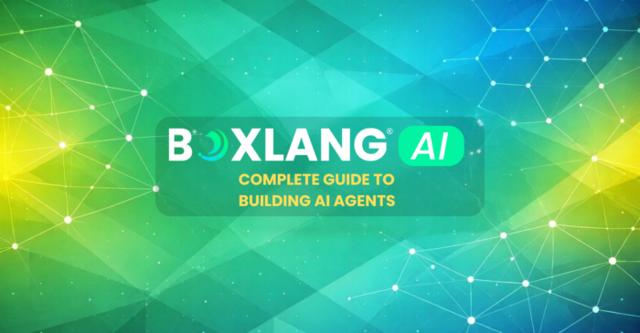

The world of AI development is moving fast, but building real, production-ready AI agents doesn't have to be complex.

This series walks you step by step through how to design, build, and deploy AI agents using BoxLang AI. Whether you're exploring AI for the first time or looking to modernize your current applications, these guides will help you move from concept to implementation with clarity.

## Start Here: A Practical Overview

If you're new to BoxLang AI or want to understand what's possible before diving into the technical details, start here:

<https://foojay.io/today/how-to-develop-ai-agents-using-boxlang-ai-a-practical-guide/>

This guide provides a high-level view of how to build AI agents, integrate multiple models, and design real-world workflows using BoxLang.

## The Full Series

Follow the series in order to go from fundamentals to advanced implementations:

* [Part 1: The Skills Revolution](https://foojay.io/today/boxlang-ai-deep-dive-part-1-of-7-the-skills-revolution-%f0%9f%8e%93/ "Part 1")
* [Part 2: Building a Production-Grade AI Tool Ecosystem](https://foojay.io/today/boxlang-ai-deep-dive-part-2-of-7-building-a-production-grade-ai-tool-ecosystem/ "Part 2")
* [Part 3: Multi-Agent Orchestration — Building AI Teams That Work](https://foojay.io/today/boxlang-ai-deep-dive-part-3-of-7-multi-agent-orchestration-building-ai-teams-that-work/ "Part 3")
* [Part 4: Middleware — The Missing Layer in Every AI Framework](https://foojay.io/today/boxlang-ai-deep-dive-part-4-of-7-middleware-the-missing-layer-in-every-ai-framework-%f0%9f%a7%b5/ "Part 4")
* [Part 5: One API, 17 Providers — The Provider Architecture Deep Dive](https://foojay.io/today/boxlang-ai-deep-dive-part-5-of-7-one-api-17-providers-the-provider-architecture-deep-dive/ "Part 5")
* [Part 6: Memory Systems \& RAG — Building AI That Remembers](https://foojay.io/today/boxlang-ai-deep-dive-part-6-of-7-memory-systems-rag-building-ai-that-remembers/ "Part 6")
* [Part 7: MCP — The Protocol That Connects Everything](https://foojay.io/today/boxlang-ai-deep-dive-part-7-of-7-mcp-the-protocol-that-connects-everything/ "Part 7")

## What You'll Learn

Across this series, you'll learn how to:

* Build AI agents with memory, tools, and reasoning capabilities
* Connect to multiple AI providers with a single unified API
* Implement Retrieval-Augmented Generation (RAG) pipelines
* Work with vector databases and document ingestion
* Design scalable, production-ready AI workflows
* Deploy AI agents in modern cloud environments

## Key Resources

To help you go deeper and start building right away:

* BoxLang AI - Playgroundhttps://ai.boxlang.io/
* Official BoxLang AI - Documentationhttps://ai.ortusbooks.com/
* BoxLang Website - <https://boxlang.io/>
* GitHub Examples and Integrations - <https://github.com/ortus-boxlang>

## Why BoxLang AI

**BoxLang AI** is designed to remove the complexity of working with multiple AI providers and tools. With a single API, you can build powerful AI-driven applications without vendor lock-in, while maintaining full control over your architecture.

If you're working with legacy systems, BoxLang also allows you to introduce AI capabilities incrementally without needing a full rewrite.

## Ready to Start Building?

Explore the series, try the examples, and start building your own AI agents today.

[If you have questions or want to see how this can apply to your existing systems, feel free to reach out to the Ortus team.](https://www.ortussolutions.com/contacts/general-information "If you have questions or want to see how this can apply to your existing systems, feel free to reach out to the Ortus team.")

[Next →](https://foojay.io/today/boxlang-ai-deep-dive-part-1-of-7-the-skills-revolution-%f0%9f%8e%93/ "Next →")
