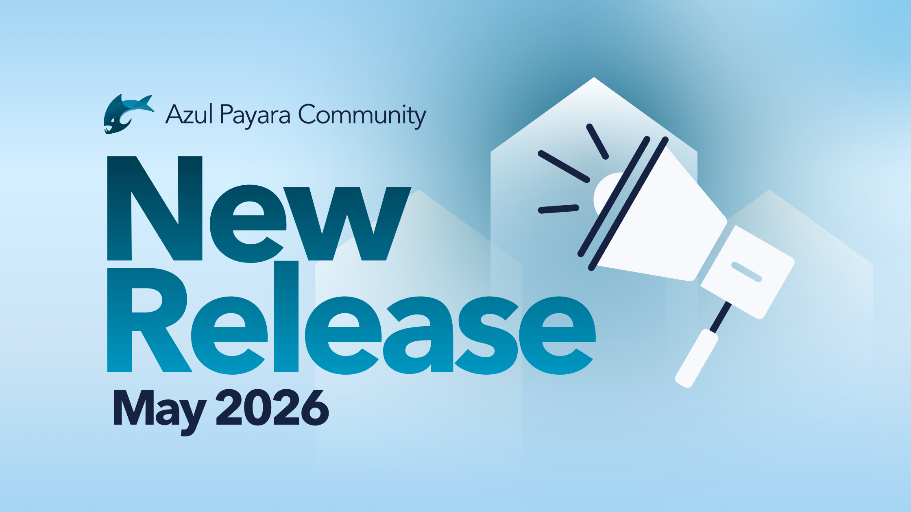

Something has been in the works since [Azul completed its acquisition of Payara in December 2025](https://www.azul.com/company/payara-acquisition/ "Azul completed its acquisition of Payara in December 2025"), and today we're ready to share it: the community edition of Payara has a new name and logo -- but not so very different from the one you already know!

Payara Platform Community is now **Azul Payara Community** , made up of two distributions you already know and love - **Azul Payara Server Community** and **Azul Payara Micro Community** - plus the tooling and connectors that go with them.

It's a small change in letters but an important one. The new name reflects where we are: fully part of the Azul family, with all the backing that brings, while staying true to what this project has always been - an open-source runtime built by and for the Java and Jakarta EE community.

The iconic Payara fish has also had a bit of a refresh. The Azul Payara commercial logos were updated back in December, and now the community edition gets the same treatment - same fish character the Payara community knows well, just updated to match its new home at Azul.

## What the acquisition means for the Community

We believe the open-source community is the heart of the Payara ecosystem. The contributors, committers and developers using Azul Payara Community for testing, education, side projects or apps that haven't gone commercial yet all matter to us. Growing that community, listening to it and investing in it is central to how we think about Azul Payara's future.

The rebrand is part of bringing Azul Payara Community properly into the Azul portfolio alongside Azul Zulu (OpenJDK), Azul Prime, Intelligence Cloud and Azul Payara's commercial offering. It's the same open-source project with a new home in the broader Azul ecosystem.

## What's changing (and when)

Over the coming weeks and months, you can expect to see updates to Payara documentation, resource names, technical content and the blog. Downloads are still available at [payara.fish](https://payara.fish/downloads/payara-platform-community-edition/ "payara.fish") for now, but will be moving to Azul website before long - we'll announce that when the time comes.

One thing we're particularly excited about: we'll be increasing our presence here on Foojay sharing everything that is relevant for the Friends of OpenJDK community - educational content, tutorials, community updates and more.

For social media, we're consolidating onto Foojay and Azul's official channels. Make sure you're following us there, so you don't miss a thing.

## Getting out and meeting you

Together with the Azul DevRel, Product and Engineering Teams, we're planning to visit a lot of Java User Groups over the coming months, and we're really looking forward to meeting community members face to face. If your JUG would like a visit or a talk on Azul Payara Community, OpenJDK or Jakarta EE - let us know.

We'll also be at a number of Java conferences this year. More details to come, but if you spot us - come and say hello.

## What's been shipping: April and May 2026 Azul Payara Community Releases

We didn't want to announce the rebrand without also catching you up on recent releases ([download here!](https://payara.fish/downloads/payara-platform-community-edition/ "download here!")), so here's a combined look at what landed for Azul Payara Community in April and May.

### May: Azul Payara Community 7.2026.5

**Security fixes (critical - please upgrade)**:

* Remote arbitrary file read vulnerability via unsafe parsing of OpenMQ configuration
* Restricted access to vulnerable EL expressions

**Bug fixes:**

* Admin Console freezing after upgrading from Payara 6 to 7

**Improvements:**

* Updated JACC Provider Compatibility Startup Service

* Audit Modules removed

* warlibs support added to Admin Console redeployment

* Reduced INFO logging for the Jakarta Data implementation

* New deployment descriptors created with deprecated properties removed

* Fix for Jakarta Data @Repository methods not throwing UnsupportedOperationException when no implementation logic can be injected at deploy time

**Component upgrades:** Docker JDK images refreshed to 21.0.11 and 25.0.3, with dependency updates for Jakarta Faces, MicroProfile Config, Project Reactor, and other libraries.

The critical security fix is also backported across Azul Payara 6.38.0, 5.87.0, and 4.1.2.191.55 --- we recommend all users upgrade regardless of which branch they're on.

### April: Azul Payara Community 7.2026.4

April's community release was a significant cleanup milestone, removing three long-standing deprecated items: the start-domain --upgrade service (replaced by the Payara Upgrade Tool), all methods previously annotated @Deprecated, and all deprecated configuration properties.

**Bug fixes:**

* Asadmin Recorder generating invalid commands when recording MicroProfile property changes

* Rendering issue in the Admin Console connection pool Advanced tab

* Broken news link in the Admin Console

* Race condition in application-scoped QueryData under concurrent access

* OpenMQ unclosed stream warnings

**Community contributions from Lenny Primak:**

* Fix for CDI annotation type resolution failing when annotations were defined in WAR library dependencies
* Resolution of an SLF4J class loader leak that could accumulate memory in long-running deployments

**Component upgrades:** EclipseLink 5.0.0-B08 → 5.0.0-B13, OpenMQ updated to 6.8.0, plus bumps to Jackson BOM, Reactor Core, Kotlin Stdlib, and several others.

## A lot more to come

The rebrand is just the start. As part of Azul, Payara Community gains access to more resources, more engineering investment and a broader platform to grow.

We have exciting plans - for the runtime, the tooling and connectors available to community users, content, and the events we put on - and we'll be sharing them with you as they take shape.

A huge thank you to everyone who has been part of the Payara community over the years - the contributors, the committers, the developers who have filed issues, submitted fixes, written content and shown up at conferences and JUGs. This project is what it is because of you, and that doesn't change with a new name. We're genuinely excited about what comes next, and we hope you are too!

For now:[download the latest release from payara.fish,](https://payara.fish/downloads/payara-platform-community-edition/ " download the latest release from payara.fish,") join us on Foojay, and follow [Azul's](https://www.azul.com/ "Azul's") official social channels for updates.
