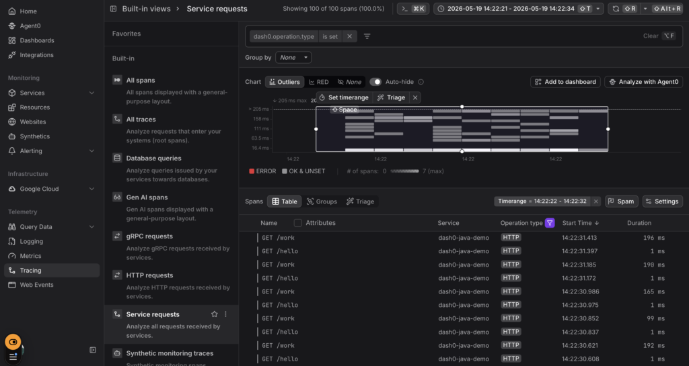

Here's a super awesome prompt (e.g., for Claude Code) that you can use with <https://github.com/dash0hq/agent-skills>, the free collection of skills for AI coding agents to make applications observable with OpenTelemetry, such as with [Dash0](https://www.dash0.com/).

And the end result is this, a view into the traces of your application (without anything at all at the start of the process).


## **The Super Awesome Prompt**

Take a careful look below: before doing this prompt, not only do we not have an application that is instrumented with OpenTelemetry yet. Not only do we not have the agent we need to do the instrumentation yet.

The application itself doesn't even exist yet.

So, here's the prompt that gets you from really zero to OpenTelemetry:

**Create a minimal Spring Boot app from scratch in this directory with two endpoints: GET /hello returning a greeting, and GET /work that sleeps 50–200ms and returns a JSON payload. Use Maven and Java 21.**   
**Then instrument it with OpenTelemetry to send traces, metrics, and logs to Dash0 using the otel-instrumentation skill.**   

**Configuration:**   
**Endpoint: \<placeholder for your endpoint\> (gRPC, so set OTEL_EXPORTER_OTLP_PROTOCOL=grpc)
Auth header: Authorization=Bearer \<placeholder for your token\>
Dataset: default (via Dash0-Dataset header)
Service name: dash0-java-demo
Service version and namespace as appropriate resource attributes**

**Use the OpenTelemetry Java agent (-javaagent:opentelemetry-javaagent.jar) — download it into the project. Don't hardcode the token in source; put env vars in a run.sh script that's gitignored, and document everything in a README. Follow OpenTelemetry semantic conventions for any custom spans or attributes you add.**   
**When done, show me the exact commands to run the app and generate some traffic.**

(All you need to run this prompt is to get your endpoint and token from your Dash0 Settings dialog, and put them in the placeholders above.)

## Why This Prompt Works

A few things in there are deliberate:

* **"using the otel-instrumentation skill"** — naming it explicitly nudges the agent to load it. Skills are supposed to auto-trigger on description match, but being explicit removes ambiguity, especially in tools where skill triggering is less aggressive than in Claude Code.
* **Concrete config values** — agents do much better with copy-pasteable specifics than "set up Dash0." You'd otherwise spend two turns answering "what's your endpoint?"
* **gRPC protocol callout**— port 4317 needs OTEL_EXPORTER_OTLP_PROTOCOL=grpc; without it, the agent might wire up the default HTTP protocol and silently fail. Worth pinning.
* **run.sh + gitignore** — keeps your token out of source control. The agent will do this if asked; less reliably if not.
* **"show me the commands to run"** — forces it to surface the verification path, not just dump files.

### After The Agent Finishes

You should end up with, roughly `pom.xml`, `src/main/java/.../Application.java` plus a controller, `opentelemetry-javaagent.jar`, `run.sh`, `.gitignore`, `README.md`.

Then run it (also fine to do in your AI prompt):

```
./run.sh
# in another terminal, generate traffic:
for i in {1..50}; do curl -s localhost:8080/hello; curl -s localhost:8080/work; done
```

Then in Dash0 go to the **Trace Explorer** — filter by `service.name = dash0-java-demo`, you should see `GET /hello` and `GET /work` spans within 10–30 seconds.


Next, go to **Integrations → Java → Install all dashboards** if you haven't yet, then open **JVM Metrics** for the heap/GC/thread charts.

### Follow Up Prompts You'll Likely Want

Once data is flowing, these are the natural next asks (each triggers a different skill):

* ***"Add a custom span around the work logic in `/work` with a `work.difficulty` attribute that follows semantic conventions."*** → triggers `otel-semantic-conventions` for naming guidance.
* ***"My span names look wrong — they're showing the full URL instead of the route. Fix that."*** → common Spring Boot gotcha, the instrumentation skill covers it.
* ***"Set up an OpenTelemetry Collector in front of the app instead of exporting directly to Dash0."*** → triggers `otel-collector`.

That's pretty cool, get it here: <https://github.com/dash0hq/agent-skills>
