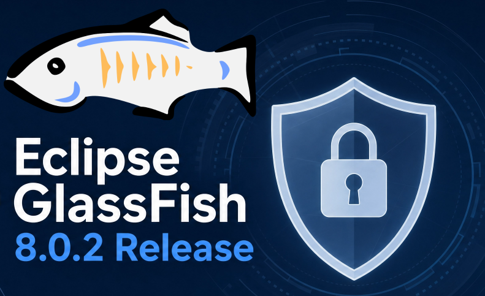

The latest version of Eclipse GlassFish 8.0.2 was released on May 5, 2026, with fixes for several critical vulnerabilities. It builds on top of a lot of subtle work and improvements in GlassFish components like the Eclipse Grizzly HTTP framework, or in related components like Eclipse OpenMQ message broker and Eclipse ORB (CORBA) for remote EJB calls. The release of GlassFish 8.0.2 serves as further evidence that GlassFish remains an actively evolving platform, backed by the dedicated maintenance and commercial support of the OmniFish team. As I was deeply involved in this release, I'd like to share a deeper look into the technical advancements within this new version.  

<figure class="aligncenter size-full is-resized">
 
</figure>

Security fixes {#h2-0-security-fixes}
-------------------------------------

First and foremost, GlassFish 8.0.2 brings a few important security fixes, which alone should be a good-enough reason to upgrade GlassFish:

* [CVE-2026-24457](https://nvd.nist.gov/vuln/detail/CVE-2026-24457) (**9.8 CRITICAL**) in OpenMQ 6.9.0
* 2 yet undisclosed CVEs in the Admin Console with severity scores of **9.6 CRITICAL** and **9.1 CRITICAL**

The two currently undisclosed CVEs were reported directly to the Eclipse Foundation and the Eclipse GlassFish team. While OmniFish collaborated closely on these fixes and possesses full knowledge of the vulnerabilities, we are unable to share specific details before the CVE details are officially published. These security flaws have been successfully resolved in GlassFish 8.0.2 and are currently in the process of being formally published by the Eclipse Foundation through a recognized CVE authority.

Stability and other Improvements {#h2-1-stability-and-other-improvements}
-------------------------------------------------------------------------

GlassFish 8.0.2 introduces **enhanced hostname resolution** for localhost. While this might appear to be a minor refinement, it effectively addresses numerous edge cases where GlassFish previously logged errors or even failed to boot when it incorrectly derived the hostname or local IP address.

This latest GlassFish version also includes an improvement for the**`@EJB` annotation** when utilizing the ***`beanName`*** attribute in an appclient. Although this specific functionality is rarely used in applications, the update was essential to ensure synchronization with the recent Jakarta EE 11 TCK service release, enabling GlassFish 8.0.2 to achieve full compliance.

Component upgrades {#h2-2-component-upgrades}
---------------------------------------------

The GlassFish 8.0.2 release brings several component upgrades. However, this time many of the updates weren't simple "bump version, test, and merge" tasks. They involved components maintained by the Eclipse GlassFish project itself or related Eclipse projects in which OmniFish is also involved. In several instances, an improvement in one component triggered changes in others, leading to a chain of multiple dependent releases. This required careful coordination with other committers and project leads before the changes could finally be integrated into GlassFish.

The most notable update is the **Grizzly HTTP framework**, now at version 5.0.1. Beyond functionality improvements, this release fixes a major issue that previously required a fragile workaround when using Grizzly as a build dependency in Maven projects. Version 5.0.0 had been released with this flaw accidentally because the release checks already included the workaround (an enabled Maven snapshots repository) and passed without issues. We have since improved the release checks to ensure this situation doesn't repeat.

Other Eclipse Foundation components that were released by the OmniFish team and were upgraded in GlassFish 8.0.2 include **Mojarra, OpenMQ, ORB, Grizzly NPN** and**HK2**.

We originally tried to upgrade to Eclipse JAXB Impl 4.0.7, but we had to roll it back since it caused some regressions in several Jakarta EE TCK tests. So, GlassFish 8.0.2 is sticking with version 4.0.6 for now. The good news is that a fix is already in a newer JAXB Impl release, which will be included in the upcoming GlassFish 8.0.3 update.

Some notable third-party component upgrades include Jackson, Helidon Config, Nimbus JOSE JWT, JNoSQL, Commons IO and Commons Codec.
> GlassFish 8.0.2 is a patch release of GlassFish 8, which brought Jakarta EE 11 and many other new features and enhancements. [Learn More About What's New In GlassFish 8](https://omnifish.ee/blog/glassfish-8-released-enterprise-grade-java-redefined/)

Conclusion -- GlassFish is a platform you can trust {#h2-3-conclusion-glassfish-is-a-platform-you-can-trust}
------------------------------------------------------------------------------------------------------------

A patch release might not sound exciting, but 8.0.2 tells a clear story: GlassFish is a platform where security issues get fixed quickly, components are kept up to date, and the team is paying attention to what matters in production -- security, stability and performance.

Meanwhile, work is already in progress on GlassFish 8.0.3, which will bring additional security fixes. We're also working on startup enhancements of Embedded GlassFish, which will save about 10% of startup time and make microservices and Docker containers start even faster.

If you are evaluating Jakarta EE platforms for a new project, or looking for a reliable home for existing applications, Eclipse GlassFish backed by OmniFish is worth a serious look. [Download 8.0.2](https://glassfish.org/download_gf8.html#eclipse-glassfish-802) and see for yourself, or reach out to us if you want to talk through your specific setup.

*** ** * ** ***

More information:

* [Download GlassFish 8.0.2](https://glassfish.org/download_gf8.html#eclipse-glassfish-802)

*** ** * ** ***

<figure class="alignleft size-full is-resized">
 
</figure>

[OmniFish - Jakarta EE experts](https://omnifish.ee) {#h2-4-omnifish-jakarta-ee-experts}
----------------------------------------------------------------------------------------

* Enterprise Support For Eclipse GlassFish
* Jakarta EE Support: Payara Community, Piranha, Quarkus
* Jakarta EE Consulting, Training \& Development

For more information about OmniFish, ask them via their [contact page](https://omnifish.ee/contact-us/), [X/Twitter](https://twitter.com/OmniFishEE) or [LinkedIn](https://www.linkedin.com/company/omnifish).
