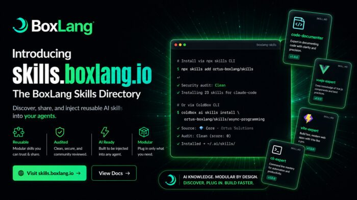

Today we're launching something we've been quietly building for months: [**skills.boxlang.io**](https://skills.boxlang.io/ "**skills.boxlang.io**") --- a public, agent-agnostic directory for AI skills covering BoxLang, ColdBox, TestBox, CommandBox, and the entire Ortus ecosystem.

If you've ever pasted a 400-line system prompt into yet another AI agent, watched two of your bots drift onto subtly different versions of the same coding standard, or spent half a Friday afternoon trying to convince an LLM that BoxLang is **not** Java and is **not** CFML, or how to code for Modern CFML; this launch is for you. 🎯

**The numbers at launch:**

* **203+** curated skills available on day one
* **8,000+** installs already, before public announcement
* **3 core** repositories maintained directly by Ortus Solutions
* **Multiple agents** supported --- Claude Code, Cursor, GitHub Copilot, Codex, OpenCode, and more  
  Let's dig into what it is, why we built it, and how to start using it in the next 30 seconds. 🚀

🤔 The Problem: AI Knowledge Doesn't Scale by Copy-Paste {#h2-0-the-problem-ai-knowledge-doesn-t-scale-by-copy-paste}
---------------------------------------------------------------------------------------------------------------------

Every team building with AI agents eventually hits the same wall.

You write a great system prompt that teaches an agent your SQL conventions. Then a teammate spins up a new bot and pastes a slightly older version. A month later there's a third variant in a Slack snippet that nobody can find. Your "single source of truth" is now three sources of conflict, and the agent's outputs reflect every one of them.

This isn't a discipline problem --- it's an architecture problem. **System prompts are plain strings, and plain strings don't have a source of truth**. They aren't versioned, aren't audited, aren't shared, and aren't discoverable.

Anthropic's Agent Skills open standard --- Markdown files with frontmatter metadata, distributed as `SKILL.md` --- gave the industry a real answer. [**BoxLang AI 3.0**](https://ai.boxlang.io/ "**BoxLang AI 3.0**") implemented it natively. And now [**skills.boxlang.io**](https://skills.boxlang.io/ "**skills.boxlang.io**") brings the missing piece: a public, curated, security-audited registry where these skills live, are versioned, and can be installed into any AI agent in seconds. 💚

🎓 What Is a Skill? {#h2-1-what-is-a-skill}
-------------------------------------------

A skill is a portable, reusable unit of expertise --- a SQL coding style guide, a tone-of-voice policy, a ColdBox conventions cheat sheet, an API design standard, a security ruleset. Anything your AI assistant should know **before** it starts answering.

Each skill is a Markdown file (`SKILL.md`) with optional YAML frontmatter:

```java
---
description: Use this skill when writing, reviewing, or formatting any
  Ortus Solutions code (BoxLang, CFML, or Java) to ensure it follows
  the official Ortus coding standards.
tags: [boxlang, cfml, java, coding-standards, ortus]
---

# Ortus Coding Standards

Always use spacing inside parentheses and brackets for readability.
Prefer closures with `=>` over anonymous functions.
Use lambdas with `->` when no external scope is needed.
...
```


Define it once. Inject it everywhere. Let your **codebase** --- not your clipboard --- be the source of truth. 📚

📥 Install in Seconds: Two Paths, One Standard {#h2-2-install-in-seconds-two-paths-one-standard}
------------------------------------------------------------------------------------------------

We built [**skills.boxlang.io**](https://www.ortussolutions.com/skills.boxlang.io "**skills.boxlang.io**") to be agent-agnostic. Whatever AI tool your team prefers, the skills work the same way. You have two install paths.

### ⚡ Option 1 --- `npx skills` (works everywhere) {#h3-3-option-1-npx-skills-works-everywhere}

Powered by [skills.sh](https://skills.sh/ "skills.sh"), an open-source, agent-agnostic CLI for discovering, installing, and managing `SKILL.md` files across Claude Code, GitHub Copilot, Cursor, Codex, and more. It reads the BoxLang Skills Hub catalog, security-audits community content, and drops files into the correct agent directory in one command.

```java
# Install an entire repository of skills
npx skills add ortus-boxlang/skills

# Or grab a single, focused skill
npx skills add ortus-boxlang/skills/coldbox-basics
```


No global install needed. Works with any Node.js. 🌐

### 🥊 Option 2 --- ColdBox CLI (deep BoxLang/ColdBox integration) {#h3-4-option-2-coldbox-cli-deep-boxlang-coldbox-integration}

If you're already living in the ColdBox world, the [**ColdBox CLI 8.11 release**](https://www.ortussolutions.com/blog/coldbox-cli-811-the-era-of-ai-skills-comes-to-every-coldbox-boxlang-app "**ColdBox CLI 8.11 release**") wires the directory directly into your project workflow:

```java
# Browse the directory interactively
coldbox ai skills install --list

# Filter by source or category
coldbox ai skills install --list coldbox/skills
coldbox ai skills install --list coldbox/skills/coldbox-testing

# Install a specific skill
coldbox ai skills install ortus-boxlang/skills/async-programming

# Search the registry
coldbox ai skills find "rest api"
```


Bonus: when you `box install` a module that has skills published to the directory, `coldbox ai refresh` auto-installs them. Skills become **infrastructure**, not setup. 💚

🔷 Core Repositories --- Curated by Ortus {#h2-5-core-repositories-curated-by-ortus}
------------------------------------------------------------------------------------

Three core repositories are officially maintained by Ortus Solutions. Skills here are trusted by default and skip the community audit step.

|                                                  Repository                                                  |                             Focus                              |
|--------------------------------------------------------------------------------------------------------------|----------------------------------------------------------------|
| [`ortus-boxlang/skills`](https://github.com/ortus-boxlang/skills "<code>ortus-boxlang/skills</code>")        | BoxLang language, runtime, BIFs, and core modules              |
| [`coldbox/skills`](https://github.com/coldbox/skills "<code>coldbox/skills</code>")                          | ColdBox MVC framework patterns and conventions                 |
| [`ortus-solutions/skills`](https://github.com/ortus-solutions/skills "<code>ortus-solutions/skills</code> ") | WireBox, TestBox, LogBox, and the broader Ortus module library |

Want a skill added to a core repo? **Open a pull request** . Add your `SKILL.md` inside a new folder, include valid YAML frontmatter, and the Ortus team will review and merge it. Once merged, it's automatically imported the next time the hub syncs. ⚡

⭐ A Taste of What's Available {#h2-6-a-taste-of-what-s-available}
-----------------------------------------------------------------

A small sample of skills you'll find in the directory at launch:

* `code-documenter` --- Producing or improving developer-facing documentation for codebases, APIs, modules, and architecture decisions
* `ortus-java-coding-standards` --- Official Ortus formatting and structural conventions for BoxLang, CFML, and Java
* `javascript-expert` --- Modern JavaScript correctness, async flows, module design, and architectural refactors
* `alpinejs-expert` --- Alpine.js component state, directives, transitions, and reusable stores
* `vite-expert` --- Vite-based frontend builds, HMR diagnostics, plugin customization, and Vitest integration
* `vuejs-expert` --- Composition API patterns, routing, forms, testing, and SSR-aware component design
* `async-programming` --- BoxLang futures, parallel execution, and concurrency primitives
* `coldbox-basics` --- ColdBox MVC conventions, handlers, models, interceptors, and module architecture  
  ...and 195+ more. Browse the full directory at [**skills.boxlang.io/skills**](https://skills.boxlang.io/skills "**skills.boxlang.io/skills**"). 🎯

🌐 Submit Your Own --- Community Skills, Security First {#h2-7-submit-your-own-community-skills-security-first}
---------------------------------------------------------------------------------------------------------------

Don't want to contribute to a core repo? Publish your own GitHub repository as a **Community** source or send us a Pull Request to any of our repos. Community skills are listed alongside core skills in the directory and go through **automated security auditing** before being made available, so consumers can install them with confidence.

The submission flow is straightforward:

* Create a GitHub repository with one or more `SKILL.md` files, each in its own subfolder (e.g. `my-skill/SKILL.md`)
* Add YAML frontmatter with at minimum `name`, `description`, and `tags`
* Write clear, accurate documentation in the Markdown body
* [**Submit your repo**](https://skills.boxlang.io/submit "**Submit your repo**") and we'll review it  
  You keep full ownership and control of your skills. The hub just makes them discoverable and installable. 💚

🛠 How Your Agent Actually Uses It {#h2-8-how-your-agent-actually-uses-it}
--------------------------------------------------------------------------

After installing, skills land in `~/.ai/skills/`, `~/.claude/skills/`, or the equivalent directory for your agent. Your AI assistant automatically discovers and loads them in each conversation.

The change in agent behavior is immediate. Ask things like:

* "Write a ColdBox REST handler with full error handling"
* "Create a WireBox-managed singleton service that queries SQLite"
* "Show me how to use TestBox to write integration tests"
* "Help me configure bx-migrations for my BoxLang app"

...and the agent answers using **patterns and idioms from the installed skills**, not scattered (and often outdated) snippets pulled from random internet training data. The hallucinations go down. The accuracy goes up. The output starts to feel like it was written by someone who actually knows the framework --- because, in a sense, it now was. 🎓

🔮 Why This Matters Beyond BoxLang {#h2-9-why-this-matters-beyond-boxlang}
--------------------------------------------------------------------------

We didn't build skills.boxlang.io as a marketing site. We built it because the Ortus ecosystem --- BoxLang, ColdBox, TestBox, CommandBox, WireBox, LogBox, CacheBox, hundreds of modules across 18+ years of work --- is too rich to fit into anyone's training data, and too valuable to be re-discovered through trial and error every time a developer opens a new chat with their AI assistant.

A public, curated, audited skills directory means:

* **Module authors** can ship AI knowledge alongside their code
* **Teams** can standardize agent behavior across every developer's workstation
* **Newcomers** get accurate, idiomatic guidance from day one
* **The community** owns and contributes to a shared knowledge layer that compounds over time

This is the same shift package managers brought to language ecosystems --- except for **AI knowledge**. It's the era of skills, and now every BoxLang and ColdBox developer can participate. 🚀

🎯 Get Started Now {#h2-10-get-started-now}
-------------------------------------------

```java
# Install your first skill in 10 seconds
npx skills add ortus-boxlang/skills

# Or via the ColdBox CLI
coldbox ai skills install --list
```


Then point your AI agent at your codebase and watch the difference. ⚡

📚 Resources {#h2-11-resources}
-------------------------------

* **Skills Hub:** [skills.boxlang.io](https://skills.boxlang.io/ "skills.boxlang.io")
* **Browse the Directory:** [skills.boxlang.io/skills](https://skills.boxlang.io/skills "skills.boxlang.io/skills")
* **Documentation:** [skills.boxlang.io/docs](https://skills.boxlang.io/docs "skills.boxlang.io/docs")
* **Submit a Repository:** [skills.boxlang.io/submit](https://skills.boxlang.io/submit "skills.boxlang.io/submit")
* **skills.sh CLI:** [skills.sh](https://skills.sh/ "skills.sh")
* **Core Repo --- BoxLang:** [github.com/ortus-boxlang/skills](https://github.com/ortus-boxlang/skills "github.com/ortus-boxlang/skills")
* **Core Repo --- ColdBox:** [github.com/coldbox/skills](https://github.com/coldbox/skills "github.com/coldbox/skills")
* **Core Repo --- Ortus:** [github.com/ortus-solutions/skills](https://github.com/ortus-solutions/skills "github.com/ortus-solutions/skills")
* **BoxLang AI:** [ai.boxlang.io](https://ai.boxlang.io/ "ai.boxlang.io")
* **BoxLang Plans:** [boxlang.io/plans](https://www.boxlang.io/plans "boxlang.io/plans")

Got a skill you'd love to publish, or one you wish existed? We'd love to hear from you --- open a PR, submit your repo, or drop us a note. The directory grows because the community grows. 💚
