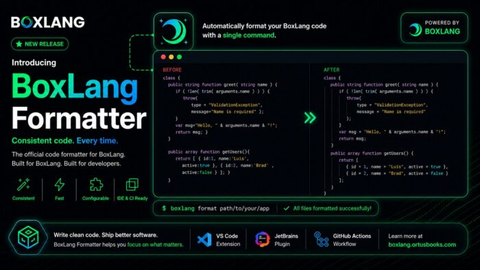

You know the drill. Someone opens a PR and half the review comments are about tabs vs spaces, where braces go, or why that one function has its arguments formatted differently from everything else. It's noise. And it's over.

**The BoxLang Formatter is here, and it handles all of that for you.**

You can find the docs here: <https://boxlang.ortusbooks.com/getting-started/ide-tooling/boxlang-formatter>

The BoxLang Formatter is a built-in code formatting tool that ships with BoxLang. It enforces consistent style across `.bx`, `.bxs`, `.bxm`, `.cfm`, `.cfc`, and `.cfs` files --- automatically.

It's not a linter. It doesn't just complain. It *fixes* your code, or tells CI to fail when style drift sneaks in.

If you have BoxLang installed, you already have the formatter. No extra install needed.

Format everything in your current directory:

```java
boxlang format
```

That's it. It recurses through your project and rewrites supported files in place.

Want to target a specific path or file?

```java
# A directory
boxlang format --source ./src

# A single file
boxlang format --source ./models/User.bx
```

Multiple paths at once (v1.14+):

```java
boxlang format --source commands,models,services
```

The formatter works great out of the box with sensible defaults, but you can customize it with a `.bxformat.json` file in your project root.

Bootstrap one instantly:

```java
boxlang format --initConfig
```

This drops a starter config in your current directory. From there, tweak what you care about. Here's a minimal example:

```java
{
  "maxLineLength": 120,
  "tabIndent": true,
  "singleQuote": false,
  "braces": {
    "style": "same-line",
    "require_for_single_statement": true
  },
  "operators": {
    "comparison_style": "symbols"
  }
}
```

You've got control over indentation, line length, brace style, struct/array formatting, operator style, SQL keyword casing, import sorting, and a lot more. Only override what you need --- everything else uses sensible defaults.

This is where it gets really useful. Run the formatter in check mode as a quality gate:

```java
boxlang format --check --source ./
```

* Exits `0` if everything is already formatted correctly
* Exits non-zero if any file has drift

Drop that into your CI pipeline and pull requests with messy formatting simply won't merge. One command, no separate linter needed.

### Recommended Team Workflow

* Developers run `boxlang format` before pushing
* CI runs boxlang `format --check` on every PR
* PRs that fail must reformat before merge

No more style debates in code review. The formatter wins.

If you want formatting to happen automatically as you work, the BoxLang LSP supports experimental format-on-save.

**Step 1** - Enable it in `.bxlint.json`:

```java
{
  "formatting": {
    "experimental": {
      "enabled": true
    }
  }
}
```

**Step 2** - Add this to your VS Code `settings.json`:

```java
{
  "[boxlang]": {
    "editor.formatOnSave": true
  },
  "[boxlang-template]": {
    "editor.formatOnSave": true
  }
}
```

**Step 3** - Open the Command Palette and run:

* `BoxLang: Select BoxLang Version` (pick latest)
* `BoxLang: Select LSP Version` (pick latest)
* `Developer: Reload Window`

Save a `.bx` file and it just formats. Local fast feedback, CI enforcement as the source of truth.

Already using cfformat in your project? Migration is a two-step process, and your existing style intent is preserved.

**Step 1 - Convert your config:**

```java
boxlang format --convertConfig --source ./
```

This transforms your `.cfformat.json` into a `.bxformat.json`, keeping your rules intact.

**Step 2 - Validate with check mode:**

```java
boxlang format --check --source ./
```

See what (if anything) drifted. Run the formatter once in a cleanup commit, then turn on `--check` in CI and you're done.

**Preview without rewriting files** --- pipe output to stdout instead:

```java
boxlang format --overwrite false --source ./handlers/MainHandler.cfc
```

**Exclude directories** (v1.14+):

```java
boxlang format --source . --excludes generated,vendor
```

**Use a custom config path:**

```java
boxlang format --config ./config/.bxformat.json --source ./
```

Stop spending review cycles on style. The formatter handles it --- in your editor, in your pre-commit hook, in CI. One command, consistent output, zero arguments about semicolons ever again.

Go format something:

```java
boxlang format
```

Questions? Hit us up on [Community \& Support](https://community.ortussolutions.com/ "Community &amp; Support") or open a discussion on the [BoxLang repo](https://github.com/ortus-boxlang/BoxLang "BoxLang repo"). We'd love to hear how you're using it.
