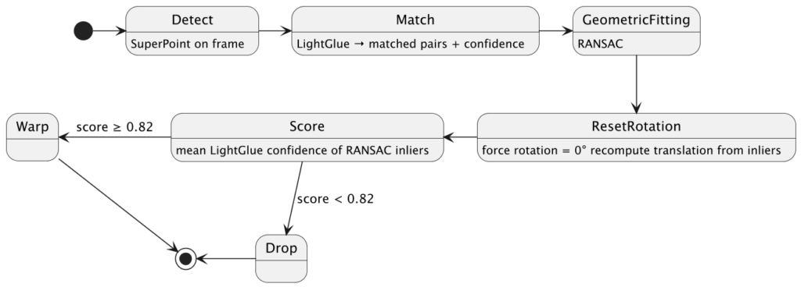

In the [previous post](https://blog.frankel.ch/seasons-time-lapse/1/), I described the Seasons project: a time-lapse of hundreds of pictures taken from nearly the same viewpoint over the years. The hardest challenge wasn't taking the pictures or assembling them, but aligning them.

You might have noticed the *nearly* part about viewpoint in the above paragraph. Indeed, it's an approximation. I'm a human being, not a tripod. The position changes ever so slightly, and so does the exact angle. My phone has changed over the years, from a Samsung S10 to an S21, and now I'm using an iPhone 14 Pro. Each of them has a different camera with a different focal length. The resulting photos look similar but are definitely not identical: slightly different scales and angles. Without any correction, the landscape appears to be moving a lot.

Alignment is the process of warping each photo so it looks like it was taken from exactly the same angle as a reference image.

## OpenCV for feature matching

For image-related features, is the go-to library.
> OpenCV is the world's biggest computer vision library.
>
> OpenCV is open source, contains over 2500 algorithms, and is operated by the non-profit Open Source Vision Foundation.
>
> —- [OpenCV](https://opencv.org/)

The most straightforward approach is to find key points across images, match them, then compute a geometric transform from the matches. It's *feature matching* . OpenCV provides an algorithm for that called **ORB**.
> ORB is basically a fusion of FAST keypoint detector and BRIEF descriptor with many modifications to enhance the performance. First it use FAST to find keypoints, then apply Harris corner measure to find top N points among them. It also use pyramid to produce multiscale-features.
>
> —- [ORB (Oriented FAST and Rotated BRIEF)](https://docs.opencv.org/4.x/d1/d89/tutorial_py_orb.html)

I mentioned two steps above: first, matching key points, then transforming the rest of them. Once key points are matched, you need an algorithm for the transformation. Meet :
> The RANSAC algorithm is a learning technique to estimate parameters of a model by random sampling of observed data. Given a dataset whose data elements contain both inliers and outliers, RANSAC uses the voting scheme to find the optimal fitting result. Data elements in the dataset are used to vote for one or multiple models. The implementation of this voting scheme is based on two assumptions: that the noisy features will not vote consistently for any single model (few outliers) and there are enough features to agree on a good model (few missing data).
>
> —- [RANSAC](https://en.wikipedia.org/wiki/Random_sample_consensus)

I first used a 3x3 matrix, also called *homography* for the transformation. It resulted in very distorted images with perspective distortion. Every small error in keypoint matching was amplified. I fixed it by using a smaller matrix, 2x3, which only handled translation and uniform scale.

That still left a nondeterministic problem. RANSAC is randomised by design. Run it twice on the same data, and you may get slightly different rotations. For a time-lapse, that means the horizon can drift from frame to frame. The fix was to discard rotation entirely and force it to zero after RANSAC, then recompute the translation analytically from the inlier matches.

The scale tolerance also required careful tuning. The Samsung S10 has a 4.30mm focal length, while the iPhone 14 Pro has a 6.86mm one. A photo from one device is 1.6× the scale of a photo from the other. Any scale gate tighter than that would wrongly reject valid cross-device frames.

There was one more spatial problem. ORB keypoints cluster on high-texture regions — in my photos, trees and rooftops. A transform fitted only from one corner of the image is less stable than one fitted from points spread across the whole frame. The fix was to divide the image into a 4×4 grid and cap the number of keypoints per cell, forcing a more even spatial distribution.

Finally, the output resolution. Each aligned frame produces a valid crop region — the area of the reference frame it fully covers. If you take the intersection of all crops, one frame with an extreme offset shrinks the output for everyone. Instead, the crop boundaries are computed from percentiles across all frames: the worst 15% of frames on each edge are ignored, and any frame that falls outside the resulting crop is dropped.

## Neural matching with SuperPoint and LightGlue

ORB works well on scenes with clear texture. In winter, photos with snow-covered fields, foggy mornings, and overcast skies degrade quickly. There is simply not enough distinctive texture for classical descriptors to anchor on. I kept it as a fallback when the following approach doesn't fall within the expected range.

The first step is a pair of Open Source neural models:

* [SuperPoint](https://github.com/rpautrat/SuperPoint) is a self-supervised keypoint detector trained to find stable, repeatable points across varying lighting and viewpoints.
* [LightGlue](https://github.com/cvg/LightGlue) is a transformer-based matcher that pairs SuperPoint keypoints across two images and produces a confidence score for each match.

Both run locally on Apple Silicon via .

SuperPoint needs a reference image. To avoid extracting its features hundreds of times, they are computed once at startup and reused for every frame.

The first version of the quality score was wrong. I measured it as the fraction of LightGlue matches that survived RANSAC. That made almost every frame poorly aligned.

The root cause was parallax. LightGlue finds geometrically correct matches, the same real-world point in both images, but many are rejected by RANSAC because the scene has depth. Objects at different distances don't move the same way when the camera shifts slightly. The matches aren't wrong; they just don't fit a flat-world model.

The fix was to score alignment using the mean LightGlue confidence of the RANSAC inliers only. With trial and error, I found that a good alignment score sits between 0.82 and 0.96. Frame acceptance went from 19.7% to 53.2%.

Here's the final representation of the alignment pipeline's nominal path:

In the next part, I'll describe how I smoothed the motion between frames using optical flow and the final result.

*Originally published at [A Java Geek](https://blog.frankel.ch/seasons-time-lapse/2/) on May 24th, 2026.*

*[RANSAC]: RANdom SAmple Consensus
*[MPS]: Metal Performance Shaders
*[OpenCV]: Open Source Computer Vision Library
