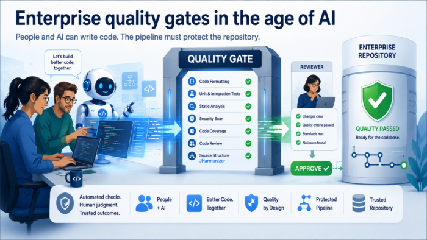
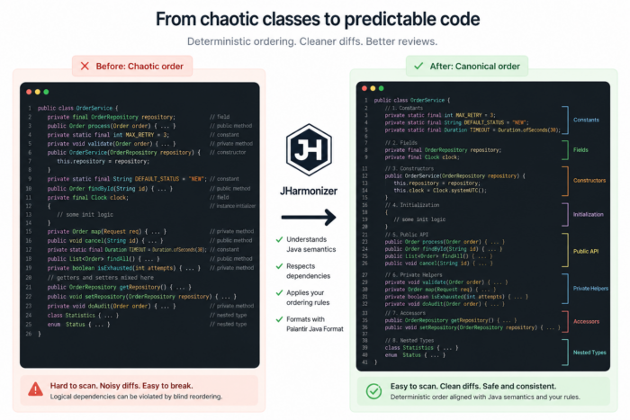

People and AI can write code together, but enterprise repositories still need deterministic quality gates to protect code quality.

## Enterprise quality is a scaling problem

Enterprise Java development is not only about writing correct code. It is about keeping a large, long-lived codebase understandable, reviewable and safe to change while many people and many tools touch it over time.

In a small project, informal discipline can be enough. A few developers agree on conventions, use similar IDE settings and fix inconsistencies during review.

That model breaks down in larger organizations. Teams change, ownership moves, modules outlive their original authors, and code is edited through different IDEs, web interfaces, scripts, generators and AI-assisted workflows.

This is where quality gates become important. They are not bureaucracy around the build. They are executable engineering agreements. If a rule matters for long-term maintainability, it should be runnable, repeatable and enforceable from the build pipeline.

## Local differences become delivery problems

Most quality problems look small in isolation. One developer uses a different IDE profile. Another ignores a local inspection warning. Someone forgets to run tests. A dependency is updated without checking the broader impact. A generated change touches many files in a slightly different style.

The damage comes from accumulation. Similar modules stop following the same structure. Reviewers work harder to find the real behavior change. Static analysis findings arrive too late. Test coverage becomes uneven. Dependency rules drift. Build behavior becomes less predictable.

A large team therefore needs common rules that run the same way for everyone. Formatting, source structure, static analysis, dependency checks, test coverage and license checks should not depend on who made the change or which local setup happened to be configured correctly.

Readable and maintainable code is a delivery concern, not an aesthetic preference. The main consumer of source code is another developer: the person reviewing it today, debugging it in six months or extending it next year.

## Noisy diffs hurt review quality

Weak automation often shows up as noisy pull requests. A developer changes a few lines of behavior, but the diff also contains reordered methods, import cleanup, blank-line changes and unrelated formatting noise.

The reviewer has to dig for the real change inside layout churn. That is tiring, slow and bad for review quality.

Good tooling separates these concerns. If a project has a canonical representation of source code, developers can bring files back to that representation before review. The diff becomes smaller, and the reviewer focuses on behavior instead of formatting archaeology.

## IDE-based quality control is not enough

The natural answer is: let the IDE handle it. Modern IDEs are powerful productivity tools. IntelliJ IDEA, Eclipse and other environments can format Java code, optimize imports, rearrange class members, run inspections, show test coverage and integrate static-analysis plugins. For local work, that feedback is valuable. It helps developers produce cleaner code before they even run the build.

The problem starts when this local workflow becomes the quality strategy for a large distributed team. An IDE can help one developer on one machine. It cannot guarantee that every change in every branch was produced with the same editor, plugins, settings, imported profile and manual actions.

At enterprise scale, that assumption fails quickly. Developers may use IntelliJ IDEA, Eclipse, VS Code, terminal tools, repository web editors, generated code or automated migrations. Some remember the right action. Others do not. One workstation has the correct profile. Another has a slightly different setup.

IDE support remains useful, but repository protection must live somewhere independent of the developer's workstation. If a rule matters for the project, it should be part of the build, reproducible in Maven or Gradle, and enforceable in CI.

AI agents make this even more obvious. They do not reliably use your IDE, inspection profile, formatter settings, rearrangement rules or local quality plugins. Depending on IDE-based quality control becomes even weaker when not all code is produced through an IDE.

## AI needs deterministic boundaries

AI does not remove the need for quality gates. It increases it.

AI agents can generate, refactor and explain code quickly. That is useful, but it also means more code can be produced with less friction by humans, scripts and AI assistants together. The repository needs stronger automatic boundaries around what is accepted.

The tempting mistake is to turn AI itself into the quality gate. For deterministic rules, that is the wrong default.

A prompt is not a quality gate. Asking an AI agent to check whether code follows a style guide, uses the right dependency policy, has correct formatting, or follows a source-structure convention is not the same as enforcing a rule. A model may follow the instruction, partially follow it, misunderstand it, or produce a different judgment when the context changes. That is not how enterprise gates should work.

If a quality rule can be expressed as a deterministic algorithm, it should be enforced by deterministic code. Formatting, import cleanup, dependency checks, static analysis, license checks and reproducible source ordering should be fast, cheap and repeatable. The same input should produce the same result. The same check should fail locally and in CI for the same reason.

AI can still be useful around this process. It can suggest fixes, explain a failed check, generate tests, or help a developer understand a static-analysis warning. But the final repository boundary should not depend on a model interpreting a prompt. It should depend on executable rules.

## What enterprise quality gates should check

A quality gate is not one vague checkbox called "quality". In a serious Java project, it is a set of concrete checks that protect different parts of the delivery process.

In the best case, the build and CI pipeline should verify:

* **Build reproducibility:** expected JDK version, Maven or Gradle version, plugin versions, compiler target, generated sources and repeatable build behavior.
* **Dependency governance:** banned dependencies, dependency convergence, snapshot dependencies, duplicated versions, vulnerable libraries and license compatibility.
* **Compilation:** main sources, test sources, annotation processors, generated code and selected Java language level.
* **Automated tests:** unit tests, integration tests, contract tests, smoke tests and other project-specific test suites.
* **Coverage:** minimum line or branch coverage, module-level thresholds and protection against silent coverage drops.
* **Static analysis:** bug patterns, duplicated code, excessive complexity, risky APIs, nullability problems and maintainability rules.
* **Security and compliance:** dependency vulnerability scanning, secret scanning, required license headers, SPDX metadata and internal repository rules.
* **Source-code policy:** formatting, imports, line wrapping, naming conventions, generated-code exclusions, package rules and class structure.
* **Build output discipline:** controlled warnings, stable reports, useful failure messages and artifacts that can be inspected after CI failure.

For enterprise development, these rules should be part of the build, not only part of local IDE setup. A common Maven or Gradle configuration gives the project one executable contract.

Locally, developers should have commands that can fix what is safe to fix automatically. For example, a Maven profile or plugin goal may format code, clean imports, reorder source structure, regenerate reports, or apply other safe mechanical changes.

In CI, the same project should have check-only execution. The pipeline should not silently rewrite code. It should verify that the code already follows the required rules. If formatting is wrong, imports are dirty, tests fail, coverage drops, dependencies violate policy, or source structure is inconsistent, the build should fail with a clear message.

This is how a written convention becomes an executable rule. Instead of repeating the same review comments again and again, such as "run the formatter", "fix imports", "update tests", "do not use this dependency", or "this class structure is inconsistent", the team moves these checks into the build pipeline. Reviewers can then focus on design, behavior, risk and business logic instead of acting as manual linters.

## Formatting is only one source-code gate

Many quality gates are already common in mature Java projects. Build checks, tests, coverage thresholds, static analysis and dependency rules are familiar parts of CI pipelines.

Source-code policy is one part of that broader picture.

Formatting is the most familiar source-code gate. It controls the text-level shape of the file: spaces, indentation, wrapping, imports, blank lines and syntax layout. Java already has strong tools for this layer. `google-java-format` and `palantir-java-format` can make formatting reproducible, and they can be integrated into the build.

But source-code policy does not end at formatting. It does not decide where constants, fields, constructors, public methods, private helpers, accessors and nested types belong inside a class. That is a separate layer: source structure.

A file can be perfectly formatted and still be hard to scan because every class follows a different internal order. This is the gap between formatting and source restructuring.

## Java member ordering is harder than it looks

Java declarations are not always independent. One constant may depend on another constant. A field initializer may depend on a field declared above it. Static or instance initialization blocks may rely on members that already exist earlier in the class.

For example, this order is safe:

```java
private static final int DEFAULT_TIMEOUT_SECONDS = 30;
private static final int API_REQUEST_TIMEOUT_SECONDS = DEFAULT_TIMEOUT_SECONDS * 2;
```

Blind alphabetical sorting may accidentally produce this:

```java
private static final int API_REQUEST_TIMEOUT_SECONDS = DEFAULT_TIMEOUT_SECONDS * 2;
private static final int DEFAULT_TIMEOUT_SECONDS = 30;
```

Now the change is not only cosmetic. `API_REQUEST_TIMEOUT_SECONDS` depends on `DEFAULT_TIMEOUT_SECONDS`, so the base constant must stay above the derived one.

A source restructuring tool therefore has to respect declaration-order dependencies. Similar issues can appear around field initializers, static initializers, instance initializers, enum constants, annotation values and other class-level declarations where order may matter.

## The missing layer: JHarmonizer

This was the missing layer I could not find in the Java tooling ecosystem: a way to make Java class structure reproducible outside the IDE, enforceable from the build, and safe enough to respect declaration-order dependencies.

So I built [JHarmonizer](https://github.com/lemon-ant/JHarmonizer).

[](https://github.com/lemon-ant/JHarmonizer)

[



](https://github.com/lemon-ant/JHarmonizer)
JHarmonizer reorganizes Java class members into a canonical structure, making code easier to scan, safer to review, and more consistent across teams.

JHarmonizer is an open-source Java source harmonization tool. It focuses on one layer of the quality workflow: making Java source structure and formatting reproducible from Maven, CLI and CI.

It can:

* reorder Java class members while respecting declaration-order dependencies;
* keep accessors together;
* use different ordering strategies for interfaces, DTOs, tests, utility classes and regular production classes;
* format the reordered result with Palantir Java Format;
* run from Maven or the command line in auto-fix mode;
* run in check mode as a CI quality gate.

## Where it fits in the Java quality stack

JHarmonizer is not meant to replace the Java quality ecosystem. Static analyzers, bug detectors, coverage tools, architectural tests and code review all solve different problems.

A typical Java quality setup may include Maven Enforcer, PMD, CPD, SpotBugs, JaCoCo, license checks, sortpom and JHarmonizer. Each tool protects a different layer: dependencies, static checks, duplication, bug patterns, coverage, legal metadata, build files and source structure.

There is no single magic tool. Enterprise quality comes from boring, deterministic checks that protect different parts of the codebase.

## Conclusion

AI will continue to change how code is produced. That is not a reason to weaken engineering discipline. It is a reason to automate more of it.

Large teams need rules that do not depend on local IDE settings, personal habits, memory or how an AI model interprets a prompt.

Formatting, static analysis, tests, coverage, dependency rules and license checks are already part of that picture. Java source structure deserves to be part of it too.

Readable and understandable code does not happen automatically in large teams. It has to be protected by process, tooling and automation.

That is what quality gates are really for: not slowing teams down, but helping them deliver safely, predictably and with less avoidable noise.
