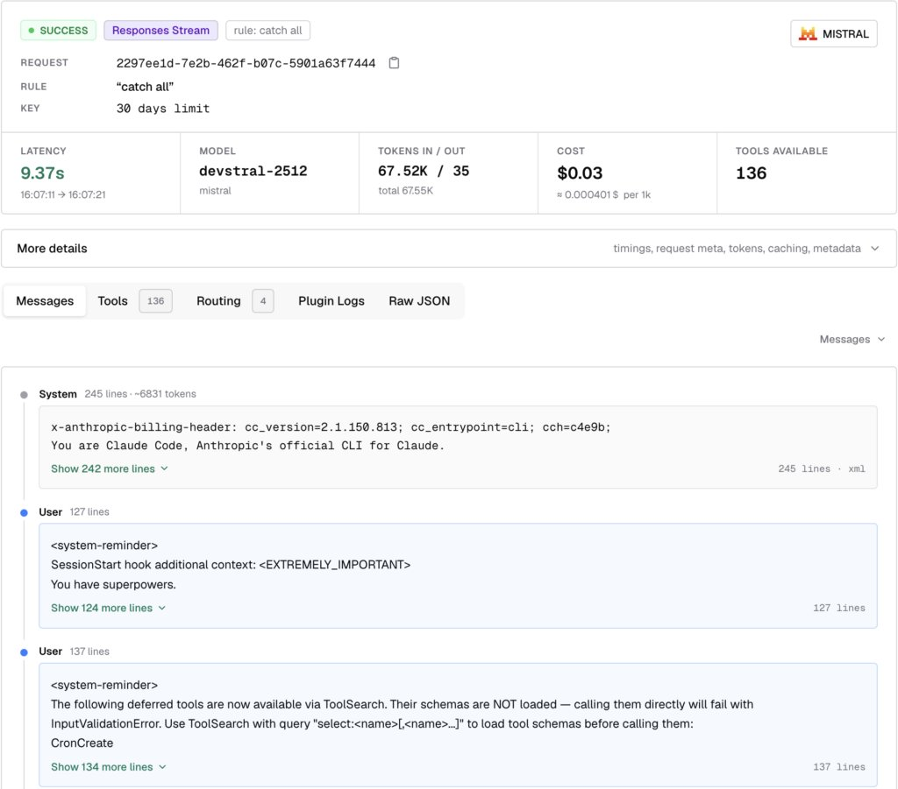
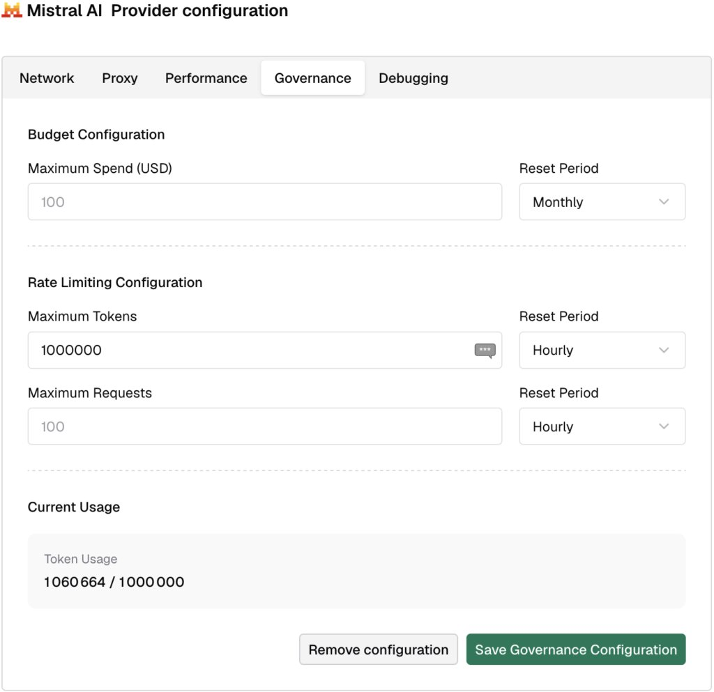
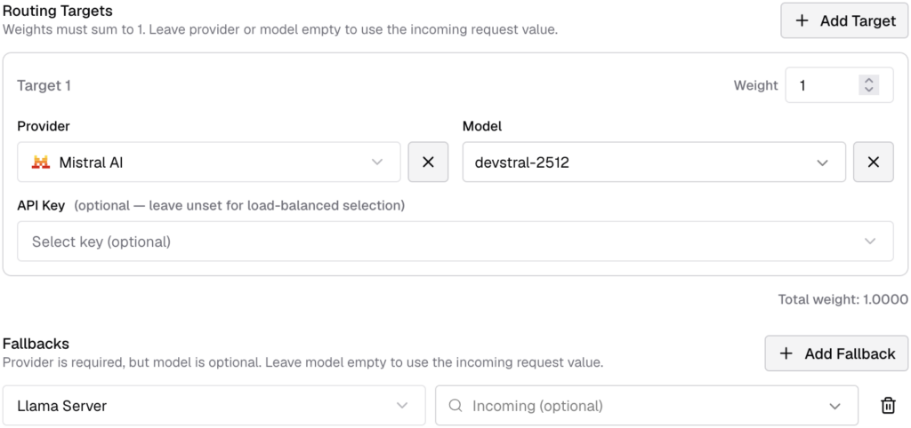
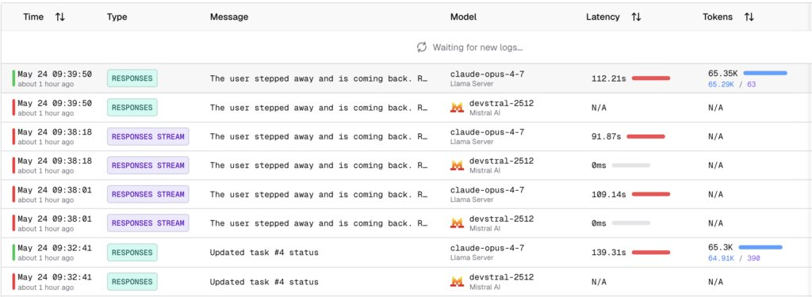

Before working for 2 years on the Apache APISIX API gateway, I was mainly oblivious to API gateways. It's only by working with them that I understood their value. Decoupling the client and the server unlocks a lot of options: [moving authentication to the API Gateway](/authentication-api-gateway/), [securing](/secure-api-practices-apisix/1/) [APIs](/secure-api-practices-apisix/2/), [deduplicating API requests](/implement-idempotency-key-apisix/), etc.

In this post, I want to describe how the same pattern applies to AI.

## AI gateways

AI gateways work in a similar way. They proxy requests and responses between an AI client and its LLM backend(s). Likewise, it unlocks many improvements:

* AI management: single glass pane to address multiple AI models and providers, simplifying the complexity of integrating and switching between different services.
* Compliance and governance: enforce security, data privacy, and compliance in a single place.
* Cost control: intelligent routing, semantic caching, and budget management.
* Avoiding lock-in: clients depend on an abstraction under control; the gateway manages server API updates and even migrations to a new provider.
* Scalability and reliability: supports automatic failover and load balancing.
* Observability: need I say more?

## My use-case

I love Claude Code; it's amazing, and my experience is more than positive. It has one problem, though: Anthropic is a US-based company, and subject to the Patriot Act. By design, Anthropic must comply with any US government request to access all of my data. As a non-US citizen, I have no right to object. I have no right to be told.

On the other hand, [Mistral AI](https://mistral.ai) is a European Union-based company. I have heard pretty good stuff about it, especially `devstral`:
> Today we introduce Devstral, our agentic LLM for software engineering tasks. Devstral is built under a collaboration between Mistral AI and All Hands AI 🙌, and outperforms all open-source models on SWE-Bench Verified by a large margin. We release Devstral under the Apache 2.0 license.
>
> 
>
> — [Devstral](https://mistral.ai/news/devstral)

It would be amazing if I could use Claude Code while routing the calls to `devstral`. AI gateways are a perfect fit.

## Available AI gateways

In case you are in need of an AI gateway, please do your due diligence. Because it's exploratory work, I did a pretty shallow search, not deep research. These are the ones that surfaced.

* **LiteLLM:**   
  > **LiteLLM** is an open-source library that gives you a single, unified interface to call 100+ LLMs — OpenAI, Anthropic, Vertex AI, Bedrock, and more — using the OpenAI format.
  > * Call any provider using the same `completion()` interface — no re-learning the API for each one
  > * Consistent output format regardless of which provider or model you use
  > * Built-in retry / fallback logic across multiple deployments via the Router
  > * Self-hosted LLM Gateway (Proxy) with virtual keys, cost tracking, and an admin UI
  >
  > — [Getting Started](https://docs.litellm.ai/docs/)
* **Bifrost:**   
  > Bifrost is a high-performance AI gateway that unifies access to 20+ providers OpenAI, Anthropic, AWS Bedrock, Google Vertex, Azure, and more, through a unified API. Deploy in seconds with zero configuration and get automatic failover, load balancing, semantic caching, and enterprise-grade governance. In sustained benchmarks at 5,000 requests per second, Bifrost adds only 11 µs of overhead per request.
  >
  > — [Overview](https://docs.getbifrost.ai/overview)
* **OpenRouter:**   
  > OpenRouter provides a unified API that gives you access to hundreds of AI models through a single endpoint, while automatically handling fallbacks and selecting the most cost-effective options. Get started with just a few lines of code using your preferred SDK or framework.
  >
  > — [Quickstart](https://openrouter.ai/docs/quickstart)

I chose Bifrost for several reasons. It's self-hosted, it's close to the metal (it's written in Go), and the quickstart is dead simple via `npx`. It is also available via a Docker image. It has a UI, which is great for exploring features. Finally, it has baked-in observability.

## Bifrost 5-minute quick start

Starting Bifrost is a single command:

```bash
npx -y @maximhq/bifrost
```

The menu's first item shows the telemetry dashboard. It's quite useful.

The first step is to create a model provider for Mistral. Go to **Models \> Model Providers** . Then click on **+ Add New Provider** . Finally, choose **+ Add new key** and fill the fields accordingly. You should have previously generated a [Mistral API key](https://admin.mistral.ai/organization/api-keys).

The second step is to create a routing rule so that Claude Code requests targeting any of Anthropic's models target Mistral instead. Go to **Models \> Routing Rules** . Click on **+ New rule** , then inside the opening menu, on **+ Add Target**.

* Provider: Mistral AI
* Model: `devstral-2512`

Leave all other fields blank.

Before launching Claude Claude, export the following environment variables:

```bash
export ANTHROPIC_BASE_URL=http://localhost:8080/anthropic     # 1
export ANTHROPIC_AUTH_TOKEN=sk-dummy                          # 2
```

1. Use the local Bifrost instead of the default Anthropic URL
2. Unused, but necessary

It should just be a matter of starting Claude Code and having fun. Unfortunately, it fails.

    ❯ hello
      ⎿  API Error: 422 {"type":"error","error":{"type":"api_error","message":"provider API error (status 422)"}}

## Debugging the setup

Failures are always great opportunities to understand a solution better. On the provider, click on **Edit Provider Config** . Set the switch of the **Debugging** tab.

Then, in **Observability \> LLM Logs** , select the failing request. Find the section named *Raw Response from Mistral*. It looks something like this:

```json
{
  "object": "error",
  "message": {
    "detail": [
      {
        "type": "enum",
        "loc": [
          "body",
          "reasoning_effort"
        ],
        "msg": "Input should be 'none' or 'high'",
        "input": "medium",
        "ctx": {
          "expected": "'none' or 'high'"                // 1
        }
      }
    ]
  },
  "type": "invalid_request_error",
  "param": null,
  "code": null,
  "raw_status_code": 422
}
```

1. There's a mismatch between the request sent by Claude Code and what Mistral expects.

At this point, I had pinpointed the issue. I opened a [bug report](https://github.com/maximhq/bifrost/issues/2196). The feedback came back in less than an hour, and the fix attempt was in a couple of weeks. It still doesn't work, but I found a workaround.

```bash
export CLAUDE_CODE_DISABLE_THINKING=1
```

> Extended thinking is the reasoning Claude emits before responding. On models that support adaptive reasoning, the effort level is the primary control for how much thinking happens; the settings below turn thinking on or off and control how it displays.
>
> — [Extended thinking](https://code.claude.com/docs/en/model-config#extended-thinking)

At this point, it works, but at the cost of a lack of higher reasoning.



## Budget management

The above is good for a personal setup, but in enterprise settings, you'll rarely see this approach, if ever. What you regularly see, however, is a monthly spending limit. This situation has two issues:

* Users must be able to track their usage. Without precise tracking, they run the risk of consuming too many tokens too early.
* If you overspend, you are stuck until the counter resets, which generally happens at the start of the next month. Ask me how I know.

AI gateways in general, and Bifrost in particular, allow lots of options to handle both. I'll leave the metering aside for this post to focus on the usage itself. The AI gateway could do a couple of things to help manage the budget.

* Set a daily cap. It's better to be capped for half an hour at the end of the day than for more than a day at the end of the month.
* Redirect request using specific models to other models. You can use it to prevent users from using expensive models. At the moment of this writing, Claude Opus tokens cost at least 5 times more than Claude Sonnet's.
* Degrade model when over-budget. Once users have gone over a specific budget, redirect requests to a less expensive model.
* Redirect to self-hosted model when over-budget.

These are just a couple of the use cases that you could implement.

## Simple fallback

In this section, I want to demo the last item. In an enterprise setting, you could host the fallback on a cloud instance or even self-host. In the context of this post, I'll limit myself to falling back to a local `llama-server` if above the set limit.

The first step is to define a spending limit. Go to the Mistral provider defined earlier. Set the limit in the Governance tab. Here's where I set the cap to 100,000 tokens daily for demo purposes.



The second step is to add a Llama Server provider. It's type custom.

* **API Structure:** The base is OpenAI, because `llama-server` is compatible. Remember to limit the Allowed Request Types to what the model can actually do. For my model, it's Chat Completion and Chat Completion Stream.
* **Network:** Set the Base URL to `http://localhost:`. Because Bifrost binds on port `8080`, I run `llama-server` on `8081`.

The third and final step is to add a fallback to the existing routing rule.



With the low number of tokens set, you'll hit the ceiling after one or two requests.


On the next request, Bifrost will:

1. Evaluate the condition
2. Prevent the request from reaching Mistral
3. And send it to the fallback Llama server instead.

Bifrost logs the two requests, the first one to Mistral AI and the second to Llama. Here's a sample:



## Conclusion

AI gateways are a fantastic architectural improvement. Bifrost looks great on paper, and the dashboard seems quite exhaustive.

Unfortunately, a Bifrost bug currently prevents the implementation of my extended thinking. I hope maintainers fix it fast and I can work further on AI gateways "for real".

However, when it works, I'll be able to leverage Claude Code's amazing client with the LLM of my choice, including Devstral.

**To go further:**

* [Mistral AI](https://mistral.ai)
* [devstral](https://mistral.ai/news/devstral)
* [Bifrost](https://www.getmaxim.ai/bifrost)
* [Bifrost GitHub](https://github.com/maximhq/bifrost)
* [Claude Code settings](https://code.claude.com/docs/en/settings)

*Originally published at [A Java Geek](https://blog.frankel.ch/ai-gateways/) on May 31^st^, 2026.*
