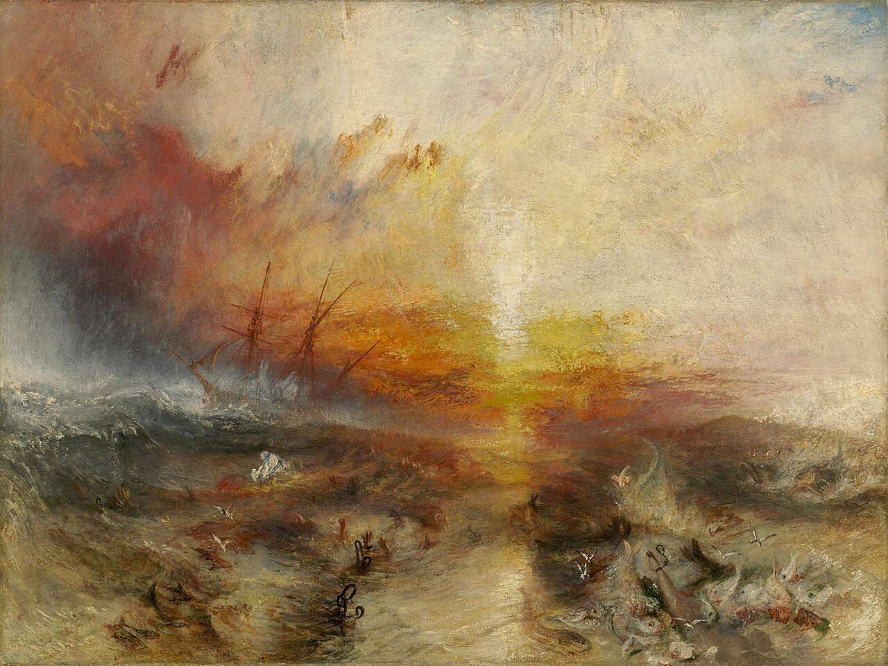
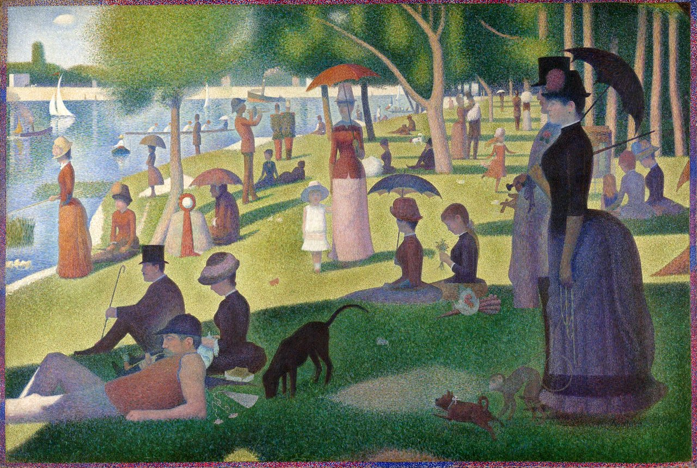

In the [first post](https://blog.frankel.ch/seasons-time-lapse/1/) of this series, I focused on the project foundations: what should I do to create a video from photos taken from the same position year after year? I dedicated the [second part](https://blog.frankel.ch/seasons-time-lapse/2/) to aligning images. It wasn't as easy as I expected. I stumbled upon new concepts, such as and .

In this third and final post, I want to tackle the video creation itself, explain some "artistic" decisions, and leave the door open to future work.

## Order

The decision with the greatest impact was about ordering pictures. I had several options available. The first thing that came to mind was to order by time of day. There were several problems:

* I mostly run at lunch time. Thus, the passing of time would have been skewed toward a range from noon to 2PM.
* The summer time vs. winter time change would have required a slight change in the pipeline.
* Most importantly, the passing of seasons could have made the video weirdly looking. Frame X could be a sunny blue sky with man-high corn plants, frame X+1 a barren field under the snow, and then frame X+2 in summer again.

I decided instead to first order by day of the year, and only then by time of day. To get the time, I chose the metadata embedded in the picture itself.
> Exif is supported by almost all digital camera manufacturers.
>
> The metadata tags defined in the Exif standard cover a broad spectrum:
>
> * Camera settings: This includes static information such as the camera model and make, and information that varies with each image such as orientation (rotation), aperture, shutter speed, focal length, metering mode, and ISO speed information
> * Image metrics: Pixel dimensions, resolution, colorspace, and filesize
> * Date and time information, digital cameras will record the current (local) date and time set on the device and save this in the metadata
> * Location information
> * A thumbnail for previewing the picture on the camera's LCD screen, in file managers, or in photo manipulation software
> * Descriptions
> * Copyright information
>
> — [Wikipedia](https://en.wikipedia.org/wiki/Exif)

I already extracted the EXIF data to get the location.

## Images to video

In essence, a video is just a rapid succession of images. With enough frames per second, it gives the illusion of movement.

To get a feel of what it would look like, I did a straightforward montage. I had three realizations:

1. Creating the video is slow.
2. Just putting images one after another was not very aesthetically pleasing.
3. The video was quite short.

For point 1, I added code to make the video from a limited sample of pictures. For points 2 and 3, I interpolated frames between the pictures. Interpolation wasn't as easy as I had thought.

Imagine the pixel with coordinates `(1,1)` and color `rgb(150,50,100)` on picture 1. The same pixel in picture two has the same coordinates `(1,1)`, but color `rgb(50,250,120)`. I naively thought that if you inserted a single frame between them, the pixel's color would be the average of both colors' values: `rgb((150+50)/2, (50+250)/2, (100+120)/2)`. This approach holds for images taken from the same location with the same angle, which is my use case.
> In theory, there's no difference between theory and practice; in practice, there is.

It turns out that even with images within the same location and angle, there are elements moving between two consecutive images. The most frequent elements are clouds, but because images are not 100% aligned, most elements of interest move slightly. If you apply the above algorithm, clouds will become transparent or appear out of thin air, or probably both at the same time. It doesn't render nicely.

To improve the rendering, I applied the Gunnar-Farnebäck optical flow.
> Optical Flow: Optical flow is known as the pattern of apparent motion of objects, *i.e.* , it is the motion of objects between every two consecutive frames of the sequence, which is caused by the movement of the object being captured or the camera capturing it. Consider an object with intensity *I (x, y, t)* , after time dt, it moves to by dx and dy, now, the new intensity would be, *I (x+dx, y+dy, t+dt)*.
>
> — [GeeksForGeeks](https://www.geeksforgeeks.org/python/opencv-the-gunnar-farneback-optical-flow/)

You're welcome to read more of the mathematical foundations. Suffice it to say that it fits my use case. Note that frames with too many differences, such as those to or from a fog or snow picture, confuse the algorithm. In this case, I fall back to the simple color blending above. To check whether the fallback activates or not, the computation takes into account:

* The average magnitude of the Farneback flow vectors across all pixels. It models large **motion**.
* The mean absolute difference of grayscale pixel values between the two frames. It represents a large change in overall appearance.

Above a certain threshold, fall back.

I showed the work in progress on the first post, but here it is again:



## Future works

I'm wondering how to even better align the images. The biggest problems are my lack of knowledge in the field and the lack of guaranteed reference points in the landscape I chose. For the former, I'll dig deeper using Claude Code. For the latter, the project is configurable enough to be reused with another picture set. I have fewer of them, but I'm pretty sure I'll be able to use more of them. A bit of disalignment makes the video more dynamic, though.

I'd also like to use another image set to validate the code's "productization". While I don't plan to make it a product, I'm still interested in whether it's possible and how much freedom it gives people.

Another axis is Open Sourcing it. You noticed I didn't publish the sources yet. The project is Python, and it's not a language I excel in. Plus, all the code has been generated with Claude Code. Thus, I don't feel very comfortable. If you are interested in helping me publish it, feel free to ping me.

Finally, I'm thinking about adding a filter option. For this project, I have something impressionist in mind. More specifically, I want to try both a [Turner](https://en.wikipedia.org/wiki/J._M._W._Turner)'s style and a [Seurat](https://en.wikipedia.org/wiki/Georges_Seurat) pointillist one. I like their respective work, even though their styles are quite far apart.

If I can implement both, then nothing would stop potential users from implementing their own.

## Conclusion

I had this project in mind for ages. However, only Claude Code allowed me to make it a reality. For once, I have more fun creating something than coding. I actually didn't write a single line of code by myself.

Have I joined the dark side?

*Originally published at [A Java Geek](https://blog.frankel.ch/seasons-time-lapse/3/) on June 7^th^, 2026.*

*[RANSAC]: RANdom SAmple Consensus
*[EXIF]: Exchangeable image file format
*[ORB]: Oriented FAST and Rotated BRIEF
