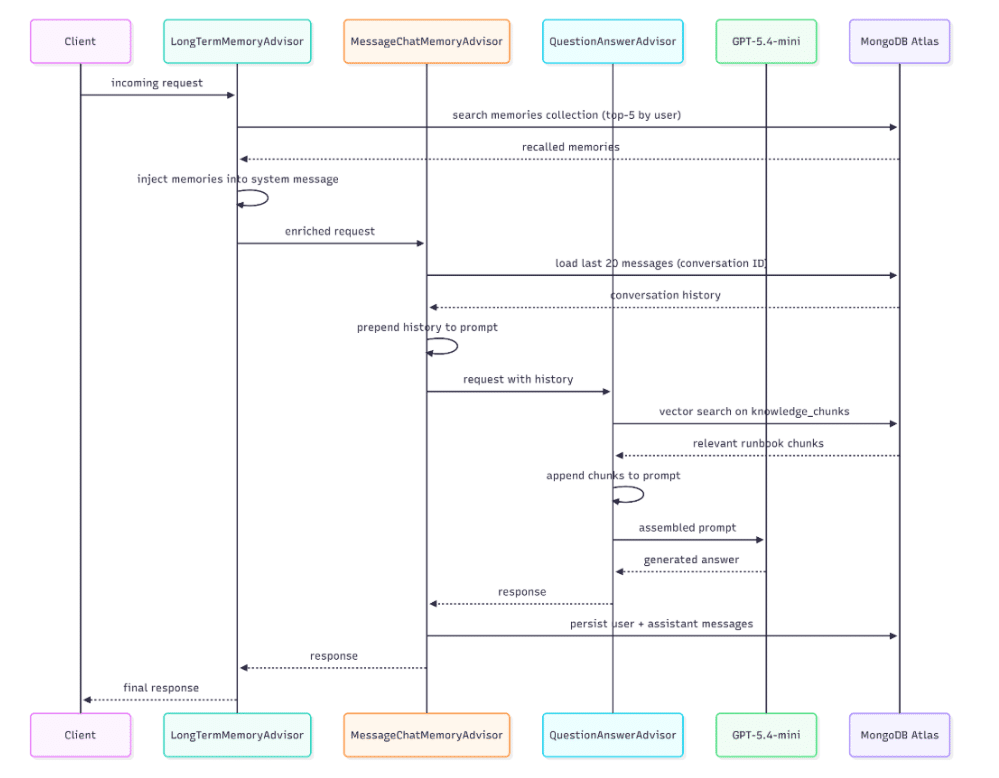
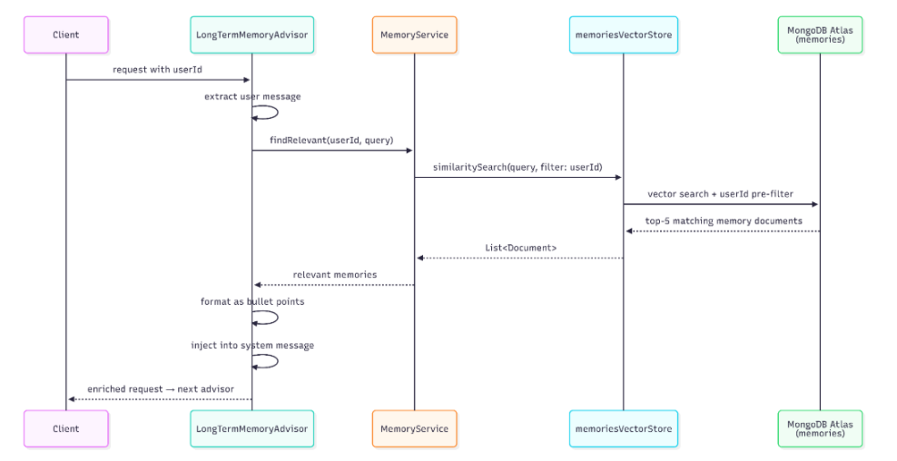
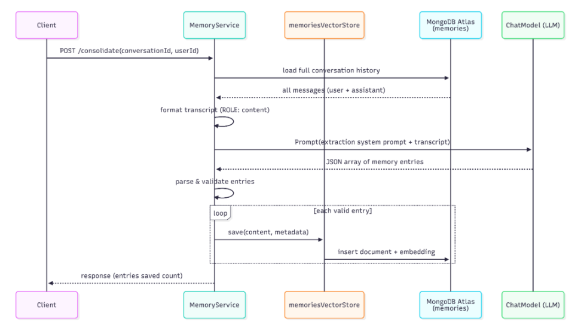

This is the second article in a three-part series. Part 1 covered the RAG foundation --- loading runbooks into a vector store and wiring them to a language model. Part 3 will introduce stateful workflow checkpointing with pause and resume.

## The Problem with Stateless Chat

In the first part of the series, we successfully created a chat interface where an operator can ask questions and receive answers based on the actual content of the runbooks they have uploaded and embedded in the system. For example, they can ask in the chat, "*What should I check when my server's CPU usage exceeds 80%?*" and the assistant retrieves the relevant sections from the various runbooks and assembles a coherent and concrete response.

The goal now is to go further. To do so, we need to add another layer of sophistication: suppose we ask in the chat, "*And if what I've done doesn't help, what's the escalation process?* " The assistant will think for a moment and tell you it has absolutely no idea what to do. This is quite a problem. In reality, this is exactly how it's supposed to work, given the way we've built and configured it so far. Every *POST* request to */api/ops/chat*made by the chatbot is a new request with no connection to previous requests. The system is very good at answering your questions, but unfortunately, it has no knowledge of what's been written in the conversation.

This situation is extremely restrictive, and in this context, it's even more complicated to manage because troubleshooting a fault involves a series of sequential steps that must be linked in order. Hypotheses, testing the results, new hypotheses, and more testing. An assistant who forgets the previous step is obviously useless.

In this second part, we'll bridge this gap and build an assistant that remembers the content of the current conversation and previous conversations.

## What We Are Building

Where do we start to add memory to our assistant? First, we need to try working with two different time perspectives of memory.

The first is short-term memory. This type of memory acts like a sliding window over the current conversation, allowing us to associate each message with everything that has already been asked and answered. Ask a question and keep in mind the last 20 messages exchanged between you and the assistant: this model allows us to maintain a conversation that is consistent with the content without having to invent artifices to populate the context window.

The second type of memory is long-term memory. This type of memory serves to archive and save information, preferences, and decisions extracted from previous conversations. It contains information about personal knowledge and preferences: if I prefer to perform a rollback with *kubectl* rather than with a Helm chart, well, this is where we find that information. It should be noted that this layer is clearly separate from the RAG's existing base knowledge.

In this exercise, both of these memory levels are hosted within [MongoDB Atlas](https://www.mongodb.com/products/platform/?utm_campaign=devrel&utm_source=third-party-content&utm_medium=cta&utm_content=agentic-foojay-part2&utm_term=hugh.murray), along with the knowledge chunks saved in Part 1. The extension is extremely straightforward, as we only need to add a new collection to our application without needing to create new infrastructure components.

## Two Different Kinds of Memory

Let's go a little deeper into the description of these two types of memory. The goal is to understand their similarities and differences, but above all to avoid treating them generically.

Short-term memory essentially maintains contextual continuity. As in human memory, this type of memory helps maintain the context of a conversation and allows us to follow the thread without getting lost. This type of information is transient by nature, as it is useful only while the session is active and becomes largely irrelevant once the conversation ends.

Long-term memory, on the other hand, serves to accumulate knowledge, conversation after conversation. It helps identify what the assistant knows about the connected user and what their preferences and habits are. The goal, therefore, is not to save text in raw format, but to select from each individual conversation the salient information and what the user asked for and/or preferred during problem-solving attempts.

Now that we have a clearer understanding of the main characteristics of these two types of memory, let's see how these characteristics guide us in the actual design. Short-term memory must be cheap and consumed quickly: retain it for a short period and then discard it. Long-term memory, on the other hand, is selective but, above all, must be durable over time. It is important that it contains preprocessed and structured information, including all the metadata that allows us to retrieve it when actually needed.

## Mix \& Match

Let's now resume the application developed in Part 1. To enable the use of these two types of memory, we need to add two components that work closely together within the request pipeline.

At the input, we need to add a custom *LongTermMemoryAdvisor* that triggers before any other processing stage. This object must take the current message, search the *memories* collection to find the first five semantically similar memories belonging to the user. These memories must then be appended, along with the message, to the context just retrieved.

After performing this first operation, we need to recall the latest messages exchanged in the current session so that we can include context within our prompt. To do this, we use a *MessageChatMemoryAdvisor*.

All these parts, combined, form the final request: it contains the long-term personal context, the short-term conversation history, the runbooks retrieved from the RAG, the system prompt defining the role, and the current question, all encapsulated within the current context window.

Let's try to visualize all of this within a sequence diagram:  


In addition to all this, we must also consider the existence of a separate workflow, which can be triggered on demand or at scheduled intervals, not with every single request, and is responsible for consolidating the information exchanged into long-term memory. This stream reads the entire conversation from the chat memory, calls the LLM to extract the relevant facts from the conversation, and writes them to the memories collection for later retrieval.

## Short-Term Memory: Keeping the Conversation Coherent

Now that we've examined why these two types of memory exist and how to logically integrate them into our pipeline, it's time to look at the code we'll use to implement all of this.

Spring AI supports the implementation of a ChatMemoryRepository with MongoDB Atlas: this way, once the Atlas starter is present in the classpath, the configuration proceeds automatically. What does this mean? It means there is no need to write any repository classes, create any collections manually, or maintain and evolve any domain objects or serialization classes. The framework itself handles persisting each message by saving it to MongoDB and retrieving it when needed using the ID of the current conversation.

From the application, we configure the windowing policy. To do this, we use *MessageWindowChatMemory* that wraps the self-configuring repository described above and applies a retention limit to the sliding window. In our case, the parameter is set to 20, which is a sufficiently large and accommodating value to avoid token overuse. For every message entered into the chat, the *MessageChatMemoryAdvisor* uses this object to load the conversation history into memory and append it to the prompt on the fly. In response, the advisor writes both the user's message and the assistant's response to memory using the repository, ensuring everything remains consistent.

The fundamental element on which this consolidation is based is the conversation ID, represented by a UUID generated from the user session, which is passed back and forth as a path parameter or query parameter in requests. The uniqueness of this field, combined with this strategy, allows us to use the application across multiple browsers and by multiple users simultaneously: each session is assigned a unique ID with an independent memory window. One conversation can never affect another.

Windowing prevents the indefinite accumulation of messages in cases where a conversation lasts for hours. In this case, we apply a FIFO logic to the queue, removing the oldest information from the context and leaving only the newest. Clearly, deleting does not mean forgetting: the essence of the messages is still always consolidated in long-term memory.

## Long-Term Memory: Carrying Knowledge Across Sessions

Long-term memory is stored within a second *VectorStore* , which is separate and distinct from the one that holds the knowledge chunks. This points to a collection of memories within the same Atlas cluster, with its own vector search index (*memories_vector_index*) and fields representing metadata that can be used for filtering.

The separation between these two containers is deliberate and serves a specific purpose: the knowledge base and memory have distinct purposes and distinct access patterns, with lifecycles that are completely independent of one another.

Within the application, we must therefore register a second bean representing a *VectorStore* , which we will call *memoriesVectorStore* via a *Qualifier* . Spring will then know where and how to inject this bean, leaving the behavior of the first *VectorStore* (self-configured and pointing to the *knowledge_chunks* collection) unchanged, which continues to serve the *QuestionAnswerAdvisor* as explained in Part 1.

The magic, however, happens within the *MemoryService*, which acts as a gateway to accessing this storage. The service class offers

* a *save* method to write individual conversation snippets into memory
* a *findRelevant* method for filtered semantic search based on the userId
* a *findByUserId* method to load into memory all memories belonging to a specific user

Each memory record is a document with a text field *content,* an *embedding* vector generated from this content, and a block of structured metadata containing the userID, the memory type classification, an importance score ranging from 0.0 to 1.0, the generation timestamp, and the ID of the conversation from which it was generated.

```
{
  "content": "The investigation into the high CPU usage of the payment-service pod is paused, awaiting approval. Immediate next action is to check for unusual spikes in traffic or load.",
  "metadata": {
    "createdAt": "2026-04-22T17:33:48.904423Z",
    "memoryType": "SUMMARY",
    "importanceScore": 0.8,
    "userId": "ops-user",
    "sourceConversationId": "6d79d518-bfae-4b2c-b236-5fc06ce51c34"
  },
“embedding”:[..]
}
```

The *memoryType* field is an enumeration that can take on 5 different categories:

* PREFERENCE for personal style preferences
* FACT for operational facts
* SUMMARY for narrative accounts of incidents
* EPISODE for significant past episodes
* DECISION for decisions that have shaped system management

This classification can help the LLM understand which documents to retrieve based on the required context.

Upon receiving a request, the *LongTermMemoryAdvisor* retrieves this information: this custom class implements both *CallAdvisor* and *StreamAdvisor*, two Spring AI interfaces that cover synchronous and reactive request paths, respectively.

When a request arrives with a user ID, the advisor extracts the content from the message, calls the *MemoryService.findRelevant* method for the specified user, formats the retrieved memories as an unordered list, and injects it into the context along with the other information. The model reads these memories as part of the instruction context rather than as ordinary conversation turns. This makes them available as persistent background about the user, previous decisions, preferences, and unresolved situations. By contrast, the RAG context retrieved from the knowledge base remains closer to the user question, where it acts as immediate evidence for the current answer.

Below is a representative sequence diagram.  


## Memory Consolidation: From Conversation to Durable Fact

As explained so far, short-term memory stores everything, while long-term memory stores only what is important to remember. The bridge connecting these two types of memory is the process of consolidation.

In this example, consolidation is triggered manually rather than automatically. After a conversation ends, an incident is resolved, a runbook is updated, or a decision is reached, we can send a request to our system (a POST to the endpoint */api/ops/chat/{conversationId}/consolidate?userId=matteoroxis* ). The *MemoryService*loads the entire conversation by retrieving it from the chat memory repository, formats each message into a plain-text object, and sends this transcript to the LLM with a prompt specific to this type of retrieval.

In this particular case, the prompt instructs the model to act as a memory retrieval assistant rather than an operational assistant. The prompt presents the LLM with the five types of memory we described earlier and asks the model to return a JSON array of objects, each containing the type, a brief description of what is important to remember, and a score ranging from 0.0 to 1.0. In this example, we used the following prompt:

You are a memory extraction assistant for an IT Operations tool.

Given a conversation, extract important facts, preferences, decisions, or summaries

worth remembering across future sessions.

Return a JSON array. Each element must have:

- "memoryType": one of PREFERENCE, FACT, SUMMARY, EPISODE, DECISION

- "content": a concise, self-contained statement of what to remember

- "importanceScore": a float 0.0--1.0 (0 = trivial, 1 = critical)

Only include genuinely reusable information. Skip conversational pleasantries.

Return ONLY the JSON array, no other text or markdown fences.

The response from the model is parsed, and each record is validated before being written to the \`memories\` collection: entries that are invalid are logged and skipped, without causing the entire system to fail. The quality of what is saved clearly depends on the quality of the conversation: in an investigation where the actions taken are clearly stated, especially by the operator ("*we decided to increase the heap space to 6GB on the payment service*"), this will produce clear and precise entries that are useful for future reference.

An unclear conversation, full of imprecise intermediate commands and inaccurate assumptions, will produce a significantly less useful output. As usual, the quality and attention paid to this type of activity is directly proportional to the future quality of the assistant's responses.

Below is a sequence diagram summarizing the interaction just presented:


## The Advisor Chain and Why Order Matters

Spring AI is designed to execute advisors in ascending order of precedence, running those with lower precedence first.

* The *LongTermMemoryAdvisor* triggers first, with a precedence of *HIGHEST_PRECEDENCE +5* : this advisor must trigger before the *MessageChatMemoryAdvisor*so that this memory is injected into the message before the short-term memory is retrieved and assembled.
* This serves to preserve the importance of the information contained in this type of memory, which would otherwise be placed in a less important position relative to the chat history, confusing the model about the importance of what is retrieved here.

<!-- -->

* *MessageChatMemoryAdvisor*is triggered second: it loads the conversation history into memory, appends the user and assistant information to the prompt, and writes the new exchange to the database after receiving the response.
* *QuestionAnswerAdvisor*is triggered third, loading the runbook chunks relevant to the current operation into memory. At this point in our chain, the prompt already contains both long- and short-term memories: the RAG content is appended to the user's question, in order to improve the information base. In fact, by following this order, the model reads the retrieved content immediately before the question, rather than after a long block represented by the conversation history.
* The final advisor is the *SimpleLoggerAdvisor*, which logs the assembled prompt and the model's response to analyze and debug the output.

The chain functions correctly, adhering to the principle of component responsibility: each advisor performs a specific task, delegating the next step to the subsequent advisor in the chain.

## The Atlas Index for Memories

Just as with the *knowledge_chunks* collection presented in Part 1 of this tutorial, the *memories* collection also requires its own vector search index in Atlas. In this case, we can define a vector index as follows:

```
{
  "fields": [
    {
      "type": "vector",
      "path": "embedding",
      "numDimensions": 1536,
      "similarity": "cosine"
    },
    { "type": "filter", "path": "metadata.userId" },
    { "type": "filter", "path": "metadata.memoryType" }
  ]
}
```

It is important to note in this definition the declaration of the two filter fields, which are necessary for semantic search to pre-filter vectors based on the user performing the search before conducting the similarity search. Without this filter, every query would have to scan the entire collection, which is unsustainable as the application's usage grows.

## Trying It Out

Now that we have all the components for our assistant's short- and long-term memory, let's run it and see how it works. Let's start the application:

mvn spring-boot:run

Before launching the application and making the first request, let's make sure we've created the two indexes:

* *knowledge_vector_index* on the *knowledge_chunks*collection
* *memories_vector_index* on the *memories*collection

Navigate to <http://localhost:8080> in the UI, and the interface will display a Memories panel next to the chat and an ingestion panel. After uploading the runbooks, start the conversation. Let's choose a topic and start exchanging messages with the assistant.

Once the conversation has accumulated a good amount of information and exchanges, we can click Consolidate. The memory consolidation API will be called, and within the panel, we'll see various records appear, classified by type, representing the key facts added to our long-term memory.

Once the conversation is complete, we can create a new conversation, which is assigned a new ID. Let's proceed again with the information request, and we'll see how the responses will include the key information the assistant remembers about us, such as the preferences expressed in the first conversation, without having to re-enter this information.

## Conclusion and What's Next

The time has come, just as it did for our assistant, to consolidate what we've done so far into memory. We started with a question-and-answer tool and gave it memory capabilities, both within a single session and across different sessions. Short-term memory allowed us to ensure consistency without any custom code, leaving Spring AI to handle the persistence and retrieval of information transparently. Long-term memory allows us to introduce something even more interesting: a specific knowledge base, tailored to the user, that grows over time, fed by preferences and decisions made during investigative activities.

This entire memory stack runs on the same [MongoDB](https://www.mongodb.com/cloud/atlas/register/?utm_campaign=devrel&utm_source=third-party-content&utm_medium=cta&utm_content=agentic-foojay-part2&utm_term=hugh.murray) instance that hosts the knowledge base. There is no separate vector database, no external cache, and no second infrastructure to operate.

What is missing for our system to be truly complete? What the system still cannot do is persist the state of an ongoing task. Suppose we are in the middle of investigating an incident: we have performed several diagnostic steps and worked together with the assistant to identify the root cause and how to resolve the problem. We close the laptop and return a few hours later to work on the problem: when we return, the conversation history will be gone, or, at best, its conclusion will be present only within long-term consolidated memory. Our assistant does not yet possess the concepts of paused workflows, pending approval, or checkpoints from which to resume.

The final part of this series aims to address this very issue. We will introduce a MongoDB-based checkpoint, a tool the LLM can use to verify the service's health, and a pause/resume mechanism that allows the investigation to persist across sessions. The human-in-the-loop pattern, where the assistant pauses and waits for explicit approval from the operator before proceeding to the next step, is made possible by this same architecture.

The code for this article is available in the following [repository](https://github.com/matteoroxis/operations-assistant). Modify the content with different runbooks and documentation to see how it behaves in different use cases.
