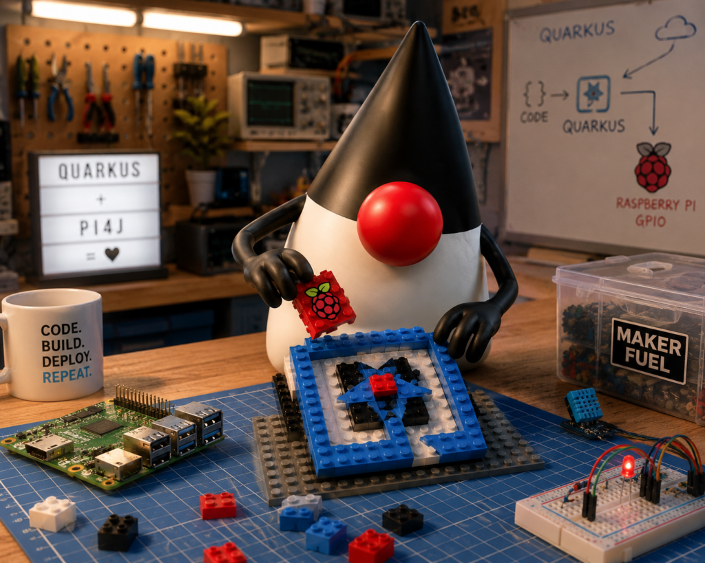
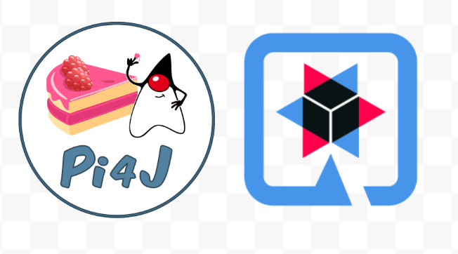
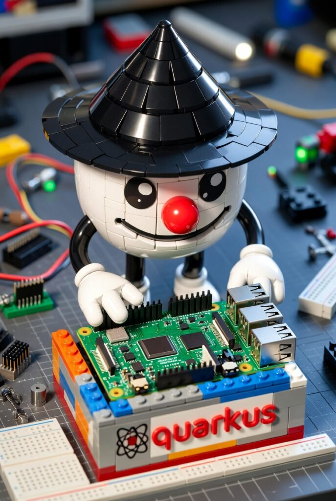

Java developers building applications for Raspberry Pi often face a common challenge: combining hardware access with modern application frameworks.

[Pi4J](https://www.pi4j.com/) has become the standard way to access GPIO, I2C, SPI, UART, and other Raspberry Pi interfaces from Java applications. On the other hand, Quarkus has established itself as one of the most innovative Java frameworks, offering fast startup times, low memory consumption, and a developer-friendly experience.

The Quarkus Pi4J Extension brings these two worlds together, making it easier than ever to build hardware-enabled applications using the Quarkus ecosystem.


Project repository:  
<https://github.com/quarkiverse/quarkus-pi4j>

### Why Combine Quarkus and Pi4J?

Modern IoT and edge computing applications often require much more than hardware access.

Developers typically need:

* REST APIs
* Dependency Injection
* Configuration management
* Health checks
* Metrics and monitoring
* Cloud integration
* Container deployment

While Pi4J provides excellent hardware integration, Quarkus adds the application framework capabilities needed to build production-ready solutions.

The Quarkus Pi4J extension allows developers to use Pi4J naturally within a Quarkus application, combining hardware control with all the features available in the Quarkus ecosystem.


### What Does the Extension Provide?

The extension automatically configures and manages the Pi4J Context, the central component responsible for hardware access and device lifecycle management.

Instead of manually creating and managing the Pi4J context, developers can simply inject it using CDI (Contexts and Dependency Injection), one of Quarkus' core features.

This means less boilerplate code and a cleaner integration with your application architecture.

Key benefits include:

* Automatic Pi4J Context initialization
* CDI integration
* Lifecycle management
* Health check support
* Native Quarkus developer experience
* Seamless integration with REST endpoints and services

### A Simple Example

One of the easiest ways to understand the value of the extension is by controlling a GPIO pin.

With the Pi4J Context automatically managed by Quarkus, the code becomes straightforward:

```
@ApplicationScoped
public class LedService {

    @Inject
    Context pi4j;

    public void turnOnLed() {

        var led = pi4j.digitalOutput().create(22);

        led.high();
    }
}
```

### Configuration Without Recompilation

One of the most powerful features of the Quarkus Pi4J extension is the ability to externalize hardware configuration using standard Quarkus configuration properties.

In many Raspberry Pi projects, changing a GPIO pin assignment often requires modifying source code, rebuilding the application, and redeploying it. While this may seem simple at first, it quickly becomes inconvenient when applications are deployed across multiple devices with different wiring configurations.

With the Quarkus Pi4J extension, GPIO mappings can be configured through application properties, allowing deployments to adapt to different hardware setups without requiring recompilation.

For example:

```
pi4j.gpio.led.address=22
```

The application can then inject and use the configured GPIO directly, keeping hardware details outside of the business logic.

This approach offers several advantages:

* No source code changes for hardware remapping
* Easier deployment across different Raspberry Pi models
* Cleaner separation between configuration and implementation
* Simplified maintenance and testing

### GPIO Injection by Number or Name

The extension also introduces a developer-friendly programming model based on annotations.

Instead of manually creating GPIO instances throughout the application, developers can inject them directly using CDI.

A GPIO can be referenced by its physical address:

```
@Inject
@GPIO(address = 22)
DigitalOutput led;
```

Or by a logical name defined in configuration:

```
@Inject
@Named("led")
DigitalOutput led;
```

Using named GPIOs is particularly useful for larger projects because the application becomes independent of the actual pin assignment. If the hardware wiring changes, only the configuration needs to be updated while the Java code remains unchanged.

This pattern aligns perfectly with Quarkus' philosophy of configuration-driven development and makes Raspberry Pi applications easier to maintain, test, and deploy in real-world environments.

In this example, the Pi4J Context is injected directly into the application component. The extension takes care of initialization and shutdown, allowing developers to focus entirely on business logic instead of infrastructure concerns.

### Health Checks for Raspberry Pi Applications

A particularly interesting feature of the extension is its integration with Quarkus Health.

By leveraging SmallRye Health, applications can expose operational information about the Raspberry Pi environment through standard health endpoints. The extension can provide information about the operating system, Raspberry Pi model, CPU architecture, Java runtime, and hardware status.

This is especially useful for:

* IoT deployments
* Edge devices
* Industrial automation
* Remote monitoring
* Fleet management

Having operational visibility built into the application makes it easier to manage Raspberry Pi deployments at scale.

### Building Modern IoT Applications

The combination of Quarkus and Pi4J opens the door to a wide range of projects.

Examples include:

* Smart home systems
* Environmental monitoring platforms
* Industrial automation
* Robotics controllers
* Data acquisition systems
* Edge AI applications

A developer can use Pi4J to collect data from sensors while simultaneously exposing REST APIs, sending data to cloud services, storing information in databases, or integrating with messaging platforms such as MQTT and Kafka.

This creates a complete Java-based stack running directly on Raspberry Pi hardware.

### Part of the Quarkiverse Ecosystem

The extension is hosted within the Quarkiverse, the community ecosystem for Quarkus extensions. Quarkiverse provides a home for community-driven integrations that expand the capabilities of Quarkus while benefiting from shared infrastructure, testing, documentation, and release processes.

Being part of Quarkiverse makes the extension easier to discover, maintain, and integrate into existing Quarkus projects.


### Looking Ahead

The Quarkus Pi4J extension represents an important step toward making Raspberry Pi development feel like a first-class experience within modern Java frameworks.

Combined with projects such as Pi4J Drivers, developers can build applications that not only access GPIO pins but also interact with sensors, displays, HATs, and complete hardware platforms such as the Sense HAT using clean and maintainable APIs.

As Java continues to grow in areas such as IoT, edge computing, education, and robotics, integrations like Quarkus Pi4J help bridge the gap between enterprise-grade development practices and physical computing.

### Conclusion

The Quarkus Pi4J extension brings together the best of both worlds: Pi4J's powerful hardware access capabilities and Quarkus' modern cloud-native development experience.

Whether you're building a simple Raspberry Pi project, an IoT gateway, or a production-ready edge application, the extension provides a clean and elegant way to integrate hardware interactions into your Quarkus applications.

For Java developers who love both software and hardware, this is an exciting addition to the growing Raspberry Pi ecosystem.
