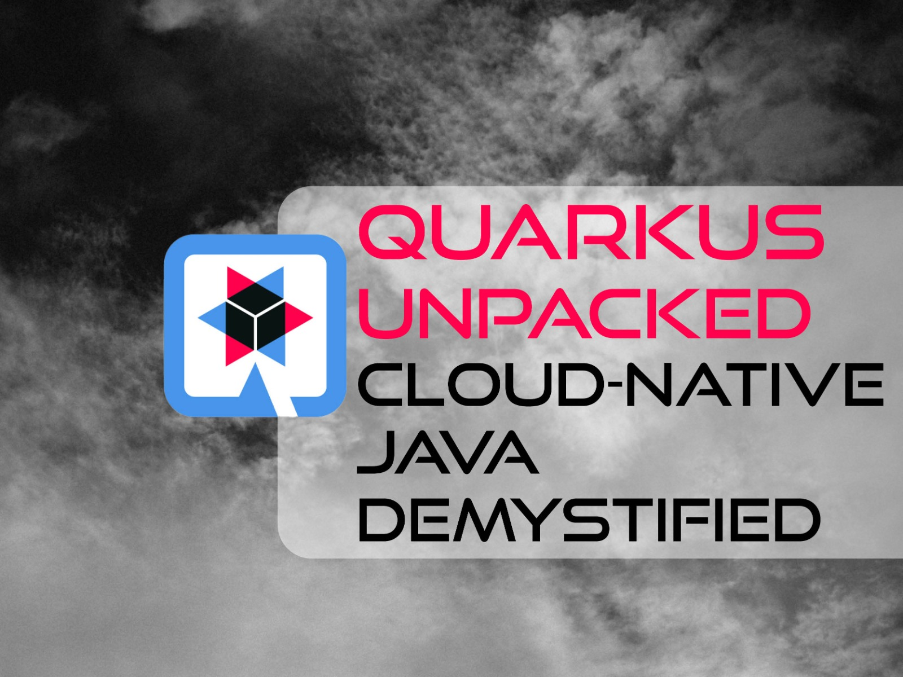

<figure class="alignleft is-resized">
 
</figure>

I recently had the pleasure of joining the [Foojay podcast](https://www.youtube.com/watch?v=_nJCTTrnZkE) to talk about Quarkus in depth. The conversation covered a lot of ground, from what makes Quarkus different to the practical trade-offs between JVM and native mode. This post captures the key questions and answers from that discussion, lightly edited for readability.{#_quarkus_unpacked_insights_from_the_foojay_podcast}

If you have been following this blog series, note that the third installment on building your own stack with Quarkus is coming next. Consider this a bonus entry that distills the podcast conversation into a format you can read, reference, and share.



What is Quarkus? {#_what_is_quarkus}
------------------------------------

Quarkus is a cloud-native Java framework for any cloud, hyperscalers included, that combines efficiency and cost savings with a great developer experience. It features innovations such as Dev Mode and Continuous Testing, while it keeps the enterprise stability that Java is known for.

Quarkus is designed for cloud-native Java developers who need quick cold starts, high-density deployments, and an efficient workflow with live reload. At the same time, it keeps standard APIs and offers the option of running on the JVM or in native mode.

How does Quarkus compare to Spring, Micronaut, or other frameworks? {#_how_does_quarkus_compare_to_spring_micronaut_or_other_frameworks}
----------------------------------------------------------------------------------------------------------------------------------------

Broadly speaking, Quarkus, Spring Boot, and Micronaut all serve the enterprise market, but Quarkus stands out for its focus on cloud-native defaults. While Spring Boot has traditionally relied on runtime reflection and classpath scanning, it has been adding AOT processing support in recent versions. Quarkus, by contrast, was designed from the start around build-time processing and native compilation with GraalVM, which results in faster startup times and reduced memory usage.

From a day-to-day perspective, Quarkus also enhances the developer experience with features like Dev Mode and live reload, providing instant feedback on code changes with no long rebuilds or restarts.

On top of that, Quarkus integrates both imperative and reactive models by using Eclipse Vert.x, and it still adheres to solid standards like MicroProfile and Jakarta EE.

Is Quarkus more modern because it is newer? {#_is_quarkus_more_modern_because_it_is_newer}
------------------------------------------------------------------------------------------

Quarkus is newer than many established Java frameworks, but "newer" does not automatically mean "more modern." In practice, its design avoids legacy constraints and stays away from older patterns that do not fit cloud-native deployments. Instead, Quarkus focuses on build-time processing and a streamlined developer loop.

It also applies lessons from earlier frameworks, and you can see that in its efficient extension model and configuration. Quarkus feels more modern not just because it is newer, but because it embraces cloud paradigms at a fundamental level.

Does Quarkus replace the JVM? {#_does_quarkus_replace_the_jvm}
--------------------------------------------------------------

No, it does not replace the JVM. In JVM mode, Quarkus runs on the JVM like other Java frameworks, while leveraging its GraalVM integration. In native mode, Quarkus compiles the application into a native executable, so the JVM is not required at runtime. In this context, "runtime" refers to the execution stack that boots the application and integrates the frameworks, configuration, and runtime services the application relies on.

In other words, Quarkus works as an intelligent layer that manages the application lifecycle, whether it runs on a standard OpenJDK or as a native binary.

What is Quarkus live reload? {#_what_is_quarkus_live_reload}
------------------------------------------------------------

Live reload is a core, game-changing feature. In Quarkus Dev Mode, live reload applies code, configuration, and resource changes while the application runs, so you see results right away without a rebuild or restart. It removes the slow turnaround that people often associate with Java and brings more of a scripting-style workflow to enterprise Java development.

It goes beyond code changes, because Dev Mode also powers Dev Services, which provisions infrastructure such as databases or Kafka brokers in Docker containers and connects them to your app with no extra configuration.

Continuous Testing runs relevant tests in the background as soon as you save a file.

More recently, Quarkus introduced Dev MCP (Model Context Protocol), which lets local AI-coding agents connect to the running application so they get more context for debugging and writing code.

How does build-time optimization work? {#_how_does_build_time_optimization_work}
--------------------------------------------------------------------------------

Build-time optimization is the mechanism by which Quarkus shifts costly startup procedures, like scanning classes for annotations, parsing configuration files, and building application metamodels, to the build phase.  

Instead of doing this work every time the application starts, Quarkus does it once during compilation and generates optimized bytecode that runs with precomputed results.

This gives you four main benefits:

* **Faster startup**, because the application skips the heavy lifting of scanning and parsing when it boots.

* **Lower memory usage**, because the final artifact stays smaller and leaner, and libraries needed only for initialization, such as parsers, do not get loaded at runtime.

* **Earlier error detection**, because Quarkus catches configuration errors or incorrect annotation usage during the build, so it fails fast instead of crashing at runtime.

* **Reduced reflection**, because Quarkus generates proxies that avoid reflection calls, which improves performance.

### How does this differ from JIT and AOT? {#_how_does_this_differ_from_jit_and_aot}

It helps to separate build-time optimization from both just-in-time (JIT) compilation and ahead-of-time (AOT) initiatives like Project Leyden.

With JIT, the JVM optimizes hot code paths into machine code while the application runs. Quarkus build-time optimizations do something different: they improve the baseline startup and memory profile, so the application reaches the JIT warm-up phase faster.

With AOT work like Project Leyden, the goal is to shift general JVM mechanics, such as class loading and heap archiving, to build time. Quarkus focuses on semantic framework optimization instead. It understands the frameworks you use, such as Hibernate or Camel, and resolves their wiring before the JVM even starts. That is why Quarkus can deliver these benefits today on standard OpenJDK releases, independent of Leyden's timeline and its constraints.

What are the other key advantages? {#_what_are_the_other_key_advantages}
------------------------------------------------------------------------

Here we can talk about how Quarkus connects a productive developer workflow with operational requirements in production.

### Day 1: Developer experience {#_day_1_developer_experience}

* **Dev Services** reduce the "it works on my machine" problem by starting external services such as databases, Kafka, or Keycloak in Docker containers and connecting them to the app.  

  This removes the need for manual Docker Compose files in many local development setups.

* The **Development UI** (Dev UI) runs alongside the app and displays configuration, active beans, and routing, so troubleshooting is more direct.

* For **Kubernetes-native deployment**, Quarkus can generate Kubernetes manifests and build container images by using Jib or Docker, so developers can deploy without learning every Kubernetes detail first.

### Day 2: Operations {#_day_2_operations}

* For **security**, Quarkus integrates standards such as OIDC (OpenID Connect) and WebAuthn (passwordless authentication) through dedicated extensions. Because Quarkus does framework work at build time, it can reduce the deployed attack surface by removing unused code paths before deployment.

* For **observability** (metrics, logs, and traces), Quarkus integrates with OpenTelemetry and Micrometer, so metrics, distributed tracing, and log correlation often work with defaults and require no extra setup.

* For **fault tolerance**, MicroProfile Fault Tolerance lets developers add annotations that apply circuit breakers, retries, or bulkheads, so the application handles common network failures without custom plumbing.

### The Quarkiverse ecosystem {#_the_quarkiverse_ecosystem}

Quarkus has the Quarkiverse ecosystem, a community extension catalog that provides a large set of extensions connecting Quarkus to common Java libraries and platforms. The [Quarkus extensions catalog](https://quarkus.io/extensions/) lists a large and growing number of extensions, including community contributions from the Quarkiverse.

JVM mode versus native mode {#_jvm_mode_versus_native_mode}
-----------------------------------------------------------

JVM mode is, or should be, the first choice for most teams. Quarkus on the JVM already improves startup time and memory efficiency compared to traditional stacks, without changing the runtime. Native compilation is a specialized tool for specific requirements, such as very fast startup and very tight resource limits, for example, running a full stack with under 100 megabytes of RAM.

At the same time, it is not accurate to say native mode cannot handle long-running workloads. Quarkus tunes native builds by applying framework-level knowledge during the build, and benchmarks show stable behavior over time. In constrained cloud environments, Quarkus native applications can deliver strong throughput with minimal CPU and memory, though exact numbers depend on the workload, JDK version, and configuration.

There are also other AOT approaches, such as snapshotting, which capture a prepared process image and restore it quickly, including work in Project Leyden and AWS Lambda SnapStart. These approaches improve startup time close to native, but they do not deliver the same memory reduction. In practice, the JVM often delivers the best peak throughput for compute-heavy workloads, while native delivers better density and memory efficiency in constrained environments.

How can Quarkus help reduce cloud costs? {#_how_can_quarkus_help_reduce_cloud_costs}
------------------------------------------------------------------------------------

Quarkus reduces cloud spend through resource density and elasticity.

Because Quarkus applications often use less RSS memory (real memory used by the process), teams can fit more pods onto the same Kubernetes nodes, or they can move to smaller nodes. That usually means fewer nodes, smaller instance sizes, or both.

To make that concrete, you can often run a Quarkus service in JVM mode on smaller instance types than you would pick for heavier Java stacks, while still handling real traffic. That reduces the baseline cost before you even touch autoscaling.

Then there is the serverless angle. When startup time is low, the cold-start penalty gets smaller, so teams can scale to zero more aggressively. That reduces payments for idle capacity, because you pay mainly when the service actually runs.

Are Vert.x and Virtual Threads complementary or competitive? {#_are_vert_x_and_virtual_threads_complementary_or_competitive}
----------------------------------------------------------------------------------------------------------------------------

They are highly complementary, not competitive. Virtual Threads solve the concurrency problem: they allow you to write simple, blocking-style code that can handle massive concurrency with very little memory. However, Virtual Threads do not solve the I/O problem. You still need a high-performance non-blocking layer to actually move bytes in and out of the network efficiently.

Vert.x provides that foundation. It acts as the underlying I/O engine for Quarkus, managing network interactions by using the multi-reactor pattern (non-blocking event loops). When a Virtual Thread performs a network call in Quarkus, the underlying I/O can be handled by the Vert.x non-blocking layer, depending on the API and extension being used. The Virtual Thread parks cheaply while Vert.x handles the heavy lifting, and resumes when the data is ready.

The result: you get the developer experience of blocking code with the runtime performance of a reactive stack.

Conclusion {#_conclusion}
-------------------------

This post captures the essence of the Foojay podcast conversation. Quarkus brings together build-time optimization, a productive developer loop, and cloud-native operational characteristics in a single framework. Whether you start with JVM mode for its throughput and diagnostics or reach for native mode when density and startup latency matter most, Quarkus adapts to the workload.

For more depth on the topics covered here, see the earlier posts in this series:

* [Part 1: Optimizing Java for the Cloud-Native Era with Quarkus](https://quarkus.io/blog/mmaler-blogpost-1-intro/)

* [Part 2: Quarkus: A Runtime and Framework for Cloud-Native Java](https://quarkus.io/blog/mmaler-blogpost-2-quarkus-runtime-and-framework-for-cloud-native-java/)

Stay tuned for the next installment, where we will explore building your own stack with Quarkus.
