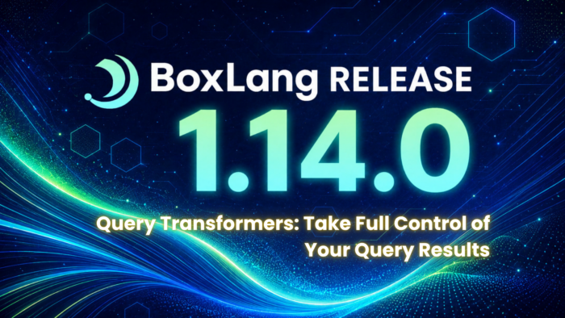

BoxLang 1.14.0 ships a lot of exciting features -- Dynamic Sets, Ranges, Inner Classes, JSONPath navigation -- but one quietly powerful addition will change the way you think about every database call in your application: **Query Transformers**, and this is just the start, we have plans for a whole lot more cool query features.

If you have ever executed a query and then immediately written a loop to reshape the result into what you actually needed, this feature is for you.

## The Problem with Three Return Types

For years, `queryExecute()` and `bx:query` have offered three hardcoded return formats:

* `returnType: "query"` -- a BoxLang Query object
* `returnType: "array"` -- an array of structs
* `returnType: "struct"` -- a struct keyed by a column

That covers the basics, but real applications want more. A REST API might need an envelope with pagination metadata. A domain layer might want hydrated objects instead of raw rows. A data pipeline might want a columnar tabular format to minimize allocations. A schema introspection tool might want full JDBC column descriptors alongside the data.

The old answer was post-processing: execute, then immediately loop, map, or transform the result in a separate step. For large result sets that means double the memory, double the work, and boilerplate scattered everywhere.

**Query Transformers eliminate that step entirely.**

## What Is a Query Transformer?

A transformer is a callable you attach to any `queryExecute()` call via the `transformer` option. BoxLang executes your SQL, materializes the result set, then passes the raw Query object and execution metadata directly to your transformer. Whatever your transformer returns becomes the result of the `queryExecute()` call -- no second pass required.

Three forms are accepted:

|       Form       |                      When to Use                      |
|------------------|-------------------------------------------------------|
| Closure / Lambda | Inline, one-off transforms                            |
| Class instance   | Reusable, testable transformer logic                  |
| String name      | App-wide registered transformers via `Application.bx` |

One rule to remember: **when** `transformer` **is present** , `returnType` **is ignored**. The transformer always wins.

## The Transformer Contract

Every transformer receives exactly two arguments:

`query` -- the raw Query object. Everything you need is here:

```java
query.recordCount          // number of rows
query.getColumnNames()     // Array of column name strings
query.getColumnMeta()      // Struct of column JDBC metadata (new in 1.14.0)
query.toArrayOfStructs()   // Array of row structs
query.getData()            // Raw 2D array of row data
```

`metadata` -- a struct with execution context:

```java
metadata.sql               // the SQL string that was executed
metadata.parameters        // bound parameter values
metadata.executionTime     // milliseconds
metadata.columnMetadata    // JDBC column descriptors
```

Both arguments arrive after the result set has been closed, so you have access to every property without worrying about cursor state.

## Live Examples: Inline Closures

### 1. Envelope with Metadata

The most common pattern in REST APIs -- wrap the rows in a response envelope that includes pagination info and the originating SQL for debugging.

```java
var result = queryExecute( "SELECT * FROM users WHERE active = 1", [], {
    datasource: "app",
    transformer: ( query, meta ) => {
        return {
            data       : query.toArrayOfStructs(),
            total      : query.recordCount,
            executedAt : now(),
            sql        : meta.sql
        }
    }
} )

// result.data     => [ { id:1, name:"Alice", ... }, ... ]
// result.total    => 42
// result.sql      => "SELECT * FROM users WHERE active = 1"
```

No second pass. No separate wrapper function. The envelope is the result.

### 2. Domain Object Hydration

Map each row directly into a domain object in a single expression. This pairs cleanly with the new class-reference-as-constructor feature also introduced in 1.14.0.

```java
var users = queryExecute( "SELECT * FROM users", [], {
    datasource: "app",
    transformer: ( query, meta ) -> query.toArrayOfStructs().map( row -> new User( row ) )
} )

// users => [ User{...}, User{...}, ... ]
```

Because `map()` accepts a class reference as a functional constructor, you can compress this even further using our BoxLang 1.14 [Functional Constructors](https://boxlang.ortusbooks.com/boxlang-language/classes#constructors "Functional Constructors") feature.

```java
transformer: ( query, meta ) => query.toArrayOfStructs().map( User )
```

### 3. Tabular Format (Near Zero-Copy)

Some consumers -- charting libraries, data grids, analytics pipelines -- prefer a columnar representation: a list of column names and a 2D array of row values. This avoids allocating a struct per row.

```java
var tabular = queryExecute( "SELECT id, name, price FROM products", [], {
    datasource: "app",
    transformer: ( query, meta ) => {
        return {
            columns : query.getColumnNames(),
            data    : query.getData().map( row => arrayNew( row ) )
        }
    }
} )

// tabular.columns => [ "id", "name", "price" ]
// tabular.data    => [ [1,"Widget",9.99], [2,"Gadget",19.99], ... ]
```

This is the format libraries like Apache Arrow or columnar JSON APIs expect. Previously you would need a custom loop to build it. Now it is a single expression. You can even compress this using BoxLang's Functional BIF expressions `::arrayNew`

```java
data    : query.getData().map( ::arrayNew )
```

### 4. Rich Column Descriptors

The new `getColumnMeta()` method (a prerequisite enhancement shipped alongside transformers) captures JDBC `ResultSetMetaData` that was previously discarded after the cursor closed. Use it to produce schema-aware result sets.

```java
var rich = queryExecute( "SELECT id, name, price, status FROM products", [], {
    datasource: "app",
    transformer: ( query, meta ) => {
        var colMeta = query.getColumnMeta()
        return {
            count   : query.recordCount,
            columns : query.getColumnNames().map( name => {
                var info = colMeta[ name ]
                return {
                    name      : name,
                    type      : info.type,
                    nullable  : info.nullable,
                    readOnly  : info.readOnly,
                    decimals  : info.decimals,
                    maxLength : info.maxLength
                }
            } ),
            data : query.getData().map( row => arrayNew( row ) )
        }
    }
} )

// rich.columns => [
//   { name: "id",     type: "INTEGER", nullable: false, readOnly: true,  decimals: 0,  maxLength: 10 },
//   { name: "name",   type: "VARCHAR", nullable: false, readOnly: false, decimals: 0,  maxLength: 100 },
//   { name: "price",  type: "DECIMAL", nullable: true,  readOnly: false, decimals: 2,  maxLength: 10 },
//   { name: "status", type: "VARCHAR", nullable: true,  readOnly: false, decimals: 0,  maxLength: 20 }
// ]
// rich.data => [ [1, "Widget", 9.99, "active"], ... ]
```

This format is ideal for dynamic data grids, code generators, and API documentation tools that need to understand the shape of data, not just its values.

## Reusable Class Transformers

When the same transformation logic needs to be shared across multiple queries -- or when you want to unit test the transformation independently -- reach for a class transformer.

Any class with a `transform( query, metadata )` method qualifies.

```java
// models/transformers/RichTransformer.bx
class RichTransformer {

    function transform( query, metadata ) {
        var colMeta = query.getColumnMeta()
        return {
            count   : query.recordCount,
            columns : query.getColumnNames().map( name => {
                var info = colMeta[ name ]
                return {
                    name      : name,
                    type      : info.type,
                    nullable  : info.nullable,
                    readOnly  : info.readOnly,
                    decimals  : info.decimals,
                    maxLength : info.maxLength
                }
            } ),
            data : query.getData().map( row => arrayNew( row ) )
        }
    }

}
```

Usage is identical -- just pass an instance:

```java
var transformer = new RichTransformer()

var products = queryExecute( sql, params, { transformer: transformer } )
var orders   = queryExecute( orderSql, orderParams, { transformer: transformer } )
```

The same transformer instance can be reused across any number of queries with no side effects -- the `query` and `metadata` arguments are always fresh per execution.

## Registered App-Level Transformers

For application-wide reuse, register your transformers once in `Application.bx` and reference them anywhere by name.

```java
// Application.bx
this.queryTransformers = {

    "rich" : new models.transformers.RichTransformer(),

    "tabular" : ( query, meta ) => {
        return {
            columns : query.getColumnNames(),
            data    : query.getData().map( row => arrayNew( row ) )
        }
    },

    "json" : ( query, meta ) => serializeJson( query.toArrayOfStructs() ),

    "envelope" : ( query, meta ) => {
        return {
            data       : query.toArrayOfStructs(),
            total      : query.recordCount,
            executedAt : now(),
            sql        : meta.sql
        }
    },

    "domainUsers" : "models.transformers.UserTransformer"

}
```

Now any `queryExecute()` call anywhere in your application can reference these by name:

```java
var rich    = queryExecute( sql, params, { transformer: "rich" } )
var tabular = queryExecute( sql, params, { transformer: "tabular" } )
var json    = queryExecute( sql, params, { transformer: "json" } )
var users   = queryExecute( sql, params, { transformer: "domainUsers" } )
```

The `"domainUsers"` entry is a dotted class path string -- BoxLang resolves it lazily on first use, so you can register class paths for transformers that may not always be loaded.

### Transformer Resolution Order

```html
transformer option:
  ├── instanceof Function/Closure/Lambda
  │     └── invoke( query, metadata )
  ├── Object with "transform" method
  │     └── invoke transform( query, metadata )
  └── String name
        └── lookup in this.queryTransformers
              ├── Closure/Lambda  => invoke( query, metadata )
              ├── Class instance  => invoke transform( query, metadata )
              └── Class path str  => instantiate, then transform( query, metadata )
```

## bx:query Component Support

Transformers are not limited to `queryExecute()`. The `bx:query` component accepts a `transformer` attribute as well.

```java
<bx:query
    name="result"
    datasource="app"
    transformer=(( q, m ) => serializeJson( q.toArrayOfStructs() ))>
    SELECT * FROM users WHERE active = 1
</bx:query>
```

Or using a registered name:

```java
<bx:query name="result" datasource="app" transformer="json">
    SELECT * FROM users WHERE active = 1
</bx:query>
```

The `result` variable will contain whatever your transformer returned -- in the JSON example above, a serialized JSON string.

## JDBC Metadata: What `getColumnMeta()` Now Captures

As part of the transformer work, BoxLang now preserves JDBC `ResultSetMetaData` that was previously discarded as soon as the cursor closed. It is available on any query via `getColumnMeta()` -- no transformer required.

|  Property   |            JDBC Source             |                    Description                    |
|-------------|------------------------------------|---------------------------------------------------|
| `type`      | `getColumnTypeName()`              | Database type name (e.g. `VARCHAR`, `INTEGER`)    |
| `nullable`  | `isNullable()`                     | Whether the column accepts NULL                   |
| `readOnly`  | `isReadOnly() / isAutoIncrement()` | Whether the column is read-only or auto-generated |
| `decimals`  | `getScale()`                       | Decimal places for numeric types                  |
| `maxLength` | `getColumnDisplaySize()`           | Max display width for string types                |

```java
var q       = queryExecute( "SELECT id, email, score FROM users" )
var colMeta = q.getColumnMeta()

for ( var name in q.getColumnNames() ) {
    var info = colMeta[ name ]
    println( "#name# -- type: #info.type#, nullable: #info.nullable#, decimals: #info.decimals#" )
}
// id    -- type: INTEGER, nullable: false, decimals: 0
// email -- type: VARCHAR, nullable: false, decimals: 0
// score -- type: DECIMAL, nullable: true,  decimals: 2
```

## Global Query Options

Along with transformers, 1.14.0 also ships application-level and runtime-level query defaults -- no more repeating the same options on every `queryExecute()` call.

### Application.bx

```java
this.queryOptions = {
    timeout      : 30,
    returnType   : "array",
    fetchSize    : 500,
    maxRows      : 0,
    cacheProvider: "default"
}
```

### boxlang.json

```java
"queries": {
    "timeout"      : 0,
    "returnType"   : "query",
    "fetchSize"    : 0,
    "maxRows"      : 0,
    "cacheProvider": "default"
}
```

Priority order is: **per-query option \>** `this.queryOptions` \> `boxlang.json`. Set your application-wide defaults once and override only where needed.

## Upgrade Notes

Query Transformers require no migration. Existing queries are unaffected -- the `transformer` option is purely additive. If you are on 1.13.x, update to 1.14.0 via CommandBox:

```java
"queries": {
    "timeout"      : 0,
    "returnType"   : "query",
    "fetchSize"    : 0,
    "maxRows"      : 0,
    "cacheProvider": "default"
}
```

Or pull the latest Docker image:

```java
docker pull ortussolutions/boxlang:1.14.0
```

## Resources

* [BoxLang 1.14.0 Release Notes](https://boxlang.ortusbooks.com/readme/release-history/1.14.0 "BoxLang 1.14.0 Release Notes")
* [Queries Documentation](https://boxlang.ortusbooks.com/boxlang-language/syntax/queries "Queries Documentation")
* [BoxLang Plans](https://boxlang.io/plans?_gl=1*32z0a5*_gcl_aw*R0NMLjE3NzYzNjQ2MzQudGVzdDEyMw..*_gcl_au*MTY3OTk4MjQwNS4xNzgyMTI1MTI4*_ga*MTI2NTE0Mzk0NC4xNzc0MDMxMDk0*_ga_D1P6P1YYT0*czE3ODIyOTUwODkkbzg3JGcwJHQxNzgyMjk1MDg5JGo2MCRsMCRoMA..*_ga_663JFQ7YGX*czE3ODIyOTUwODkkbzk4JGcwJHQxNzgyMjk1MDg5JGo2MCRsMCRoMA.. "BoxLang Plans")
* [BoxLang Community](https://community.ortussolutions.com/ "BoxLang Community")

Have a transformer pattern you are using in production? Share it in the [Ortus Community](https://community.ortussolutions.com/ "Ortus Community") -- we would love to feature real-world examples in the docs.
