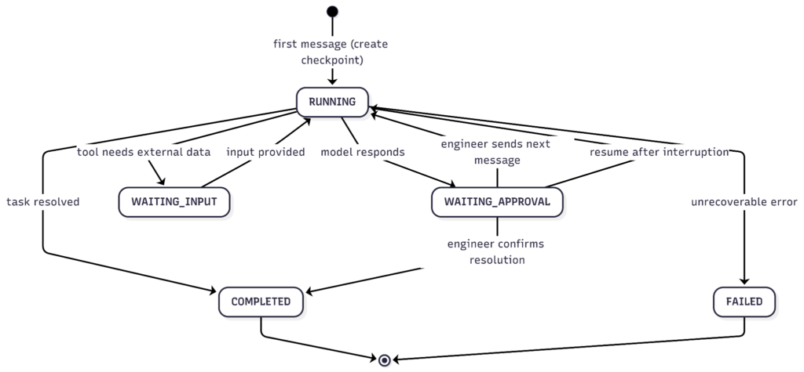

This is the third and final article in the series. [Part 1](https://foojay.io/today/building-an-ai-powered-operations-assistant-with-spring-ai-and-mongodb-atlas-part-1-rag-foundation/) covered the RAG foundation — loading runbooks into a vector store and grounding model answers in real documentation. [Part 2](https://foojay.io/today/building-an-ai-powered-operations-assistant-with-spring-ai-and-mongodb-atlas-part-2-conversational-memory/) added short-term and long-term conversational memory. This article introduces stateful workflow checkpointing, tool calls, and a pause/resume mechanism that lets multi-step investigations survive session boundaries.

## The Remaining Gap

Where were we? At the end of [Part 2](https://foojay.io/today/building-an-ai-powered-operations-assistant-with-spring-ai-and-mongodb-atlas-part-2-conversational-memory/) of our tutorial, we have an assistant capable of sustaining a conversation consisting of multiple exchanges and remembering the information exchanged across multiple sessions. For example, an operator can ask multiple questions regarding a CPU spike alert and will receive responses from the assistant that build upon one another, taking into account their preferences or past choices. In fact, across all sessions, the assistant will remember when the operator expressed a preference for using Helm charts for rollback operations and the fact that the payments service runs on a Kubernetes infrastructure consisting of 16 pods.

We are still one step away from making everything truly complete. Suppose our operator, in the middle of an investigation, needs a break, since we are, after all, human beings. The operator steps away for half an hour, and upon returning from the break, wants to continue the investigation.

Short-term memory is present; it saves every message exchange between the assistant and the operator within [MongoDB](https://www.mongodb.com/?utm_campaign=devrel&utm_source=third-party-content&utm_medium=cta&utm_content=agentic-foojay-part3&utm_term=hugh.murray), but we are unable to correctly represent the concept of a paused task. At this moment, the assistant is unable to understand where we are in the investigation, which decisions remain pending, and which automatic checks it has already performed and which still remain to be performed. The only way to reconstruct the conversation is through its history, but this can only happen if the user explicitly requests to review it.

This gap is particularly pronounced in an activity like this, as real incidents are rarely resolved in a single uninterrupted session. If we consider real-world production scenarios, an incident is rarely confined to a single point, and its resolution rarely involves a single operation. Furthermore, the impact of the resolution often affects various areas of operations (cloud engineers, security experts, storage, networking, etc.), with actions requiring approval from each expert in their respective domains. If we want to build an assistant capable of managing this complexity, we need to take a step forward.

## What We Are Building

In this third part, we will introduce a checkpoint system: each ongoing conversation will be enhanced with a persistent document that tracks the current state of the workflow, the overall status of the investigation, every call made to external tools, and all the information needed to resume the investigation intelligently following an interruption.

In addition to this, we will add another feature, the first active one, which is a [Spring AI tool](https://www.mongodb.com/company/blog/product-release-announcements/elevate-your-java-applications-mongodb-spring-ai/?utm_campaign=devrel&utm_source=third+party+content&utm_medium=Call+to+action+link&utm_content=agentic-foojay-part3&utm_term=marissa.doherty) that the model can invoke to retrieve a real-time list of service metrics. Up until now, the assistant has been purely reactive: it receives questions, reads the runbooks, and responds. With this new feature, the assistant is able to analyze the current state of a service and use that information to enrich its reasoning.

Finally, we will combine all these features with the ability to pause and resume a conversation: with a single call to an API, the assistant will be able to rehydrate the state within the context, picking up exactly where the conversation left off.

## The Core Idea: Externalizing Workflow State

Let's quickly review a few concepts: an LLM on its own is a stateless object. Each call starts without any prior context. The memory layer we added in Part 2 of the tutorial adds continuity to our conversation, but it lacks one key element: it doesn't provide the model with any information about which task is currently in progress.

The checkpoint pattern resolves this issue by storing the state of tasks in MongoDB, outside the model. The underlying idea is to reconstruct the state of the investigation using an external tracking record, rather than reconstructing it by going back through the conversation history. At every step, the model knows exactly where it is, without having to reconstruct this information.

We see the same principle applied to distributed systems in an attempt to make them resilient: systems must not rely on their own internal memory, which cannot survive restart operations. The state is externalized into a durable object so that any process that needs to know the exact state of the work can retrieve it from this point.

## The Checkpoint Document

Let's try to outline and structure our checkpoint document. One possible structure for the checkpoints collection is as follows:

* *conversationId*: links the checkpoint to the conversation and to short-term memory
* *taskId*: identifier for the operational task currently being executed
* *workflowName* : a human-readable label associated with the workflow (e.g., *incident* -*investigation*)
* *currentStep* : a string describing the current phase of the workflow (e.g., *INIT* , *PROCESSING* , and *WAITING_APPROVAL*)
* *status* : an enumeration representing the status (e.g., *RUNNING* , *WAITING_APPROVAL* , *COMPLETED* , and *FAILED*)
* *stateData* : a key-value map *\<String, Object\>* that allows for the collection of data and facts during the conversation, such as the model's latest response, timestamps, and any intermediate results from diagnostic activities.
* *toolExecutionRefs* : a list of IDs pointing to *ToolExecution*documents that track every tool call made during the investigation
* *expiresAt*: a timestamp with a TTL index used to clean up checkpoints that are no longer useful. Set this TTL to span a realistic incident lifetime (hours or days, not minutes) so an investigation paused overnight isn't deleted before the operator resumes it. In production, you would typically expire only terminal checkpoints (COMPLETED or FAILED) rather than active ones.

The document is designed to be flexible, utilizing the *stateData*map to include all necessary information to support the status.

## Checkpoint Lifecycle

The checkpoint lifecycle is managed entirely by the *CheckpointService*class. This class allows us to create a checkpoint, advance it by one step, load the latest checkpoint for a conversation, add a reference to the execution of an operation on an external tool, and finally mark it as completed or failed.

The key method that enables this transition is the *updateStep* method: this method loads the latest checkpoint for the current conversation into memory, sets the new step by assigning it a name and a status, merges all data in the *stateData* map with the current map, and increases the expiration time in the *expiresAt*field. Every change is made to the current state document, which represents the current state of the investigation.

Let's now see how the state machine governing this model works.

The checkpoint is created when the first message is received in the conversation. The *ChatController* calls the method *checkpointService.loadLatest(conversationId)* before processing each request; if the result of this call is empty, a new checkpoint is created in the *RUNNING* state at the *INIT* step. All subsequent messages will find the existing checkpoint, advance it to *PROCESSING,* and then to *WAITING_APPROVAL*after the model's response.

*WAITING_APPROVAL* is the state between message exchanges: after each response from the model, the assistant writes the latest exchanged messages into the *stateData* and sets the state to *WAITING_APPROVAL*. From the checkpoint's perspective, the model has produced a response and is now waiting for the operator to decide how to proceed.

## Giving the Model the Ability to Observe The Systems

The assistant we built together in Parts 1 and 2 has a major limitation: it is purely passive. It is certainly capable of retrieving information and remembering the conversations we've had, but it cannot interact with any running systems.

In this final part, we will add the first active capability to our assistant: the *ServiceStatusTool*. Clearly, this is just an example, but it can be used to further evolve the assistant and expand its capabilities in line with business needs.

Spring AI allows us to annotate a method with the *@Tool* annotation so that it can be called by a model. In our case, the *ChatClient* has been configured to call the *ServiceStatusTool* via the *defaultTools(serviceStatusTool)* method: this way, the model is now aware that it can call the *getServiceStatus(serviceName, environment)* method when it needs real-time information on CPU, memory, error rate, and metrics for a particular service.

The really special thing about this interaction is that the model decides on its own when to call the tool: the moment the operator asks for the health status of the payment service, the model calls the tool and retrieves the data in real time, without having to make any guesses or assumptions.

For obvious reasons, in our tutorial example, the returned metrics are all mocked, showing degraded service values (CPU at 87%, memory at 62%, and latency at the 99th percentile of 1240ms). In real life, this mocked call must be replaced with a call to an observability platform, such as Datadog, Dynatrace, or New Relic, or to any other platform used. But the strength of this model resides precisely in this: the entire chain remains unchanged, and work is done at the edges.

## Propagating Context Into Tool Methods

Methods annotated with *@Tool* are plain Java methods: they have no access to HTTP calls, the *ChatClient*, or anything else in the application stack. Nothing, except what is specifically made available to them when the method is invoked or loaded into the current thread.

This is a problem, as the tool must have access to the ID of the current conversation to log and write an audit record linking to the active investigation. The easy solution would be to add an additional parameter to the method, but this would mix operational concepts with audit concepts.

It's better to take a different approach: we'll use the JVM's *ThreadLocal* through a *ConversationContextHolder* class, which allows us to interact with the *ThreadLocal* at points where we need to insert information related to the conversation context. This is a well-known pattern in which we store context information for auditing purposes in *ThreadLocal* . When we need to add, modify, or delete information, we interact directly with the *ThreadLocal*, which then acts as a transport mechanism throughout the call flow.

The important thing to note is that *ThreadLocal*is, by its very nature, thread-confined: a value set for one request stays on that request's thread. One caveat worth stating: because servers reuse threads from a pool, the holder must be cleared once the request finishes (for example, in a finally block), or a stale conversation ID can carry over to the next request that reuses the thread.

## Audit Trails with ToolExecution

Each call to a method annotated with *@Tool* writes a *ToolExecution* document to the *tool_executions*collection, recording the execution ID, the conversation ID, the tool name, the inputs provided by the model, the response returned to the model, the status, and the start and end timestamps.

This workflow consists of two key parts:

* First, we append the *executionId* to the list in the *toolExecutionRefs*checkpoint document, so we have a reference to which tools were called, and, if more information is needed, we can look up the details.
* Second, we create a document within the *tool_executions*collection to track what was done during the tool call, ensuring auditability and visibility into the steps taken.

All of this is done with the goal of having as much visibility as possible into the operations performed by the assistant: we are not trying to make our system infallible, but we are making it readable and understandable when unexpected situations occur.

## Pause, Inspect, Resume

Now that we've built the foundation, it's time to expose the functionality to the graphical interface. We'll do this by exposing two new endpoints within the *ChatController*:

* *GET /api/ops/chat/{conversationId}/state* returns the current checkpoint for the specified conversation. The demo UI calls this endpoint after every chat response to visually highlight the workflow's status.
* *POST /api/ops/chat/{conversationId}/resume* is the core of the pause/resume mechanism. This API is triggered when an operator pauses and resumes an investigation, or when the conversation is handed off to a second operator. The controller loads the latest available checkpoint, sets it to the *RUNNING* state, and constructs a prompt to initiate resumption: this prompt includes the contextual information present within the *stateData* map. This structured content is injected as a user message for the new call to the *ChatClient* . After receiving the response that provides all the information needed to resume the investigation, the checkpoint is set back to the *WAITING_APPROVAL*state, and the cycle continues.

## A Demo Scenario

It's time to test what we've built. As usual, let's start our application and navigate to the UI at[http://localhost:8080](http://localhost:8080/). This time, let's try typing the following into the chat: *"The payment service CPU alert just fired. What should I check first?"* The assistant will respond with diagnostic steps based on our runbooks. Behind the scenes, however, a lot is happening:

* A checkpoint has been created with a *RUNNING*status.
* The model called the *getServiceStatus("payment-service", "prod")* tool.
* A *ToolExecution*document was written to MongoDB.
* The *executionID*was linked to the checkpoint.
* The checkpoint transitions to *WAITING_APPROVAL* status with the question and answer saved in the *stateData*map.

At this point, refreshing the Workflow State panel will display the status of our workflow, which will show as *WAITING_APPROVAL* , in the *WAITING_APPROVAL* step, with the name *incident-investigation* and a record representing the tool call just made.

Let's now attempt the recovery activity by closing the browser and then reopening it. At this point, enter the conversation ID into the recovery flow (or, in a more advanced model, select the activities to resume from our list) and click the Resume Task button.

After clicking Resume, the assistant will respond that we are investigating high CPU usage on the payment service and will recommend a next step, aligned with what has been done so far.

## What This Architecture Makes Possible

If we look at what we've done to build our assistant, we'll find one constant. That constant is in this prototype; MongoDB functions as a unified persistence layer managing four different aspects:

* Structured knowledge (runbooks within the *knowledge_chunks* collection)
* Conversation session history (short-term memory)
* Long-term personal knowledge
* Workflow status (checkpoints and audit logs)

Each of these features has a different access pattern, ranging from vector similarity search to key lookup by conversation ID, all within the same cluster, with a single infrastructure to maintain and manage.

This unified modeling offers unique advantages, especially when it comes to future developments. In fact, whenever we add a new feature, we don't need to add a new piece of infrastructure, which would certainly increase operational overhead. Keeping everything together doesn't necessarily reduce complexity, but it allows us to centralize it in a single location.

The chain of advisors we built with Spring AI also deserves a final mention; this was a deliberate architectural choice that allows us, once again, to add functionality without touching the entry and exit points of our assistant. The controller is completely unaware of which advisors it will encounter in the chain: it will always call the method *chatClient.prompt()...call()*, and the chain will handle inserting one advisor after another.

## Conclusion

We've reached the end of this series of articles, which has guided us through the creation of an assistant that answers questions using real documentation, maintains consistency within the conversation, and remembers what has been discussed and analyzed. Furthermore, with the final step we took a moment ago, the assistant can also retrieve the status of services in real time and restore that status even after prolonged interruptions.

All of this was possible without building any custom integrations with specific LLMs, vector stores, or abstract memory management frameworks. Spring AI allowed us to do all of this by abstracting the concepts of chat, advisors, memory, vector stores, and MCP tools, using MongoDB as a unified persistence layer. An AI application focused on domain-specific operational logic rather than infrastructural complexities.

The end result is a complete system, ready to be forked and customized: insert real runbooks, modify the mock on the monitoring system to make a real API call, and add new tools to integrate new specific actions for the assistant to perform. This type of architecture allows us to scale horizontally with the application, as well as the [MongoDB Atlas](https://www.mongodb.com/cloud/atlas/register?) cluster, since the workflow state lives in MongoDB rather than in any single instance's memory. All that's left is to test the assistant and wait for the next incident.

The code for this article is available in the following [repository](https://github.com/matteoroxis/operations-assistant). Modify the content with different runbooks and documentation to see how it behaves in different use cases.
