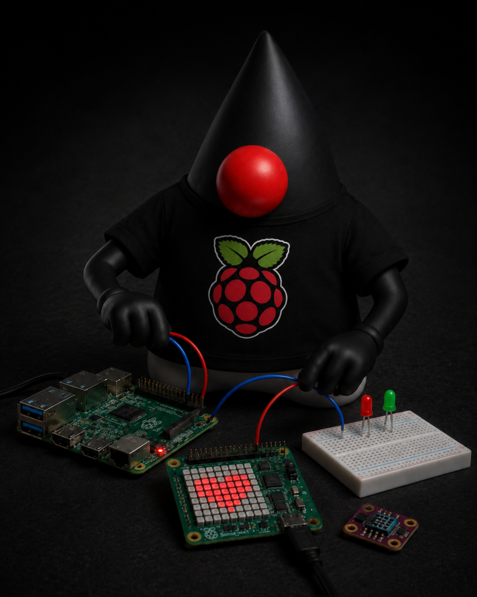
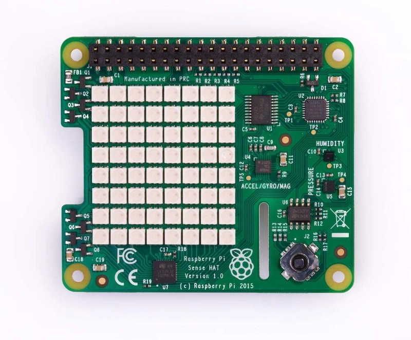

<figure class="alignleft is-resized">
 
</figure>

One of the biggest advantages of the Pi4J Drivers project is the ability to interact with complex hardware through simple and intuitive Java APIs. A great example of this is the Raspberry Pi Sense HAT, one of the most popular Raspberry Pi add-on boards and the hardware platform used in the Astro Pi program aboard the International Space Station.

Instead of manually implementing communication with multiple sensors and devices, Pi4J Drivers provides a ready-to-use driver that makes accessing the Sense HAT straightforward and enjoyable.

What is the Sense HAT?
----------------------

The Raspberry Pi Sense HAT is a feature-rich expansion board that combines multiple sensors and interactive components into a single device. Originally designed for educational and scientific applications, it has become one of the most widely used Raspberry Pi add-ons for learning, experimentation, and prototyping.

The board includes several built-in components:

* 8×8 RGB LED Matrix
* 5-button Joystick
* Temperature Sensor
* Humidity Sensor
* Pressure Sensor
* Accelerometer
* Gyroscope
* Magnetometer (Compass)

With all these features available on a single board, the Sense HAT is an excellent platform for learning IoT, environmental monitoring, robotics, and hardware programming.


Why is the Sense HAT So Popular?
--------------------------------

The Sense HAT is much more than just a collection of sensors. It has become one of the most recognized Raspberry Pi expansion boards thanks to its versatility, ease of use, and strong educational focus.

One of the main reasons for its popularity is its connection to the Astro Pi program, an initiative created in partnership with the European Space Agency (ESA). Through Astro Pi, students from around the world have the opportunity to write code that runs on Raspberry Pi computers aboard the International Space Station (ISS). The Sense HAT was selected as a key component of these missions because it provides a rich set of environmental and motion sensors, allowing students to perform real scientific experiments in space.

This unique connection has helped introduce thousands of students and developers to Raspberry Pi and physical computing, making the Sense HAT one of the most iconic Raspberry Pi accessories available today.

Beyond its role in Astro Pi, the Sense HAT is widely used for:

* STEM and computer science education
* IoT and environmental monitoring projects
* Robotics applications
* Data logging and analytics
* Prototyping and hardware experimentation

Because the board combines multiple sensors, a joystick, and an 8×8 RGB LED matrix in a single package, developers can build complete applications without purchasing additional hardware. This makes the Sense HAT an excellent platform for learning both software and electronics while keeping projects affordable and easy to reproduce.

Java, Education, and the Journey to Space
-----------------------------------------

The Sense HAT is also an exciting opportunity for the Java community to expand its presence in education and maker initiatives. Over the past few years, there has been growing interest in bringing Java back into STEM education, physical computing, and Raspberry Pi projects.

One example is the Foojay Education Catalog, an initiative that helps educators, students, and developers discover Java learning resources, projects, and educational content. The catalog aims to make Java more accessible and showcase how the language can be used beyond traditional enterprise applications.

At the same time, there are ongoing discussions within the Java community about increasing Java's presence in programs such as the Code Club, the global coding initiative supported by the Raspberry Pi Foundation. Introducing Java alongside existing educational technologies would provide students with another powerful language for learning programming, software engineering, and hardware integration.

Another exciting possibility is bringing Java to the Astro Pi program. Since Astro Pi projects already use Raspberry Pi hardware equipped with the Sense HAT aboard the International Space Station, enabling students to develop and run Java applications would open the door to an incredible experience: writing Java code that literally runs in space.

For many young developers, the idea of creating a Java application, deploying it to a Raspberry Pi, and having it execute experiments aboard the ISS could be a powerful source of inspiration. It demonstrates that Java is not only a language for servers and enterprise systems but also a platform for education, science, IoT, robotics, and even space exploration.

<https://astro-pi.org>

Why Use Pi4J Drivers?
---------------------

Without a dedicated driver, working with the Sense HAT would require interacting with multiple devices over I2C and handling low-level sensor communication manually.

Pi4J Drivers abstracts these details and provides a clean Java API that allows developers to focus on building applications instead of implementing hardware protocols.

Benefits include:

* Simple setup
* Consistent API design
* Less boilerplate code
* Faster development
* Easier maintenance

<https://www.pi4j.com/drivers>

Initializing the Sense HAT
--------------------------

Using the Sense HAT driver starts with creating the Pi4J context and initializing the device.

```
Context pi4j = Pi4J.newAutoContext();
SenseHat senseHat = new SenseHat(pi4j);
```


Once initialized, the board's sensors and LED matrix become available through dedicated APIs.

Reading Environmental Data
--------------------------

One of the most common use cases is collecting environmental information.

```
double temperature = senseHat.getTemperature();
float humidity = senseHat.getHumidity();
double pressure = senseHat.getPressure();

System.out.println("Temperature: " + temperature);
System.out.println("Humidity: " + humidity);
System.out.println("Pressure: " + pressure);
```


With just a few lines of code, your application can access real-time sensor data.

This is one of the key advantages of Pi4J Drivers. Rather than studying datasheets, implementing I2C communication, and managing sensor registers manually, developers can immediately focus on using the collected data within their applications.

Using the LED Matrix
--------------------

The 8×8 RGB LED matrix is one of the most recognizable features of the Sense HAT.  

It can be used to display colors, patterns, animations, and status indicators.

For example:

```
senseHat.fill(0x0000FF); # 0xRRGGBB
```


This immediately turns the entire LED matrix blue.

Applications can use the matrix to display:

* Sensor alerts
* System status
* Animations
* Text messages
* Visual dashboards

The LED matrix is particularly useful for creating interactive projects where visual feedback is important.

Motion and Orientation Data
---------------------------

The built-in accelerometer, gyroscope, and magnetometer allow applications to detect movement and orientation.

Typical use cases include:

* Robotics
* Motion detection
* Navigation systems
* Interactive educational projects
* Gaming applications

Having these sensors available through a unified API dramatically simplifies development and allows developers to experiment with advanced hardware capabilities using only a few lines of Java code.

Learn More with Pi4J Examples
-----------------------------

If you're looking for complete working examples, the Pi4J Examples repository provides practical demonstrations of how to use Pi4J Drivers and supported hardware devices.

Repository:  
<https://github.com/Pi4J/pi4j-examples>

The examples are an excellent starting point for understanding device initialization, sensor reading, LED control, and best practices when developing Java applications on Raspberry Pi.

You can use these examples as learning resources, quick-start templates, or the foundation for your own projects.

An Open Community Resource
--------------------------

To support the growing community of Raspberry Pi enthusiasts, educators, and Java developers, I've started an open GitHub project called Pi4J Sense HAT Playground. The goal is to create a central hub for everything related to the Sense HAT, bringing together documentation, hardware references, Pi4J examples, Java libraries, educational resources, Astro Pi information, project ideas, and practical tutorials. Instead of searching across multiple websites, blog posts, and repositories, you'll find a curated collection of resources in one place. Whether you're just getting started or building advanced STEM and IoT projects, I hope this repository becomes a valuable reference for learning, experimenting, and sharing knowledge. Contributions, feedback, and new ideas are always welcome as the project continues to grow.

<https://github.com/igfasouza/Pi4J-Sense-HAT-Playground>

Conclusion
----------

The Sense HAT is one of the most feature-rich Raspberry Pi expansion boards available, combining environmental sensors, motion sensors, a joystick, and a programmable LED matrix into a single device.

Its role in the Astro Pi program and its presence aboard the International Space Station have made it a favorite platform for education, experimentation, and innovation.

Thanks to Pi4J Drivers, Java developers can access all of these capabilities through simple and maintainable APIs without worrying about low-level communication details.

Whether you're building educational projects, IoT solutions, dashboards, robotics applications, or simply exploring what Raspberry Pi hardware can do, the combination of Sense HAT and Pi4J Drivers provides a powerful and accessible platform for hardware development with Java.

If you're ready to get started, be sure to explore both the Pi4J Drivers and Pi4J Examples repositories and see how quickly you can bring your hardware ideas to life.

<br />
