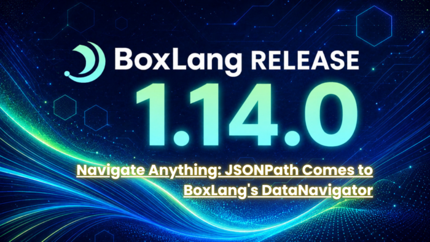

Every application eventually has to deal with deeply nested data. JSON API responses with payloads six levels deep. Configuration files where the key you need is buried inside an array of objects, one of which has a `null` for the field you thought was required. Module metadata structures that nobody wrote a schema for. Runtime introspection data shaped like a tree that grew without a plan.

BoxLang introduced DataNavigators in version 1 so you can use `dataNavigate()`, call `.from()` to scope down, chain your `.get()` calls, provide defaults everywhere. Clean and safe. But even with the fluent API, extracting a specific slice of a complex payload still required multiple navigator hops, or a loop, or defensive key-exists checks stacked three levels deep.

BoxLang 1.14.0 changes that. The `DataNavigator` now understands **JSONPath-style path expressions** natively, and a new `query()` method lets you fan out across a structure and collect every match in a single call. Less ceremony. More signal.

## A Quick Refresher: What is the DataNavigator?

The `DataNavigator` is BoxLang's fluent helper for safely moving through nested data structures: Structs, Arrays, parsed JSON, configuration documents, runtime metadata. The key feature is that it never throws when a path doesn't exist -- it returns a null, a default, or an empty navigator depending on how you call it.

```java
// The old way -- three levels of structKeyExists
if ( structKeyExists( config, "database" ) ) {
    if ( structKeyExists( config.database, "connection" ) ) {
        maxSize = config.database.connection.pool?.maxSize ?: 10
    }
}

// With DataNavigator
maxSize = dataNavigate( config ).get( ["database", "connection", "pool", "maxSize"], 10 )
```

You create a navigator with the `dataNavigate()` BIF, which accepts a Struct, a JSON string, a file path to a JSON file, or a Java Map. From there, you use `.from()` to scope, `.has()` to check, `.get()` / `.getOrThrow()` to extract.

That API still works exactly as it always did. What 1.14.0 adds is a compact expression language that you can drop directly into those same methods.

## What Is New in 1.14.0

Four focused additions to the `DataNavigator`:

| DataNavigator 1.14.0 additions |    Type    |
|--------------------------------|------------|
| `get( "dot.path[0]" )`         | JSONPath   |
| `has( "..recursive" )`         | JSONPath   |
| `from( "dot.path" )`           | JSONPath   |
| `query( "path[*].key" )`       | NEW: multi |
| `getOrDefault( key, v )`       | NEW: safe  |
| `getByKey( "x.y" )`            | NEW: exact |
| `hasByKey( "x.y" )`            | NEW: exact |

* **JSONPath expressions in** `get()`, `has()`, `from()` -- when you pass a single string containing` . `or `[`, it is treated as a path expression. Multi-argument and plain key calls behave exactly as before.
* `query(path)` -- returns every match as a BoxLang Array. Wildcards, slices, filters, and recursive descent can produce multiple matches; `query()` collects them all.
* `getOrDefault(key, value)` -- an explicit-fallback variant of `get()`. Guaranteed non-null. Cleaner than the null-check pattern.
* `getByKey(key)` / `hasByKey(key)` -- exact key lookup where dots and brackets are literal, not separators. For payloads that have keys like `"db.host"` as an actual key name.

## The Path Expression Syntax

BoxLang's JSONPath dialect covers the operations that matter day-to-day. Here is the full reference:

Path Expression Syntax

### Path Expression Syntax

|         Path expression         |                     Meaning                     |
|---------------------------------|-------------------------------------------------|
| `boxlang.settings.hello`        | Dot notation: navigate nested struct keys       |
| `keywords[1]`                   | Array index: 1-based, returns that element      |
| `..hello`                       | Recursive descent: first match anywhere in tree |
| `items[*].name`                 | Wildcard: all elements, then `.name` on each    |
| `keywords[1:3]`                 | Slice: 1-based inclusive range                  |
| `keywords[3:]`                  | Open-ended slice: index 3 to end                |
| `items[?(@.active == true)]`    | Filter: elements matching a condition           |
| `items[?(@.priority > 2)]`      | Filter: numeric comparison                      |
| `items[?(@.active && @.n > 2)]` | Filter: combined AND condition                  |
| `items[?(@.email)]`             | Filter: existence check, truthy field           |
| `items[?(@.active)].name`       | Filter + key: extract field from matches        |

Whitespace is tolerated anywhere:

|   Expression with whitespace   |   Equivalent expression    |
|--------------------------------|----------------------------|
| `"boxlang . settings . hello"` | `"boxlang.settings.hello"` |
| `"keywords [ * ]"`             | `"keywords[*]"`            |

Trigger rule:

* A single string with `.` or `[` is treated as a path expression.
* Multiple arguments or strings with no separators keep the original variadic key behavior.

All of this syntax is available inside `get()`, `has()`, `from()`, and `query()`.

## Real-World Scenarios

### Scenario 1: Processing an API Response

You are consuming a third-party REST API. The payload looks like this:

```java
{
  "status": "ok",
  "data": {
    "store": {
      "products": [
        { "id": 1, "name": "Keyboard", "price": 149.99, "inStock": true,  "category": "hardware" },
        { "id": 2, "name": "Mouse",    "price": 49.99,  "inStock": false, "category": "hardware" },
        { "id": 3, "name": "License",  "price": 299.00, "inStock": true,  "category": "software" },
        { "id": 4, "name": "Cable",    "price": 9.99,   "inStock": true,  "category": "hardware" }
      ]
    }
  }
}
```

Before 1.14.0, pulling in-stock product names required navigating to the array and then looping:

```java
// Pre-1.14.0
products = dataNavigate( apiResponse )
    .from( ["data", "store", "products"] )
    .get( [] )

inStockNames = products
    .filter( p -> p.inStock )
    .map( p -> p.name )
```

With JSONPath expressions in 1.14.0, the navigator handles the traversal and filter in a single call:

```java
nav = dataNavigate( apiResponse )

// All in-stock product names in one expression
names = nav.query( "data.store.products[?(@.inStock == true)].name" )
// => [ "Keyboard", "License", "Cable" ]

// Only hardware items over $50
expensive = nav.query( "data.store.products[?(@.category == 'hardware' && @.price > 50)]" )
// => [ { id:1, name:"Keyboard", price:149.99, ... } ]

// First in-stock product (single result)
first = nav.get( "data.store.products[?(@.inStock == true)]" )
// => { id:1, name:"Keyboard", ... }

// Total product count (safe, with default)
count = nav.getOrDefault( "data.store.meta.count", 0 )
// => 0 (field doesn't exist, default returned cleanly)
```

Note the distinction: `get()` returns the **first match** . `query()` returns **all matches** as an Array.

### Scenario 2: Configuration Introspection

You are writing a module that needs to inspect the runtime's `boxlang.json` and extract settings across nested paths. Some keys may or may not be present depending on the deployment environment.

```java
config = dataNavigate( server.system.config )

// Dot-path reads -- no chained .from() calls needed
logLevel   = config.getOrDefault( "logging.level", "WARN" )
datasource = config.getOrDefault( "defaultDatasource", "main" )
cacheMax   = config.getOrDefault( "caches.default.maxObjects", 1000 )

// Recursive descent -- find any "timeout" key anywhere in the config tree
// useful when you don't know the exact nesting
timeout = config.get( "..timeout", 30 )

// Existence check before consuming an optional section
if ( config.has( "modules.bx-ai.providers[*]" ) ) {
    providers = config.query( "modules.bx-ai.providers[*].name" )
    // => [ "openai", "anthropic", "bedrock" ]
}

// Keys that literally contain dots (common in Java-style property files)
// Use getByKey() to skip path parsing entirely
jdbcUrl = config.getByKey( "datasources.main.db.url" )
//                          ^ treated as ONE literal key, not a path
```

The `getByKey()` / `hasByKey()` distinction matters whenever your data was shaped by a Java properties system, a dotted-key config library, or any payload where a key name contains` .` or `[` as real characters.

### Scenario 3: Wildcard and Slice Extraction

You have a module's metadata struct and want to extract specific slices for a dashboard or diagnostic tool.

```java
moduleData = {
    "name": "bx-ai",
    "version": "3.2.0",
    "providers": [
        { "name": "openai",    "models": [ "gpt-4o", "gpt-4-turbo", "gpt-3.5-turbo" ] },
        { "name": "anthropic", "models": [ "claude-opus-4-5", "claude-sonnet-4-5" ] },
        { "name": "bedrock",   "models": [ "titan", "llama3" ] }
    ],
    "settings": {
        "timeout": 30,
        "retries": 3,
        "debug": false
    }
}

nav = dataNavigate( moduleData )

// All provider names
nav.query( "providers[*].name" )
// => [ "openai", "anthropic", "bedrock" ]

// First two providers only (slice)
nav.query( "providers[1:2]" )
// => [ { name:"openai", ... }, { name:"anthropic", ... } ]

// All model names across all providers -- wildcard + wildcard
nav.query( "providers[*].models[*]" )
// => [ "gpt-4o", "gpt-4-turbo", "gpt-3.5-turbo", "claude-opus-4-5", ... ]

// All settings values (wildcard on struct)
nav.query( "settings.*" )
// => [ 30, 3, false ]

// Providers that have more than 2 models
nav.query( "providers[?(@.models)]" )
// => all providers that have a models field (existence check)
```

## Choosing the Right Method

The four retrieval methods serve distinct purposes. Use this as a guide:

|           Method            |                                             Use when                                              |
|-----------------------------|---------------------------------------------------------------------------------------------------|
| `get(path, dflt)`           | You expect one value; the path may not exist; returns `null` or the default value.                |
| `getOrDefault(path, value)` | Same as `get()`, but you want to guarantee a non-null return with an explicit fallback.           |
| `getOrThrow(path)`          | The value is required. A missing key is a fatal configuration error; fail fast.                   |
| `query(path)`               | You expect multiple matches: wildcards, slices, or filters that fan out. Always returns an Array. |
| `getByKey(key)`             | The key name literally contains `.` or `[`; you want exact lookup with no path parsing.           |

Use `get()` or `getOrDefault()` when a value may or may not exist, `getOrThrow()` when missing data should fail immediately, `query()` when the path can return multiple results, and `getByKey()` when you need literal key lookup instead of path parsing.

One rule of thumb: if your path expression contains` [*]`, `[n:m]`, `..`, or a filter `[?(...)]`, reach for `query()`. These operators can match zero, one, or many nodes. `get()` only returns the first hit and silently drops the rest.

## Putting It All Together

Here is a complete, realistic example: loading and validating a multi-environment application config, then extracting just what you need from each section.

```java
class AppConfigLoader {

    function load( required string environment ) {
        var nav = dataNavigate( expandPath( "/config/app.json" ) )

        // Required fields -- fail fast if missing
        var appName = nav.getOrThrow( "app.name" )
        var appVersion = nav.getOrThrow( "app.version" )

        // Scope to the requested environment
        var envNav = nav.from( "environments.#environment#" )
        if ( envNav.isEmpty() ) {
            throw( type="ConfigError", message="Unknown environment: #environment#" )
        }

        // Gather database settings with defaults
        var db = {
            host:     envNav.getOrDefault( "database.host", "localhost" ),
            port:     envNav.getOrDefault( "database.port", 5432 ),
            ssl:      envNav.getOrDefault( "database.ssl", true ),
            poolMax:  envNav.getOrDefault( "database.pool.maxConnections", 10 )
        }

        // Collect all enabled feature flags
        var enabledFeatures = envNav.query( "features[?(@.enabled == true)].name" )

        // Find the first configured cache provider (recursive descent)
        var cacheProvider = envNav.get( "..cacheProvider", "default" )

        // Any module-level overrides -- wildcard across all modules
        var moduleOverrides = envNav.query( "modules[*].overrides" )

        return {
            name:             appName,
            version:          appVersion,
            environment:      environment,
            database:         db,
            enabledFeatures:  enabledFeatures,
            cacheProvider:    cacheProvider,
            moduleOverrides:  moduleOverrides
        }
    }

}
```

No loops. No null guard towers. No nested `structKeyExists()` chains. The path expressions describe the shape of the data you want, and the navigator handles the traversal.

## Upgrade and Explore

JSONPath support in the `DataNavigator` ships in **BoxLang 1.14.0** , available today. No dependencies to add, no configuration to change. If you are already using `dataNavigate()`, the new expressions are a drop-in enhancement. Existing variadic-key calls are untouched.

Full documentation is at [boxlang.ortusbooks.com/boxlang-language/syntax/data-navigators](https://boxlang.ortusbooks.com/boxlang-language/syntax/data-navigators "boxlang.ortusbooks.com/boxlang-language/syntax/data-navigators").

The complete 1.14.0 release notes, including Dynamic Sets, Ranges, Inner Classes, Query Transformers, and all 65 closed issues, are at [boxlang.ortusbooks.com/readme/release-history/1.14.0](https://boxlang.ortusbooks.com/readme/release-history/1.14.0 "boxlang.ortusbooks.com/readme/release-history/1.14.0").

## Resources

* [BoxLang Documentation](https://boxlang.ortusbooks.com/ "BoxLang Documentation")
* [DataNavigator Reference](https://boxlang.ortusbooks.com/boxlang-language/syntax/data-navigators "DataNavigator Reference")
* [BoxLang 1.14.0 Release Notes](https://boxlang.ortusbooks.com/readme/release-history/1.14.0 "BoxLang 1.14.0 Release Notes")
* [BoxLang Plans and Subscriptions](https://boxlang.io/plans?_gl=1*69yb26*_gcl_au*MzI0MjI3ODM0LjE3NzU1MDUwMDA.*_ga*MTQ4MjQzODA2Ny4xNzc1NTA1MDAw*_ga_D1P6P1YYT0*czE3ODMwMTAzMzUkbzYyJGcwJHQxNzgzMDEwMzM1JGo2MCRsMCRoMA..*_ga_663JFQ7YGX*czE3ODMwMTAzMzUkbzU4JGcwJHQxNzgzMDEwMzM1JGo2MCRsMCRoMA.. "BoxLang Plans and Subscriptions")
* [ForgeBox Module Registry](https://forgebox.io/ "ForgeBox Module Registry")
* [Community Forum](https://community.ortussolutions.com/ "Community Forum")
* [BoxLang on GitHub](https://github.com/ortus-boxlang/BoxLang "BoxLang on GitHub")  
  *BoxLang is a modern, multi-runtime JVM language by [Ortus Solutions](https://www.ortussolutions.com/ "Ortus Solutions"). Built for the web, the cloud, and the command line. Open source, professionally supported.*
