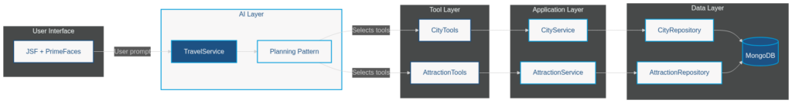
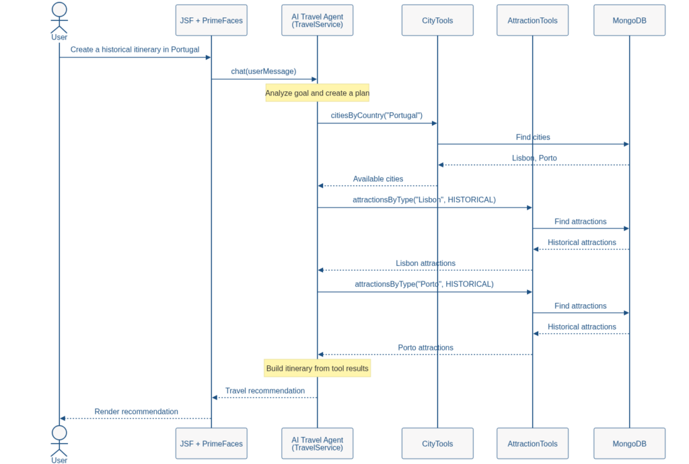
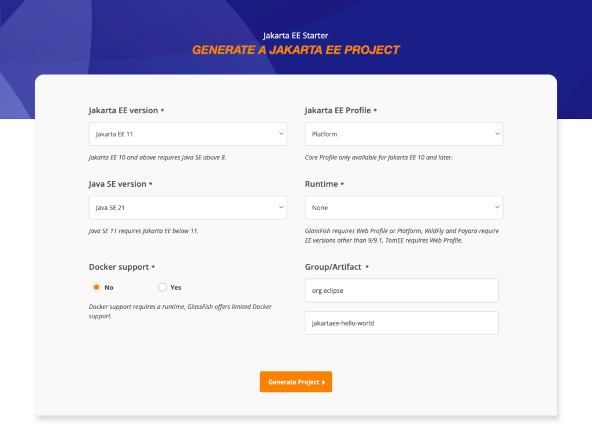

Artificial Intelligence has swiftly evolved from a niche research topic to a technology that impacts nearly every aspect of the software industry. Developers now use AI to generate code, review pull requests, create documentation, and accelerate workflows through methods like vibe coding and specification-driven development. While these applications position AI as an engineering tool, a new trend is emerging: integrating AI directly into business workflows within applications.

This shift offers new challenges for software architects and engineers. Traditional applications rely on deterministic flows, where execution paths are explicitly defined by methods, conditions, loops, and business rules. In contrast, machine learning systems can make decisions during execution, select actions, and adjust dynamically based on context and available information. Architects must therefore design systems that balance the predictability of conventional software with the flexibility of AI-powered reasoning. The Planning Pattern is an effective approach for uniting these domains. Instead of having an LLM address a complex objective in a single step, this pattern breaks the goal into smaller, feasible tasks that interact with deterministic code, external services, and data sources. This creates a more reliable and observable path toward autonomous AI applications.

This tutorial introduces the Planning pattern and demonstrates how to implement it with [MongoDB](https://www.mongodb.com/?utm_campaign=devrel&utm_source=third-party-content&utm_medium=cta&utm_term=hugh.murray).

In this tutorial, you'll:

* Model a simple Travel system.
* Model and interact with MongoDB using Java.
* Explore how MongoDB can help you achieve an AI with a Planning Pattern.

You can find all the code presented in this tutorial in the GitHub repository:

```
[email protected]:soujava/mongodb-ai-planning-pattern.git
```

## Prerequisites

For this tutorial, you'll need:

* Java 21.
* Maven.
* A MongoDB cluster.
  * [MongoDB Atlas](https://www.mongodb.com/cloud/atlas/register?utm_campaign=devrel&utm_source=third-party-content&utm_medium=cta&utm_content=data_driven_test_dev&utm_term=otavio.santana) (Option 1)
  * Docker (Option 2)

You can use the following Docker command to start a standalone MongoDB instance:

```
docker run --rm -d --name mongodb-instance -p 27017:27017 mongo
```

The [Planning Pattern](https://docs.cloud.google.com/architecture/choose-design-pattern-agentic-ai-system) enables an AI system to decompose high-level objectives into smaller, independent actions. Rather than relying solely on internal knowledge, the agent identifies required information and selects deterministic tools, such as databases or REST services. This approach improves reliability, observability, and accuracy by combining the reasoning capabilities of Large Language Models with the predictable behavior of traditional software components.

Unlike architectures that employ a dedicated planner agent or workflow graph, this implementation uses the language model itself as the planner. During execution, the model repeatedly reasons over the user's objective, selects the most appropriate tool, observes the returned data, and decides whether additional actions are required before producing the final response. This Reason--Act--Observe loop provides a lightweight yet highly effective planning architecture that is widely used in modern agentic systems.



To illustrate this pattern, we will develop a travel itinerary assistant. Users may ask questions such as "Show me available cities to travel" or "Create a historical itinerary in Portugal." Rather than relying only on training data, the AI agent will access a MongoDB database of cities and attractions that reflects the offerings available at the travel agency. Based on the user's goal, the agent will select suitable tools, retrieve relevant information, and generate recommendations using real application data.

The implementation uses [Jakarta EE](https://jakarta.ee/) as the application platform, [JSF](https://jakarta.ee/specifications/faces/) and [PrimeFaces](https://www.primefaces.org/) for the user interface, [LangChain4j](https://github.com/langchain4j/langchain4j) for AI integration and tool invocation, and MongoDB for data persistence. [Jakarta Data](https://github.com/jakartaee/data) and [Jakarta NoSQL](https://github.com/jakartaee/nosql) simplify database access by supporting repositories and domain models with minimal boilerplate. Together, these technologies create a practical environment for exploring AI agent collaboration with enterprise applications using the Planning Pattern.


For example, when a user executes any question, this will be the flow that the application will follow:


## Step 1: Generate the Project

Begin by generating a new Jakarta EE project using the [Jakarta EE starter](https://start.jakarta.ee/). For this example, we will use Glassfish version 8.0.3.

Select Jakarta EE 11 as the version, Platform as the profile, and Java 21 as the Java version. Refer to the image below for these options. After selecting them, click "Generate Project" to download your project.


Next, add the required libraries. Jakarta Data streamlines MongoDB integration with Java and supports the Java Enterprise standard. For AI integration, we will use langchain4j with CDI.

MongoDB's document model aligns well with AI-driven applications, which often exchange hierarchical and semi-structured data. This flexibility supports not only attractions with city references but also itineraries, user preferences, recommendations, and conversation history.

Langchain4j serves as an AI orchestrator, using a single interface to manage AI execution, similar to repositories in Spring or Jakarta Data. It allows you to switch AI providers easily, much like changing [JDBC drivers](https://www.geeksforgeeks.org/java/jdbc-drivers/). While databases return deterministic results, AI systems generate probabilistic responses. In this example, we use OpenAI as the provider, but you can change providers by updating the dependency without modifying the code.

For the user interface, we will combine JSF with PrimeFaces components. This approach lets us use existing components efficiently rather than developing new ones.

To simplify execution, we will include the Eclipse GlassFish plugin.

The code below shows the updated dependency.

```
<?xml version="1.0" encoding="UTF-8"?>
<project xmlns="http://maven.apache.org/POM/4.0.0"
         xmlns:xsi="http://www.w3.org/2001/XMLSchema-instance"
         xsi:schemaLocation="http://maven.apache.org/POM/4.0.0 http://maven.apache.org/xsd/maven-4.0.0.xsd">
    <modelVersion>4.0.0</modelVersion>

    <groupId>expert.os.demos</groupId>
    <artifactId>travel-assistance</artifactId>
    <version>1.0.0</version>
    <packaging>war</packaging>

    <name>travel-assistance</name>

    <properties>
        <project.build.sourceEncoding>UTF-8</project.build.sourceEncoding>
        <project.report.sourceEncoding>UTF-8</project.report.sourceEncoding>
        <maven.compiler.release>21</maven.compiler.release>
        <jakartaee-api.version>11.0.0</jakartaee-api.version>
        <compiler-plugin.version>3.15.0</compiler-plugin.version>
        <war-plugin.version>3.5.1</war-plugin.version>
        <jnosql.version>1.1.14</jnosql.version>
        <langchain4j-cdi.version>1.3.3</langchain4j-cdi.version>
    </properties>

    <dependencies>
        <dependency>
            <groupId>dev.langchain4j.cdi</groupId>
            <artifactId>langchain4j-cdi-portable-ext</artifactId>
            <version>${langchain4j-cdi.version}</version>
        </dependency>
        <dependency>
            <groupId>dev.langchain4j.cdi.mp</groupId>
            <artifactId>langchain4j-cdi-config</artifactId>
            <version>${langchain4j-cdi.version}</version>
        </dependency>
        <dependency>
            <groupId>dev.langchain4j</groupId>
            <artifactId>langchain4j-open-ai</artifactId>
            <version>1.16.0</version>
        </dependency>
        <dependency>
            <groupId>org.eclipse.jnosql.databases</groupId>
            <artifactId>jnosql-mongodb</artifactId>
            <version>${jnosql.version}</version>
        </dependency>
        <dependency>
            <groupId>jakarta.platform</groupId>
            <artifactId>jakarta.jakartaee-api</artifactId>
            <version>${jakartaee-api.version}</version>
            <scope>provided</scope>
        </dependency>
        <dependency>
            <groupId>org.primefaces</groupId>
            <artifactId>primefaces</artifactId>
            <version>15.0.16</version>
            <classifier>jakarta</classifier>
        </dependency>
    </dependencies>

    <build>
        <finalName>travel-assistance</finalName>
        <plugins>
            <plugin>
                <groupId>org.apache.maven.plugins</groupId>
                <artifactId>maven-compiler-plugin</artifactId>
                <version>${compiler-plugin.version}</version>
            </plugin>
            <plugin>
                <groupId>org.apache.maven.plugins</groupId>
                <artifactId>maven-war-plugin</artifactId>
                <version>${war-plugin.version}</version>
            </plugin>
            <plugin>
                <groupId>org.glassfish.embedded</groupId>
                <artifactId>embedded-glassfish-maven-plugin</artifactId>
                <version>8.0</version>
                <configuration>
                    <app>target/travel-assistance.war</app>
                    <glassfish.version>8.0.3</glassfish.version>
                    <contextRoot>/</contextRoot>
                    <port>8080</port>
                </configuration>
            </plugin>
        </plugins>
    </build>
</project>
```

Add the following configuration to the web.xml file located at src/main/webapp/WEB-INF/ to enable JSF.

```
<web-app version="6.1"
        xmlns="https://jakarta.ee/xml/ns/jakartaee"
        xmlns:xsi="http://www.w3.org/2001/XMLSchema-instance"
        xsi:schemaLocation="https://jakarta.ee/xml/ns/jakartaee https://jakarta.ee/xml/ns/jakartaee/web-app_6_1.xsd">
   <welcome-file-list>
       <welcome-file>index.xhtml</welcome-file>
   </welcome-file-list>
   <servlet>
       <servlet-name>Faces Servlet</servlet-name>
       <servlet-class>jakarta.faces.webapp.FacesServlet</servlet-class>
       <load-on-startup>1</load-on-startup>
   </servlet>

   <servlet-mapping>
       <servlet-name>Faces Servlet</servlet-name>
       <url-pattern>*.xhtml</url-pattern>
   </servlet-mapping>
</web-app>
```

In the same directory, add the beans.xml file to enable [CDI support](https://jakarta.ee/learn/docs/jakartaee-tutorial/current/cdi/cdi-basic/cdi-basic.html).

```
<?xml version="1.0" encoding="UTF-8"?>
<beans xmlns="https://jakarta.ee/xml/ns/jakartaee"
       bean-discovery-mode="annotated">
</beans>
```

The next step is to configure credentials in the properties file. Set the AI model class, OpenAI API key, and MongoDB connection string. You can override these settings using system environment variables, following the Twelve Factor Application methodology. Ideally, these configurations should be transparent to software developers, and sensitive information should not be hard-coded for security reasons. So create the file: src/main/resources/META-INF/microprofile-config.properties

```
dev.langchain4j.cdi.plugin.chat-model.class=dev.langchain4j.model.openai.OpenAiChatModel
dev.langchain4j.cdi.plugin.chat-model.config.api-key=${OPENAI_API_KEY}
dev.langchain4j.cdi.plugin.chat-model.config.model-name=gpt-5
jnosql.document.database=travels
jnosql.mongodb.url=mongodb+srv://admin:<db_password>@cluster0.gblhb3d.mongodb.net/?appName=devrel-article-java-jnosql
jnosql.mongodb.application.name=devrel-article-java-jnosql
```

## Step 2: Generate the domain classes

Once the setup is complete, the next step is to create the entities: City and its attractions. The annotation approach is similar to Jakarta Persistence (formerly JPA), but each attribute must be marked with either Id or Column annotations. The overall structure remains similar. We will define two entities and one embedded class.

The first class is an enum that will show the options of attraction type:

```
package expert.os.demos.travel.assistance;

public enum AttractionType {
    HISTORICAL,
    NATURE,
    MUSEUM,
    ARCHITECTURE,
    FOOD,
    RELIGIOUS
}
```

The City class serves as the entity representing the City. Notably, this approach is similar to Jakarta Persistence, where the Entity annotation marks a class as persistable. The Id and Column annotations specify which attributes are persistable and whether they serve as identifiers or standard fields.

```
package expert.os.demos.travel.assistance;

import jakarta.nosql.Column;
import jakarta.nosql.Entity;
import jakarta.nosql.Id;

import java.util.UUID;

@Entity
public class City {

    @Id
    private UUID id;

    @Column
    private String name;

    @Column
    private String country;

    @Column
    private String description;

    City() {
    }

    public City(UUID id, String name, String country, String description) {
        this.id = id;
        this.name = name;
        this.country = country;
        this.description = description;
    }

    public UUID getId() {
        return id;
    }

    public String getName() {
        return name;
    }

    public String getCountry() {
        return country;
    }

    public String getDescription() {
        return description;
    }
}
```

The CityReference works as an embeddable defined by the annotation of the same name. Since it can be defined as a Value Type in DDD, we will define it as an immutable class with two attributes. This information will be grouped inside the Attraction as a reference to the city.

```
package expert.os.demos.travel.assistance;

import jakarta.nosql.Column;
import jakarta.nosql.Embeddable;

import java.util.UUID;

@Embeddable(Embeddable.EmbeddableType.GROUPING)
public record CityReference(@Column UUID id, @Column String name) {
}
```

The Attraction uses the same structure as the City. The main difference, aside from the attributes, is the inclusion of an embedded grouping that functions as a subdocument within the Attraction.

```
package expert.os.demos.travel.assistance;

import jakarta.nosql.Column;
import jakarta.nosql.Entity;
import jakarta.nosql.Id;

import java.util.UUID;

@Entity
public class Attraction {

    @Id
    private UUID id;

    @Column
    private CityReference city;

    @Column
    private String name;

    @Column
    private AttractionType type;

    @Column
    private String description;

    Attraction() {
    }

     public Attraction(UUID id, CityReference city, String name, AttractionType type, String description) {
        this.id = id;
        this.city = city;
        this.name = name;
        this.type = type;
        this.description = description;
    }

    public UUID getId() {
        return id;
    }

    public CityReference getCity() {
        return city;
    }

    public String getName() {
        return name;
    }

    public AttractionType getType() {
        return type;
    }

    public String getDescription() {
        return description;
    }
}
```

With the entities complete, the next step is to establish the connection between the Java and MongoDB classes. We will use Jakarta Data with Jakarta NoSQL to leverage interface-based capabilities within Jakarta EE.

```
package expert.os.demos.travel.assistance;

import jakarta.data.repository.BasicRepository;
import jakarta.data.repository.Repository;

import java.util.List;
import java.util.UUID;

@Repository
public interface CityRepository extends BasicRepository<City, UUID> {

    List<City> findByCountry(String country);
}
```

Jakarta Data offers several ways to explore data capabilities. In our scenario, we defined repositories using BasicRepository, which provides multiple database operations. You can query data by method name, such as "findByCountry," to search by specific fields. Additionally, Jakarta Queries functionalities can be accessed using the Query annotation.

```
package expert.os.demos.travel.assistance;

import jakarta.data.repository.BasicRepository;
import jakarta.data.repository.Param;
import jakarta.data.repository.Query;
import jakarta.data.repository.Repository;

import java.util.List;
import java.util.UUID;

@Repository
public interface AttractionRepository extends BasicRepository<Attraction, UUID> {

    @Query("WHERE city.name = :name")
    List<Attraction> findByCityName(@Param("name") String name);

    @Query("WHERE city.name = :name AND type = :type")
    List<Attraction> findByCityNameAndType(@Param("name") String city, @Param("type") AttractionType type);
}
```

The integration between Java and the data layer is complete, and the process was straightforward thanks to the Jakarta EE platform. Now, we will add functionality by implementing three services: an attraction service, a city service, and a setup service that will populate the database with initial data. While you may later consider adding user interface forms for data entry, this feature is not included in the scope of this tutorial.

The service classes will act as orchestrators and manage the repositories. In the following example, CityService will handle operations related to CityRepository.

```
package expert.os.demos.travel.assistance;

import jakarta.enterprise.context.ApplicationScoped;
import jakarta.inject.Inject;

import java.util.List;

@ApplicationScoped
public class CityService {

    private final CityRepository cityRepository;

    @Inject
    public CityService(CityRepository cityRepository) {
        this.cityRepository = cityRepository;
    }

     CityService() {
        this.cityRepository = null;
    }

    public List<City> findByCountry(String country) {
        return cityRepository.findByCountry(country);
    }

    public List<City> findAll() {
        return cityRepository.findAll().toList();
    }

    public City save(City city) {
        this.cityRepository.save(city);
        return city;
    }
}
```

The AttractionService will function similarly to the CityService and will manage all attraction-related operations.

```
package expert.os.demos.travel.assistance;

import jakarta.enterprise.context.ApplicationScoped;
import jakarta.inject.Inject;

import java.util.List;
import java.util.UUID;

@ApplicationScoped
public class AttractionService {

    private final AttractionRepository attractionRepository;

    @Inject
    public AttractionService(AttractionRepository attractionRepository) {
        this.attractionRepository = attractionRepository;
    }

        AttractionService() {
            this.attractionRepository = null;
        }

    public List<Attraction> findByCity(String name) {
        return attractionRepository.findByCityName(name);
    }

    public Attraction save(Attraction attraction) {
        return attractionRepository.save(attraction);
    }

    public List<Attraction> findByType(String city, AttractionType type) {
        return attractionRepository.findByCityNameAndType(city, type);
    }
}
```

The data loader class generates information for our travel agency. In a real-world scenario, this could be achieved through a form or by integrating with a third-party service, such as a REST API. In our example, for simplicity, the data loader checks if the database is empty and then creates data based on three cities and their respective attractions.

```
package expert.os.demos.travel.assistance;

import jakarta.annotation.PostConstruct;
import jakarta.enterprise.context.ApplicationScoped;
import jakarta.inject.Inject;

import java.util.UUID;
import java.util.logging.Logger;

@ApplicationScoped
public class DataLoader {

    private static final Logger LOGGER = Logger.getLogger(DataLoader.class.getName());
    @Inject
    private CityService cityService;

    @Inject
    private AttractionService attractionService;

    @PostConstruct
    public void load() {

        LOGGER.info("Loading sample travel data");

        if (!cityService.findAll().isEmpty()) {
            LOGGER.info("Sample travel data already loaded");
            return;
        }

        City lisbon = cityService.save(new City(
                UUID.randomUUID(),
                "Lisbon",
                "Portugal",
                "Portugal's capital city."
        ));

        City porto = cityService.save(new City(
                UUID.randomUUID(),
                "Porto",
                "Portugal",
                "Historic city in northern Portugal."
        ));

        City paris = cityService.save(new City(
                UUID.randomUUID(),
                "Paris",
                "France",
                "Capital of France."
        ));

        City rome = cityService.save(new City(
                UUID.randomUUID(),
                "Rome",
                "Italy",
                "The Eternal City."
        ));

        loadAttractions(lisbon, porto, paris, rome);
        LOGGER.info("Sample travel data loaded successfully");

    }

    private void loadAttractions(
            City lisbon,
            City porto,
            City paris,
            City rome) {

        attractionService.save(new Attraction(
                UUID.randomUUID(),
                new CityReference(lisbon.getId(), lisbon.getName()),
                "Belém Tower",
                AttractionType.HISTORICAL,
                "UNESCO World Heritage Site."
        ));

        attractionService.save(new Attraction(
                UUID.randomUUID(),
                new CityReference(lisbon.getId(), lisbon.getName()),
                "Jerónimos Monastery",
                AttractionType.RELIGIOUS,
                "Manueline monastery."
        ));

        attractionService.save(new Attraction(
                UUID.randomUUID(),
                new CityReference(lisbon.getId(), lisbon.getName()),
                "Alfama",
                AttractionType.ARCHITECTURE,
                "Historic neighborhood."
        ));

        attractionService.save(new Attraction(
                UUID.randomUUID(),
                new CityReference(porto.getId(), porto.getName()),
                "Ribeira",
                AttractionType.ARCHITECTURE,
                "Riverside district."
        ));

        attractionService.save(new Attraction(
                UUID.randomUUID(),
                new CityReference(porto.getId(), porto.getName()),
                "Livraria Lello",
                AttractionType.MUSEUM,
                "Historic bookstore."
        ));

        attractionService.save(new Attraction(
                UUID.randomUUID(),
                new CityReference(porto.getId(), porto.getName()),
                "Port Wine Cellars",
                AttractionType.FOOD,
                "Wine tasting experience."
        ));

        attractionService.save(new Attraction(
                UUID.randomUUID(),
                new CityReference(paris.getId(), paris.getName()),
                "Eiffel Tower",
                AttractionType.ARCHITECTURE,
                "Paris landmark."
        ));

        attractionService.save(new Attraction(
                UUID.randomUUID(),
                new CityReference(paris.getId(), paris.getName()),
                "Louvre Museum",
                AttractionType.MUSEUM,
                "World-famous museum."
        ));

        attractionService.save(new Attraction(
                UUID.randomUUID(),
                new CityReference(paris.getId(), paris.getName()),
                "Notre-Dame Cathedral",
                AttractionType.RELIGIOUS,
                "Gothic cathedral."
        ));

        attractionService.save(new Attraction(
                UUID.randomUUID(),
                new CityReference(rome.getId(), rome.getName()),
                "Colosseum",
                AttractionType.HISTORICAL,
                "Ancient amphitheater."
        ));

        attractionService.save(new Attraction(
                UUID.randomUUID(),
                new CityReference(rome.getId(), rome.getName()),
                "Roman Forum",
                AttractionType.HISTORICAL,
                "Center of ancient Rome."
        ));

        attractionService.save(new Attraction(
                UUID.randomUUID(),
                new CityReference(rome.getId(), rome.getName()),
                "Vatican Museums",
                AttractionType.MUSEUM,
                "Art and history collections."
        ));
    }
}
```

## Step 3: Defining the AI layer over MongoDB integration

Once all services are available, the next step is to expose them through tools using the [Tool annotation](https://docs.langchain4j.dev/tutorials/tools/), which defines functions the language model can call. Tool classes should provide as much context as possible for these services. Langchain4j will automatically handle the response, which may be returned as JSON and passed to the language model.

The purpose of the tools classes is to prevent the use of the Tool annotation within the service itself. These tools are designed solely to expose services to AI systems. The Tool annotation specifies input and output details, which lang4chain processes automatically by convention, such as converting the return value to JSON. AttractionTools will use the Tool annotation to expose and describe service availability. The ApplicationScoped annotation defines the class's lifecycle, ensuring it survives as long as the application exists.

```
package expert.os.demos.travel.assistance.ai;

import dev.langchain4j.agent.tool.Tool;
import expert.os.demos.travel.assistance.Attraction;
import expert.os.demos.travel.assistance.AttractionService;
import expert.os.demos.travel.assistance.AttractionType;
import jakarta.enterprise.context.ApplicationScoped;
import jakarta.inject.Inject;

import java.util.List;
import java.util.logging.Logger;

@ApplicationScoped
public class AttractionTools {

    private static final Logger LOGGER = Logger.getLogger(AttractionTools.class.getName());
    @Inject
    private AttractionService service;

    @Tool("""
            Find attractions available in a city.
            Use this tool when you need to discover places to visit in a destination.
            """)
    public List<Attraction> attractionsByCity(String city) {

        LOGGER.info(() -> "[TOOL] attractionsByCity(city=%s)".formatted(city));

        List<Attraction> attractions = service.findByCity(city);

        LOGGER.info(() -> "[TOOL] attractionsByCity returned %d attraction(s)".formatted(attractions.size()));

        return attractions;
    }

    @Tool("""
            Find attractions by category in a city.
            Categories include HISTORICAL, NATURE, MUSEUM, ARCHITECTURE, FOOD, and RELIGIOUS.
            Use this tool when the traveler has specific interests or preferences.
            """)
    public List<Attraction> attractionsByType(
            String city,
            AttractionType type) {

        LOGGER.info(() -> "[TOOL] attractionsByType(city=%s, type=%s)".formatted(city, type));

        List<Attraction> attractions =
                service.findByType(city, type);

        LOGGER.info(() -> "[TOOL] attractionsByType returned %d attraction(s)".formatted(attractions.size()));

        return attractions;
    }

    @Tool("""
            List all available attraction categories.
            Use this tool when you need to discover which attraction types can be used to build an itinerary.
            """)
    public AttractionType[] attractionTypes() {

        LOGGER.info("[TOOL] attractionTypes()");

        AttractionType[] values = AttractionType.values();

        LOGGER.info(() -> "[TOOL] attractionTypes returned %d type(s)".formatted(values.length));

        return values;
    }
}
```

CityTools has a similar structure and function, but it exposes and describes services available to AI. This allows us to identify city services that AI can utilize.

```
package expert.os.demos.travel.assistance.ai;

import dev.langchain4j.agent.tool.Tool;
import expert.os.demos.travel.assistance.City;
import expert.os.demos.travel.assistance.CityService;
import jakarta.enterprise.context.ApplicationScoped;
import jakarta.inject.Inject;

import java.util.List;
import java.util.logging.Logger;

@ApplicationScoped
public class CityTools {

    private static final Logger LOGGER = Logger.getLogger(CityTools.class.getName());

    @Inject
    private CityService service;

    @Tool("""
            Find cities available in a country.
            Use this tool when you need to discover destinations before creating a travel itinerary.
            """)
    public List<City> citiesByCountry(String country) {

        LOGGER.info(() -> "[TOOL] citiesByCountry country=%s"
                .formatted(country));

        List<City> cities = service.findByCountry(country);

        LOGGER.info(() -> "[TOOL] citiesByCountry resultCount=%d cities=%s"
                .formatted(
                        cities.size(),
                        cities.stream()
                                .map(City::getName)
                                .toList()
                ));

        return cities;
    }

    @Tool("""
            List all available cities.
            Use this tool when you need to explore destinations without any country restriction.
            """)
    public List<City> cities() {

        List<City> cities = service.findAll();
        LOGGER.info(() -> "[TOOL] cities resultCount=%d cities=%s"
                .formatted(
                        cities.size(),
                        cities.stream()
                                .map(City::getName)
                                .toList()
                ));

        return cities;
    }
}
```

With the available tools, the next step is to register all TravelService components that serve as the bridge between Java and AI. This process is similar to the approach used in Jakarta Data and Spring Data, where configuration is based on the interface and a few annotations.

We use the [RegisterAIService](https://github.com/langchain4j/langchain4j-cdi/blob/main/langchain4j-cdi-core/src/main/java/dev/langchain4j/cdi/spi/RegisterAIService.java) annotation to designate this interface as an AI service, similar to the Repository annotation in Jakarta Data. Additionally, we specify the available tools. The single method uses the SystemMessage annotation to define the prompt command, outlining the HTML structure to be rendered by JSF.

The travel service provides an interface for communication with the AI. By using annotations, we specify that this interface will be implemented by Langchain, and its tools will be registered with the RegisterAIService annotation. Finally, we define a method operation, where the prompt is detailed in the SystemMessage annotation.

```
package expert.os.demos.travel.assistance.ai;

import dev.langchain4j.cdi.spi.RegisterAIService;
import dev.langchain4j.service.SystemMessage;
import jakarta.enterprise.context.ApplicationScoped;

@RegisterAIService(
        tools = {
                CityTools.class,
                AttractionTools.class
        }
)
@ApplicationScoped
public interface TravelService {

    @SystemMessage("""
            You are a travel assistant powered by a travel database.

            Rules:

            - Always use the available tools before answering.
            - Never ask follow-up questions.
            - Never ask for clarification.
            - Never request additional information.
            - Use only cities and attractions returned by the tools.
            - Never invent cities or attractions.
            - Keep responses short and direct.
            - When creating itineraries, select destinations from the available data and generate the itinerary immediately.
            - If information is unavailable, say so briefly.
            Return only valid HTML.

            Example:

            <h2>Historical Tour in Portugal</h2>

            <h3>Cities</h3>
            <ul>
              <li>Lisbon</li>
              <li>Porto</li>
            </ul>

            <h3>Attractions</h3>
            <ul>
              <li>Belém Tower</li>
              <li>Jerónimos Monastery</li>
            </ul>

            <p>Perfect for travelers interested in Portuguese history.</p>
            """)
    String chat(String userMessage);
}
```

## Step 4: Showing the result with UI

With all services and tools in place, the next step is to present them and enable user interaction. We will use Jakarta Faces, which simplifies development for those without extensive front-end experience. The TravelBean class will display information in HTML. By combining its attributes with Jakarta Expression Language, we will expose getters and setters for use as inputs and outputs on the webpage. We will also define the scope here as View.

```
package expert.os.demos.travel.assistance.web;

import expert.os.demos.travel.assistance.DataLoader;
import expert.os.demos.travel.assistance.ai.TravelService;
import jakarta.annotation.PostConstruct;
import jakarta.faces.view.ViewScoped;
import jakarta.inject.Inject;
import jakarta.inject.Named;

import java.io.Serializable;

@Named
@ViewScoped
public class TravelBean implements Serializable {

    @Inject
    private TravelService travelService;

    @Inject
    private DataLoader dataLoader;

    private String userMessage;

    private String answer;

    @PostConstruct
    public void init() {
        SSLBypass.disableSslVerification();
        dataLoader.load();
    }

    public void send() {
        if (userMessage == null || userMessage.isBlank()) {
            return;
        }
        answer = travelService.chat(userMessage);
    }

    public String getUserMessage() {
        return userMessage;
    }

    public void setUserMessage(String userMessage) {
        this.userMessage = userMessage;
    }

    public String getAnswer() {
        return answer;
    }

    public void availableCities() {
        this.userMessage = "Show me available cities to travel";
    }

    public void historicalTour() {
        this.userMessage = "Create a historical itinerary in Portugal";
    }

    public void museumWeekend() {
        this.userMessage = "Create a museum-focused trip in Europe";
    }

    public void foodAndCulture() {
        this.userMessage = "Create a food and culture itinerary";
    }

}
```

If you are running the sample locally [without a certificate](https://thecybersandeep.medium.com/bypassing-ssl-validation-in-a-java-application-via-truststore-f1b9ea42accd), you will need to use an SSL bypass. Please note that this approach is not recommended for production environments.

```
package expert.os.demos.travel.assistance.web;

import javax.net.ssl.*;
import java.security.SecureRandom;
import java.security.cert.X509Certificate;

public final class SSLBypass {

    public static void disableSslVerification() {

        try {

            TrustManager[] trustAllCerts = new TrustManager[]{
                    new X509TrustManager() {

                        @Override
                        public void checkClientTrusted(
                                X509Certificate[] chain,
                                String authType) {
                        }

                        @Override
                        public void checkServerTrusted(
                                X509Certificate[] chain,
                                String authType) {
                        }

                        @Override
                        public X509Certificate[] getAcceptedIssuers() {
                            return new X509Certificate[0];
                        }
                    }
            };

            SSLContext sslContext = SSLContext.getInstance("TLS");

            sslContext.init(
                    null,
                    trustAllCerts,
                    new SecureRandom()
            );

            SSLContext.setDefault(sslContext);

        } catch (Exception e) {
            throw new RuntimeException(e);
        }
    }

    private SSLBypass() {
    }
}
```

NOTE: Don't use this class in production; use it for local testing only.

The XHTML page will render our information as HTML. With Jakarta Faces, front-end development becomes more efficient because components manage most operations through straightforward Java methods. We will include the index.html file at src/main/webapp/index.html and remove the existing index.html.

```
<!DOCTYPE html>
<html xmlns="http://www.w3.org/1999/xhtml"
      xmlns:h="jakarta.faces.html"
      xmlns:f="jakarta.faces.core"
      xmlns:p="primefaces">

<h:head>
    <title>Travel Planner AI</title>
    <h:outputStylesheet library="css" name="travel.css"/>
</h:head>

<h:body>

    <div class="hero">
        <div class="hero-title">
            ✈️ Travel Planner AI
        </div>

        <div class="hero-subtitle">
            Explore cities, attractions, and build personalized travel itineraries
            using AI, MongoDB, Jakarta Data, and the Planning Pattern.
        </div>
    </div>

    <div class="main-container">

        <h:form>

            <p:card styleClass="chat-card">

                <f:facet name="title">
                    AI Travel Assistant
                </f:facet>

                <f:facet name="subtitle">
                    Ask anything about destinations, attractions, or travel plans
                </f:facet>

                <p:inputTextarea
                        id="prompt"
                        value="#{travelBean.userMessage}"
                        rows="6"
                        autoResize="false"
                        styleClass="prompt-box"
                        placeholder="Example: Create a two-day historical itinerary in Portugal"/>

                <p:spacer height="15"/>

                <p:commandButton
                        value="Generate Itinerary"
                        icon="pi pi-send"
                        action="#{travelBean.send}"
                        update="answer"
                        styleClass="ui-button-success"/>

            </p:card>

            <div class="examples">

                <p:panel header="Suggested Prompts">

                    <div class="grid">

                        <div class="col-12 md:col-3">
                            <p:card styleClass="example-card">

                                <p:commandButton
                                        value="🌍 Available Cities"
                                        action="#{travelBean.availableCities}"
                                        update="prompt"
                                        process="@this"
                                        styleClass="ui-button-flat example-button"/>

                            </p:card>
                        </div>

                        <div class="col-12 md:col-3">
                            <p:card styleClass="example-card">

                                <p:commandButton
                                        value="🏛️ Historical Tour"
                                        action="#{travelBean.historicalTour}"
                                        update="prompt"
                                        process="@this"
                                        styleClass="ui-button-flat example-button"/>

                            </p:card>
                        </div>

                        <div class="col-12 md:col-3">
                            <p:card styleClass="example-card">

                                <p:commandButton
                                        value="🎨 Museum Weekend"
                                        action="#{travelBean.museumWeekend}"
                                        update="prompt"
                                        process="@this"
                                        styleClass="ui-button-flat example-button"/>

                            </p:card>
                        </div>

                        <div class="col-12 md:col-3">
                            <p:card styleClass="example-card">

                                <p:commandButton
                                        value="🍷 Food &amp; Culture"
                                        action="#{travelBean.foodAndCulture}"
                                        update="prompt"
                                        process="@this"
                                        styleClass="ui-button-flat example-button"/>

                            </p:card>
                        </div>

                    </div>

                </p:panel>

            </div>

            <h:panelGroup
                    id="answer"
                    layout="block"
                    styleClass="answer-container">

                <div class="answer-header">
                    <i class="pi pi-sparkles"></i>
                    <span>AI Travel Recommendation</span>
                </div>

                <div class="answer-content">

                    <h:panelGroup rendered="#{empty travelBean.answer}">
                        <div class="empty-answer">
                            Ask a question or select one of the suggested prompts to generate an itinerary.
                        </div>
                    </h:panelGroup>

                    <h:panelGroup rendered="#{not empty travelBean.answer}">
                        <h:outputText
                                value="#{travelBean.answer}"
                                escape="false"/>
                    </h:panelGroup>

                </div>

            </h:panelGroup>

        </h:form>

        <div class="footer">
            Powered by Jakarta EE, PrimeFaces, MongoDB, Jakarta NoSQL, Jakarta Data and AI Planning
        </div>

    </div>

</h:body>
</html>
```

Finally, the beauty with the CSS, where we will create at src/main/webapp/resources/css/travel.css:

```
body {
    margin: 0;
    background: #f5f7fa;
    font-family: Inter, Arial, sans-serif;
}

.hero {
    text-align: center;
    padding: 40px;
    background: linear-gradient(135deg, #0f172a, #1e3a8a);
    color: white;
}

.hero-title {
    font-size: 2.5rem;
    font-weight: bold;
    margin-bottom: 10px;
}

.hero-subtitle {
    opacity: 0.9;
    font-size: 1.1rem;
}

.main-container {
    max-width: 1100px;
    margin: 30px auto;
    padding: 0 20px;
}

.chat-card {
    border-radius: 20px !important;
}

.prompt-box {
    width: 100%;
}

.example-button {
    width: 100%;
    height: 4rem;
    font-weight: 600;
}

.answer-container {
    margin-top: 25px;
    padding: 25px;
    border-radius: 16px;
    background: white;
    min-height: 150px;
    box-shadow: 0 4px 20px rgba(0,0,0,.08);
    line-height: 1.7;
}

.examples {
    margin-top: 25px;
}

.example-card {
    text-align: center;
    cursor: pointer;
    transition: .2s;
}

.example-card:hover {
    transform: translateY(-4px);
}

.footer {
    text-align: center;
    margin-top: 40px;
    color: #64748b;
    font-size: .9rem;
}

.answer-container {
    margin-top: 25px;
    background: white;
    border-radius: 16px;
    box-shadow: 0 4px 20px rgba(0,0,0,.08);
    overflow: hidden;
}

.answer-header {
    background: #f8fafc;
    border-bottom: 1px solid #e2e8f0;
    padding: 16px 24px;
    font-size: 1rem;
    font-weight: 600;
    color: #0f172a;

    display: flex;
    align-items: center;
    gap: .75rem;
}

.answer-content {
    padding: 24px;
    min-height: 180px;
    line-height: 1.8;
    color: #334155;
}

.empty-answer {
    color: #94a3b8;
    text-align: center;
    padding: 40px;
    font-style: italic;
}
```

## Step 5: Execute the application

To complete the process, package the application and start it using the embedded GlassFish plugin:

```
mvn clean install && mvn embedded-glassfish:run
```

Next, open the application in your browser:

```
http://localhost:8080/
```

## Conclusion

This tutorial introduced the Planning Pattern as a practical method for integrating AI into enterprise applications. Instead of tasking a language model with solving complex problems in one step, this pattern breaks objectives into smaller actions handled by deterministic tools. This approach elevates reliability, transparency, and maintainability by enabling AI to reason about goals while delegating data access and business operations to traditional software components. As AI becomes more embedded in business workflows, patterns like Planning offer a structured way to balance autonomy and control.

To demonstrate these concepts, we developed a travel itinerary assistant using Jakarta EE, LangChain4j, MongoDB, Jakarta Data, and Jakarta NoSQL. We modeled a simple domain, stored data in MongoDB, exposed application capabilities via tools, and enabled an AI agent to generate recommendations based on real data rather than solely on training data. This example shows how AI agents can collaborate with enterprise systems, merging dynamic reasoning with the predictability and governance required within modern software architectures.

Ready to explore the benefits of MongoDB Atlas? Get started now by [trying MongoDB Atlas](https://www.mongodb.com/lp/cloud/atlas/try4-reg?utm_campaign=devrel&utm_source=third-party-content&utm_medium=cta&utm_content=data_driven_test_dev&utm_term=otavio.santana).

[Access the source code](https://github.com/soujava/mongodb-ai-planning-pattern) used in this tutorial.

Any questions? Come chat with us in the [MongoDB Community Forum](https://www.mongodb.com/community/forums/?utm_campaign=devrel&utm_source=third-party-content&utm_medium=cta&utm_content=data_driven_test_dev&utm_term=otavio.santana).

**References**:

* [Source code](https://github.com/soujava/mongodb-ai-planning-pattern)
