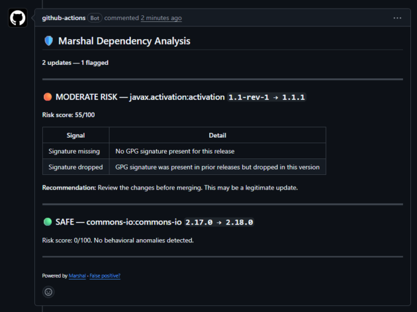

I pointed a scanner I have been building at an old Spring project, and it flagged javax.activation. The bump was 1.1-rev-1 to 1.1.1. Prior releases carried a GPG signature. This one did not.


<br />

If you have read the post-mortems of real supply-chain attacks, that pattern should make you sit up. A package that has signed its releases for years suddenly ships one unsigned. The boring explanation is a build pipeline change. The other explanation is that a different person is publishing now, and the signing key stayed behind with the old one. When ua-parser-js was hijacked in 2021, the malicious versions came from a compromised account. When event-stream went bad in 2018, it was a new maintainer nobody had vetted. The artifact looks fine. The metadata around it is what changed.

So which one is javax.activation? It turns out to be the boring one, sort of. This artifact changed hands during the Sun to Oracle transition, and the signing discipline broke along the way. It is benign. But I only know that because I went and checked, and that is the actual point of this article: the signal that separates a routine handoff from an account takeover does not live in any CVE database, because at the moment it happens, there is nothing to file a CVE about.

The gap CVE scanners cannot see
-------------------------------

I want to be precise here, because this is not a "your scanner is bad" argument. Snyk, Dependabot, OWASP Dependency-Check, they all do their job. Their job is matching your dependency tree against known, disclosed, published advisories. That makes them lagging indicators by construction. Every major supply-chain attack of the last several years, event-stream, ua-parser-js, node-ipc, the XZ Utils backdoor, walked straight past CVE scanning, because when the malicious version shipped there was no CVE yet. The disclosure came days or weeks later. Teams on auto-update had already pulled the poisoned version within hours.

The behavioral tools that do exist for this problem are npm-first, basically all of them. Which is odd, because the JVM is where the banks live. Maven Central serves an enormous amount of regulated, boring, load-bearing software, and almost nobody watches how its packages change over time.

That gap annoyed me enough that I built something for it.

Marshal
-------

Marshal is an open source CLI (Apache 2.0, Java 21) that scans a Maven or Gradle project and scores every dependency update on how it changed, not on what is known to be broken. It is deliberately complementary to CVE scanning. Keep your CVE scanner. Marshal covers the window before a CVE can exist.

Each dependency gets a 0 to 100 risk score built from seven behavioral rules:

|         Rule         |                      What it watches                       |
|----------------------|------------------------------------------------------------|
| Signature dropped    | Prior releases were GPG signed, this one is not            |
| Missing signature    | No signature on this release at all                        |
| New maintainer       | The signing key differs from every prior release           |
| Dependency explosion | Declared dependency count grew more than 3x in one release |
| Repo URL changed     | The scm URL moved to a different org, or vanished          |
| Major version jump   | More than two majors skipped with nothing in between       |
| Yanked version       | A previously published release has disappeared             |

Scores land in four buckets. GREEN (0 to 20) passes silently. YELLOW (21 to 50) shows up as a count in the terminal summary, with full detail in the JSON output. ORANGE (51 to 80) gets a PR comment. RED (81 to 100) fails CI.

How the scoring actually works
------------------------------

The number one killer of developer security tools is false-positive fatigue, so most of the engine design is about not crying wolf.

The rule that matters most for that is: a single signal cannot produce RED. No matter how heavy one rule is, a lone signal is capped at ORANGE. RED requires at least two independent signals corroborating each other. A signature drop alone is worth investigating. A signature drop plus a new signing key plus a tripled dependency count is a different animal, and that combination is what fails your build.

There is also a reputation layer. A maintained list of high-reputation packages (the Apache commons family, the big framework vendors) gets its raw score scaled by half. Those packages still get scanned and rules still fire, they just need stronger evidence before they alert, because a corporate key rotation at Apache is routine and a key rotation on a three-week-old artifact is not.

And for findings you have personally vetted, there is a suppression whitelist. It is deliberately strict: entries must pin the full groupId:artifactId:version, wildcards are rejected at load time, and every entry requires a written reason and an expiry date. A new version of a whitelisted package drops out of the whitelist and gets re-evaluated, on purpose, because a new version is exactly where a compromise lands. Suppressed findings still appear in the JSON output with the reason attached, so there is an audit trail instead of a silent hole.

Back to javax.activation. Two rules fired: signature dropped (weight 40, the historical event: this package had signing discipline and abandoned it) and missing signature (weight 15, the current posture: this release is unverifiable right now). Total 55, ORANGE. Not RED, and that is correct. There was no second identity signal, no new key, no dependency changes, so the engine says "review this before merging" rather than "block everything." Had the drop come with a maintainer key change, it would have gone RED. That is the account-takeover shape.

Try it on your own pom.xml
--------------------------

The whole thing is one jar. You need a JRE 21.

```
curl -fsSL https://github.com/marshal-hq/marshal/releases/download/v0.2.0/marshal-cli-0.2.0.jar -o marshal.jar

java -jar marshal.jar scan --build-file ./pom.xml
```


Output looks like this (trimmed):

```
● ORANGE  javax.activation:activation  1.1-rev-1 → 1.1.1   55/100
          SIG-DROPPED: prior releases signed, this one is not
          MISSING-SIG: no GPG signature for this release

1 finding at or above threshold. Exit code 1.
```


Gradle projects work the same way, point --build-file at build.gradle or build.gradle.kts and Marshal resolves the full dependency graph through the Gradle tooling itself rather than trying to parse the build file as text. For CI there is JSON output (`--output json`, schema is stable at 1.0) and a threshold flag (`--threshold orange`) that controls the exit code, so wiring it into a pipeline is one line. Exit codes are boring on purpose: 0 clean, 1 findings at or above threshold, 2 usage error, 3 could not resolve. That last one can never be silenced by configuration. "I could not analyze your build" should never quietly pass.

There is also a `diff` command that compares a base and head build file and reports only newly introduced risk, plus a GitHub Action that runs it on PRs and posts the comment you saw in the screenshot above. I will not walk through the Action setup here, the README covers it.

If you expect a wall of red on your first scan: no. Most well-maintained packages score zero, and they should. The interesting question was never "how much can a tool flag." It is whether the two or three things it does flag are worth your attention.

What ships today
----------------

v0.2.0 is current. Maven and Gradle are at parity across scan, diff, and the Action. Three output formats via the `--output` flag (`human`, `json`, `md`), configurable thresholds and rule weights via marshal.yml, Slack webhooks on critical findings, an SQLite metadata cache so repeat scans are fast and work offline, and the whitelist system described above. The engine is verified against a replay corpus of real historical incidents, event-stream, ua-parser-js, node-ipc among them, as CI fixtures, so every release has to keep catching the attacks that already happened.

One honest limitation worth naming: Maven Central does not expose publisher identity beyond the signing key, so the new-maintainer rule fires on key changes only. And an XZ Utils style attack, months of patient social engineering by a trusted-looking contributor, is mostly beyond what static behavioral signals can catch. Marshal would have flagged the maintainer handoff, not the payload. I would rather say that plainly than let you believe otherwise.

What is in the pipeline
-----------------------

All open source work, in rough order:

* Full transitive resolution on the Maven path. The Gradle path already resolves the complete graph; the Maven path reads direct dependencies today, with the full Maven model resolution in progress.
* Test fixtures for BOM imports (scope=import). The code path is wired but I want it exercised against a real project before anyone leans on it.
* Activating the signed remote refresh for the curated whitelist, so false-positive fixes reach users without waiting for a binary release. The mechanism is built and dormant; it goes live once the publishing key and URL ship.
* `marshal watch --package` for keeping an eye on a single artifact.
* npm support, eventually. Maven first until it is genuinely solid.

Links
-----

* Code and README: <https://github.com/marshal-hq/marshal>
* Project site: <https://marshalhq.dev>

If you run it and it flags something dumb, open an issue. A false positive report is worth more to me right now than a star. And if it flags something that is not dumb, I definitely want to hear about that.
