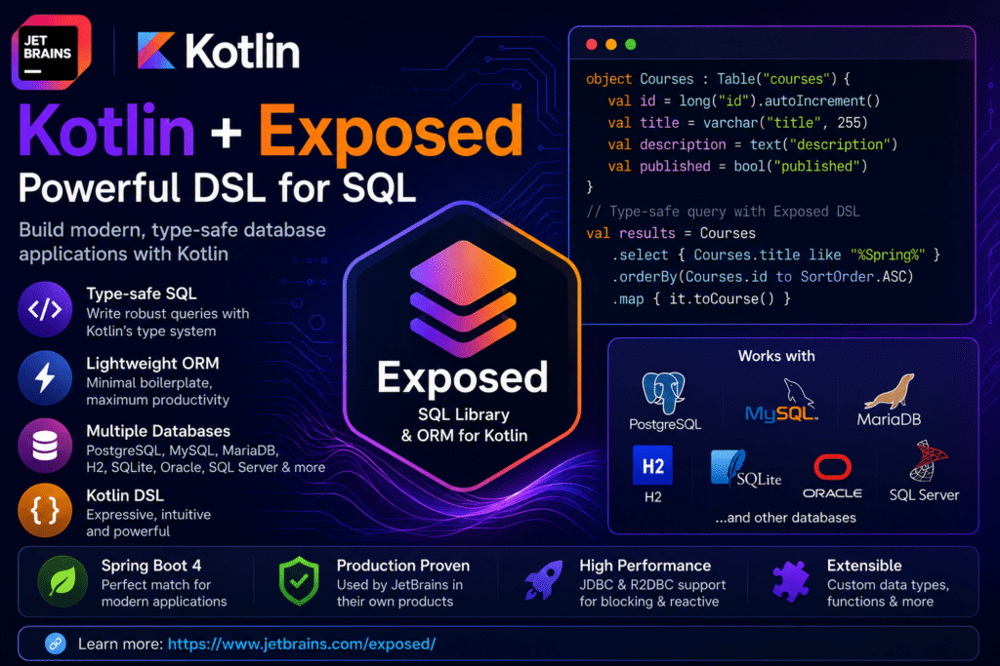
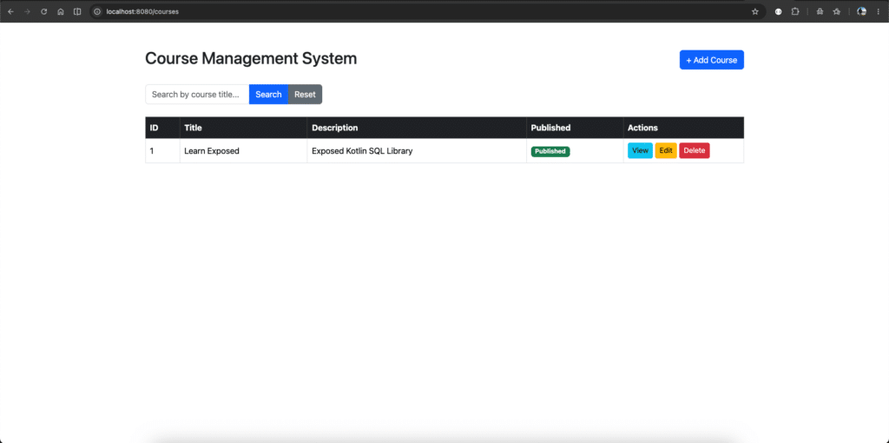

## Introduction

For quite some time, I have been a huge fan of and fascinated by JetBrains products, tools, and libraries because of their masterful craftsmanship in product creation and their pristine focus on building high-quality developer tools.

Even more excitingly, JetBrains Java Annotated Monthly newsletters have featured most of the technical articles I wrote for Foojay on topics such as Java, Spring, Spring Boot 4, and OpenRewrite.

Recently, one Kotlin Domain-Specific Language (DSL) library caught my attention. I immediately tried converting my existing Spring Boot 4 application from Java to Kotlin using Exposed, an ORM framework for Kotlin.
 Kotlin SQL Libary

Before diving into the Exposed library, let's first understand some fundamentals and prerequisites.

### What is a Domain-Specific Language (DSL)?

According to Wikipedia, a domain-specific language (DSL) is a computer language specialized for a particular problem or application domain. Unlike general-purpose languages (GPLs), which apply broadly across domains, DSLs trade broad applicability for greater efficiency, readability, and ease of use in specific tasks. A DSL uses concepts and rules derived from a particular field or domain.

**Common Examples**

* **SQL:** Designed specifically for managing and querying data in relational databases.
* **HTML/CSS:** Tailored for structuring and styling web pages.
* **Regular Expressions (Regex):** Optimized for pattern matching and text searching.
* **Maven/Gradle:** Used specifically for build automation and software compilation.

### **Key Types of DSLs**

DSLs generally fall into two categories:

* **Internal DSLs:** Embedded within a general-purpose host language (for example, using Ruby or Kotlin syntax to define specific rules or configurations).
* **External DSLs:** Independent languages with their own custom syntax that require a dedicated parser (for example, SQL).

### What is Exposed?

**Exposed** is Jetbrains's official, lightweight SQL library and object-relational mapping (ORM) framework designed specifically for Kotlin. It provides:

1. An idiomatic, type-safe way to interact with relational databases without the overhead of heavyweight Java frameworks such as Hibernate
2. Native support for both traditional blocking database drivers through JDBC and modern,  
   non-blocking asynchronous database drivers through R2DBC.

### Why Exposed?

1. **Lightweight ORM:**Maps our database schema to Kotlin objects in an intuitive and lightweight way
2. **Type-safe Queries:** Let's you write type-safe SQL queries that survive refactoring and help prevent errors
3. **CRUD Operations:** Provides built-in support for implementing CRUD operations with minimal boilerplate
4. **Query Builder:** Enables you to build safe, reusable, and dynamic SQL queries tailored to your application's needs.
5. **Rich Data Type Support:** Supports all common SQL data types, including JSON, out of the box. You can also define custom data types and custom functions
6. **Broad Database Support:**Works with popular databases such as PostgreSQL, MySQL, MariaDB, Microsoft SQL Server, SQLite, Oracle, H2, and others.
7. **Production-proven:** Jetbrains develops and maintains Exposed and uses it extensively in its own products, making it a mature and battle-tested framework.

### Database Access APIs in Exposed

Exposed provides two primary APIs for interacting with a database: **the Domain-Specific Language (DSL) API and the Data Access Object (DAO) API**.

1. **Domain-Specific Language (DSL) API:** The DSL API provides kotlin-based abstractions for interacting with relational databases. It closely resembles writing SQL queries while leveraging Kotlin's type safety. Although it is more verbose than the DAO API, it gives you greater control over your queries and makes complex SQL easier to express.
2. **Data Access Object (DAO) API:** The DAO API provides an object-orientated approach to database access, similar to ORM frameworks such as Hibernate and MyBatis. It requires less boilerplate code and offers a more intuitive, Kotlin-centric way to work with database entities.

### Which API Should You Choose?

Choose the API based on your project's requirements:

* Use the DSL API when you need fine-grained control over SQL queries or want to write complex queries
* Use the DAO API when you prefer an object-oriented programming model and want to reduce boilerplate code for standard CRUD operations.

Exposed can be integrated into your application in multiple ways. You can either add the core Exposed dependencies directly or, for **Spring Boot 3** and **Spring Boot 4**, simply include the Exposed Spring Boot Starter dependency. Once integrated, you can leverage the full capabilities of the Exposed SQL library using either the DSL API or the DAO API, depending on your application's requirements.

In this article, we will explore Exposed's capabilities by implementing simple CRUD operations with **Spring Boot 4**.
> **Note: *Support for [Spring Boot 3](https://www.jetbrains.com/help/exposed/spring-boot-integration.html#spring-boot-3) will be sunsetting in the next major release of Exposed. New projects should use Spring Boot 4 whenever possible.***
>
> ## Step-by-Step Guide
>
> ### Pre-requisities
>
> * Java 17 or later
> * Kotlin 2.1.x or later
> * IntelliJ IDEA
> * Gradle (Optional)
>
> ### Step 1: Scaffolding a project
>
> Let's begin by scaffolding a new Spring Boot 4 application. We'll use **Spring Initializr**, which generates a production-ready project with the required build configuration and dependencies.
>
> Visit **<https://start.spring.io>** and configure the project as follows:
>
> |   Property    |            Value            |
> |---------------|-----------------------------|
> | Project       | Gradle-Kotlin               |
> | Language      | Kotlin                      |
> | Spring Boot   | 4.1.0                       |
> | Group         | com.courses                 |
> | Artifact      | explore-exposed             |
> | Name          | explore-exposed             |
> | Package Name  | com.courses.explore-exposed |
> | Packaging     | Jar                         |
> | Configuration | Properties/YAML             |
> | Java          | 17/21                       |

**Step 2: Add Required Dependencies**

Select the following dependencies:

* **Spring Web**
* **Thymeleaf**
* **PostgreSQL Driver** **or H2**
* **Spring Boot DevTools** *(optional but recommended for development)*

**Note:** At the time of writing, **Exposed** *is not available as a selectable dependency in Spring Initializr.* We'll add the required Exposed dependencies manually in the next section.

### **Step 3: Generate and Open the Project**

Click **Generate** to download the project, then extract the archive and open it in your preferred IDE, such as **IntelliJ IDEA**.

Once imported, your project structure should resemble the following:

```yaml
explore-exposed
├── src
│   ├── main
│   │   ├── kotlin
│   │   └── resources
│   └── test
├── build.gradle.kts
├── settings.gradle.kts
└── gradlew
```

### **Step 4: Verify the Application**

Run the application using Gradle:

```
./gradlew bootRun
```

Or simply run the `ExploreExposedApplication.kt` class directly from your IDE.

If everything is configured correctly, Spring Boot will start successfully, confirming that the project scaffold is ready. In the next section, we'll integrate the **Exposed** **Spring Boot 4 Starter** for working with Exposed features and configure it to work with **H2**.

### Step 5: Add Exposed Spring Boot 4 Starter

Add the below exposed Spring Boot starter artifact to `build.gradle.kts` the script.

```json
dependencies {
    implementation("org.jetbrains.exposed:exposed-spring-boot4-starter:1.3.1")
}
```

So final `build.gradle.kts` looks like this:

```json
plugins {
	kotlin("jvm") version "2.3.21"
	kotlin("plugin.spring") version "2.3.21"
	id("org.springframework.boot") version "4.1.0"
	id("io.spring.dependency-management") version "1.1.7"
}

group = "com.courses"
version = "0.0.1-SNAPSHOT"

java {
	toolchain {
		languageVersion = JavaLanguageVersion.of(17)
	}
}

repositories {
	mavenCentral()
}

dependencies {
	//implementation("org.springframework.boot:spring-boot-h2console")
	implementation("org.springframework.boot:spring-boot-starter-thymeleaf")
	implementation("org.springframework.boot:spring-boot-starter-webmvc")
	implementation("org.jetbrains.kotlin:kotlin-reflect")
	implementation("tools.jackson.module:jackson-module-kotlin")

	//developmentOnly("org.springframework.boot:spring-boot-docker-compose")

	runtimeOnly("com.h2database:h2")
	//runtimeOnly("org.postgresql:postgresql")

	implementation("org.jetbrains.exposed:exposed-spring-boot4-starter:1.3.1")

	testImplementation("org.springframework.boot:spring-boot-starter-thymeleaf-test")
	testImplementation("org.springframework.boot:spring-boot-starter-webmvc-test")
	testImplementation("org.jetbrains.kotlin:kotlin-test-junit5")
	testRuntimeOnly("org.junit.platform:junit-platform-launcher")
}

kotlin {
	compilerOptions {
		freeCompilerArgs.addAll("-Xjsr305=strict", "-Xannotation-default-target=param-property")
	}
}

tasks.withType<Test> {
	useJUnitPlatform()
}
```

The **Exposed Spring Boot Starter** bundles the latest version of Exposed, the custom SpringTransactionManager from the **spring7-transaction** module, and the **Spring Boot Starter JDBC** dependency. This starter simplifies Exposed integration by providing the essential components out of the box.

The **Exposed Spring Boot Starter** builds on top of `spring-boot-starter-jdbc`, so Spring Boot requires a configured data source. To establish a connection to the database, add the following properties to your `application.properties` file:

```powershell
spring.application.name=explore-exposed
spring.datasource.url=jdbc:h2:mem:testdb
spring.datasource.driverClassName=org.h2.Driver
spring.datasource.username=sa
spring.datasource.password=password

# To automatically generate database schemas from your Exposed table definitions during application startup,
# set the spring.exposed.generate-ddl property in the application.properties file:
spring.exposed.generate-ddl=true
# To log the SQL statements generated and executed by Exposed, 
# enable the `spring.exposed.show-sql` property in the `application.properties` file:
spring.exposed.show-sql=true
```

To enable Exposed's auto-configuration, import the Exposed auto-configuration class into your Spring Boot application. You can do this in one of the following ways:

* **Option 1:** Add the **@ImportAutoConfiguration** annotation to your main Spring Boot Application class
* **Option 2:** Create a dedicated configuration class and import the Exposed auto-configuration there

Both approaches enable Exposed's Spring Boot integration and configure the required infrastructure automatically.

I have followed Option 2, which is more modular.

Since Exposed provides its own SpringTransactionManager, you need to explicitly enable Exposed's auto-configuration and disable Spring Boot's DataSourceTransactionManager auto-configuration. Otherwise, both transaction managers may be registered, leading to bean conflicts or unexpected transaction behavior.

```java
@ImportAutoConfiguration(
    value = [ExposedAutoConfiguration::class],
    exclude = [DataSourceTransactionManagerAutoConfiguration::class]
)
```

This configuration imports Exposed AutoConfiguration, which registers Exposed's infrastructure beans, including the custom ***SpringTransactionManager*** . At the same time, it excludes Spring Boot's default ***DataSourceTransactionManagerAutoConfiguration*** to ensure that Exposed exclusively manages database transactions.

```java
package com.courses.explore_exposed.config

import org.jetbrains.exposed.v1.core.DatabaseConfig
import org.jetbrains.exposed.v1.spring.boot4.autoconfigure.ExposedAutoConfiguration
import org.springframework.boot.autoconfigure.ImportAutoConfiguration
import org.springframework.boot.jdbc.autoconfigure.DataSourceTransactionManagerAutoConfiguration
import org.springframework.context.annotation.Bean
import org.springframework.context.annotation.Configuration

@Configuration
@ImportAutoConfiguration(
    value = [ExposedAutoConfiguration::class],
    exclude = [DataSourceTransactionManagerAutoConfiguration::class]
)
class ExposedConfig {
    @Bean
    fun databaseConfig() = DatabaseConfig {
        useNestedTransactions = true
    }
}
```

### Step 6: Create Course Table Entity

We can create different datatypes with primary keys; we will use [LongIdTable](https://jetbrains.github.io/Exposed/api/exposed-core/org.jetbrains.exposed.v1.core.dao.id/-long-id-table/index.html). For more details, <https://jetbrains.github.io/Exposed/api/exposed-core/org.jetbrains.exposed.v1.core.dao.id/index.html>

```java
package com.courses.explore_exposed.model

import org.jetbrains.exposed.v1.core.dao.id.LongIdTable

object CourseEntity : LongIdTable("courses") {

    val title = varchar("title", length = 255)

    val description = text("description")

    val published = bool("published")
}
```

### Step 7: Understanding the Service Layer

The *CourseService* class holds all the business logic for CRUD operations on courses. It uses **Exposed's DSL** to access the database, while Spring handles transactions behind the scenes.

Transactions, handled automatically

```java
import org.springframework.stereotype.Service
import org.springframework.transaction.annotation.Transactional

@Service
@Transactional
class CourseService {
}
```

Putting ***@Transactional*** on the class means every public method automatically runs inside a database transaction. In practice:

* Spring opens a transaction before the method runs.
* Exposed executes all queries within that same transaction (via SpringTransactionManager).
* If the method finishes normally, Spring commits.
* If it throws a runtime exception (like NotFoundException), Spring rolls back—no partial writes, no inconsistent data.

Thanks to the Exposed Spring Boot Starter, you never have to write a manual `transaction { }` block yourself. Spring takes care of it. For more details about querying, go through this [link](https://www.jetbrains.com/help/exposed/dsl-querying-data.html)

**The Exposed Features in Action**

|                     |                                    |                                      |
|---------------------|------------------------------------|--------------------------------------|
| **Operation**       | **Exposed Code**                   | **What It Does**                     |
| Get all rows        | CourseEntity.selectAll()           | SELECT \* FROM course                |
| Filter by condition | .where { CourseEntity.id eq id }   | WHERE id = ?                         |
| Pattern match       | CourseEntity.title like "%Spring%" | WHERE title LIKE '%Spring%'          |
| Map row → object    | .map { Course(...) }               | Converts DB rows into Kotlin objects |
| Insert              | insertAndGetId { ... }             | INSERT ... and returns the new ID    |
| Update              | update({ ... eq id }) { ... }      | Updates only matching rows           |
| Delete one          | deleteWhere { ... eq id }          | Deletes matching rows                |
| Delete all          | deleteAll()                        | Wipes the table                      |

Each of these reads almost like plain SQL but with full Kotlin type-checking—so a typo or wrong type gets caught at compile time, not at runtime.

**Why This Is Nice to Work With**

* **Type-safe** — the compiler catches query mistakes before you even run the app.
* **Feels native to Kotlin** — no clunky annotations or XML mapping files.
* **Less boilerplate** — CRUD logic stays short and readable. <https://www.jetbrains.com/help/exposed/dsl-crud-operations.html>
* **Plays well with Spring** — transactions are handled declaratively, no manual wiring.
* **Easy to read** — the DSL mirrors SQL closely enough that anyone familiar with SQL can follow along.

### Step 8: Understanding the Controller Layer

The *CourseController* is where HTTP requests meet business logic. It's a bit unusual in that it does double duty—serving server-rendered HTML views (**Thymeleaf** ) *and* exposing JSON REST endpoints, all from the same class.

```java
@Controller
@RequestMapping("/courses")
class CourseController(private val courseService: CourseService) {
```

Note this uses *@Controller* , not *@RestController.* That's intentional—most methods here return a **view name** (a string like *"index"* or *"redirect:/courses"*), which Spring resolves to an HTML template. A few methods explicitly wrap their response in ResponseEntity to return raw JSON instead. This lets one controller power both a traditional web UI and a small API.

Serving Pages (View-Based Endpoints)

|                               |                                                           |
|-------------------------------|-----------------------------------------------------------|
| **Route**                     | **Purpose**                                               |
| **GET /courses/new**          | Shows a blank "add course" form                           |
| **POST /courses**             | Saves the submitted form, then redirects back to the list |
| **GET /courses**              | Shows the course list—optionally filtered by ?title=      |
| **GET /courses/edit/{id}**    | Loads a course into an "edit" form                        |
| **POST /courses/update/{id}** | Saves edits, then redirects back to the list              |
| **GET /courses/delete/{id}**  | Deletes a course via a plain link click, then redirects   |

These all follow the classic **Post/Redirect/Get** pattern: after a form submission or delete action, the browser is redirected to /courses instead of re-rendering the same page. This avoids duplicate submissions if the user refreshes.

### Step 9: Thymeleaf under the hood

Since this project uses **Thymeleaf** as the templating engine, every string returned from a view-based method (like **"index", "add-course", "edit-course"**) maps directly to an HTML template—typically found at:

```powershell
src/main/resources/templates/index.html
src/main/resources/templates/add-course.html
src/main/resources/templates/edit-course.html
```

Spring Boot's Thymeleaf auto-configuration takes care of resolving these automatically—no extra ViewResolver setup needed, as long as spring-boot-starter-thymeleaf is on the classpath.

### **Step 10: Verify the Application**

Run the application using Gradle:

```
./gradlew bootRun
```

```bash
  .   ____          _            __ _ _
 /\\ / ___'_ __ _ _(_)_ __  __ _ \ \ \ \
( ( )\___ | '_ | '_| | '_ \/ _` | \ \ \ \
 \\/  ___)| |_)| | | | | || (_| |  ) ) ) )
  '  |____| .__|_| |_|_| |_\__, | / / / /
 =========|_|==============|___/=/_/_/_/

 :: Spring Boot ::                (v4.1.0)

2026-07-05T14:08:46.343+05:30  INFO 7888 --- [explore-exposed] [           main] c.c.e.ExploreExposedApplicationKt        : Starting ExploreExposedApplicationKt using Java 17.0.10 with PID 7888 (/Users/puneethsai/devworkspace/explore-exposed/build/classes/kotlin/main started by puneethsai in /Users/puneethsai/devworkspace/explore-exposed)
2026-07-05T14:08:46.349+05:30  INFO 7888 --- [explore-exposed] [           main] c.c.e.ExploreExposedApplicationKt        : No active profile set, falling back to 1 default profile: "default"
2026-07-05T14:08:49.239+05:30  INFO 7888 --- [explore-exposed] [           main] o.s.boot.tomcat.TomcatWebServer          : Tomcat initialized with port 8080 (http)
2026-07-05T14:08:49.262+05:30  INFO 7888 --- [explore-exposed] [           main] o.apache.catalina.core.StandardService   : Starting service [Tomcat]
2026-07-05T14:08:49.262+05:30  INFO 7888 --- [explore-exposed] [           main] o.apache.catalina.core.StandardEngine    : Starting Servlet engine: [Apache Tomcat/11.0.22]
2026-07-05T14:08:49.332+05:30  INFO 7888 --- [explore-exposed] [           main] b.w.c.s.WebApplicationContextInitializer : Root WebApplicationContext: initialization completed in 2909 ms
2026-07-05T14:08:49.662+05:30  INFO 7888 --- [explore-exposed] [           main] o.s.b.w.a.WelcomePageHandlerMapping      : Adding welcome page template: index
2026-07-05T14:08:50.153+05:30  INFO 7888 --- [explore-exposed] [           main] o.s.boot.tomcat.TomcatWebServer          : Tomcat started on port 8080 (http) with context path '/'
2026-07-05T14:08:50.161+05:30  INFO 7888 --- [explore-exposed] [           main] c.c.e.ExploreExposedApplicationKt        : Started ExploreExposedApplicationKt in 4.356 seconds (process running for 5.624)
2026-07-05T14:08:50.211+05:30  INFO 7888 --- [explore-exposed] [           main] o.j.e.v.s.boot4.DatabaseInitializer      : Schema generation for tables '[courses]'
2026-07-05T14:08:50.217+05:30  INFO 7888 --- [explore-exposed] [           main] com.zaxxer.hikari.HikariDataSource       : HikariPool-1 - Starting...
2026-07-05T14:08:50.705+05:30  INFO 7888 --- [explore-exposed] [           main] com.zaxxer.hikari.pool.HikariPool        : HikariPool-1 - Added connection conn0: url=jdbc:h2:mem:testdb user=SA
2026-07-05T14:08:50.708+05:30  INFO 7888 --- [explore-exposed] [           main] com.zaxxer.hikari.HikariDataSource       : HikariPool-1 - Start completed.
2026-07-05T14:08:50.796+05:30  INFO 7888 --- [explore-exposed] [           main] o.j.e.v.s.boot4.DatabaseInitializer      : ddl [CREATE TABLE IF NOT EXISTS COURSES (ID BIGINT AUTO_INCREMENT PRIMARY KEY, TITLE VARCHAR(255) NOT NULL, DESCRIPTION TEXT NOT NULL, PUBLISHED BOOLEAN NOT NULL)]
SQL: CREATE TABLE IF NOT EXISTS COURSES (ID BIGINT AUTO_INCREMENT PRIMARY KEY, TITLE VARCHAR(255) NOT NULL, DESCRIPTION TEXT NOT NULL, PUBLISHED BOOLEAN NOT NULL)
```

Run the following:

<http://localhost:8080/courses>

To create a course, click on the **+AddCourse** button, and then the Add Course form will appear. fill the details and save it and observe the logs:

```
SQL: SELECT COURSES.ID, COURSES.TITLE, COURSES.DESCRIPTION, COURSES.PUBLISHED FROM COURSES
SQL: INSERT INTO COURSES (TITLE, DESCRIPTION, PUBLISHED) VALUES ('Learn Exposed', 'Exposed Kotlin SQL Library', TRUE)
SQL: SELECT COURSES.ID, COURSES.TITLE, COURSES.DESCRIPTION, COURSES.PUBLISHED FROM COURSES
```

 Course management

## Conclusion

Working with databases in Kotlin usually means picking a side: raw SQL, which is fast but easy to get wrong, or a heavy ORM, which is safe but full of boilerplate. Exposed sits nicely in between.

In CourseService, we wrote queries that read almost like SQL — but the Kotlin compiler checked them for us. No typos slipping through to production. No mapping files. Just clean, readable code.

Spring's @Transactional quietly handled the hard part—committing when things went well, rolling back when they didn't—without us writing a single manual transaction block.

And in CourseController, we saw how well this all fits together: one class serving both HTML pages (via Thymeleaf) and JSON APIs, with the service layer staying completely unaware of which one was calling it.

That's the real takeaway: Exposed doesn't try to hide the database from you, and it doesn't bury you in boilerplate either. It just gets out of your way so you can write code that's type-safe, easy to read, and easy to trust.

If you're a Kotlin developer tired of choosing between "too much magic" and "too much SQL," Exposed is worth trying.

Everything comes from the companion [GithubRepo](https://github.com/bsmahi/explore-exposed), which contains fully working implementations of each example.

## References:

1. <https://martinfowler.com/bliki/DomainSpecificLanguage.html>
2. <https://www.jetbrains.com/mps/concepts/domain-specific-languages>
3. Exposed: <https://www.jetbrains.com/help/exposed/about.html>
