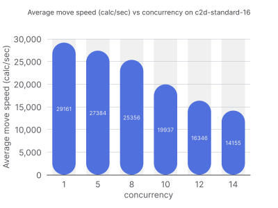
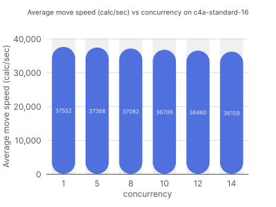

When we investigated unexpected performance variance in our Timefold Solver worker pods on our platform, we traced it to hyperthreading on AMD (x86-64) cloud instances. Switching to ARM (ARM64), where each vCPU maps to a physical core, eliminated the problem and roughly doubled effective throughput per dollar for concurrent solver workloads.

Originally written by Timefold engineers Lars Beckmann, Jenne De Bleser and Lukáš Petrovický  

Adapted for foojay by Tom Cools

Something felt off.

We use [Timefold Solver](https://github.com/TimefoldAI/timefold-solver) to power our optimization platform, a Java library that handles problems like shift scheduling and vehicle routing. On our platform, it runs inside [Quarkus](https://quarkus.io/ "Quarkus").

One of our customers ran the same optimization process twice. Same input, same configuration. The only change was swapping one constraint weight for another, switching from optimizing travel time to travel distance. It shouldn't have mattered to performance. And yet the second run's move calculation speed (our key performance metric) was less than half of the first.

Half. For what amounted to a config tweak.

That's the kind of anomaly that makes you stop and ask: why?

Our first instinct was to look for differences in the data that was sent to our platform. After digging through the inputs, we found some configuration noise, but even after controlling for that and running the two jobs with truly identical settings, the gap remained.

One run was consistently twice as fast as the other.

[Timefold Solver](https://github.com/TimefoldAI/timefold-solver "Timefold Solver") is deterministic. Given the same CPU time, it follows the exact same path. So if you're seeing different move calculation speeds on identical inputs, the variable isn't the solver, it's the machine underneath it.

Here's what we found: the nodes running our solver workloads on GCP were AMD-based machines with 8 physical cores and 16 vCPUs. The "extra" cores come from hyperthreading, Intel and AMD's technique for running two instruction streams on one physical core simultaneously, sharing execution units, cache, and memory bandwidth between them.

In theory, hyperthreading boosts throughput by keeping cores busier. In practice, for compute-intensive workloads like our solver, it's a trap.

When two solver jobs land on the same node, they compete for the same physical cores. Each job thinks it has a full vCPU, but it's actually time-sharing a real core with another job. They're fighting over L1/L2 cache, execution ports, and memory bandwidth. Performance for both workloads falls of a cliff.

This is exactly what we observed. One of our engineers, ran a controlled benchmark: the same optimization problem, the same node type, with a varying number of concurrent solver jobs. The results were striking.

* **AMD (8 cores / 16 vCPUs)**: Performance was stable and fast when running one job at a time. Add a second job, and performance nearly halved. Add more, and it keeps falling, far faster than you'd expect if the bottleneck were simply "less CPU time per job."

* **ARM (16 physical cores / 16 vCPUs)**: Performance degraded gracefully as load increased. With 16 concurrent jobs, each job still ran at roughly the speed you'd expect given 1/16th of the available compute.

The difference comes down to a deliberate architectural choice: ARM processors used in cloud instances, whether GCP's Tau series running Ampere Altra or AWS Graviton, map each vCPU to a physical core. There's no hyperthreading. What you allocate is what you get.

It's a well-documented characteristic of compute-intensive, single-threaded workloads (but who reads documentation, right?). When a workload needs the full resources of a core things like registers, cache, execution units and hyperthreading becomes a liability rather than an asset.

There's another angle that seals the case: cost.

An AMD (x86-64) node with 8 physical cores and 16 vCPUs, when you account for the performance penalty under concurrent load, effectively doesn't allow you to run 16 workloads with high CPU load. To maintain the same throughput, you'd need to reduce concurrency, essentially treating a 16-vCPU machine like a much smaller one. One engineer on our team pointed out that the effective utilization could be as low as 0.5 workloads per vCPU before hitting the degradation cliff.

Meanwhile, the ARM (ARM64) equivalent (16 physical cores, 16 vCPUs) handles 16 concurrent jobs cleanly. It's also priced competitively. Once you factor in the utilization reality of AMD under load, **ARM ends up being roughly twice as cost-effective** for this workload.

This is consistent with what the broader industry has found. AWS's [own benchmarks](https://aws.amazon.com/blogs/compute/how-potential-performance-upside-with-aws-graviton-helps-reduce-your-costs-further/ "own benchmarks") and independent testing consistently show meaningful price-performance gains for compute-bound workloads. GCP's own [ARM offerings](https://docs.cloud.google.com/compute/docs/instances/arm-on-compute "ARM offerings") show similar patterns.

If you're running compute-intensive workloads in the cloud, optimization solvers, simulation engines, tight data processing loops, **hyperthreading is not your friend under concurrent load**. It creates the illusion of having more cores than you do, and the penalty for that illusion is paid at the worst possible time: when your nodes are actually busy.

ARM cloud instances solve this by mapping vCPUs to physical cores. The result is more predictable performance, better utilization, and in most configurations, lower cost.

If you are not running on ARM64 vCPUs yet and are running into weird performance degradations with your Java applications, that might be the reason why.

We moved fully to ARM. We're not going back.
