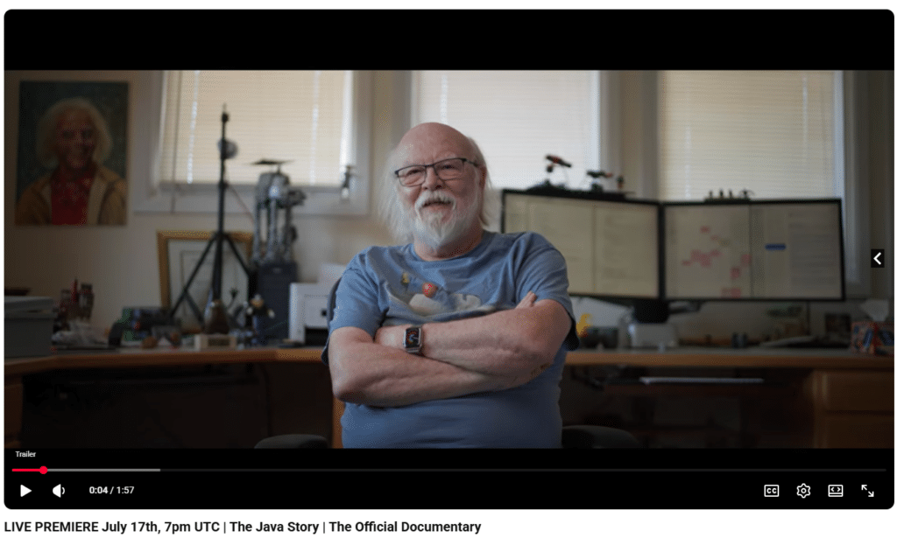

Every so often a story comes along that belongs to an entire community rather than any one company or person. The Java Story documentary by CultRepo is one of those. On July 17th at 7pm UTC, the official Java documentary premieres live on YouTube - if you've spent any significant part of your career working with Java (and I assume most Foojay readers have!), I really think you'd want to watch it!

[Watch the trailer and set a reminder for the premiere here](https://www.youtube.com/watch?v=ZqGSg4b_cZA).

## Why It's Important To Foojay Community

Java's story, as much as it's about the history and evolution of the programming language we use day-to-day, is most of all a story about a community that, more than once, could have let something great quietly fade. But that community chose to fight for it, rebuild it and hand it forward to the next generation of developers. That's the Java story, the OpenJDK story, the Jakarta EE story. It's the story a lot of us have been living for years without necessarily stopping to appreciate how remarkable it is - but it's great to take a step back and actually watch how it unfolded over the last 31 (!) years.

The documentary traces that arc from the very beginning and people who lived it firsthand share it with us. **James Gosling** - yes, THAT James Gosling - will actually be in the YouTube live chat during the premiere alongside other early Java team members, so this is a rare chance to watch the origin story unfold while trading messages with the people who wrote it from day one.

The rest of the guest list is as impressive and relevant: **Joshua Bloch** , creator of the Java Collections Framework and author of *Effective Java* ;**James Duncan Davidson** , creator of Apache Tomcat; **Tim Lindholm** , co-author of the Java Virtual Machine Specification; **Kim Polese** , Java's first product manager; **Carla Schroer** , former Director of Java Compatibility at Sun Microsystems; **Sharat Chander**, formerly Senior Director of Java Product Management and Developer Engagement at Oracle; and more. It's a rare thing to have this many people who shaped the platform's actual history in one place, telling the story in their own words and from their own perspectives.

The film also follows the story into enterprise Java territory toward its later chapters - which is where I can personally feel part of it - Jakarta EE's emergence from the old Java EE and the community effort that kept enterprise Java alive and moving forward.

## How the Premiere Works

If you have time to take part in the live online premiere, here are a few practical things worth knowing:

* **WHEN** **July 17th, 7pm UTC**, live on YouTube.
* **WHERE** : [The official watch page is already live](https://www.youtube.com/watch?v=ZqGSg4b_cZA)- you can watch the trailer now and set a reminder so you don't miss the countdown.
* **LIVE CHAT:** once the countdown hits zero, the film plays and the chat opens up - this is where you'll find James Gosling and members of the early Java team.
* **AFTER THE PREMIERE**: the film stays up on the channel as a regular upload, so there's no pressure if you can't make it live.

## Our Ask

If Java, OpenJDK or Jakarta EE has been part of your career (as you're reading this on Foojay, it probably has 😉 ) - take some time on July 17th if you're around, to watch this with the rest of us. Set your reminder, show up for the live chat and share it with the developers who came up through this same community. Stories like this don't get told very often and - as Java Community - this one's about all of us.  

