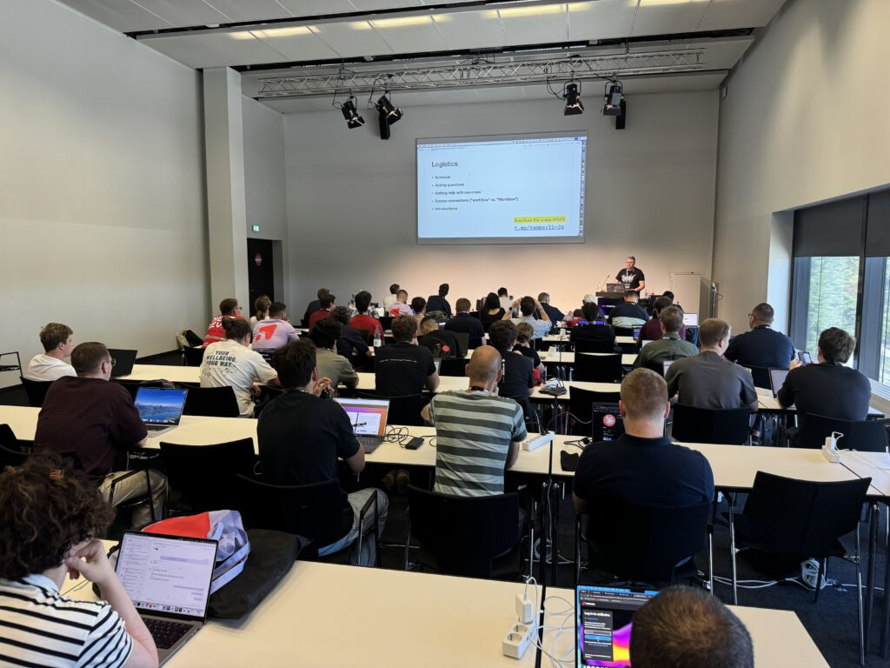
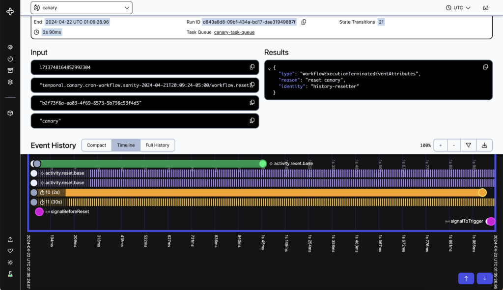

**When developers first hear about [Temporal](https://temporal.io/), they tend to move through a predictable sequence of emotions. First comes disbelief — the claim that your application can crash mid-execution and simply pick up where it left off, variables intact, sounds like nonsense. Then comes irritation that anyone would even say such a thing is possible. Then they try it, discover it actually works, and get very excited. And finally they ask the only question that matters: *how?***

That arc was the through-line of yesterday's very well attended [Developing Crash-Proof Java Applications](https://www.wearedevelopers.com/world-congress/agenda/workshops/developing-crash-proof-java-applications-1122204) hands-on workshop at [We Are Developers World Congress Europe in Berlin](https://www.wearedevelopers.com/world-congress), on building crash-proof Java applications with Temporal, led by [principal developer advocate Tom Wheeler](https://www.wearedevelopers.com/world-congress/speakers/tom-wheeler) --- who cheerfully admitted he went through the exact same stages himself. He spent days trying to break the platform before joining the company. He couldn't.

## The problem: we all became distributed systems developers

Twenty-five years ago, most applications ran on a single machine. A function call either worked or it didn't, and life was simple. Then the internet happened. Applications had to scale horizontally across machines, integrate with cloud services and third-party APIs, and split into microservices. Components that used to be a local function call became network hops — and every network hop is an opportunity for failure.

The workshop's canonical example was focused on moving money between two banks. The code looks trivial: withdraw from account A, deposit into account B. Four or five lines. But what happens if the process crashes *between* those two steps? The withdrawal happened; the deposit didn't. The money is simply gone. Restart the program naively and it starts over from the beginning — withdrawing a second time. Every variable, every notion of what was already done, vanished with the process.

Traditionally, you defend against this with checkpointing code, message queues, cron jobs, idempotency keys, and mountains of error-handling logic. All of that infrastructure exists because of one assumption we've internalized since our first "Hello, World": processes die, so keep execution time short and never trust in-memory state.

## Durable execution: crash-proof, not crash-preventing

Temporal's answer is *durable execution*. The analogy used in the workshop was a waterproof watch: it doesn't stop you from falling in the lake, but if you do, the watch keeps working. Durable execution doesn't prevent crashes — it makes them inconsequential.

The mechanism is a logical execution that spans multiple physical processes. Your program starts in one process; if that process dies, execution resumes in another — potentially on a different machine entirely. Set `x = 5`, crash the server, and when execution resumes elsewhere, x is still 5. No database writes, no manual state persistence. Your laptop could catch fire and the workflow would carry on somewhere else.

## How it actually works: history replay, not snapshots

The first guess almost everyone makes is that Temporal must be snapshotting your process memory. It isn't — writing gigabytes of RAM to disk every second would be catastrophically slow, and memory addresses wouldn't survive a restart anyway.

Instead, Temporal uses a technique called **history replay**. It records just enough information to reconstruct application state on demand. This works because of a strict architectural split:

* **Workflows** are the deterministic orchestration layer — the sequence of steps in your business logic. Totaling up a shopping cart is deterministic: same input, same output, every time, on any machine, on any day. Workflow code gets full durable execution, but in exchange it *must* behave identically on every run.

<!-- -->

* **Activities** are where all the non-deterministic, failure-prone work lives: calling APIs, querying databases, sending emails, hitting an LLM. Activities don't get durable state, but they get automatic retries with configurable timeouts. Service down? Temporal retries until it succeeds or you cancel.  
* **Workers** do the replays. Every time a workflow calls an activity, Temporal records the call, its parameters, and its result in an **event history** maintained by the Temporal Service. If a crash occurs, a worker replays that history against your deterministic workflow code and reconstructs the exact state — typically in a fraction of a second. Nothing is lost, and crucially, nothing already completed is repeated. No duplicate withdrawals.

## The moving parts

The architecture has three main components. Your **workflow and activity definitions** are plain code — in the workshop's case Java, though Temporal ships SDKs for Go, TypeScript, Python, PHP, .NET, and more, and you can mix languages freely within one system. **Workers**, provided by the SDK and run on your own infrastructure, poll task queues and execute your code.

The **Temporal Service** sits separately, managing task queues and event histories — it never runs your code and never initiates connections, which keeps firewall rules simple.

## Seeing is believing

The Temporal Web UI got singled out as "worth the price of admission." Every workflow execution — running or long finished — is inspectable: inputs, outputs, timelines, per-activity details down to which process on which machine executed each step.

In the live demo, Tom killed the inventory service mid-order. The UI showed the reserve-inventory activity failing and retrying — attempt six, seven, eight — while the rest of the workflow simply waited.

Bring the service back up, and the order completes as if nothing happened. No alerts, no manual intervention, no 3 a.m. page.

## Why this changes how you write software

The deeper point of the workshop wasn't reliability — it was simplicity. If your program can survive any crash without losing state or duplicating work, it can effectively run forever. And if it can run forever, entire categories of infrastructure become unnecessary. Need to do something in 30 days? You don't need a cron job; you can just sleep for 30 days *in your code*. Need to coordinate across services? You may not need that message queue.

People come to [Temporal](https://temporal.io/) for reliability, Tom explained, but they stay for the productivity. Code stops being cluttered with retry loops, checkpoint logic, and failure mitigation. What remains is the happy path — the thing your program is actually trying to do — which means junior teammates can read it, maintain it, and free you up for the next thing.

You may still think it's magic. But as a room full of first-time [Temporal](https://temporal.io/) users in Berlin discovered, it really does work.
