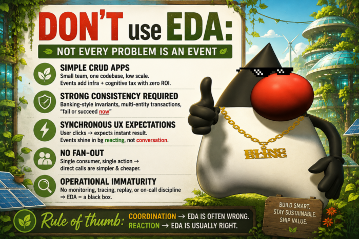

## When Event-Driven Architecture Is Not the Right Choice

Event-Driven Architecture (EDA) can help teams build scalable, loosely coupled and highly responsive distributed systems. Technologies such as Apache Kafka, RabbitMQ, Pulsar and cloud messaging platforms have made this architectural style increasingly popular.

However, EDA also introduces significant complexity. Asynchronous communication requires teams to manage retries, duplicate events, eventual consistency, schema evolution, observability and failure recovery. When these challenges are introduced without a clear business or technical need, an event-driven system can become harder to develop, operate and debug than a simpler synchronous architecture.

The important question is therefore not only **"When should we use Event-Driven Architecture?"** It is also:
> **When should we not use EDA?**

In this article, we will examine seven situations where synchronous APIs, direct service calls or traditional database transactions may be the better choice. The goal is not to discourage event-driven systems, but to help architects and developers use them where they create real value rather than unnecessary complexity.

## TL;DR ☕

Event-Driven Architecture (EDA) is one of the most powerful architectural styles for scalable distributed systems, but it is **not** a universal solution.

Many teams adopt Kafka, RabbitMQ, Pulsar or cloud messaging because they are trendy, only to discover months later that they have added complexity without solving any real problem.

The best architects know when to use EDA.

Great architects also know when **not** to use it.



## Why This Article?

Modern software architecture often swings between extremes.

Yesterday, everything was a monolith.

Today, everything becomes asynchronous.

Tomorrow, we will probably rediscover moderation. 😄

EDA is amazing for reacting to events.

It is often terrible for coordinating workflows.

A useful rule of thumb is:
> **Coordination → Think twice.**

Let us examine the most common situations where EDA may actually be the wrong architectural choice.  



Don't use EDA for everything{#caption-attachment-124878}

1. Avoid EDA for Simple CRUD Applications
-----------------------------------------

If your application has:

* One small team
* One deployable
* One database
* A few hundred users

Adding Kafka or another event broker usually creates more problems than value.

Instead of:

```bash
REST
 ↓
Database
```

You suddenly have:

```bash
REST
 ↓
Producer
 ↓
Broker
 ↓
Consumer
 ↓
Database
```

Congratulations. 🎉

You just added:

* Brokers
* Retries
* Dead-letter queues
* Replay
* Monitoring
* Serialization
* Versioning

All of that just to update one row.

### Direct CRUD Is Often Enough

```java
@PostMapping("/customers")
public Customer create(@RequestBody Customer c) {
    return repository.save(c);
}
```

One request, one transaction and one database update. For small CRUD applications, this is easier to maintain than introducing asynchronous messaging and distributed infrastructure.

**The complexity budget of EDA should be paid only when it brings clear business value.**

2. Avoid EDA When Strong Consistency Is Required
------------------------------------------------

Some domains cannot tolerate eventual consistency.

Examples include:

* 🏦 Banking
* 💳 Payments
* 📦 Inventory reservation
* ✈️ Airline booking

Imagine this sequence:

```bash
Debit account
↓
Publish event
↓
Credit account
```

If something crashes in the middle, money may disappear.

Not ideal.

Some business rules require either everything to succeed or everything to fail.

Those are classic ACID transaction scenarios.

### Preserve Atomicity with One Transaction

```java
@Transactional
public void transfer(Account from, Account to, BigDecimal amount) {
    from.withdraw(amount);
    to.deposit(amount);
}
```

Some business operations require atomicity. Distributed events introduce temporary inconsistency that may violate important business invariants.

**This does not mean EDA is incompatible with finance. Many banks use it extensively, but usually after the transactional boundary.**

3. Avoid EDA When Users Expect an Immediate Response
----------------------------------------------------

Imagine clicking:

```bash
Pay Now
```

Would you like the UI to answer:
> "We will eventually process your payment."

Probably not.

Sometimes users expect:

```bash
Click
↓
Immediate validation
↓
Immediate confirmation
```

Synchronous APIs are often the right tool.

EDA works wonderfully for background processing such as:

* 📧 Sending emails
* 📊 Analytics
* 📱 Notifications
* 🧾 Invoice generation

Those actions do not need to block the user experience.

### Use Synchronous APIs for Immediate Responses

```java
@PostMapping("/login")
public Token login(LoginRequest request) {
    return authenticationService.authenticate(request);
}
```

Authentication is conversational. The client waits for the answer before continuing. An asynchronous workflow would only increase latency and complexity.

4. Avoid EDA When There Is No Fan-Out
-------------------------------------

One of the biggest strengths of EDA is fan-out:

```bash
One producer
↓
Many consumers
```

For example:

```bash
OrderCreated
↓
Inventory
↓
Shipping
↓
Analytics
↓
Recommendation Engine
↓
Fraud Detection
↓
Email
```

Beautiful.

Now imagine:

```bash
Producer
↓
One consumer
```

That is basically an asynchronous method call.

You added a broker to replace:

```java
service.process(order);
```

That is not always a good trade-off.

### Prefer a Direct Service Call for One Consumer

```java
orderValidator.validate(order);
paymentService.process(order);
```

If only one service consumes the information, direct calls are usually simpler, easier to debug and cheaper to operate than an event broker.

5. Avoid EDA When Your Team Is Not Operationally Ready
------------------------------------------------------

EDA is an operational architecture, not just a programming model.

Successful EDA requires:

* Metrics
* Tracing
* Replay
* Dead-letter queues
* Dashboards
* Alerting
* Idempotency
* Schema evolution
* On-call discipline

Without those capabilities, events become mysteries.

Imagine hearing:
> "The event disappeared."

Where?

Nobody knows.

Without observability, debugging distributed systems becomes painful.

### Reliable EDA Requires Idempotent Consumers

```java
if(processedIds.contains(event.id())) {
    return;
}

handle(event);
```

Consumers should safely process duplicate events. Idempotency is one of the foundations of reliable event-driven systems.

6. Avoid EDA When the Business Process Is a Conversation
--------------------------------------------------------

EDA excels at notifications.

It struggles when every step depends immediately on the previous answer.

For example:

```bash
Client
↓
Validate
↓
Calculate
↓
Reserve
↓
Confirm
↓
Return result
```

Each step requires immediate feedback.

This is more of a conversation than a reaction.

REST or gRPC are usually better suited.

### Use Synchronous Calls for Sequential Workflows

```java
Quote quote = pricingService.calculate(order);
reservationService.reserve(quote);
```

Sequential workflows where each step depends on the previous result are often easier to express using synchronous service calls.

7. Avoid EDA When You Do Not Have a Real Event Model
----------------------------------------------------

Some teams create events such as:

```bash
CustomerUpdated

OrderUpdated

ProductUpdated

InvoiceUpdated
```

Those are often just CRUD notifications.

Great events usually represent business facts, not database operations.

Examples include:

* ✅ OrderPlaced
* ✅ PaymentAuthorized
* ✅ ShipmentDispatched
* ✅ SubscriptionCancelled

Those events have meaning beyond the database.

### Model Business Facts, Not Database Updates

```java
publisher.publish(
    new OrderPlaced(orderId, customerId)
);
```

Events should describe something meaningful that happened in the business domain, not simply mirror SQL `UPDATE` statements.

## What Event-Driven Architecture Is Excellent At

EDA shines when you need:

* 🚀 Scalability
* 📈 Multiple consumers
* ⚡ Loose coupling
* 🌍 Distributed systems
* 📊 Analytics
* 📬 Notifications
* 📱 Integrations
* 🧠 Reactive architectures

It becomes even more powerful when combined with patterns such as:

* Outbox Pattern
* Saga Pattern
* CQRS
* Event Sourcing, when appropriate
* Idempotent Consumers
* Dead-Letter Queues
* Schema Registry

## Common Event-Driven Architecture Anti-Patterns

* ❌ Kafka replacing every REST call
* ❌ Events for simple CRUD updates
* ❌ Event storms with dozens of tiny events
* ❌ No replay strategy
* ❌ No observability
* ❌ No idempotency
* ❌ Using events to hide slow services
* ❌ Assuming asynchronous always means scalable

## Key Takeaways 🎯

* EDA is a powerful architectural style, not a silver bullet.
* Complexity should be introduced only when it solves a real problem.
* Strong consistency often favors synchronous transactions.
* Immediate user interactions usually benefit from synchronous APIs.
* Fan-out is where EDA creates significant value.
* Operational maturity is a prerequisite for production-grade event-driven systems.
* Business events should represent domain facts, not CRUD operations.
* A good architect chooses the simplest solution that satisfies today's requirements while leaving room for tomorrow's growth.

Architecture is about trade-offs, not trends.

Sometimes the best event is...

**No event at all.** ☕⚡

#EventDrivenArchitecture #EDA #Kafka #ApacheKafka #SoftwareArchitecture #Microservices #Java #SpringBoot #DistributedSystems #CloudNative #CQRS #EventSourcing #SystemDesign #Backend #SoftwareEngineering #Architecture #TechLeadership

## Go Further with Java Certification

### Java

<https://bit.ly/javaOCP>

### Spring

<https://bit.ly/2v7222>

### Spring Book

<https://bit.ly/springtify>

### Java Book

<https://bit.ly/jroadmap>
