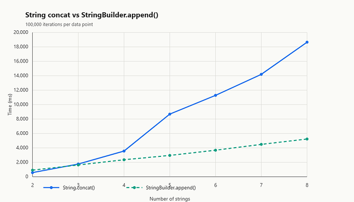

**BoxLang 1.15.0** is a high-impact release with two big headlines and a long tail of hardening. The first headline is a **massive performance upgrade to string handling** : a new first-class `BoxStringBuilder` type, compile-time literal folding, smarter `&=` semantics, and a runtime concat strategy that automatically switches to builder-backed accumulation once your expression gets big enough. Your existing string-heavy code just got faster. No rewrites required.

The second headline is architectural. Every class loader in the BoxLang runtime and module system has been fully abstracted behind a pluggable `IClassLoaderFactory` interface. That single seam is what unlocks the **Android runtime** and **Ahead-of-Time (AOT) compiled runtimes** such as GraalVM Native Image that we have on the roadmap. The default behavior is unchanged, but the ceiling just got a lot higher.

On top of that, 1.15.0 ships two new type-check BIFs (`isBoxSet()` and `isRange()`), a `threadCurrent() `BIF for direct JVM thread access, synchronized set support, security hardening for the web runtime, QoQ performance improvements, and an extensive round of CFML compatibility fixes, formatter corrections, and runtime hardening.

**35 issues closed. 9 new features. 13 improvements. 13 bug fixes.** Let's dig in.

## 🔤 Headline: BoxStringBuilder and Dramatically Faster String Concatenation

String concatenation looks simple until it lands on a hot path. Java strings are immutable, which means every `a & b` allocates a new object and copies both buffers. In a tight loop or a large accumulator, that dominates runtime.

BoxLang 1.15.0 fixes this at four layers simultaneously: a new type, a new operator semantic, a compiler pass, and an auto-switching runtime strategy. Together they mean **your existing string code is faster without a single change**, and when you want maximum control you now have a proper mutable builder to reach for.

### The Performance Story

We benchmarked plain string concatenation against` StringBuilder.append()` across 100,000 iterations, with segment counts from 2 to 8 strings. The result:



Key takeaways:

* Plain concat is faster for exactly **2 strings**.
* Break-even lands around **3 segments**.
* From 2 to 8 strings, concat growth is roughly **4.2x steeper** than builder growth.
* **BoxLang now automatically switches to the builder path at 4 or more segments.**

You get the fast path automatically. No opt-in. No new syntax.

### A First-Class BoxStringBuilder Type

`BoxStringBuilder` wraps `java.lang.StringBuilder` with full BoxLang integration: member-function dispatch, 1-based positional semantics, and silent coercion to `String` wherever a string value is required.

Three equivalent creation forms:

```java
// BIF: optional initial value and initial buffer capacity
sbA = stringBuilderNew( "Hello", 128 )

// Long literal form
sbB = stringbuilder{ "Hello" }

// Short literal form (preferred)
sbC = sb{ "Hello" }
sbC.append( " World" )
writeOutput( sbC.toString() )  // "Hello World"
```

The `sb{ ... }` literal accepts **any expression**, not just quoted text:

```java
sb{ "Hello #name#" }
sb{ myVar }
sb{ getGreeting() }
sb{ foo.bar() }
```

And identifiers named `sb` or `stringbuilder` still work as normal variables. The parser only treats them as literals when followed by braces.

**Fluent, mutable member API** (1-based positional where applicable):

|                    Method                     |                       Description                        |
|-----------------------------------------------|----------------------------------------------------------|
| `append( value ) `                            | Append a value to the end                                |
| `prepend( value )`                            | Prepend a value to the beginning                         |
| `insert( position, value )`                   | Insert at a 1-based position                             |
| `delete( start, end )`                        | Delete characters from start to end (inclusive, 1-based) |
| `replace( start, end, value ) `               | Replace range with new value                             |
| `reverse() `                                  | Reverse the character sequence                           |
| `clear()`                                     | Reset to empty                                           |
| `trim()`                                      | Remove leading/trailing whitespace                       |
| `left( count ) / right( count )`              | Return leftmost/rightmost N characters                   |
| `mid( start [, count ] ) `                    | Substring from 1-based position                          |
| `find( substring [, start [, noCase ] ] )`    | Find a substring                                         |
| `contains( substring [, noCase ] )`           | Boolean membership                                       |
| ` startsWith( prefix ) / endsWith( suffix ) ` | Boundary checks                                          |
| `length() / isEmpty()`                        | State inspection                                         |
| `toString() `                                 | Materialize as a Java `String`                           |

Building an HTML fragment in a loop, the way it should be done:

```java
sb = sb{}
sb.append( "<ul>" )
for ( item in items ) {
    sb.append( "<li>" ).append( item ).append( "</li>" )
}
sb.append( "</ul>" )
writeOutput( sb.toString() )
```

**Silent string coercion.** Pass a `BoxStringBuilder` anywhere a `String` is required and it converts automatically:

```java
sb = sb{ "Hello " }
writeOutput( sb & "World" )   // "Hello World"
len( sb )                     // works, sb is coerced
```

### Optimization 1: `&=` Does In-Place Append

Compound concat now uses in-place append semantics for `BoxStringBuilder` values. No new allocation. Reference stays stable.

```java
sb = sb{ "Hello" }

// &= desugars to sb.append( " World" )
sb &= " World"

writeOutput( sb )  // "Hello World"
```

The same in-place append also applies to raw `java.lang.StringBuilder` instances, not just `BoxStringBuilder`.

### Optimization 2: Compiler Self-Assignment Rewrite

The compiler recognizes explicit self-concat patterns and rewrites them to the compound form automatically:

```java
// Source:
data = data & chunk

// Compiled as:
data &= chunk
```

Applies to identifier, dot-access, and array-access targets: `variables.data, arr[ 1 ]`, and friends. Legacy code that never learned the `&=` habit still gets the fast path.

### Optimization 3: Compile-Time Literal Folding

Contiguous string literals are combined **at compile time**, before your code ever runs:

```java
// Source:
result = "foo" & "bar" & "baz" & "qux"

// Compiled as:
result = "foobarbazqux"
```

Mixed expressions are partially folded, collapsing runs of adjacent literals:

```java
// Source:
result = "foo" & "bar" & name & "baz" & "qux"

// Compiled as:
result = "foobar" & name & "bazqux"
```

### Optimization 4: Auto-Switching Runtime Concat Strategy

At runtime, concat behavior is tiered by segment count:

| Segments  |                       Strategy                        |
|-----------|-------------------------------------------------------|
| 0 to 1    | Trivial return                                        |
| 2 to 3    | Direct String concat path                             |
| 4 or more | `StringBuilder`-backed path with precomputed capacity |

This means expression chains like `"foo" & bar & "baz" & bum` and interpolation strings like `"foo#bar#baz#bum#" `are lowered automatically to:

```java
sb = new StringBuilder( precomputedCapacity )
sb.append( "foo" ).append( bar ).append( "baz" ).append( bum )
result = sb.toString()
```

You write idiomatic BoxLang. The compiler and runtime cooperate to make it fast.

### Java Interop Nuance

`BoxStringBuilder` member methods are **not** injected onto a raw `java.lang.StringBuilder`. Mixing 1-based (BoxLang) and 0-based (Java) positional semantics on the same instance would be a source of quiet bugs. Wrap the Java instance first if you want BoxLang semantics:

```java
javaSB = createObject( "java", "java.lang.StringBuilder" ).init( "Hello" )
boxSB  = stringBuilderNew( javaSB )
boxSB.delete( 1, 1 )   // BoxStringBuilder semantics (1-based)

javaSB.delete( 2, 2 )  // Java semantics (0-based, no-op for equal start/end)
```

#### 📖 Deep dive resources:

* Syntax \& Semantics guide: [StringBuilder](https://boxlang.ortusbooks.com/boxlang-language/syntax/string-builder "StringBuilder")
* Community deep dive: [StringBuilder in BoxLang: Fast Concatenation, Better \&=, and Compile-Time Folding](https://community.ortussolutions.com/t/stringbuilder-in-boxlang-fast-concatenation-better-and-compile-time-folding/11123 "StringBuilder in BoxLang: Fast Concatenation, Better &amp;=, and Compile-Time Folding")

## 🚀 Headline: Pluggable ClassLoader Factory (BL-2526)

BoxLang has always had ambitions beyond the JVM. We want BoxLang to run on **Android** . We want it to compile **ahead-of-time** via GraalVM Native Image. We want to support constrained and specialized execution targets that differ fundamentally from a standard JVM process.

What has stood in the way, everywhere, has been class loading.

On a standard JVM, loading a class means `URLClassLoader.defineClass()`, which JIT-compiles bytecode on first use. That model is wired into how BoxLang boots, how it compiles your `.bx` source, how modules get isolated, and how runtime-generated classes are resolved. On Android, `URLClassLoader` does not exist. On GraalVM Native Image in closed-world mode, you cannot call `defineClass()` at runtime at all.

In 1.15.0, **every class-loader creation point in the runtime has been extracted behind a single** `IClassLoaderFactory` **interface**. One seam governs three construction points:

* The **runtime root class loader**, parent of all module loaders, used for Java interop and dynamic lookups.
* Each **module's isolated class loader**, responsible for keeping module JARs from bleeding into the rest of the runtime.
* The **generated class loader** , which receives compiled BoxLang bytecode and resolves it for execution.  
  Swap one factory before the runtime boots. All three change together.

```java
// Standard JVM (the default, no changes for existing deployments)
BoxRuntime.setClassLoaderFactory( new DynamicClassLoaderFactory() );

// Android: use the app ClassLoader as the runtime loader,
// DexClassLoader for modules, and a resolve-only loader for generated classes
BoxRuntime.setClassLoaderFactory( new AndroidClassLoaderFactory() );

// GraalVM Native Image (closed-world AOT):
// all classes pre-registered at build time, no defineClass() at runtime
BoxRuntime.setClassLoaderFactory( new NativeImageClassLoaderFactory() );
```

The default `DynamicClassLoaderFactory` is installed automatically and reproduces the exact behavior of every previous BoxLang release. **Zero breaking changes for existing deployments.**

#### What This Unlocks

|        Target         |             What changes              |            BoxLang runtime             | Your code |
|-----------------------|---------------------------------------|----------------------------------------|-----------|
| Standard JVM          | Nothing                               | DynamicClassLoaderFactory (default)    | Unchanged |
| Android (ART)         | AndroidClassLoaderFactory at boot     | App ClassLoader + DexClassLoader       | Unchanged |
| GraalVM Native Image  | NativeImageClassLoaderFactory at boot | Pre-registered classes, no defineClass | Unchanged |
| Custom OSGi / sandbox | Custom factory at boot                | Full control                           | Unchanged |

This investment does not add a single new BIF or language construct. What it does is make BoxLang **portable at the architecture level**. The BoxLang code you write today will run, unchanged, on whatever runtime target we ship tomorrow.
> **For module authors:** if your module currently constructs class loaders directly instead of going through the module service lifecycle, now is the time to align with the factory pattern. Reach out to the Ortus team for migration guidance.

## ✨ New Features

### `isBoxSet()` BIF (BL-2506)

A dedicated type check to identify BoxLang `BoxSet` instances, rounding out the `isArray()` / `isStruct()` / `isQuery()` family.

```java
s = setOf( 1, 2, 3 )

isBoxSet( s )         // true
isBoxSet( [ 1, 2, 3 ] )  // false, arrays are not sets
isBoxSet( "hello" )   // false

function processCollection( data ) {
    if ( isBoxSet( data ) ) {
        return data.toArray().sort( "numeric" )
    }
    if ( isArray( data ) ) {
        return data.toSet().toArray().sort( "numeric" )
    }
    throw( "Unsupported collection type" )
}
```

### `isRange() `BIF (BL-2507)

Test whether a value is a BoxLang `Range` instance.

```java
r = 1..10

isRange( r )         // true
isRange( [ 1, 2, 3 ] )  // false
isRange( "1..10" )   // false, string representation, not a Range

function sumRange( val ) {
    if ( !isRange( val ) ) {
        throw( "Expected a Range, got #val.getClass().getSimpleName()#" )
    }
    return val.reduce( ( acc, item ) => acc + item, 0 )
}
```

### `threadCurrent()` BIF (BL-2513)

Direct access to the current native Java thread from BoxLang.

```java
javaThread = threadCurrent()
writeOutput( javaThread.getName() )    // java.lang.Thread getName()
writeOutput( javaThread.getState() )   // RUNNABLE, WAITING, etc.
writeOutput( javaThread.isVirtual() )  // true for virtual threads (Java 21+)
writeOutput( javaThread.threadId() )   // JVM thread identifier
```

Useful for telemetry, profiling integrations, and anywhere direct Thread API access is required.

### Improved `asString()` on Class Instances (BL-2487)

Class instances now produce a more useful string representation. If the class defines a `toString()` method or property, that value is used. Otherwise the representation now includes the class name and a summary of public properties.

```java
class Product {
    property string name
    property numeric price

    function toString() {
        return "Product(#variables.name#, $#variables.price#)"
    }
}

p = new Product( name="Widget", price=9.99 )
writeOutput( p )       // Product(Widget, $9.99)
writeOutput( "#p#" )   // Product(Widget, $9.99)
```

### Compile Validation for Inner Classes Inside Functions (BL-2490)

The compiler now emits a clear validation error when an inner class is declared inside a function body, instead of failing confusingly at runtime.

```html
function doSomething() {
    // Now produces a clear compile-time error:
    class Helper { }
    // "Inner classes cannot be declared inside a function body."
}
```

### Auto-Deserialize JSON Args in Remote Methods (BL-2505)

Remote methods (marked` access="remote"`) now automatically deserialize JSON string arguments into `Struct` or `Array` values when the argument type is declared as such.

```java
remote function saveUser( required struct userData ) {
    // Called via HTTP with userData={"name":"Alice","email":"alice@example.com"}
    // userData is automatically deserialized to a BoxLang Struct:
    writeOutput( userData.name )   // Alice
    writeOutput( userData.email )  // alice@example.com
}
```

### `application/json` Whitespace Compression (BL-2547)

The web runtime's whitespace compression, previously only active for HTML responses, now also applies to `application/json` responses. Smaller payloads, no application changes.

### Error Basics in HTML Error Page Comment (BL-2204)

The default HTML error page now includes an HTML comment at the very top of the response with essential error information. Makes it possible to programmatically extract error details during testing and debugging even when full error display is suppressed.

```java
<!-- BoxLang Error
   Type    : application.MyException
   Message : Something went wrong
   Template: /path/to/template.bxm
   Line    : 42
-->
```

### Synchronized Set Support (BL-2494)

`setNew()` gains an `isSynchronized` boolean argument. When `true`, the set is wrapped in a thread-safe synchronized wrapper for safe concurrent access.

```java
sharedSet = setNew( type="linked", isSynchronized=true )

thread name="t1" { sharedSet.add( "alpha" ) }
thread name="t2" { sharedSet.add( "beta" )  }
threadJoin( "t1,t2" )

writeOutput( sharedSet.size() )  // 2
```

## 🔧 Improvements

### Language \& Runtime

* [BL-2538](https://ortussolutions.atlassian.net/browse/BL-2538 "BL-2538") **QoQ Performance** Query of Queries executes significantly faster on large datasets, thanks to internal optimizations across the filter, sort, and aggregation pipeline.
* [BL-2539](https://ortussolutions.atlassian.net/browse/BL-2539 " BL-2539") **Safe navigation in the expression interpreter** The expression interpreter no longer throws when a safe navigation expression fails to resolve a key. It returns null instead.

```java
data = { name: "alice" }
val = data?.age?.years   // null, no exception thrown
```

* [BL-2543](https://ortussolutions.atlassian.net/browse/BL-2543 "BL-2543") `null` **is falsey but not boolean** `isBoolean( null )` now correctly returns `false`. `null` is falsey but that does not make it a boolean value.

```java
isBoolean( null )    // false (was: true in some earlier builds)
if ( !null ) { }     // still works, null IS falsey
```

* [BL-2500](https://ortussolutions.atlassian.net/browse/BL-2500 "BL-2500") **Struct keys capped in error messages** `KeyNotFoundException` messages now show a capped list of available keys to avoid flooding logs on large structs.
* [BL-2501](https://ortussolutions.atlassian.net/browse/BL-2501 "BL-2501") **Range empty-set semantics** Paradoxical ranges (`5..3` with a positive step) now produce zero elements instead of throwing.

```java
r = ( 5..3 ).step( 1 )
r.toArray()   // []
```

* [BL-2512](https://ortussolutions.atlassian.net/browse/BL-2512 "BL-2512") **Formatter** `arguments.separator` **config** Configurable spacing around named argument separators (default `" = "`).
* [BL-2514](https://ortussolutions.atlassian.net/browse/BL-2514 "BL-2514") **Session cookie gated on session management** The web runtime no longer emits a `BXSESSIONID` cookie for apps with session management disabled.
* [BL-2508](https://ortussolutions.atlassian.net/browse/BL-2508 "BL-2508") **No path rewriting for known script extensions** Avoids double-resolution in certain URL routing scenarios.
* [BL-2509](https://ortussolutions.atlassian.net/browse/BL-2509 "BL-2509") **File upload copies rather than moves** `fileUpload` now copies from temp to destination, preventing failures when the two paths cross filesystem mount boundaries.
* [BL-2510](https://ortussolutions.atlassian.net/browse/BL-2510 "BL-2510") **Stored proc** `OUT` **params respect** `nullEqualsEmptyString` CFML compat flag now honored, returning `""` instead of `null` where appropriate.
* [BL-2497](https://ortussolutions.atlassian.net/browse/BL-2497 "BL-2497") **CFML compat: string dates as numbers** In CFML compatibility mode, string representations of dates can now participate in numeric operations, matching Adobe ColdFusion.
* [BL-2548](https://ortussolutions.atlassian.net/browse/BL-2548 "BL-2548") **Adobe CF** `returnFormat` **drives** `Content-Type` Remote methods with `returnFormat="json"` now correctly set `Content-Type: application/json.`
* [BL-2493](https://ortussolutions.atlassian.net/browse/BL-2493 "BL-2493") **Set dump template handles Java sets** The HTML dump template for `BoxSet` now also renders native `java.util.Set` instances.

### Security

* [BL-2515](https://ortussolutions.atlassian.net/browse/BL-2515 "BL-2515") **Web runtime blocks null-byte requests** Any HTTP request with a null byte (`%00`) in the URL is rejected with `400 Bad Request` before processing, preventing null-byte injection attacks.

## Upgrade Today

BoxLang 1.15.0 is available now.

```java
# Install or upgrade via CommandBox
box install boxlang
box upgrade boxlang

# Or grab it directly from the download page
```

#### Key resources:

* 📖[Full 1.15.0 Release Notes](https://boxlang.ortusbooks.com/readme/release-history/1.15.0 " Full 1.15.0 Release Notes")
* 🔤 [BoxStringBuilder Documentation](https://boxlang.ortusbooks.com/boxlang-language/syntax/string-builder "BoxStringBuilder Documentation")
* 💬 [StringBuilder Community Deep Dive](https://community.ortussolutions.com/t/stringbuilder-in-boxlang-fast-concatenation-better-and-compile-time-folding/11123 "StringBuilder Community Deep Dive")
* 🌐 [BoxLang Home](https://boxlang.io/?_gl=1*1b9ycbq*_gcl_aw*R0NMLjE3NzYzNjQ2MzQudGVzdDEyMw..*_gcl_au*MTY3OTk4MjQwNS4xNzgyMTI1MTI4*_ga*MTI2NTE0Mzk0NC4xNzc0MDMxMDk0*_ga_D1P6P1YYT0*czE3ODQwNDMwNzMkbzExMCRnMSR0MTc4NDA0MzY4NiRqNTYkbDAkaDA.*_ga_663JFQ7YGX*czE3ODQwNDMwNzMkbzEyMSRnMSR0MTc4NDA0MzY4NiRqNTckbDAkaDA. "BoxLang Home")
* 💰[BoxLang Plans](https://boxlang.io/plans?_gl=1*1b9ycbq*_gcl_aw*R0NMLjE3NzYzNjQ2MzQudGVzdDEyMw..*_gcl_au*MTY3OTk4MjQwNS4xNzgyMTI1MTI4*_ga*MTI2NTE0Mzk0NC4xNzc0MDMxMDk0*_ga_D1P6P1YYT0*czE3ODQwNDMwNzMkbzExMCRnMSR0MTc4NDA0MzY4NiRqNTYkbDAkaDA.*_ga_663JFQ7YGX*czE3ODQwNDMwNzMkbzEyMSRnMSR0MTc4NDA0MzY4NiRqNTckbDAkaDA. " BoxLang Plans")

If you find issues, please report them on our [issue tracker](https://ortussolutions.atlassian.net/browse/BL "issue tracker"). If you love what's shipping, come tell us on the [BoxLang Community forums](https://community.ortussolutions.com/ "BoxLang Community forums") or join us on [Slack](https://boxteam.ortussolutions.com/ "Slack").

Happy building. Your strings just got a whole lot faster.
