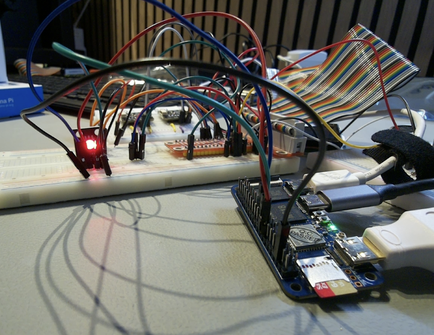
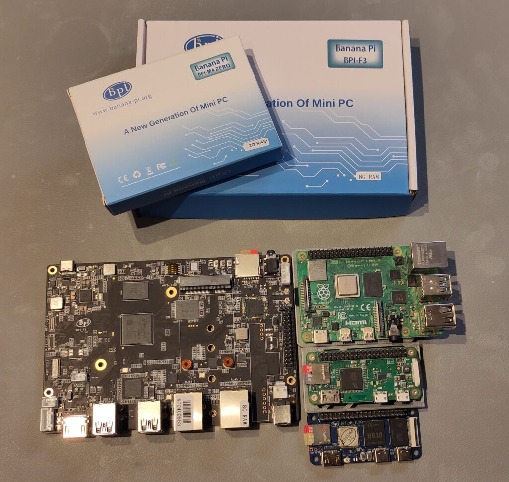
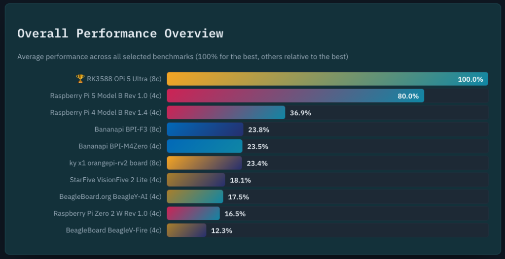

As part of my 2026 learning goals around Java on RISC-V (see [this post about x86 versus ARM versus RISC-V](https://webtechie.be/post/2026-01-07-x86-arm-riscv/)), I've asked various suppliers to send me evaluation boards. I already published these:

* [LattePanda IOTA (x86)](https://webtechie.be/post/first-experiments-with-java-on-the-lattepanda-iota-an-alternative-to-raspberry-pi/)
* [OrangePi 5 Ultra (ARM) and OrangePi RV2 (RISC-V)](https://webtechie.be/post/first-test-of-java-on-the-orange-pi-arm-and-risc-v/)
* [VisionFive 2 Lite (RISC-V)](https://webtechie.be/post/first-test-of-java-on-the-starfive-visionfive-2-lite-risc-v/)
* [BeagleBoards (ARM and RISC-V)](https://webtechie.be/post/first-test-of-java-on-beagleboards-arm-and-risc-v/)
* [Java 25 on BeagleV-First](https://webtechie.be/post/i-got-java-25-running-on-the-risc-v-beagleboard-beaglev-fire/)
* In this post: Banana Pi's

I got all these boards for free, but what I write here and show in the video is not controlled by the suppliers.



ARM versus RISC-V?
------------------

ARM and RISC-V represent two different approaches to processor design. ARM is the established player we know from, e.g., the Raspberry Pi's. It's mature, and has a huge ecosystem of tools and support built over decades. RISC-V is the open-source alternative, free from licensing restrictions and fully transparent. While ARM still leads in performance and tooling today, RISC-V is catching up fast. The real difference isn't just about speed. It's about openness and flexibility. With RISC-V, you're not locked into a vendor's ecosystem, and you have complete visibility into how your hardware works.

Banana Pi
---------

Here's how the Banana Pi's I received, compare to some of the Raspberry Pi's. If you compare the Raspberry Pi prices with my earlier articles from +-6 months ago, you'll see that the prices have gone up a lot. The shortage of memory chips is really a problem and making these single-board-computers less attractive...

The Banana Pi BPI-M4 Zero was 44€ earlier this year, but now at 148€! The BPI-F3 went from 84€ to 214€...

| Board                                                                         | SOC         | Type   | CPU        | Cores |  Speed | Early 2026 |                                                                                                 July 2026 |
|:------------------------------------------------------------------------------|:------------|:-------|:-----------|:-----:|-------:|-----------:|----------------------------------------------------------------------------------------------------------:|
| [Raspberry Pi 4](https://api.pi4j.com/board-information/MODEL_4_B)            | BCM2711     | ARMv8  | Cortex-A72 |   4   | 1.8Ghz |        68€ |                  [128€ (4GB)](https://www.amazon.com.be/-/en/Raspberry-Pi-Model-4GB-LPDDR4/dp/B09TTNF8BT) |
| [Raspberry Pi 5](https://api.pi4j.com/board-information/MODEL_5_B)            | BCM2712     | ARMv8  | Cortex-A76 |   4   | 2.4Ghz |        79€ |          [144€ (4GB)](https://www.amazon.com.be/-/en/Raspberry-4GB-Quad-Core-ARMA76-64-bit/dp/B0CK3L9WD3) |
| [Raspberry Pi Zero 2](https://api.pi4j.com/board-information/ZERO_V2)         | BCM2710A1   | ARMv8  | Cortex-A53 |   4   |   1Ghz |            | [21€ (0.5GB)](https://www.kiwi-electronics.com/nl/raspberry-pi-zero-2-w-met-header-20130?search=zero%202) |
| [Banana Pi BPI-M4 Zero](https://www.banana-pi.org/en/banana-pi-sbcs/171.html) | H618        | ARMv8  | Cortex-A53 |   4   | 1.5Ghz |        44€ |                                     [148€ (4GB+32GB)](https://openelab.io/products/banana-pi-bpi-m4-zero) |
| [Banana Pi BPI-F3](https://www.banana-pi.org/en/banana-pi-sbcs/175.html)      | SpacemiT K1 | RISC-V |            |   8   |        |        84€ |                                             [214€ (16GB)](https://banana-pi.eu/produit/banana-pi-bpi-f3/) |

### First Impressions

Banana Pi suffers from the same problem as a lot of single-board-computer suppliers. They make great hardware but forget the user experience to get started... There is no tool available to select the board and create an SD card like you can do with the Raspberry Pi Imager tool. So you have to search through the documentation, ignore some broken links, and search further to find the right image...

Below are the links I found with OS images for the Banana Pi boards and burned them to an SD card with the Raspberry Pi Imager tool. In the "Device" step select "No filtering", and in the "OS" step select "Other" and browse to the image file you have downloaded (and unzipped).

### Banana Pi BPI-M4 Zero

*Banana Pi BPI-M4 Zero is the successor model of BPI-M2 Zero. The SOC is upgraded to Allwinner H618 quad-core A53 . The memory is upgraded to 2G LPDDR4, and 8G eMMC onboard . It supports 5G WiFi and BT, and the USB interface has also been upgraded to type-C. It has the same form factor and 40-pin connector as the Raspberry Pi Zero W, and it will fit most Zero W cases and accessories.*

* [Product page](https://www.banana-pi.org/en/banana-pi-sbcs/171.html)
* [Documentation](https://docs.banana-pi.org/en/BPI-M4_Zero/BananaPi_BPI-M4_Zero)
* [Getting Started](https://docs.banana-pi.org/en/BPI-M4_Zero/GettingStarted_BPI-M4_Zero)
* [Operating System](https://drive.google.com/drive/folders/1-MzSVsduPX8qHKgbAOM3wmcCbwfkffAz)
  * I used "20241011_Bananapi-Armbian_24.8.2_Bpi-m4zero_ubuntu22.04_jammy_legacy_5.4.125_xfce_desktop.zip"



### Banana Pi BPI-F3

*Banana Pi BPI-F3 is a industrial grade RISC-V development board, it design with SpacemiT K1 8 core RISC-V chip, CPU integrates 2.0 TOPs AI computing power. 2/4/8/16G DDR and 8/16/32/128G eMMC onboard.2x GbE Ethernet prot, 4x USB 3.0 and PCIe for M.2 interface, supprt HDMI and Dual MIPI-CSI Camera.*

* [Product page](https://www.banana-pi.org/en/banana-pi-sbcs/175.html)
* [Documentation](https://docs.banana-pi.org/en/BPI-F3/BananaPi_BPI-F3)
* [Getting Started](https://docs.banana-pi.org/en/BPI-F3/GettingStarted_BPI-F3)
* [Operating System](https://archive.spacemit.com/image/k1/version/bianbu/)
  * Select the image ending in "bianbu-k1-xxx.img.zip"
  * I used "bianbu-25.04-desktop-k1-v3.0.1-release-20250815185656.img.zip"



Testing with Java and Pi4J
--------------------------

I started with a lot of reserves... Both OS images are pretty outdated (2024 and 2025), so I'm wondering what I will find when I boot the boards. I also have no idea if the Banana Pi BPI-F3 RISC-V board will run Java 25, as it is a very new board and the OS image is already a bit outdated.

### Banana Pi BPI-M4 Zero

The Zero boots in terminal mode, and after the first boot asks to create a root password, user account, and WiFi credentials. After that, it's ready to be used and accessible via SSH. I used a USB-C dongle to connect keyboard, mouse, and network to get started quickly. After doing the usual steps I used on the previous boards I tested, I can confirm that Java runs fine on the Banana Pi BPI-M4 Zero. I installed Java 25 (25.0.3-zulu) and JBang, and ran the `HelloWorld.java` and `JsonParsing.java` examples from the [Pi4J JBang repository](https://github.com/Pi4J/pi4j-jbang). The result is shown in the video.

```
sudo apt update
sudo apt upgrade
sudo apt install zip
curl -s "https://get.sdkman.io" | bash

# Close the terminal and open a new one
sdk install java 25.0.3-zulu-fx
sdk install jbang

# Close the terminal and open a new one
git clone https://github.com/Pi4J/pi4j-jbang.git
cd pi4j-jbang
cd basic
java HelloWorld.java
jbang JsonParsing.java
```


I also executed my [SBC Java benchmark test](/sbc/) so we can compare the performance of this board with other single-board-computers. Results below...

### Pi4j on the Banana Pi Zero

In the [documentation of th Banana Pi BPI-M4 Zero](https://docs.banana-pi.org/en/BPI-M4_Zero/BananaPi_BPI-M4_Zero) I found a GPIO table that looks similar to the 40-pin layout of the Raspberry Pi. And as we are running the same kind of Linux used in the Raspberry Pi OS, we should be able to use Pi4J V4, based on the Foreign Function and Memory API (FFM API) to access the GPIO pins. I tried to run `jbang RgbLed.java` from the Pi4J JBang repo.

Sidenote: this board comes without a header, so I soldered a 40-pin header but struggled a lot! For some odd reason, the solder doesn't stick to the board. So it took me a lot of time and removing solder that got stuck to two pins and then trying again. I finally got it done, but it was a lot of work and hope the soldering is good enough to make a reliable connection.

After some struggling with the user rights, using a script from the [Pi4J OS repository](https://github.com/Pi4J/pi4j-os/blob/main/script/setup-permissions.sh), I got passed exceptions thrown by the FFM plugin in Pi4J, but still got blocked with the following output. Probably a mismatch between GPIO addresses, or an outdated Linux kernel, something to figure out later... It's also strange that Pi4J recognizes this board as a Raspberry Pi 1 Model B, while it is a Banana Pi BPI-M4 Zero. Seems this Banana Pi has the same board code as the Raspberry Pi 1 Model B...

```
$ jbang RgbLed.java 
[main] INFO com.pi4j.Pi4J - Pi4J library build info:
[main] INFO com.pi4j.Pi4J -     Version: 4.0.2
[main] INFO com.pi4j.Pi4J -     Timestamp: 2026-06-08T10:01:34Z
...
[main] INFO com.pi4j.boardinfo.util.BoardInfoHelper - Detected OS: Name: Linux, version: 5.4.125-legacy-sunxi64, architecture: aarch64
[main] INFO com.pi4j.boardinfo.util.BoardInfoHelper - Detected Java: Version: 25.0.3, runtime: 25.0.3+9-LTS, vendor: Azul Systems, Inc., vendor version: Zulu25.34+17-CA
[main] INFO com.pi4j.boardinfo.util.BoardInfoHelper - Detected board type MODEL_1_B by code: 0003
[main] INFO com.pi4j.context.impl.DefaultContext - Detected board model: Raspberry Pi 1 Model B
[main] INFO com.pi4j.context.impl.DefaultContext - Running on: Name: Linux, version: 5.4.125-legacy-sunxi64, architecture: aarch64
[main] INFO com.pi4j.context.impl.DefaultContext - With Java version: Version: 25.0.3, runtime: 25.0.3+9-LTS, vendor: Azul Systems, Inc., vendor version: Zulu25.34+17-CA
...
[main] INFO com.pi4j.plugin.ffm.providers.gpio.FFMDigitalOutput - /dev/gpiochip0-23 - setting up DigitalOutput BCM...
Exception in thread "main" com.pi4j.exception.Pi4JException: Error during call to method 'call' with data '[9, 3238048773, LineInfo{name=()[], consumer=()[], offset=23, numAttrs=0, flags=0, attrs=[]}]': Invalid argument (22)
    at com.pi4j.plugin.ffm.common.ioctl.IoctlNative.call(IoctlNative.java:106)
    at com.pi4j.plugin.ffm.providers.gpio.FFMDigitalOutput.initialize(FFMDigitalOutput.java:55)
    at com.pi4j.plugin.ffm.providers.gpio.FFMDigitalOutput.initialize(FFMDigitalOutput.java:24)
    at com.pi4j.registry.impl.DefaultRuntimeRegistry.add(DefaultRuntimeRegistry.java:95)
    at com.pi4j.registry.impl.DefaultRegistry.add(DefaultRegistry.java:103)
    at com.pi4j.plugin.ffm.providers.gpio.FFMDigitalOutputProviderImpl.create(FFMDigitalOutputProviderImpl.java:25)
    at com.pi4j.plugin.ffm.providers.gpio.FFMDigitalOutputProviderImpl.create(FFMDigitalOutputProviderImpl.java:12)
    at com.pi4j.io.gpio.digital.DigitalOutputProvider.create(DigitalOutputProvider.java:58)
    at RgbLed.main(RgbLed.java:38)
Caused by: com.pi4j.exception.Pi4JException: Error during call to method 'call' with data '[9, 3238048773, LineInfo{name=()[], consumer=()[], offset=23, numAttrs=0, flags=0, attrs=[]}]': Invalid argument (22)
    at com.pi4j.plugin.ffm.common.Pi4JNativeContext.processError(Pi4JNativeContext.java:58)
    at com.pi4j.plugin.ffm.common.ioctl.IoctlNative.call(IoctlNative.java:103)
    ... 8 more
```


After some researching, I [found a newer OS for this board](https://armbian.com/boards/bananapim4zero) and downloaded a version with Xfce desktop from [here](https://dl.armbian.com/bananapim4zero/Noble_current_xfce). With this newer version of the OS, and the correctly configured user rights, we get another error. That's progress! 😉

```
$ jbang RgbLed.java 
...
[main] INFO com.pi4j.boardinfo.util.BoardInfoHelper - Detected OS: Name: Linux, version: 6.18.33-current-sunxi64, architecture: aarch64
...
[main] INFO com.pi4j.context.impl.DefaultContext - With Java version: Version: 25.0.3, runtime: 25.0.3+9-LTS, vendor: Azul Systems, Inc., vendor version: Zulu25.34+17-CA
...
[main] INFO com.pi4j.runtime.impl.DefaultRuntime - Pi4J context/runtime successfully initialized.
[main] INFO com.pi4j.plugin.ffm.providers.gpio.FFMDigitalOutput - /dev/gpiochip0-23 - setting up DigitalOutput BCM...
Exception in thread "main" com.pi4j.exception.Pi4JException: Error during call to method 'call' with data '[9, 3260068871, LineRequest{offsets=[23], consumer=(pi4j.FFMDigitalOutput)[112, 105, 52, 106, 46, 70, 70, 77, 68, 105, 103, 105, 116, 97, 108, 79, 117, 116, 112, 117, 116], config=LineConfig{flags=8, numAttrs=0, attrs=[]}, numLines=1, eventBufferSize=0, fd=0}]': Unknown error 517 (517)
    at com.pi4j.plugin.ffm.common.ioctl.IoctlNative.call(IoctlNative.java:106)
    at com.pi4j.plugin.ffm.providers.gpio.FFMDigitalOutput.initialize(FFMDigitalOutput.java:64)
    at com.pi4j.plugin.ffm.providers.gpio.FFMDigitalOutput.initialize(FFMDigitalOutput.java:24)
    at com.pi4j.registry.impl.DefaultRuntimeRegistry.add(DefaultRuntimeRegistry.java:95)
    at com.pi4j.registry.impl.DefaultRegistry.add(DefaultRegistry.java:103)
    at com.pi4j.plugin.ffm.providers.gpio.FFMDigitalOutputProviderImpl.create(FFMDigitalOutputProviderImpl.java:25)
    at com.pi4j.plugin.ffm.providers.gpio.FFMDigitalOutputProviderImpl.create(FFMDigitalOutputProviderImpl.java:12)
    at com.pi4j.io.gpio.digital.DigitalOutputProvider.create(DigitalOutputProvider.java:58)
    at RgbLed.main(RgbLed.java:38)
Caused by: com.pi4j.exception.Pi4JException: Error during call to method 'call' with data '[9, 3260068871, LineRequest{offsets=[23], consumer=(pi4j.FFMDigitalOutput)[112, 105, 52, 106, 46, 70, 70, 77, 68, 105, 103, 105, 116, 97, 108, 79, 117, 116, 112, 117, 116], config=LineConfig{flags=8, numAttrs=0, attrs=[]}, numLines=1, eventBufferSize=0, fd=0}]': Unknown error 517 (517)
    at com.pi4j.plugin.ffm.common.Pi4JNativeContext.processError(Pi4JNativeContext.java:58)
    at com.pi4j.plugin.ffm.common.ioctl.IoctlNative.call(IoctlNative.java:103)
    ... 8 more
```


On a Raspberry Pi, the numbers you pass to Pi4J directly match the SoC's own "BCM" GPIO numbering, so pin 16 on the header is simply BCM 23, no translation needed. The [Banana Pi M4 Zero](https://docs.banana-pi.org/en/BPI-M4_Zero/BananaPi_BPI-M4_Zero) uses a different SoC (Allwinner H618) with its own GPIO controller and numbering scheme, so that shortcut doesn't apply, even though the board has the same 40-pin header layout as a Raspberry Pi Zero.

The first clue was Banana Pi's own [pinout table](https://docs.banana-pi.org/en/BPI-M4_Zero/BananaPi_BPI-M4_Zero#_gpio_pin_define), which lists physical pin 16 as `PI15` = GPIO bank `I`, pin `15`. Allwinner chips group their GPIOs into lettered banks of 32 pins each (`PA0`-`PA31`, `PB0`-`PB31`, and so on --- see [linux-sunxi.org/GPIO](https://linux-sunxi.org/GPIO) for the general convention), and the Linux kernel exposes this hardware as character devices under `/dev/gpiochip*`. Running `gpioinfo` on the board showed two chips: `gpiochip0` with 32 lines, and `gpiochip1` with 288 lines. 288 is exactly 9 banks of 32, which matches banks A through I. This indicates that `gpiochip1` is the controller behind the 40-pin header, not `gpiochip0`.

```
$ sudo apt install -y gpiod
$ gpioinfo
gpiochip0 - 32 lines:
    line   0:      unnamed       kernel   input  active-high [used]
    line   1:      unnamed       kernel   input  active-high [used]
    line   2:      unnamed       unused   input  active-high 
    ...
gpiochip1 - 288 lines:
    line   0:      unnamed       unused   input  active-high 
    line   1:      unnamed       unused   input  active-high 
    line   2:      unnamed       unused   input  active-high 
    ...
```


To find the pin number to use in the code, we need to do some calculation: the index of the bank (A=0, B=1, C=2, ... I=8) multiplied by 32, plus the pin number within that bank, to calculate the absolute line offset on the chip. For `PI15`, that's `8 × 32 + 15 = 271`.

We can verify this with [`libgpiod`](https://packages.debian.org/bookworm/gpiod), a command-line tools to toggle GPIO lines. As we already installed `gpiod`, we can use `gpioset` to set a line high or low. For example, to toggle the red LED connected to physical pin 16, we can run:

```
$ gpioset gpiochip1 271=1   # Red on
$ gpioset gpiochip1 271=0   # Red off
```


The red LED turned on and off, confirming line 271 on `gpiochip1` really is physical pin 16. I repeated the same process for green (`PI16` → line 272) and blue --- except blue's original pin (physical pin 22) turned out to be a 3.3V power pin on this board, not a GPIO at all. So I moved that wire to a real GPIO pin (physical pin 23, `PH6`, bank H → `7 × 32 + 6 = 230`) before it could work.

| Color |       Physical pin | Offset (gpiochip1) |
|:------|-------------------:|-------------------:|
| Red   |                 16 |                271 |
| Green |                 18 |                272 |
| Blue  | 23 (moved from 22) |                230 |

After testing these values again with `gpioset`, I could modify the JBang `RgbLed.java` script. We need to add `.bus(1)` to target `gpiochip1`, and change the BCM values with `.bcm(271)`. These are the lines to be added/changed in the [original code](https://github.com/Pi4J/pi4j-jbang/blob/main/digital/RgbLed.java):

```
import com.pi4j.io.gpio.digital.DigitalOutput;
import com.pi4j.io.gpio.digital.DigitalState;

...

// Connect a LED to PIN 16 = gpiochip1 line 271
private static final int GPIO_RED = 271;
// Connect a LED to PIN 18 = gpiochip1 line 272
private static final int GPIO_GREEN = 272;
// Connect a LED to PIN 23 = gpiochip1 line 230 (moved from PIN 22, which is 3.3V, not a GPIO pin on this board)
private static final int GPIO_BLUE = 230;

void main() throws Exception {
    // Initialize the Pi4J context
    var pi4j = Pi4J.newAutoContext();

    // Initialize the three LEDs on gpiochip1 (this board's main GPIO controller)
    var ledRed = pi4j.create(DigitalOutput.newConfigBuilder(pi4j)
            .id("red").name("Red LED").bus(1).bcm(GPIO_RED)
            .shutdown(DigitalState.LOW).initial(DigitalState.LOW));

    var ledGreen = pi4j.create(DigitalOutput.newConfigBuilder(pi4j)
            .id("green").name("Green LED").bus(1).bcm(GPIO_GREEN)
            .shutdown(DigitalState.LOW).initial(DigitalState.LOW));

    var ledBlue = pi4j.create(DigitalOutput.newConfigBuilder(pi4j)
            .id("blue").name("Blue LED").bus(1).bcm(GPIO_BLUE)
            .shutdown(DigitalState.LOW).initial(DigitalState.LOW));
    ...
    // Keep the remaining code the same
}
```


Now executing `jbang RgbLed.java` finally worked, and the RGB LED started blinking in the expected colors. Success! This is my very first working Pi4J example on a non-Raspberry Pi board!!! One of my 2026-goals is achieved 🙂

### Banana Pi BPI-F3

The Banana Pi BPI-F3 boots in desktop mode! So that's a lot nicer for a first test 😉 As this board has a RISC-V processor, we can't use SDKMAN to install Java as we learned from experiments with other RISC-V boards before. So I installed `openjdk-25-jdk` with `apt`, but to my surprise, this installed an `ea` (Early Access) version. Maybe because the OS is outdated and got stuck on older JDK releases? Anyhow, I could run the `HelloWorld.java` and `JsonParsing.java` examples again without a problem, and ran the SBC benchmark.

Benchmark Results
-----------------

To have a fair comparison in the benchmarks, I also ran one on a Raspberry Pi Zero 2 as this is the closest competitor to the Banana Pi BPI-M4 Zero. The full results are available on the [SBC Java benchmark page](/sbc/), where you can compare them with the other boards I tested before.


Some highlights:

* The Banana Pi BPI-M4 Zero beats its direct rival, the Raspberry Pi Zero 2, on every single benchmark. `fj-kmeans` finished in 64.8s on the BPI-M4 Zero, while the Raspberry Pi Zero 2 didn't even finish within the 10-minute timeout. On the four benchmarks both boards did complete, the BPI-M4 Zero was 35-47% faster, e.g. `mnemonics` (31.1s vs 58.3s) and `future-genetic` (23.6s vs 41.6s).
* The tiny, cheap BPI-M4 Zero even outran the pricier BeagleY-AI on all five shared benchmarks, by 5% (`fj-kmeans`) up to 24% (`future-genetic`). Not bad for the smallest and cheapest board in the whole comparison!
* On the RISC-V side, the BPI-F3 is roughly in the same league as the OrangePi RV2 (within 2-5% of each other on every benchmark), and clearly ahead of the older BeagleV-Fire, which timed out on `fj-kmeans`, `mnemonics`, and `par-mnemonics` altogether. On the benchmarks BeagleV-Fire did finish, the BPI-F3 was 2.6-2.8x faster.
* Compared to the StarFive VisionFive 2 Lite, the BPI-F3 is almost twice as fast on the heavily multi-threaded `fj-kmeans` (33.0s vs 62.3s), but the VisionFive 2 edges ahead by 10-17% on the more single-threaded `scala-kmeans` and `future-genetic` tests.
* Two benchmarks, `akka-uct` and `db-shootout`, failed to complete on the BPI-F3. Considering the outdated Bianbu OS image, take these RISC-V numbers with a grain of salt.

Conclusion
----------

Performance-wise, the Banana Pi's are a pleasant surprise! The BPI-M4 Zero, the cheapest and smallest board in this whole comparison, if you take the amount of memory and eMMC into account, outran both its direct rival, the Raspberry Pi Zero 2, and the pricier BeagleY-AI on every single benchmark. And the BPI-F3 holds its own on the RISC-V side too, landing right next to the OrangePi RV2 and comfortably ahead of the BeagleV-Fire.

The rough edges are elsewhere. Documentation is scattered across broken links and outdated OS images, the M4 Zero's header needs to be soldered on yourself (and mine didn't go smoothly!), and Pi4J's GPIO first test still throws exceptions I'll need to dig into further. And unlike the boards themselves, the price is no longer a highlight: the memory chip shortage pushed the prices up, but that's similar for all brands.

Still, if you can get past the price and the setup hassle, Java, JBang, and even an early-access JDK 25 all run without problems on these boards. I'll keep digging into the Pi4J GPIO issue and share an update once I've got the it working.

That wraps up this round of my "2026 single-board computer" series! If you're working on similar projects or have experience with Java on Banana Pi (or RISC-V in general), I'd love to hear about it. Feel free to reach out through [Mastodon](https://foojay.social/@frankdelporte) or the [Foojay.io community](https://foojay.io/).
