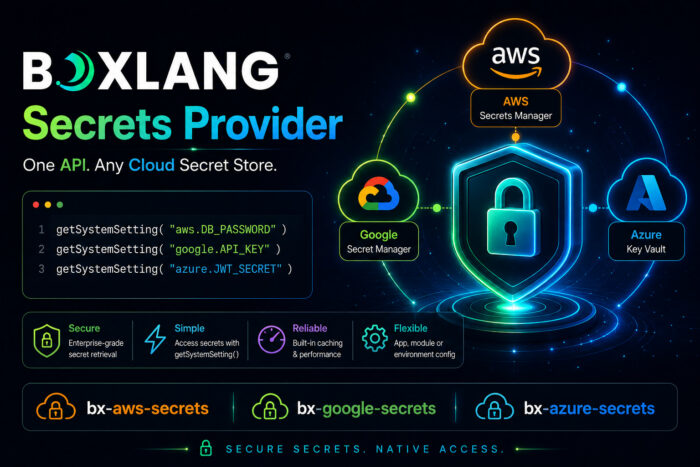

Every production application carries secrets: database passwords, API tokens, encryption keys. The question is never whether to manage them -- it's how badly the current approach is going to hurt you.

Hardcoded credentials in config files get committed to repos. Environment variables sprawl across deployment pipelines with no audit trail. Custom integration code for each cloud provider means three different patterns to maintain, test, and rotate. And when a key needs to rotate at 2am? Someone is waking up.

Today we're shipping three new BoxLang+ modules that solve this at the language level:

* `bx-aws-secrets` -- AWS Secrets Manager
* `bx-azure-secrets` -- Azure Key Vault
* `bx-google-secrets` -- Google Secret Manager

One consistent API. Three major cloud providers. Zero custom plumbing in your application code. They are also fully documented:

* <https://boxlang.ortusbooks.com/boxlang-+-++/modules/bx-aws-secrets>
* <https://boxlang.ortusbooks.com/boxlang-+-++/modules/bx-azure-secrets>
* <https://boxlang.ortusbooks.com/boxlang-+-++/modules/bx-google-secrets>

## One Pattern to Rule Them All

No matter which cloud provider you use, the interface is the same:

```java
// AWS
dbPassword = getSystemSetting( "aws.DB_PASSWORD" )

// Azure
dbPassword = getSystemSetting( "azure.DB-PASSWORD" )

// Google
dbPassword = getSystemSetting( "google.DB_PASSWORD" )
```

That's it. BoxLang's `getSystemSetting()` BIF understands cloud provider namespaces. Your application code never knows where the secret lives -- and that's the point. Swap providers, rotate credentials, move between environments: your code doesn't change.

Need a fallback for local development?

```java
apiKey = getSystemSetting( "aws.API_KEY", "local-dev-key" )
```

If the secret can't be resolved (no credentials, wrong environment, network issue), BoxLang falls back gracefully to your default. No exceptions to swallow, no conditional logic to write.

## InstallationInstallation

### CommandBoxVia CommandBox

```java
# AWS
box install bx-plus,bx-aws-secrets

# Azure
box install bx-plus,bx-azure-secrets

# Google
box install bx-plus,bx-google-secrets
```

### Via BoxLang OS Binary

```java
install-bx-module bx-plus bx-aws-secrets
install-bx-module bx-plus bx-azure-secrets
install-bx-module bx-plus bx-google-secrets
```

All three modules require an active BoxLang+ license. See plans at boxlang.io/plans.

## How Configuration Resolution Works

Each module resolves its settings using a clean 3-tier hierarchy -- independently per setting, so you can mix sources freely:

| Priority |                             Source                             |          Use Case           |
|----------|----------------------------------------------------------------|-----------------------------|
| 1st      | `this.aws` / `this.azure` / `this.google `in `Application.bx ` | Per-application isolation   |
| 2nd      | Module settings in `boxlang.json `                             | Global server defaults      |
| 3rd      | Cloud provider environment variables                           | CI/CD pipelines, containers |

This means a multi-tenant server can run multiple applications, each with their own credentials and region, with no cross-contamination. Each application gets its own dedicated client instance, created on first use and cleaned up on application shutdown.

### Per-Application Configuration (Application.bx)

```java
class {
    this.name = "myApp"

    // AWS example
    this.aws = {
        region          : "us-east-2",
        accessKeyId     : "${Setting: AWS_ACCESS_KEY_ID not found}",
        secretAccessKey : "${Setting: AWS_SECRET_ACCESS_KEY not found}",
        cacheTTL        : 300
    }

    // Azure example
    this.azure = {
        vaultUrl     : "https://my-vault.vault.azure.net/",
        tenantId     : "${Setting: AZURE_TENANT_ID not found}",
        clientId     : "${Setting: AZURE_CLIENT_ID not found}",
        clientSecret : "${Setting: AZURE_CLIENT_SECRET not found}",
        cacheTTL     : 300
    }

    // Google example
    this.google = {
        projectId       : "my-gcp-project",
        credentialsPath : "${Setting: GOOGLE_APPLICATION_CREDENTIALS not found}",
        cacheTTL        : 300
    }
}
```

### Global Server Configuration (boxlang.json)

```java
{
  "modules": {
    "bxaws-secrets": {
      "settings": {
        "region": "us-east-2",
        "accessKeyId": "${Setting: AWS_ACCESS_KEY_ID not found}",
        "secretAccessKey": "${Setting: AWS_SECRET_ACCESS_KEY not found}",
        "cacheTTL": 300
      }
    },
    "bxazure-secrets": {
      "settings": {
        "vaultUrl": "https://my-vault.vault.azure.net/",
        "cacheTTL": 300
      }
    },
    "bxgoogle-secrets": {
      "settings": {
        "projectId": "my-gcp-project",
        "cacheTTL": 300
      }
    }
  }
}
```

## Real-World Usage: Datasource Configuration

This is where it gets satisfying. No more credentials in your datasource config, no more environment variable juggling:

```java
class {
    this.name = "myApp"

    this.datasources = {
        main : {
            className        : "org.postgresql.Driver",
            connectionString : "jdbc:postgresql: //db.prod.internal:5432/app",
            username         : getSystemSetting( "aws.DB_USER" ),
            password         : getSystemSetting( "aws.DB_PASSWORD" )
        }
    }
}
```

Rotate the secret in AWS Secrets Manager, and the next cache expiry cycle picks it up automatically. No redeployment, no config change, no 2am wake-up call.

## Built-In Caching: Performance Without Compromise

Every secrets call is cached in-memory with a configurable TTL (default: 300 seconds). Cache keys are scoped to the provider identity (`region:secretName` for AWS, `vaultUrl:secretName` for Azure, `projectId:secretName` for Google) so there is no leakage between applications or providers.

The math is straightforward: a BoxLang application handling thousands of requests per minute would otherwise generate thousands of Secrets Manager API calls. With caching, that's one call per TTL window. Your cloud bill will notice.

Set `cacheTTL` to `0` if you need fresh values on every resolution -- useful in certain compliance scenarios.

## Local Development Support

All three modules have first-class local development stories.

#### AWS with LocalStack:

```java
{
  "modules": {
    "bxaws-secrets": {
      "settings": {
        "region": "us-east-1",
        "accessKeyId": "test",
        "secretAccessKey": "test",
        "endpointOverride": "http://localhost:4566"
      }
    }
  }
}
```

```java
aws --endpoint-url=http://localhost:4566 secretsmanager create-secret \
  --name DB_PASSWORD \
  --secret-string "local-password"
```

#### Azure with Azure CLI:

```java
az login
az keyvault secret set --vault-name my-vault --name DB-PASSWORD --value "local-password"
```

#### Google with gcloud:

```java
gcloud auth application-default login
gcloud secrets create DB_PASSWORD --replication-policy="automatic"
gcloud secrets versions add DB_PASSWORD --data-file=- <<< "local-password"
```

In each case, the same application code that runs in production works locally with no changes. That's the contract.

## Environment Variable Support

All three modules fall back to standard provider environment variables when no explicit configuration is set. This makes them drop-in compatible with existing container and CI/CD setups:

|        Module        |                                Key Variables                                 |
|----------------------|------------------------------------------------------------------------------|
| `bx-aws-secrets`     | `AWS_REGION, AWS_ACCESS_KEY_ID, AWS_SECRET_ACCESS_KEY, AWS_SESSION_TOKEN`    |
| `bx-azure-secrets `  | `AZURE_KEY_VAULT_URL, AZURE_TENANT_ID, AZURE_CLIENT_ID, AZURE_CLIENT_SECRET` |
| `bx-google-secrets ` | `GOOGLE_CLOUD_PROJECT, GOOGLE_APPLICATION_CREDENTIALS `                      |

Azure and Google also support their respective managed identity and default credential chains (`DefaultAzureCredential`, Application Default Credentials), so workloads running inside Azure or GCP need no explicit credentials at all.

## This Is a BoxLang+ Feature

These modules are available exclusively to **BoxLang+** and **BoxLang++** subscribers. If you're already a subscriber, install away. If you're not, this is a good moment to look at what's in the tier.

[Explore BoxLang plans](https://boxlang.io/plans?_gl=1*mwcok8*_gcl_au*MTY2NTY3NzQ5Ni4xNzgzMzU1ODU3Li0uLS4xNzg0NTY3MTg5Ljc0ODkxOTMwMy4xNzg0NTY3MTg5LjE3ODQ1NjcxODk.*_ga*MTQ4MjQzODA2Ny4xNzc1NTA1MDAw*_ga_D1P6P1YYT0*czE3ODQ2MzIxNjEkbzY5JGcwJHQxNzg0NjMyMTYxJGo2MCRsMCRoMA..*_ga_663JFQ7YGX*czE3ODQ2MzIxNjEkbzY1JGcwJHQxNzg0NjMyMTYxJGo2MCRsMCRoMA.. "Explore BoxLang plans")

## Get Started

```java
# Pick your provider and install
box install bx-plus,bx-aws-secrets
box install bx-plus,bx-azure-secrets
box install bx-plus,bx-google-secrets
```

Full documentation:

* [bx-aws-secrets docs](https://boxlang.ortusbooks.com/ " bx-aws-secrets docs")
* [bx-azure-secrets docs](https://boxlang.ortusbooks.com/ "bx-azure-secrets docs")
* [bx-google-secrets docs](https://boxlang.ortusbooks.com/ "bx-google-secrets docs")

Questions? Drop into the [Ortus Community](https://community.ortussolutions.com/ "Ortus Community") -- we're there. 🚀

BoxLang+ modules are part of the Ortus Solutions commercial offering. A valid `bx-plus` license is required. [See plans](https://boxlang.io/plans?_gl=1*1717nio*_gcl_au*MTY2NTY3NzQ5Ni4xNzgzMzU1ODU3Li0uLS4xNzg0NTY3MTg5Ljc0ODkxOTMwMy4xNzg0NTY3MTg5LjE3ODQ1NjcxODk.*_ga*MTQ4MjQzODA2Ny4xNzc1NTA1MDAw*_ga_D1P6P1YYT0*czE3ODQ2MzIxNjEkbzY5JGcwJHQxNzg0NjMyMTYxJGo2MCRsMCRoMA..*_ga_663JFQ7YGX*czE3ODQ2MzIxNjEkbzY1JGcwJHQxNzg0NjMyMTYxJGo2MCRsMCRoMA.. "See plans").
