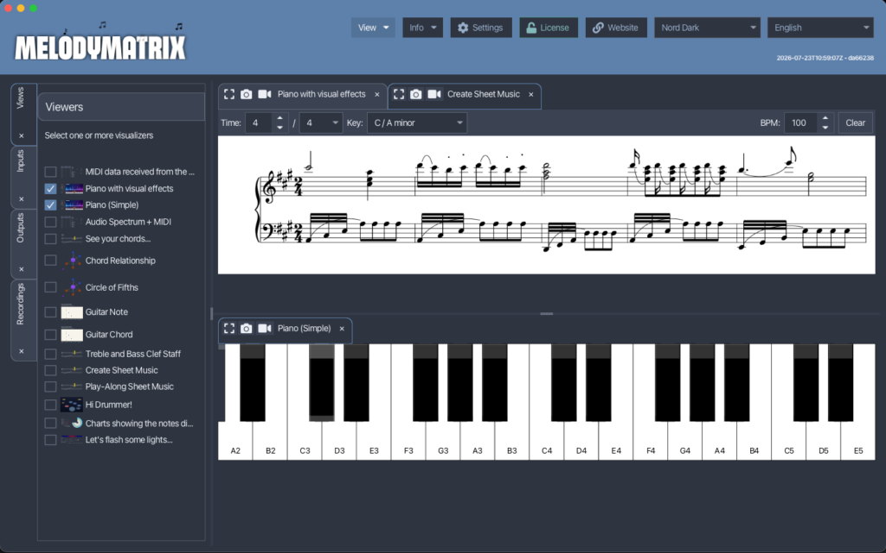
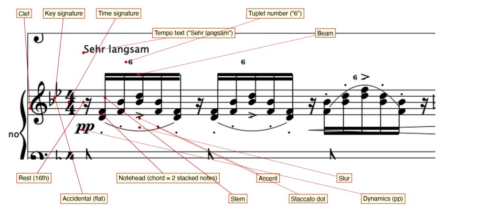
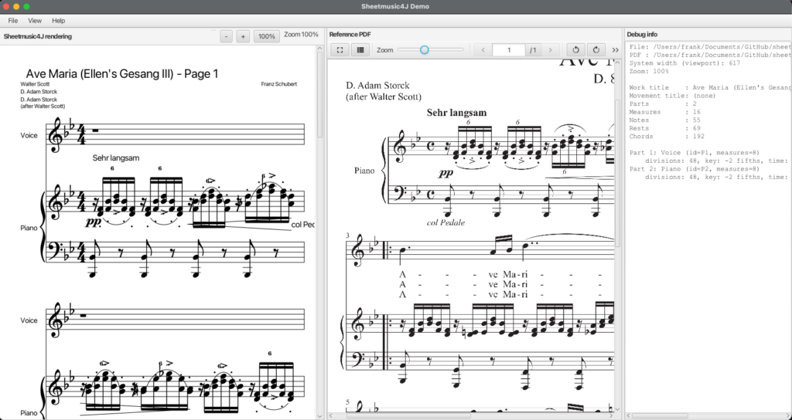

I'm building [MelodyMatrix](https://melodymatrix.rocks/) with my son, an application to look at and play along with music. The app already shows a song in different views: falling blocks, chords, guitar views, and many more. Now we want a Learn section, a view that helps someone practice piano by following the actual sheet music while it plays.

A static PDF of the sheet doesn't work for that. Great PDF viewer components exist for JavaFX, but a PDF has no connection to what's playing. Nothing highlights the current note, nothing marks the current position in the song. I looked for a JavaFX library that renders sheet music and lets code interact with it: jump to a position, highlight a note, follow playback. I couldn't find one, so I built it.



Same Approach as Lottie4J {#h2-0-same-approach-as-lottie4j}
-----------------------------------------------------------

The problem matched one I'd already solved. With [Lottie4J](https://lottie4j.com/), I ran into the same gap: solid animation players exist for the browser and mobile, none for JavaFX. Sheetmusic4J follows the same path: an open file format on one side, a JavaFX rendering component on the other, with AI doing a large part of the implementation work.

To be clear, this isn't vibe coding. I define the tasks, describe what I want to achieve, review what comes back, and iterate from there. The library wouldn't exist this fast without that collaboration, but the direction and the decisions stay mine.

Built on MusicXML {#h2-1-built-on-musicxml}
-------------------------------------------

Sheetmusic4J reads [MusicXML](https://www.w3.org/2021/06/musicxml40/), an open standard for representing sheet music. MIDI stores notes and timing, MusicXML stores a lot more: how a piece is structured, how it should look on the page, lyrics under a melody line for a song with a singer. MusicXML also ships an official set of example files, and I use those to compare what Sheetmusic4J renders against the reference PDF for each file.

Notation itself follows the [SMuFL](https://www.smufl.org/) standard for music fonts. Sheetmusic4J currently renders with the Bravura font. I haven't wired up font swapping yet, that's still on the list, but SMuFL makes it possible to support other notation fonts later.

The image above comes straight from the library and maps MusicXML terms to the class names in the Java model and to the layout terms used internally. I'm not a musician, despite years at music school long ago, so I built this reference for myself first. It also gives anyone reporting an issue a shared vocabulary to point at the exact element that's wrong. Check the [NOTATION_ELEMENTS.md file on GitHub](https://github.com/sheetmusic4j/sheetmusic4j/blob/main/docs/NOTATION_ELEMENTS.md) for more info and a table showing the link between MusicXML elements and how they are used in the library code.

[Open Sheet Music Display](https://opensheetmusicdisplay.org/) already renders MusicXML in the browser and served as a reference here, the same role the official Lottie web player played for Lottie4J. A WebView could show the same result inside MelodyMatrix, but a WebView doesn't give me a way to talk to the rendering from JavaFX code. Sheetmusic4J does: it exposes the hooks to move a marker, highlight a note, and drive the view from a MIDI stream, which is exactly what MelodyMatrix needs to sync a piano performance with the sheet.

Four Repositories, One Library {#h2-2-four-repositories-one-library}
--------------------------------------------------------------------

Everything lives in the [sheetmusic4j](https://github.com/sheetmusic4j) organization on GitHub, with the [library project](https://github.com/sheetmusic4j/sheetmusic4j) structured close to Lottie4J:

* **Core**: reads and writes MusicXML and MIDI files.
* **Engraver**: turns that raw data into the layout of a sheet, with no JavaFX dependency.
* **FX Viewer**: the JavaFX component applications use to show a sheet, including a full-page sheet view and a horizontal strip view.
* **Demo**: a test application for the other three modules.

The demo app renders the same MusicXML file two ways side by side: a static PDF (using [Derek Lemmerman's PDF viewer component](https://github.com/dlsc-software-consulting-gmbh/PDFViewFX)) next to the Sheetmusic4J FX Viewer. The PDF stays fixed to its page size. The FX Viewer reflows the layout as the window resizes, which occasionally shifts a line differently than the PDF does. The demo also includes tools to simulate playback and highlight notes, without any sound, purely to test the visual sync. A diff tab compares the FX Viewer output pixel by pixel against the reference PDF. It surfaces real differences, though I'm still figuring out how useful that comparison is given that a static PDF and an interactive viewer solve different problems.

Using the Library {#h2-3-using-the-library}
-------------------------------------------

Add the FX Viewer dependency to a JavaFX project:

<pre class="EnlighterJSRAW" data-enlighter-language="generic" data-enlighter-theme="" data-enlighter-highlight="" data-enlighter-linenumbers="" data-enlighter-lineoffset="" data-enlighter-title="" data-enlighter-group="">&lt;dependency&gt;
    &lt;groupId&gt;com.sheetmusic4j&lt;/groupId&gt;
    &lt;artifactId&gt;fxviewer&lt;/artifactId&gt;
    &lt;version&gt;0.0.1&lt;/version&gt;
&lt;/dependency&gt;</pre>

Load a MusicXML file into a sheet view with a few lines of code:

<pre class="EnlighterJSRAW" data-enlighter-language="generic" data-enlighter-theme="" data-enlighter-highlight="" data-enlighter-linenumbers="" data-enlighter-lineoffset="" data-enlighter-title="" data-enlighter-group="">Score score = ScoreFile.load("path/to/song.musicxml");

SheetView sheetView = new SheetView();
sheetView.setScore(score);

stage.setScene(new Scene(new ScrollPane(sheetView), 900, 600));
stage.show();</pre>

The FX Viewer module also ships a `StripView` for a horizontal, scrolling layout of the same score.

Version 0.0.1, and What's Next {#h2-4-version-0-0-1-and-what-s-next}
--------------------------------------------------------------------

This [first release carries version 0.0.1](https://sheetmusic4j.com/releases/), not a stable release. A lot of the API and the rendering can still change. From here, MelodyMatrix's Learn section drives most of the requirements: following a marker across the sheet, highlighting the note currently played, keeping the view in sync with MIDI input from a real piano.

If you try it and hit a rendering difference, open an issue in the [GitHub repository](https://github.com/sheetmusic4j/sheetmusic4j) with the MusicXML file and a screenshot of what you expected versus what you got. That's exactly the kind of report that moved Lottie4J forward fast, and I expect it works the same way here. Check the code, the docs, and the demo app on [sheetmusic4j.com](https://sheetmusic4j.com). Use the dependency from Maven or fork the repository, and let me know what you build with it.
