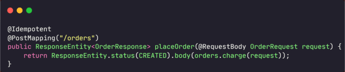
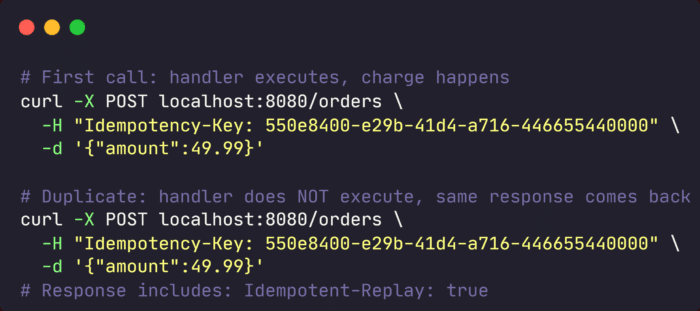
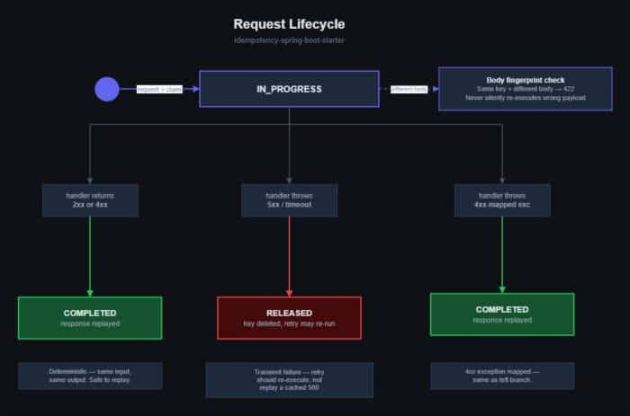
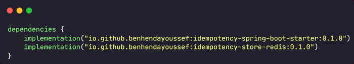
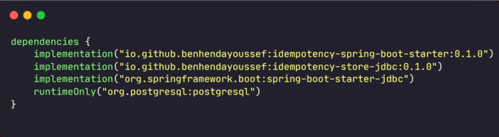
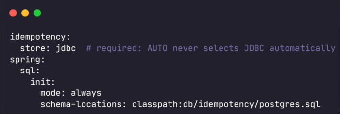
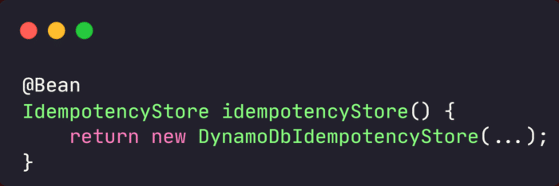

## The problem nobody talks about until production

A user taps "Pay." The request times out. Their app retries. Your server charges them twice.

You didn't write a bug. The network did. But your users don't care about that distinction.

The idempotency problem shows up in more places than payments. A load balancer replays a timed-out request. A mobile client double-taps a submit button. A Kubernetes pod retries after a restart. From the server's perspective, all of these look identical: a second POST that arrives after the first one already executed.

The standard fix is to have clients send an `Idempotency-Key` header. The server remembers what it already did. [Stripe](https://stripe.com/docs/idempotency "Stripe") does this. PayPal does this. Most teams that need it end up writing the same boilerplate for every endpoint that matters.

I got tired of writing that boilerplate, so I built an idempotent Spring Boot starter that handles it for every endpoint at once.

## What the idempotent Spring Boot starter does

`idempotency-spring-boot-starter` adds a single annotation:

That's it. A duplicate request carrying the same `Idempotency-Key` header gets the **original response replayed**, not a re-execution, not an error.

Two stores are available out of the box: **Redis** (the default when detected) and **JDBC/Postgres**. You swap between them with one configuration property.

## What happens when things go wrong

The happy path is straightforward. The interesting design question is what to do when the handler throws.

Here is the state machine:

**5xx failures release the key.** The first request may have failed because of something transient: a database blip, a slow dependency. If we kept the key, a legitimate retry would get a cached 500 forever. That is worse than a duplicate. So we delete it and let the retry re-execute.

**4xx responses are kept and replayed.** A `400 Bad Request` or `409 Conflict` is deterministic. The same bad input produces the same bad output every time. Replaying it is correct. It also protects against race conditions where two concurrent requests both race to discover the same conflict.

This behavior is configurable via `idempotency.release-on` if your requirements are different.

There is also a body fingerprint check. If a client sends the same key with a different request body, that is a client bug. The library returns `422` and never silently executes the wrong payload.

## Idempotent Spring Boot and Concurrent Requests: the case people forget

Sequential duplicates are the easy case. The interesting case is two identical requests arriving at the same time, before either has completed.

The claim step is **atomic** : a single `SETNX` in Redis, or an `INSERT ... ON CONFLICT DO NOTHING` in Postgres. One request wins the claim and runs the handler. The other sees `IN_PROGRESS` and waits.

By default (`idempotency.on-conflict=wait`), the losing request polls until the winner finishes. Then it replays the result. If polling times out, it returns `409`.

You can also set `on-conflict=fail_fast`. This skips the polling and returns `409` immediately. Useful if your clients retry anyway and you would rather free the thread sooner.

One thing worth knowing from testing: a burst of 20 concurrent duplicates against an 8-thread pool caused unrelated endpoints' latency to spike from sub-50ms to over a second. No requests failed. But if your thread pool is constrained and you expect frequent duplicate bursts, `fail_fast` is the safer choice.

## The exactly-once caveat I chose to be loud about

Most libraries in this space either skip this entirely or bury it in fine print. I did not want to do that.

Both stores give you **at-least-once** semantics out of the box, not exactly-once.

Here is why. The AOP aspect wraps *outside* any `@Transactional` boundary on your handler. By the time the aspect calls `complete()`, your handler's transaction has already committed. The completion write is a separate transaction.

This means there is a small window between your business transaction committing and the idempotency record being written. If the process crashes in that window, the key stays `IN_PROGRESS` until TTL expires. A retry will re-execute the handler.

For the JDBC store, exactly-once is achievable. Call `IdempotencyStore.complete()` from inside your own open transaction. The completion write joins that transaction and commits atomically with your business data.

But `@Idempotent` + `@Transactional` on the same method does *not* give you this for free. "Idempotent" and "exactly-once" are not the same claim. Getting the latter takes more than swapping in a dependency.

## Quick setup for idempotent Spring Boot endpoints

**Redis (recommended for most cases):**

Auto-configuration kicks in when Redis is on the classpath. No extra properties required.

**JDBC/Postgres:**

The schema file ships inside `idempotency-store-jdbc`. The annotation and behavior are identical regardless of which store you use.

## Configuration worth knowing

Most defaults are sensible. A few properties are worth calling out:

|            Property            |      Default      |                               When to change it                                |
|--------------------------------|-------------------|--------------------------------------------------------------------------------|
| `idempotency.require-key`      | `false`           | Set to `true` to reject keyless requests with 400                              |
| `idempotency.scope`            | `global`          | `user` or `tenant` namespaces the key per-principal (requires Spring Security) |
| `idempotency.on-conflict`      | `wait`            | Switch to `fail_fast` under a constrained thread pool                          |
| `idempotency.on-store-failure` | `proceed`         | `fail` returns 503 if the store is unreachable                                 |
| `idempotency.release-on`       | `five_xx,timeout` | Spring needs `five_xx`, not `5xx`                                              |

The `scope` property is worth a quick note.

`global` means all users share the same key namespace. `user` namespaces keys per authenticated principal. Two different users can then use the same UUID without collision. `tenant` reads a claim from the JWT. You can also implement `ScopeResolver` yourself and register it as a `@Bean`.

## Measured overhead

I benchmarked 200 requests with 20 warmup iterations against real Redis and Postgres via Testcontainers on Docker Desktop:

* **p50: around 5 to 6.4ms added latency** versus an identical unannotated endpoint
* **p99: up to around 40ms**
* In-memory store control: **around 0.5ms p50**, negative p99 (within measurement noise)

The aspect's own cost is sub-millisecond. Fingerprinting, key composition, JSON serialization: all fast. Everything else is two network round trips: claim and complete. The Docker Desktop numbers reflect container networking, not the library.

## Extending it

`IdempotencyStore` is a four-method interface: `claim`, `complete`, `release`, `find`. Register your own as a `@Bean` and `@ConditionalOnMissingBean` means yours wins:

Same pattern for `ScopeResolver` (custom key namespacing) and `IdempotencyMetrics` (plug in Micrometer or anything else). There is also `IdempotencyObjectMapperCustomizer`. Use it to register your Jackson modules without touching your app's own `ObjectMapper`.

## What it deliberately does not do

Scope creep kills small libraries. These are non-goals:

* **Not a retry library.** It does not help you retry outbound calls.
* **Not a rate limiter.** Different problem, different tool.
* **Not a Kafka dedup layer.** Consumer idempotency is a different shape of problem.
* **No WebFlux support yet.** Servlet stack only in v0.1; WebFlux is on the roadmap.
* **No streaming or SSE.** Anything written directly to `HttpServletResponse` is not captured.
* **Postgres only** for JDBC for now; MySQL is planned.

## Where to find it

**Maven Central:** `io.github.benhendayoussef:idempotency-spring-boot-starter:0.1.0`

**GitHub:** [github.com/benhendayoussef/idempotency-spring-boot-starter](https://github.com/benhendayoussef/idempotency-spring-boot-starter)

A runnable sample lives at `samples/sample-orders-api`. Run `docker compose up -d && ./gradlew :samples:sample-orders-api:bootRun`, then `./demo.sh` to see the replay behavior live.

This is v0.1. I would genuinely value feedback from people who have shipped idempotent Spring Boot APIs in production, especially on the failure policy and the exactly-once limitation. Issues and PRs are very welcome.
